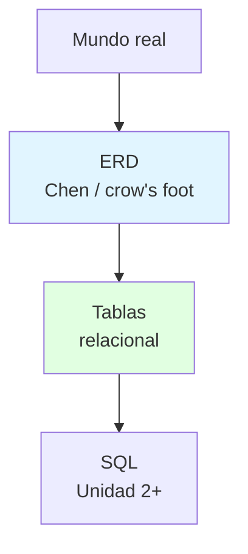

---
{"dg-publish":true,"permalink":"/universidad/3er-semestre/sistema-de-bases-de-datos/unidad-1-modelos-de-datos-y-er/03-modelo-relacional-erm-y-casos-tiny-college/","tags":["TICG1018","unidad1","relacional","erm","chen","casos"],"dg-note-properties":{"tags":["TICG1018","unidad1","relacional","erm","chen","casos"]}}
---


# 🗃️ Modelo Relacional, ERM y Casos Tiny College

## 🎯 Introducción

> [!info] 💡 ¿Por Qué las Tablas Ganaron y el Dibujo Manda?
>
> Desde 1970 casi todo lo que consultas vive en tablas, y desde 1976 casi todo lo que se diseña se dibuja primero. Entender por qué ganó cada uno —y qué resuelve cada notación— es lo que separa traducir un ER mecánicamente de diseñar uno que no se rompa al implementar.
>
> **Aplicaciones:**
> - **Implementación:** toda tabla del proyecto y del SQL futuro sale de aquí.
> - **Diseño gráfico:** el ERD es el plano que cliente y dev entienden sin código.
> - **Lección 1 (13-oct):** Codd en 1 frase + Chen en 1 frase + traducir 1 ER a tablas.
>
> | Concepto | Relacional (implementa) | ERM (diseña) |
> |---|---|---|
> | **Autor/año** | Codd | Chen 1976 |
> | **Pieza base** | Relación = tabla (filas × columnas) | Entidad + relación graficadas |
> | **Conexión** | Columna en común | Rombo/verbo + cardinalidad |
> | **Notaciones ERD** | — | Chen, pata de gallo, clases |



---

## 📋 Definiciones Formales

> [!note] 📋 Definición — Relación, Tupla, Niveles
>
> - **Relación (tabla):** intersección de filas y columnas. **Tupla/fila:** una ocurrencia (un estudiante concreto). **Atributo/columna:** una casilla (nombre, código).
> - **Tres niveles:** 1. **Conceptual** (ERD, sin motor) → 2. **Lógico** (tablas, PKs/FKs, tipos) → 3. **Físico** (índices, almacenamiento, permisos).
> - **Regla de traducción ER→tablas:** entidad → tabla; atributo → columna; clave → PK; N:M → intermedia con 2 FK; 1:N → FK del lado N.

> [!note] 📋 Definición — Entidad Débil y Fuerza de Relación (Coronel 4.1.6–4.1.7)
>
> - **Relación débil (non-identifying):** la PK hija NO hereda del padre (solo FK); línea **punteada** Crow's Foot. Ej.: CLASS con `CLASS_CODE` propia.
> - **Relación fuerte (identifying):** la PK hija hereda del padre (PK compuesta); línea **sólida**. Ej.: CLASS con `CRS_CODE + CLASS_SECTION`.
> - **Entidad débil:** cumple AMBAS — existencia-dependiente + PK derivada del padre. Ej.: DEPENDENT (`EMP_NUM + DEP_NUM`). Chen: rectángulo **doble**.
> - Chen no distingue fuerza (es conceptual); Crow's Foot sí (afecta implementación). La fuerza la decide el diseñador según transacciones y eficiencia.

<svg xmlns="http://www.w3.org/2000/svg" style="background: transparent; background-color: transparent; color-scheme: light dark;" xmlns:xlink="http://www.w3.org/1999/xlink" version="1.1" width="462px" height="311px" viewBox="0 0 462 311" id="ge-svg-ydfwJhBo7KZNf--Fcd-L" content="&lt;mxfile host=&quot;localhost&quot;&gt;&lt;diagram name=&quot;Debil-fuerte&quot; id=&quot;d1&quot;&gt;zZbfT4MwEMf/Gt6h3cZ81A018dciGuNjpTdoUujSFdn8672OskGmcRqcvpD2e71r78P1wKOTfHWh2SK7URykR3y+8ujUIyT0B/i0wroWhiSshVQLXkvBTojFGzjRd2opOCw7C41S0ohFV0xUUUBiOhrTWlXdZXMlu7suWAp7Qpwwua8+CW6yWh03WVj9EkSaNTsHo5PakrNmsctkmTGuqpZEI49OtFKmHuWrCUjLruFS+51/Yt0eTENhDnF4/cDDSUuzbvLVqiw4WBffo2dVJgzEC5ZYa4UvGLXM5BJnAQ5r71cmS+cd3cyu756jyBlAG1i1dnIHuwCVg9FrXJK12IUOVLXjHIyd5qIM3HTdFImbM/eW023kHQgcOBafcCG/z2UazaLbaXT78CMw2zRbZIjfJUP9LprxsAcy9L+TCUf7JdNoDZiAdMCchD2AGRwCBhMxXxNhUqQFjhOMBBoFi0BgAzp1hlxwbkOeaViKN/ayCW9Rz1VhXMMMBh+x1dgQWZGWUtkGrKwn9ghr8jm8CPkj5PT7tUh6uabD3y/GyeN9fHek3kXGfUAZHQHK9WmMDR13ooH1n11tctfAGWd9wfqyhHqhFR5C68+vrRQFMHsmJYUl7K7svLSUj3Vn6ej7HxCc7n5nNrbWPyGN3gE=&lt;/diagram&gt;&lt;/mxfile&gt;"><style type="text/css">@supports (color: light-dark(#000, #fff)) { #ge-svg-ydfwJhBo7KZNf--Fcd-L { --ge-adaptive-bg: light-dark(#ffffff, var(--ge-dark-color, #121212)); } }</style><defs/><g><g data-cell-id="0"><g data-cell-id="1"><g data-cell-id="v1"><g transform="translate(0.5,0.5)"><rect x="0" y="15" width="180" height="70" fill="#ffffff" stroke="#000000" pointer-events="all" style="fill: var(--ge-adaptive-bg, #ffffff); stroke: light-dark(rgb(0, 0, 0), rgb(255, 255, 255));"/></g><g><g><switch><foreignObject style="overflow: visible; text-align: left;" pointer-events="none" width="100%" height="100%" requiredFeatures="http://www.w3.org/TR/SVG11/feature#Extensibility"><div xmlns="http://www.w3.org/1999/xhtml" style="display: flex; align-items: unsafe center; justify-content: unsafe center; width: 178px; height: 1px; padding-top: 50px; margin-left: 1px;"><div style="box-sizing: border-box; font-size: 0; text-align: center; color: #000000; "><div style="display: inline-block; font-size: 12px; font-family: Helvetica; color: light-dark(#000000, #ffffff); line-height: 1.2; pointer-events: all; white-space: normal; word-wrap: normal; ">EMPLOYEE</div></div></div></foreignObject><text x="90" y="54" fill="#000000" font-family="Helvetica" font-size="12px" text-anchor="middle" style="fill: light-dark(rgb(0, 0, 0), rgb(255, 255, 255));">EMPLOYEE</text></switch></g></g></g><g data-cell-id="v2"><g transform="translate(0.5,0.5)"><rect x="260" y="0" width="200" height="100" fill="#ffffff" stroke="#000000" pointer-events="all" style="fill: var(--ge-adaptive-bg, #ffffff); stroke: light-dark(rgb(0, 0, 0), rgb(255, 255, 255));"/></g><g><g><switch><foreignObject style="overflow: visible; text-align: left;" pointer-events="none" width="100%" height="100%" requiredFeatures="http://www.w3.org/TR/SVG11/feature#Extensibility"><div xmlns="http://www.w3.org/1999/xhtml" style="display: flex; align-items: unsafe center; justify-content: unsafe center; width: 198px; height: 1px; padding-top: 50px; margin-left: 261px;"><div style="box-sizing: border-box; font-size: 0; text-align: center; color: #000000; "><div style="display: inline-block; font-size: 12px; font-family: Helvetica; color: light-dark(#000000, #ffffff); line-height: 1.2; pointer-events: all; white-space: normal; word-wrap: normal; ">DEPENDENT</div></div></div></foreignObject><text x="360" y="54" fill="#000000" font-family="Helvetica" font-size="12px" text-anchor="middle" style="fill: light-dark(rgb(0, 0, 0), rgb(255, 255, 255));">DEPENDENT</text></switch></g></g></g><g data-cell-id="v3"><g transform="translate(0.5,0.5)"><rect x="272" y="12" width="176" height="76" fill="#ffffff" stroke="#000000" pointer-events="all" style="fill: var(--ge-adaptive-bg, #ffffff); stroke: light-dark(rgb(0, 0, 0), rgb(255, 255, 255));"/></g><g><g><switch><foreignObject style="overflow: visible; text-align: left;" pointer-events="none" width="100%" height="100%" requiredFeatures="http://www.w3.org/TR/SVG11/feature#Extensibility"><div xmlns="http://www.w3.org/1999/xhtml" style="display: flex; align-items: unsafe center; justify-content: unsafe center; width: 174px; height: 1px; padding-top: 50px; margin-left: 273px;"><div style="box-sizing: border-box; font-size: 0; text-align: center; color: #000000; "><div style="display: inline-block; font-size: 12px; font-family: Helvetica; color: light-dark(#000000, #ffffff); line-height: 1.2; pointer-events: all; white-space: normal; word-wrap: normal; ">DEPENDENT</div></div></div></foreignObject><text x="360" y="54" fill="#000000" font-family="Helvetica" font-size="12px" text-anchor="middle" style="fill: light-dark(rgb(0, 0, 0), rgb(255, 255, 255));">DEPENDENT</text></switch></g></g></g><g data-cell-id="v4"><g><rect x="260" y="115" width="200" height="30" fill="none" stroke="none" pointer-events="all"/></g><g><g><switch><foreignObject style="overflow: visible; text-align: left;" pointer-events="none" width="100%" height="100%" requiredFeatures="http://www.w3.org/TR/SVG11/feature#Extensibility"><div xmlns="http://www.w3.org/1999/xhtml" style="display: flex; align-items: unsafe center; justify-content: unsafe center; width: 198px; height: 1px; padding-top: 130px; margin-left: 261px;"><div style="box-sizing: border-box; font-size: 0; text-align: center; color: #000000; "><div style="display: inline-block; font-size: 14px; font-family: Helvetica; color: light-dark(#000000, #ffffff); line-height: 1.2; pointer-events: all; white-space: normal; word-wrap: normal; ">rectangulo doble = debil</div></div></div></foreignObject><text x="360" y="134" fill="#000000" font-family="Helvetica" font-size="14px" text-anchor="middle" style="fill: light-dark(rgb(0, 0, 0), rgb(255, 255, 255));">rectangulo doble = debil</text></switch></g></g></g><g data-cell-id="v5"><g transform="translate(0.5,0.5)"><rect x="0" y="195" width="180" height="70" fill="#ffffff" stroke="#000000" pointer-events="all" style="fill: var(--ge-adaptive-bg, #ffffff); stroke: light-dark(rgb(0, 0, 0), rgb(255, 255, 255));"/></g><g><g><switch><foreignObject style="overflow: visible; text-align: left;" pointer-events="none" width="100%" height="100%" requiredFeatures="http://www.w3.org/TR/SVG11/feature#Extensibility"><div xmlns="http://www.w3.org/1999/xhtml" style="display: flex; align-items: unsafe center; justify-content: unsafe center; width: 178px; height: 1px; padding-top: 230px; margin-left: 1px;"><div style="box-sizing: border-box; font-size: 0; text-align: center; color: #000000; "><div style="display: inline-block; font-size: 12px; font-family: Helvetica; color: light-dark(#000000, #ffffff); line-height: 1.2; pointer-events: all; white-space: normal; word-wrap: normal; ">CURSO</div></div></div></foreignObject><text x="90" y="234" fill="#000000" font-family="Helvetica" font-size="12px" text-anchor="middle" style="fill: light-dark(rgb(0, 0, 0), rgb(255, 255, 255));">CURSO</text></switch></g></g></g><g data-cell-id="v6"><g transform="translate(0.5,0.5)"><rect x="260" y="195" width="200" height="70" fill="#ffffff" stroke="#000000" pointer-events="all" style="fill: var(--ge-adaptive-bg, #ffffff); stroke: light-dark(rgb(0, 0, 0), rgb(255, 255, 255));"/></g><g><g><switch><foreignObject style="overflow: visible; text-align: left;" pointer-events="none" width="100%" height="100%" requiredFeatures="http://www.w3.org/TR/SVG11/feature#Extensibility"><div xmlns="http://www.w3.org/1999/xhtml" style="display: flex; align-items: unsafe center; justify-content: unsafe center; width: 198px; height: 1px; padding-top: 230px; margin-left: 261px;"><div style="box-sizing: border-box; font-size: 0; text-align: center; color: #000000; "><div style="display: inline-block; font-size: 12px; font-family: Helvetica; color: light-dark(#000000, #ffffff); line-height: 1.2; pointer-events: all; white-space: normal; word-wrap: normal; ">CLASE<br />PK heredada</div></div></div></foreignObject><text x="360" y="227" fill="#000000" font-family="Helvetica" font-size="12px" text-anchor="middle" style="fill: light-dark(rgb(0, 0, 0), rgb(255, 255, 255));"><tspan x="360" y="227">CLASE</tspan><tspan x="360" y="241">PK heredada</tspan></text></switch></g></g></g><g data-cell-id="v7"><g><rect x="260" y="280" width="200" height="30" fill="none" stroke="none" pointer-events="all"/></g><g><g><switch><foreignObject style="overflow: visible; text-align: left;" pointer-events="none" width="100%" height="100%" requiredFeatures="http://www.w3.org/TR/SVG11/feature#Extensibility"><div xmlns="http://www.w3.org/1999/xhtml" style="display: flex; align-items: unsafe center; justify-content: unsafe center; width: 198px; height: 1px; padding-top: 295px; margin-left: 261px;"><div style="box-sizing: border-box; font-size: 0; text-align: center; color: #000000; "><div style="display: inline-block; font-size: 14px; font-family: Helvetica; color: light-dark(#000000, #ffffff); line-height: 1.2; pointer-events: all; white-space: normal; word-wrap: normal; ">linea solida = fuerte</div></div></div></foreignObject><text x="360" y="299" fill="#000000" font-family="Helvetica" font-size="14px" text-anchor="middle" style="fill: light-dark(rgb(0, 0, 0), rgb(255, 255, 255));">linea solida = fuerte</text></switch></g></g></g></g></g></g><switch><g requiredFeatures="http://www.w3.org/TR/SVG11/feature#Extensibility"/><a transform="translate(0,-5)" xlink:href="https://www.drawio.com/doc/faq/svg-export-text-problems" target="_blank"><text text-anchor="middle" font-size="10px" x="50%" y="100%">Text is not SVG - cannot display</text></a></switch></svg>
>
> ```mermaid
> graph LR
>     A["COURSE<br/>PK propia"] -.->|"punteada: débil"| B["CLASS<br/>PK propia"]
>     C["COURSE<br/>PK"] -->|"sólida: fuerte"| D["CLASS<br/>PK heredada"]
> ```

---

## 🧵 Notación de Chen a Fondo

### 🎭 Cada Símbolo Tiene un Trabajo

> [!example] 🧪 Leer Chen como Profesional
>
> | Símbolo | Significado | Ejemplo |
> |---|---|---|
> | **Rectángulo simple** | Entidad fuerte | ESTUDIANTE |
> | **Rectángulo doble** | Entidad débil | DEPENDENT |
> | **Rombo** | Relación con verbo | *dicta*, *toma* |
> | **Óvalo** | Atributo | Nombre, código |
> | **Óvalo + línea punteada** | Atributo derivado (calculado) | Edad desde fecha |
> | **Subrayado** | Clave (PK) | `carnet` |
> | **Cardinalidad** | Del lado de la entidad **relacionada** | (1,4) junto a CLASS |
>
> Solo Chen marca derivados con punteada (Crow's Foot no tiene cómo). M:N existe en conceptual pero no va al relacional.

<svg xmlns="http://www.w3.org/2000/svg" style="background: transparent; background-color: transparent; color-scheme: light dark;" xmlns:xlink="http://www.w3.org/1999/xlink" version="1.1" width="651px" height="169px" viewBox="0 0 651 169" id="ge-svg-fqi3foBmUE8Zr1vqKUdU" content="&lt;mxfile host=&quot;localhost&quot;&gt;&lt;diagram name=&quot;Leyenda-Chen&quot; id=&quot;d1&quot;&gt;1ZY9b4MwEIZ/DVK7GQMhHdv0a+mUobPBV7BkcGRMCP31PQeTxE2qRhGp1AXdvfdh/GBsB9Gi2rxotirfFAcZUMI3QfQYUJqSGJ9W6AchoekgFFrwQQr3wlJ8ghOJU1vBofESjVLSiJUv5qquITeexrRWnZ/2oaQ/6ooVcCQscyaP1XfBTTmo83EWVn8FUZTjyOHsbohUbEx2M2lKxlV3IEVPQbTQSpnBqjYLkJbdyGWoe/4hunsxDbU5p2B9osJJjenH+WrV1hxsCQmih64UBpYrlttohx8YtdJUEr0QzaF6zWTrqrGx4Ixb0C1oAy7BmpuDEd0LvoCqwOgeU8oDhjMHrNvzDudOc11i5/a+y9zHLnaN9zzQcEh+wEP/Eg+HTMiL6MzjIzqU+HR2BB0eOp8AT/Q/8JxaPOnMx5PS6VdPfBaeUlVZ21yARoNkuVD1ZEwSf8kk5Ap/VHIOE6zBvRwuYMKMFllr1EVMkuRXJt82mXASJrPrMuGgxRrPmWsxodE1oKTnQMGZmN+JMCmKGu0cO4FGwTIQeJ7fu0AlOLctHzQ04pNl2/Z2t/pQtXH3jzA+xTaXbI0nGtl6pGkzzfotanKTM12DuZ2K+u6PHVfiBNTR3d81trGDC1v09AU=&lt;/diagram&gt;&lt;/mxfile&gt;"><style type="text/css">@supports (color: light-dark(#000, #fff)) { #ge-svg-fqi3foBmUE8Zr1vqKUdU { --ge-adaptive-bg: light-dark(#ffffff, var(--ge-dark-color, #121212)); } }</style><defs/><g><g data-cell-id="0"><g data-cell-id="1"><g data-cell-id="v1"><g transform="translate(0.5,0.5)"><rect x="0" y="12" width="180" height="60" fill="#ffffff" stroke="#000000" pointer-events="all" style="fill: var(--ge-adaptive-bg, #ffffff); stroke: light-dark(rgb(0, 0, 0), rgb(255, 255, 255));"/></g><g><g><switch><foreignObject style="overflow: visible; text-align: left;" pointer-events="none" width="100%" height="100%" requiredFeatures="http://www.w3.org/TR/SVG11/feature#Extensibility"><div xmlns="http://www.w3.org/1999/xhtml" style="display: flex; align-items: unsafe center; justify-content: unsafe center; width: 178px; height: 1px; padding-top: 42px; margin-left: 1px;"><div style="box-sizing: border-box; font-size: 0; text-align: center; color: #000000; "><div style="display: inline-block; font-size: 12px; font-family: Helvetica; color: light-dark(#000000, #ffffff); line-height: 1.2; pointer-events: all; white-space: normal; word-wrap: normal; ">entidad fuerte</div></div></div></foreignObject><text x="90" y="46" fill="#000000" font-family="Helvetica" font-size="12px" text-anchor="middle" style="fill: light-dark(rgb(0, 0, 0), rgb(255, 255, 255));">entidad fuerte</text></switch></g></g></g><g data-cell-id="v2"><g transform="translate(0.5,0.5)"><rect x="220" y="0" width="200" height="84" fill="#ffffff" stroke="#000000" pointer-events="all" style="fill: var(--ge-adaptive-bg, #ffffff); stroke: light-dark(rgb(0, 0, 0), rgb(255, 255, 255));"/></g><g><g><switch><foreignObject style="overflow: visible; text-align: left;" pointer-events="none" width="100%" height="100%" requiredFeatures="http://www.w3.org/TR/SVG11/feature#Extensibility"><div xmlns="http://www.w3.org/1999/xhtml" style="display: flex; align-items: unsafe center; justify-content: unsafe center; width: 198px; height: 1px; padding-top: 42px; margin-left: 221px;"><div style="box-sizing: border-box; font-size: 0; text-align: center; color: #000000; "><div style="display: inline-block; font-size: 12px; font-family: Helvetica; color: light-dark(#000000, #ffffff); line-height: 1.2; pointer-events: all; white-space: normal; word-wrap: normal; ">entidad debil</div></div></div></foreignObject><text x="320" y="46" fill="#000000" font-family="Helvetica" font-size="12px" text-anchor="middle" style="fill: light-dark(rgb(0, 0, 0), rgb(255, 255, 255));">entidad debil</text></switch></g></g></g><g data-cell-id="v3"><g transform="translate(0.5,0.5)"><rect x="232" y="12" width="176" height="60" fill="#ffffff" stroke="#000000" pointer-events="all" style="fill: var(--ge-adaptive-bg, #ffffff); stroke: light-dark(rgb(0, 0, 0), rgb(255, 255, 255));"/></g><g><g><switch><foreignObject style="overflow: visible; text-align: left;" pointer-events="none" width="100%" height="100%" requiredFeatures="http://www.w3.org/TR/SVG11/feature#Extensibility"><div xmlns="http://www.w3.org/1999/xhtml" style="display: flex; align-items: unsafe center; justify-content: unsafe center; width: 174px; height: 1px; padding-top: 42px; margin-left: 233px;"><div style="box-sizing: border-box; font-size: 0; text-align: center; color: #000000; "><div style="display: inline-block; font-size: 12px; font-family: Helvetica; color: light-dark(#000000, #ffffff); line-height: 1.2; pointer-events: all; white-space: normal; word-wrap: normal; ">entidad debil</div></div></div></foreignObject><text x="320" y="46" fill="#000000" font-family="Helvetica" font-size="12px" text-anchor="middle" style="fill: light-dark(rgb(0, 0, 0), rgb(255, 255, 255));">entidad debil</text></switch></g></g></g><g data-cell-id="v4"><g transform="translate(0.5,0.5)"><path d="M 535 12 L 610 42 L 535 72 L 460 42 Z" fill="#ffffff" stroke="#000000" stroke-miterlimit="10" pointer-events="all" style="fill: var(--ge-adaptive-bg, #ffffff); stroke: light-dark(rgb(0, 0, 0), rgb(255, 255, 255));"/></g><g><g><switch><foreignObject style="overflow: visible; text-align: left;" pointer-events="none" width="100%" height="100%" requiredFeatures="http://www.w3.org/TR/SVG11/feature#Extensibility"><div xmlns="http://www.w3.org/1999/xhtml" style="display: flex; align-items: unsafe center; justify-content: unsafe center; width: 148px; height: 1px; padding-top: 42px; margin-left: 461px;"><div style="box-sizing: border-box; font-size: 0; text-align: center; color: #000000; "><div style="display: inline-block; font-size: 12px; font-family: Helvetica; color: light-dark(#000000, #ffffff); line-height: 1.2; pointer-events: all; white-space: normal; word-wrap: normal; ">relacion</div></div></div></foreignObject><text x="535" y="46" fill="#000000" font-family="Helvetica" font-size="12px" text-anchor="middle" style="fill: light-dark(rgb(0, 0, 0), rgb(255, 255, 255));">relacion</text></switch></g></g></g><g data-cell-id="v5"><g transform="translate(0.5,0.5)"><ellipse cx="75" cy="139.5" rx="75" ry="27.5" fill="#ffffff" stroke="#000000" pointer-events="all" style="fill: var(--ge-adaptive-bg, #ffffff); stroke: light-dark(rgb(0, 0, 0), rgb(255, 255, 255));"/></g><g><g><switch><foreignObject style="overflow: visible; text-align: left;" pointer-events="none" width="100%" height="100%" requiredFeatures="http://www.w3.org/TR/SVG11/feature#Extensibility"><div xmlns="http://www.w3.org/1999/xhtml" style="display: flex; align-items: unsafe center; justify-content: unsafe center; width: 148px; height: 1px; padding-top: 140px; margin-left: 1px;"><div style="box-sizing: border-box; font-size: 0; text-align: center; color: #000000; "><div style="display: inline-block; font-size: 12px; font-family: Helvetica; color: light-dark(#000000, #ffffff); line-height: 1.2; pointer-events: all; white-space: normal; word-wrap: normal; ">atributo</div></div></div></foreignObject><text x="75" y="143" fill="#000000" font-family="Helvetica" font-size="12px" text-anchor="middle" style="fill: light-dark(rgb(0, 0, 0), rgb(255, 255, 255));">atributo</text></switch></g></g></g><g data-cell-id="v6"><g transform="translate(0.5,0.5)"><ellipse cx="265" cy="139.5" rx="75" ry="27.5" fill="#ffffff" stroke="#000000" pointer-events="all" style="fill: var(--ge-adaptive-bg, #ffffff); stroke: light-dark(rgb(0, 0, 0), rgb(255, 255, 255));"/></g><g><g><switch><foreignObject style="overflow: visible; text-align: left;" pointer-events="none" width="100%" height="100%" requiredFeatures="http://www.w3.org/TR/SVG11/feature#Extensibility"><div xmlns="http://www.w3.org/1999/xhtml" style="display: flex; align-items: unsafe center; justify-content: unsafe center; width: 148px; height: 1px; padding-top: 140px; margin-left: 191px;"><div style="box-sizing: border-box; font-size: 0; text-align: center; color: #000000; "><div style="display: inline-block; font-size: 12px; font-family: Helvetica; color: light-dark(#000000, #ffffff); line-height: 1.2; pointer-events: all; white-space: normal; word-wrap: normal; ">derivado</div></div></div></foreignObject><text x="265" y="143" fill="#000000" font-family="Helvetica" font-size="12px" text-anchor="middle" style="fill: light-dark(rgb(0, 0, 0), rgb(255, 255, 255));">derivado</text></switch></g></g></g><g data-cell-id="v7"><g><rect x="390" y="112" width="260" height="55" fill="none" stroke="none" pointer-events="all"/></g><g><g><switch><foreignObject style="overflow: visible; text-align: left;" pointer-events="none" width="100%" height="100%" requiredFeatures="http://www.w3.org/TR/SVG11/feature#Extensibility"><div xmlns="http://www.w3.org/1999/xhtml" style="display: flex; align-items: unsafe center; justify-content: unsafe center; width: 258px; height: 1px; padding-top: 140px; margin-left: 391px;"><div style="box-sizing: border-box; font-size: 0; text-align: center; color: #000000; "><div style="display: inline-block; font-size: 14px; font-family: Helvetica; color: light-dark(#000000, #ffffff); line-height: 1.2; pointer-events: all; white-space: normal; word-wrap: normal; ">clave = subrayado (carnet)</div></div></div></foreignObject><text x="520" y="144" fill="#000000" font-family="Helvetica" font-size="14px" text-anchor="middle" style="fill: light-dark(rgb(0, 0, 0), rgb(255, 255, 255));">clave = subrayado (carnet)</text></switch></g></g></g></g></g></g><switch><g requiredFeatures="http://www.w3.org/TR/SVG11/feature#Extensibility"/><a transform="translate(0,-5)" xlink:href="https://www.drawio.com/doc/faq/svg-export-text-problems" target="_blank"><text text-anchor="middle" font-size="10px" x="50%" y="100%">Text is not SVG - cannot display</text></a></switch></svg>
>
> ```mermaid
> graph TB
>     E1["ESTUDIANTE<br/><u>carnet</u>"]
>     R{"toma"}
>     E2["MATERIA<br/><u>codigo</u>"]
>     W[["DEPENDIENTE<br/>carnet+dep"]]
>     R2{"tiene"}
>     A1(["nombre"])
>     A2(["edad*<br/>derivada"])
>     E1 --- R
>     R --- E2
>     E1 --- A1
>     E1 -.- A2
>     E2 --- R2
>     R2 --- W
> ```
>
> **Cómo leerlo:** rectángulo = entidad (`[[ ]]` = débil) · rombo `{ }` = relación · óvalo `([ ])` = atributo · punteada `-.-` = derivado · subrayado = PK. Compáralo con la tabla de arriba: es el mismo Chen, dibujable en cualquier nota.

---

## 🛠️ Método para Pasar del ERD a Tablas

> [!note] 📋 Procedimiento General
>
> 1. Verifica el ERD: toda entidad con PK, toda relación con verbo y cardinalidad.
> 2. Crea una tabla por entidad con sus columnas y PK.
> 3. Resuelve cada N:M con tabla intermedia (las 2 FK, PK compuesta).
> 4. Coloca cada FK del lado N con su contraparte PK.
> 5. Decide fuerza: ¿hereda la PK o no? Dibuja punteada/sólida en consecuencia.
> 6. Ordena creación y carga: lado 1 primero (padres antes que hijas).
>
> **Principio clave:** el orden de carga no es decorativo — violarlo rompe integridad referencial.

---

## 🎨 Ejemplos Trabajados: Tiny College

> [!example] 🟢 Ejemplo — CLASS Débil vs Fuerte
>
> Misma realidad, dos decisiones de clave:
>
> | Versión | Definición CLASS | Línea | Cuándo |
> |---|---|---|---|
> | **Débil** | `CLASS(CLASS_CODE, CRS_CODE, ...)` — PK propia | Punteada | Identidad independiente |
> | **Fuerte** | `CLASS(CRS_CODE, CLASS_SECTION, ...)` — PK heredada | Sólida | Identidad ligada al padre |
>
> ```mermaid
> erDiagram
>     CURSO ||--o{ CLASE : genera
>     CURSO {
>         string CRS_CODE PK
>     }
>     CLASE {
>         string CLASS_CODE PK
>         string CRS_CODE FK
>     }
> ```

> [!example] 🟢 Ejemplo — Clasificar DIVISION–EMPLOYEE
>
> Solo sabes *"Una DIVISIÓN es manejada por un EMPLEADO"* — insuficiente:
>
> | Paso | Acción |
> |---|---|
> | Pregunta de vuelta | ¿Puede uno manejar varias? |
> | Si sí | 1:M: "Un EMPLEADO maneja muchas DIVISIONes" |
> | Si no | 1:1: "Un EMPLEADO maneja una sola DIVISIÓN" |

---

## 📋 Tablas Comparativas

> [!note] 📋 Chen vs Crow's Foot · Débil vs Fuerte
>
> | Aspecto | Chen | Crow's Foot |
> |---|---|---|
> | **Uso** | Teoría y parciales | Herramientas y pizarrón |
> | **Cardinalidad** | Lado de la relacionada | Junto a la entidad que aplica |
> | **Derivados** | Línea punteada ✅ | Sin marca ❌ |
> | **Fuerza** | No distingue | Punteada/sólida por PK |
>
> | Versión CLASS | PK | Línea | Cuándo |
> |---|---|---|---|
> | **Débil** | Propia | Punteada | Identidad independiente |
> | **Fuerte** | Heredada | Sólida | Identidad ligada al padre |

---

## ⚠️ Errores Comunes y Principios Lógicos

> [!warning] ⚠️ Errores Frecuentes
>
> - **Tablas sin pasar por el ER:** columnas repetidas, FKs inventadas, N:M sin intermedia — orden obligatorio ERD → tablas → SQL.
> - **PK compuesta en diagrama pero FK simple en tablas (o al revés):** decide herencia primero, verifica después.
> - **Cargar el lado N primero:** referencia tablas inexistentes; padres siempre antes.
> - **M:N directo al relacional:** sin intermedia no hay modelo que funcione.

---

## 🎯 Metas de Aprendizaje

> [!note] 📋 Nivel Básico
>
> - [ ] Defino relación, tupla, niveles conceptual/lógico/físico sin mirar.
> - [ ] Dibujo los 7 símbolos Chen con su significado.
> - [ ] Traduzco un ER simple a tablas con PKs y FKs.

> [!note] 📋 Nivel Intermedio
>
> - [ ] Decido débil vs fuerte por la PK y dibujo su línea.
> - [ ] Resuelvo N:M con intermedia correcta.
> - [ ] Ordeno creación y carga sin romper integridad.

> [!note] 📋 Nivel Avanzado
>
> - [ ] Comparo CLASS débil vs fuerte justificando por transacciones.
> - [ ] Detecto en diagramas ajenos N:M olvidadas y fuerzas invertidas.

---

## 📚 Referencias

> [!quote] 📖 Fuentes Consultadas
>
> - `unidad1.3-1.5.pdf` (Irene Cheung) + Codd (relacional) · Chen 1976 (ERM).
> - C. Coronel, S. Morris, *Database Systems*, 9th ed., cap. 4 §§4.1.6–4.1.7 y cap. 2 (Chen vs Crow's Foot).

---

## 🔗 Conexiones

> [!quote] 🔗 Notas Relacionadas
>
> - [[Universidad/3er Semestre/Sistema de Bases de Datos/Unidad 1 - Modelos de Datos y ER/02 - Entidades, atributos, claves y relaciones\|02 - Entidades, atributos, claves y relaciones]] — el vocabulario que aquí se vuelve tablas.
> - [[Universidad/3er Semestre/Sistema de Bases de Datos/Unidad 1 - Modelos de Datos y ER/01 - Dato, información y modelos de datos\|01 - Dato, información y modelos de datos]] — el problema original.
> - Ver también la nota de **Claves** integrada en 02 si vienes de un link viejo: ahora vive ahí.

---

**Tags:** #TICG1018 #unidad1 #relacional #erm #chen #casos #bd
