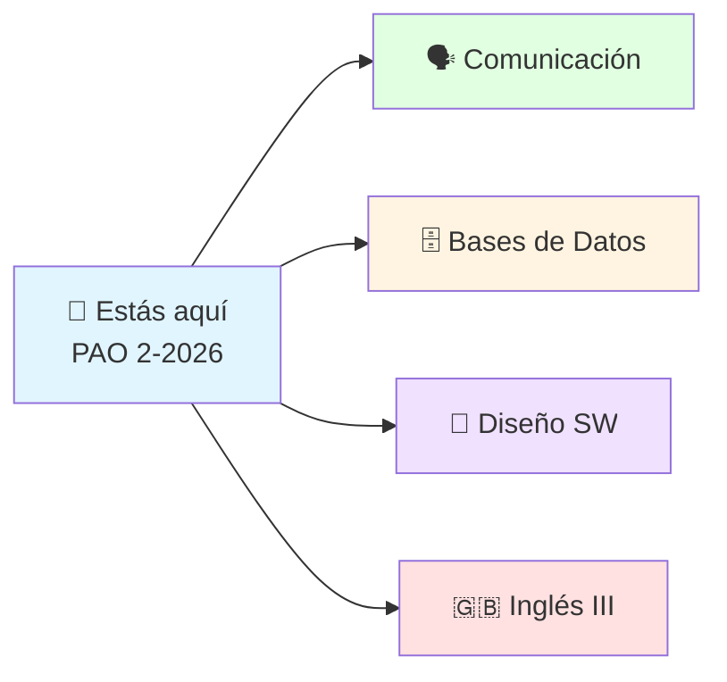

---
{"dg-publish":true,"permalink":"/universidad/index/","tags":["gardenEntry"],"dg-note-properties":{}}
---

# 🎓 FS — Notas ESPOL

> [!quote] 💡 *"Lo que no se escribe, se olvida. Lo que se comparte, se multiplica."*
>
> Bienvenido a mi jardín digital: apuntes vivos de **Ingeniería Computacional en ESPOL**, organizados por semestres y publicados automáticamente desde Obsidian.

> [!success] 📊 El jardín en números
>
> | 🌱 Notas | 📚 Materias | 📎 PDFs de apoyo | 🎯 Semestre actual |
> |---|---|---|---|
> | **700+** | **18** | **50+** | **PAO 2-2026** |

---

## 📌 Semestre actual — PAO 2-2026

> [!info] 🎓 Materias que curso ahora — empieza por aquí
>
> - [[Universidad/2do Semestre/Comunicación/Comunicación\|Comunicación]] (2do · IDIG2012) `Activo`
> - [[Universidad/3er Semestre/Sistema de Bases de Datos/Sistema de Bases de Datos\|Sistema de Bases de Datos]] (3ro) `Activo`
> - [[Universidad/3er Semestre/Diseño de Software/Diseño de Software\|Diseño de Software]] (3ro) `Activo`
> - [[Universidad/3er Semestre/Ingles III/Ingles III\|Ingles III]] (3ro) `Activo`
> - [[Universidad/3er Semestre/Matemáticas Discretas/Matemáticas Discretas\|Matemáticas Discretas]] (3ro · repitiendo, notas ya completas) `Activo`

---

## 🗺️ Explorar por semestre

> [!tip] 🧭 ¿Cómo navegar?
>
> Usa el **árbol de archivos** (lateral), el **buscador** 🔍 o entra por tu semestre. Cada materia tiene su **mapa de contenido** con todas sus notas.

## Preuniversitario

- [[Universidad/Preuniversitario/MOOC de Comunicación/Comunicación Efectiva\|MOOC de Comunicación]]
- [[Universidad/Preuniversitario/MOOC - Ingles (A1 - A2)/Inglés (A1-A2)\|MOOC - Ingles (A1 - A2)]]
- [[Universidad/Preuniversitario/Matemáticas/Matemáticas\|Matemáticas]]

---

## 1er Semestre

- [[Universidad/1er Semestre/Cálculo de una Variable/Cálculo de una Variable\|Cálculo de una Variable]]
- [[Universidad/1er Semestre/Física Mecánica/Física Mecánica\|Física Mecánica]]
- [[Universidad/1er Semestre/Fundamentos de Programación/Fundamentos de Programación\|Fundamentos de Programación]]
- [[Universidad/1er Semestre/Ingles I (B1-B2)/Inglés I (B1-B2)\|Inglés I (B1-B2)]]

---

## 2do Semestre

- [[Universidad/2do Semestre/Algebra Lineal/Álgebra Lineal\|Álgebra Lineal]]
- [[Universidad/2do Semestre/Cálculo Vectorial/Cálculo Vectorial\|Cálculo Vectorial]]
- [[Universidad/2do Semestre/Comunicación/Comunicación\|Comunicación]] `Activo`
- [[Universidad/2do Semestre/Computación y Sociedad/Computación y Sociedad\|Computación y Sociedad]]
- [[Universidad/2do Semestre/Ingles II (C1-C2)/Inglés II (C1-C2)\|Inglés II (C1-C2)]]
- [[Universidad/2do Semestre/Programación orientada a objetos/Programación Orientada a Objetos\|Programación Orientada a Objetos]]

---

## 3er Semestre

- [[Universidad/3er Semestre/Fundamentos de Electricidad y Sistemas Digitales/Fundamentos de Electricidad y Sistemas Digitales\|Fundamentos de Electricidad y Sistemas Digitales]]
- [[Universidad/3er Semestre/Matemáticas Discretas/Matemáticas Discretas\|Matemáticas Discretas]] `Activo`
- [[Universidad/3er Semestre/Sistema de Bases de Datos/Sistema de Bases de Datos\|Sistema de Bases de Datos]] `Activo`
- [[Universidad/3er Semestre/Diseño de Software/Diseño de Software\|Diseño de Software]] `Activo`
- [[Universidad/3er Semestre/Ingles III/Ingles III\|Ingles III]] `Activo`

---

> [!example] 🌟 Sobre este jardín
>
> - 📝 Notas en Markdown, publicadas con [Digital Garden](https://github.com/oleeskild/Obsidian-Digital-Garden).
> - 🔄 Se actualiza solo cada vez que publico desde Obsidian.
> - 💖 *Espero que te sirva y te deseo suerte en tu paso por la universidad.*
