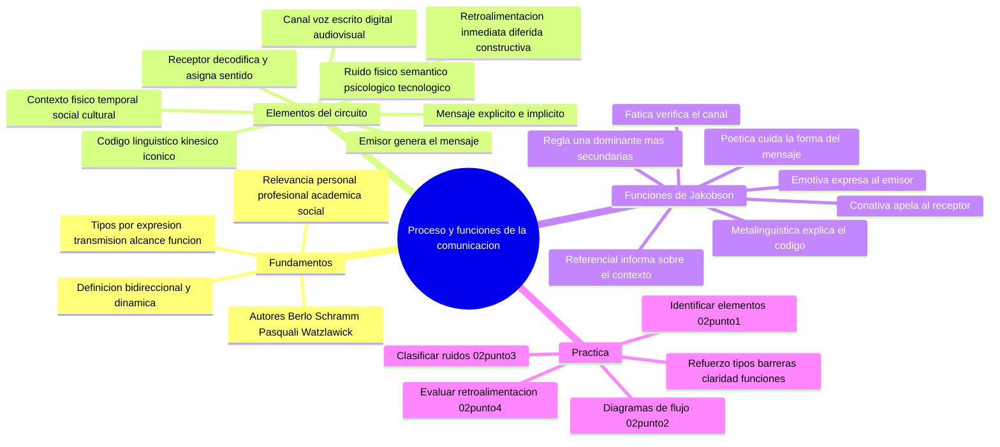

---
{"dg-publish":true,"permalink":"/universidad/preuniversitario/comunicacion-efectiva/unidad-1-el-proceso-de-la-comunicacion/01-el-proceso-y-las-funciones-de-la-comunicacion/","dg-note-properties":{}}
---

# 📡 El Proceso y las Funciones de la Comunicación

## 🎯 Introducción

> [!info] 💡 ¿Qué estudia esta nota?
>
> La **comunicación** es el proceso mediante el cual un emisor transmite un mensaje a un receptor a través de un canal, utilizando un código compartido, dentro de un contexto determinado, con posible ruido y con retroalimentación que cierra el circuito. No se trata solo de hablar o escribir: escuchar, observar, los gestos y hasta el silencio también comunican.
>
> Desde la antigüedad, la capacidad de comunicarse ha sido el motor del progreso humano. Sin ella no existirían lenguas, culturas, leyes, ciencias ni relaciones interpersonales. En el contexto universitario, dominar la comunicación efectiva es tan importante como dominar la materia técnica de cada carrera.
>
> Esta nota integra tres temas de la Unidad 1: la **definición e importancia** de la comunicación, los **ocho elementos del circuito comunicacional** y las **seis funciones del lenguaje de Jakobson**. Cada elemento del circuito activa una función dominante, por lo que los tres temas forman una sola unidad lógica.
>
> ```mermaid
> graph LR
>     A[Emisor] --> B[Mensaje]
>     B --> C[Canal]
>     C --> D[Receptor]
>     D --> E[Retroalimentacion]
>     E --> A
>     F[Codigo] --> B
>     G[Contexto] --> D
>     H[Ruido] --> C
> ```

---

## 1. Fundamentos de la Comunicación

> [!note] 🔑 Definición central
>
> La comunicación **no es un acto unidireccional**. Es un proceso circular, bidireccional y dinámico donde el emisor y el receptor intercambian roles continuamente. Cada mensaje enviado genera una respuesta (retroalimentación o *feedback*) que a su vez alimenta al emisor original.
>
> Este ciclo continuo implica:
> - **Bidireccionalidad:** ambos participantes emiten y reciben.
> - **Dinamismo:** el mensaje se modifica según el contexto, el estado emocional y el canal utilizado.
> - **Inevitabilidad:** incluso el silencio o la ausencia de respuesta comunican algo.
>
> > 📌 **Nota importante:** La comunicación no requiere necesariamente palabras. Un gesto, una mirada o incluso la ausencia de respuesta son formas válidas de comunicación. Según Watzlawick, es imposible no comunicarse: todo comportamiento tiene un valor de mensaje en una situación interpersonal.
>
> En el sentido clásico (estilo RAE): **comunicación** es la acción y efecto de hacer partícipe a otro de lo que se tiene — información, ideas, emociones o instrucciones — mediante un código común y un medio que las transporta.

> [!note] 📚 Definiciones de autor en una sola tabla
>
> |Autor|Definición|Enfoque|
> |---|---|---|
> |**David Berlo (1960)**|"La comunicación es el proceso mediante el cual un sistema emisor transmite información a otro sistema receptor."|Proceso de transmisión|
> |**Wilbur Schramm (1955)**|"La comunicación se inicia cuando una fuente codifica un mensaje y lo envía por un canal a un destino que lo descodifica."|Modelo científico y campo de experiencia|
> |**Antonio Pasquali (1977)**|"Comunicar es establecer una comunidad afectiva, intelectual o moral entre dos o más personas, en una dirección determinada."|Relación humana|
> |**Paul Watzlawick (1969)**|"No es posible no comunicar: todo comportamiento es comunicación verbal o no verbal."|Interacción sistemática|

---

### 1.1 Relevancia de la comunicación efectiva

> [!info] 💡 ¿Por qué es tan importante comunicarse bien?
>
> La comunicación efectiva no es un lujo ni una habilidad opcional: es una necesidad transversal a todas las áreas de la vida. En un mundo hiperconectado, donde la información fluye a velocidad vertiginosa, saber comunicar con claridad, respeto y empatía es una ventaja competitiva y una fuente de bienestar.

> [!success] 🌟 Relevancia personal, profesional, académica y social
>
> |Ámbito|Área|Beneficio de una buena comunicación|
> |---|---|---|
> |**Personal**|Relaciones personales|Fortalece vínculos, evita malentendidos, genera confianza|
> |**Personal**|Salud emocional|Permite expresar necesidades, establecer límites, gestionar conflictos|
> |**Personal**|Autoconocimiento|Facilita la reflexión interna y la toma de decisiones|
> |**Personal**|Resolución de problemas|Clarifica ideas, reduce ambigüedades, acelera soluciones|
> |**Profesional**|Liderazgo|Un líder claro motiva, delega eficientemente y genera compromiso|
> |**Profesional**|Trabajo en equipo|Coordina tareas, alinea objetivos, reduce fricciones|
> |**Profesional**|Negociación|Permite llegar a acuerdos mutuamente beneficiosos|
> |**Profesional**|Atención al cliente|Mejora la satisfacción, reduce quejas, fideliza|
> |**Profesional**|Entrevistas laborales|Presenta tu perfil con claridad y seguridad|
> |**Académico**|Aprendizaje|Participar en clase, formular preguntas, explicar conceptos|
> |**Académico**|Investigación|Redactar artículos, presentar hallazgos, defender tesis|
> |**Académico**|Presentaciones|Exponer ideas con estructura y conectar con la audiencia|
> |**Académico**|Trabajo colaborativo|Coordinar grupos, repartir responsabilidades, integrar perspectivas|
> |**Social**|Participación ciudadana|Expresar opiniones, participar en debates, votar informadamente|
> |**Social**|Cultura y diversidad|Comprender otras perspectivas, respetar diferencias, construir puentes|
> |**Social**|Prevención de conflictos|El diálogo constructivo evita la escalada de tensiones|
> |**Social**|Cambio social|Los movimientos sociales dependen de comunicar una visión compartida|

> [!warning] ⚠️ Consecuencias de la mala comunicación
>
> |Consecuencia|Descripción|
> |---|---|
> |**Malentendidos**|Interpretaciones erróneas del mensaje original|
> |**Conflictos interpersonales**|Desacuerdos que escalan por falta de claridad|
> |**Pérdida de tiempo y recursos**|Retrabajo y correcciones innecesarias|
> |**Daño reputacional**|Mensajes inadecuados que afectan la imagen personal o institucional|
> |**Estrés y frustración**|Sensación de no ser escuchado o comprendido|
> |**Pérdida de oportunidades**|Puertas que se cierran por un mensaje mal formulado o a destiempo|

---

### 1.2 Tipos de comunicación

> [!info] 💡 ¿Cómo se clasifica la comunicación?
>
> La comunicación es un fenómeno complejo que puede clasificarse desde múltiples perspectivas: por canal de expresión, por canal de transmisión, por alcance y dirección, y por función predominante.

> [!note] 🗂️ Tipos por canal de expresión
>
> |Tipo|Descripción|Ejemplos|
> |---|---|---|
> |**Verbal**|Utiliza palabras habladas o escritas|Conversaciones, ensayos, correos electrónicos, discursos|
> |**No verbal**|Transmite información sin palabras, con el cuerpo o señales|Expresiones faciales, lenguaje corporal, tono de voz, proxemia|
> |**Paraverbal**|Aspecto auditivo del mensaje verbal que lo modifica o complementa|Entonación, ritmo, pausas, volumen, énfasis|

> [!note] 🗂️ Tipos por canal de transmisión
>
> |Tipo|Descripción|Ejemplos|
> |---|---|---|
> |**Oral**|Se produce en tiempo real mediante la voz hablada|Conferencias, llamadas telefónicas, reuniones|
> |**Escrita**|Se registra en un soporte físico o digital con permanencia|Libros, artículos, mensajes de texto, publicaciones en redes|
> |**Gráfica**|Utiliza imágenes, símbolos o signos visuales|Señales de tránsito, emojis, infografías, logotipos|

> [!note] 🗂️ Tipos por alcance y dirección
>
> |Tipo|Descripción|Ejemplos|
> |---|---|---|
> |**Intrapersonal**|Comunicación consigo mismo: pensamientos, monólogo interno|Planificación personal, autoevaluación, meditación|
> |**Interpersonal**|Entre dos personas, cara a cara o virtual|Conversación con un amigo, entrevista de trabajo, tutoría|
> |**Grupal**|Entre un número reducido de personas con propósito común|Reuniones de equipo, seminarios, mesas redondas|
> |**Organizacional**|Dentro de una institución, siguiendo estructuras jerárquicas|Circulares internos, boletines corporativos, reuniones de dirección|
> |**Masiva**|Dirigida a un público amplio e indefinido por medios de comunicación|Noticieros de TV, periódicos, redes sociales, campañas publicitarias|

> [!note] 🗂️ Tipos por función predominante
>
> |Tipo|Función|Ejemplo|
> |---|---|---|
> |**Denotativa (informativa)**|Transmite información objetiva y verificable|Noticia de un periódico, instructivo de uso|
> |**Connotativa (expresiva)**|Emite opiniones, sentimientos y valoraciones|Crítica literaria, carta personal|
> |**Apelativa (persuasiva)**|Busca influir en el receptor y provocar una acción|Publicidad, discurso político, llamado a la acción|
> |**Referencial (contextual)**|Se centra en el propio mensaje o el contexto comunicativo|"Dicho sea de paso...", notas al pie|
> |**Metalingüística**|Se refiere al código lingüístico mismo|Definiciones de palabras, explicaciones gramaticales|

---

### 1.3 Barreras de la comunicación

> [!warning] 🚧 ¿Qué son las barreras comunicacionales?
>
> Las **barreras de la comunicación** son todos aquellos factores que impiden, distorsionan o dificultan la correcta transmisión y recepción de un mensaje. Pueden originarse en el emisor, en el receptor, en el canal o en el contexto. Identificarlas es el primer paso para superarlas.

> [!warning] 🚧 Tipos de barreras y cómo superarlas
>
> |Barrera|Tipo|Ejemplo|Estrategia de superación|
> |---|---|---|---|
> |**Ruido ambiental**|Física|Conversación en una calle concurrida, ventilador encendido en conferencia|Buscar entornos adecuados, usar micrófono con cancelación de ruido|
> |**Idioma o jerga técnica**|Semántica|Terminología especializada sin explicar a audiencia general|Usar lenguaje claro y adaptado, definir términos|
> |**Prejuicios y estereotipos**|Psicológica|Descartar una opinión por edad, género o apariencia|Practicar empatía y escucha activa|
> |**Diferencias culturales**|Cultural|Un gesto cortés en una cultura y ofensivo en otra|Respetar la diversidad cultural, informarse antes|
> |**Problemas auditivos o del habla**|Fisiológica|Hipoacusia, tartamudez, dificultades de articulación|Adaptar medios y canales, preferir videollamada o texto|
> |**Barreras digitales**|Tecnológica|Conexión inestable, falta de acceso a tecnología|Tener conexión alternativa, descargar materiales previamente|
> |**Defensividad**|Emocional|Rechazar un mensaje por sentirse atacado|Crear confianza, usar tono calmado, técnica de teach-back|
> |**Sobrecarga informativa**|Cognitiva|Demasiados mensajes simultáneos sin poder procesarlos|Priorizar, dosificar, usar formatos legibles y concisos|

---

### 1.4 Características de la comunicación efectiva

> [!info] 💡 ¿Qué hace que una comunicación sea efectiva?
>
> Una comunicación es efectiva cuando el mensaje recibido coincide con el mensaje enviado, es decir, cuando el receptor comprende exactamente lo que el emisor quiso transmitir. Esto depende no solo del contenido, sino del tono, el canal, el contexto y la actitud de ambos participantes.

> [!success] ✨ Atributos clave
>
> |Característica|Definición|Ejemplo práctico|
> |---|---|---|
> |**Claridad**|El mensaje se expresa de forma comprensible, sin ambigüedades|Decir "Reunión martes a las 10 a.m. en el aula 3" en vez de "Nos vemos pronto"|
> |**Concisión**|Se dice lo necesario sin información redundante|Un correo de 3 líneas en vez de un párrafo de 200 palabras|
> |**Precisión**|Los datos y cifras son exactos y verificables|"El informe se entrega el 15 de septiembre" en vez de "pronto"|
> |**Empatía**|Se considera la perspectiva y el estado emocional del receptor|"Entiendo que estás ocupado, ¿cuándo te viene mejor?"|
> |**Retroalimentación**|Se verifica que el mensaje fue recibido y comprendido|"¿Me confirmas que recibiste el archivo?"|
> |**Coherencia**|Consistencia entre lo que se dice, cómo se dice y el lenguaje corporal|Un tono amable que acompaña palabras de apoyo|
> |**Respeto**|Se evita el uso ofensivo, discriminatorio o irrespetuoso|Agradecer, pedir con cortesía, escuchar sin interrumpir|
> |**Adaptabilidad**|Se ajusta el mensaje al canal, la audiencia y el contexto|Explicar un tema técnico distinto para un experto y un principiante|

> [!tip] ✅ Estrategias para comunicarte mejor
>
> 1. **Escucha activamente:** atiende al contenido, las emociones y el lenguaje corporal del otro.
> 2. **Sé concreto:** evita rodeos; ve al punto con respeto y claridad.
> 3. **Verifica la comprensión:** pregunta "¿Quedó claro?" o "¿Hay alguna duda?" antes de cerrar.
> 4. **Adapta tu lenguaje:** ajusta el vocabulario según tu interlocutor.
> 5. **Controla las emociones:** si estás alterado, respira profundo antes de responder.
> 6. **Observa el lenguaje corporal:** postura, mirada y gestos comunican tanto como las palabras.
> 7. **Practica la empatía:** antes de responder, ponte en el lugar del otro.
> 8. **Pide retroalimentación:** "¿Qué opinas?" abre el diálogo.
> 9. **Estructura tus mensajes:** idea principal primero, luego detalles y acción esperada.
> 10. **Usa ejemplos concretos:** un caso real facilita la comprensión inmediata.

> [!tip] 📱 Comunicación efectiva en entornos digitales
>
> |Consejo|Descripción|
> |---|---|
> |**Elige el canal adecuado**|Un tema delicado no se resuelve por chat; una actualización rápida no requiere reunión formal|
> |**Evita el abuso de mayúsculas**|Escribir todo en mayúsculas se interpreta como grito|
> |**Relee antes de enviar**|Los mensajes escritos se malinterpretan fácil; verifica el tono antes de dar enviar|
> |**Respeta los tiempos de respuesta**|No esperes respuesta inmediata en horarios no laborales|
> |**Usa formato legible**|Párrafos cortos, viñetas y negritas para lo importante|

---

## 2. Elementos del Circuito de la Comunicación

> [!info] 💡 ¿Qué es el circuito comunicacional?
>
> Todo acto de comunicación se estructura como un **circuito** con componentes interconectados: emisor, mensaje, código, canal, receptor, contexto, ruido y retroalimentación. Estudiar estos elementos permite diagnosticar por qué un mensaje falla, diseñar mensajes más efectivos y mejorar la comprensión en salud, educación, empresa y vida cotidiana.
>
> ```mermaid
> graph LR
>     A[Emisor] --> B[Codifica mensaje]
>     B --> C[Canal]
>     C --> D[Receptor]
>     D --> E[Decodifica y responde]
>     E --> A
>     F[Codigo compartido] --> B
>     G[Contexto] --> C
>     H[Ruido] --> D
> ```

> [!note] 📐 Modelos clásicos: Shannon-Weaver y Schramm
>
> Claude Shannon y Warren Weaver (1949) propusieron un modelo lineal de transmisión de información, concebido para telecomunicaciones y luego adaptado al ámbito humano. Es la base del circuito comunicacional.
>
> |Elemento|Definición|Ejemplo humano|
> |---|---|---|
> |**Emisor**|Fuente que genera el mensaje|Un profesor que explica un tema|
> |**Mensaje**|Información que se desea transmitir|La explicación sobre fotosíntesis|
> |**Código**|Sistema de signos utilizado|Español escrito, gestos, imágenes|
> |**Canal**|Medio por donde viaja el mensaje|La voz, un libro, Internet|
> |**Receptor**|Destinatario que recibe y decodifica|Un estudiante que escucha|
> |**Ruido**|Interferencia que distorsiona el mensaje|Un teléfono que suena mientras se explica|
> |**Retroalimentación**|Respuesta del receptor al emisor|El estudiante formula una pregunta|
>
> Wilbur Schramm (1954) amplió el modelo con el **campo de experiencia** del emisor y del receptor: la comunicación es efectiva solo cuando sus campos se superponen. Cuanto mayor es la superposición, mejor se comprende el mensaje. Además concibe la comunicación como simultánea: emisor y receptor intercambian roles en tiempo real.

---

### 2.1 Los ocho elementos en forma compacta

> [!note] 🗂️ Visión panorámica
>
> Los ocho elementos son indispensables: si falta uno o falla, la comunicación se degrada o se interrumpe. La tabla siguiente condensa lo esencial de cada uno; los detalles por tipo se desarrollan en las sub-tablas que siguen.

> [!success] 📊 Los ocho elementos del proceso comunicacional
>
> |Elemento|Definición breve|Ejemplo concreto|
> |---|---|---|
> |**1. Emisor**|Quien genera y transmite el mensaje|Un docente en clase|
> |**2. Mensaje**|El contenido que se desea transmitir|La explicación sobre el sistema nervioso|
> |**3. Código**|Sistema de signos para codificar el mensaje|Español oral con dibujos en la pizarra|
> |**4. Canal**|Medio por donde viaja el mensaje|La voz y la pizarra en el aula|
> |**5. Receptor**|Quien recibe y decodifica el mensaje|Un estudiante que toma apuntes|
> |**6. Contexto**|Circunstancias que enmarcan la comunicación|Un salón de clases durante la mañana|
> |**7. Ruido**|Interferencia que distorsiona el mensaje|El ruido del aire acondicionado|
> |**8. Retroalimentación**|Respuesta del receptor al emisor|El estudiante pregunta si no entendió|

> [!note] 1️⃣ Emisor — Quién comunica
>
> El **emisor** es quien inicia el proceso al elaborar y transmitir un mensaje. Puede ser una persona, un grupo, una organización o incluso una máquina (por ejemplo, un sistema de notificaciones automáticas).
>
> |Aspecto|Detalle|
> |---|---|
> |**Función principal**|Convertir una idea en un mensaje transmisible|
> |**Requisitos**|Claridad de intención, dominio del código, conocimiento del público|
> |**Errores comunes**|Suponer que el receptor sabe lo mismo, usar código inadecuado, no planificar el mensaje|
> |**Ejemplo**|Un médico que explica un diagnóstico: su vocabulario, empatía y tono determinan la calidad de la transmisión|

> [!note] 2️⃣ Mensaje — Qué se comunica
>
> El **mensaje** es el conjunto de información, ideas, emociones o instrucciones que el emisor desea transmitir. Tiene dos dimensiones: **explícito** (contenido literal) e **implícito** (subtexto, connotaciones, emociones no dichas).
>
> |Tipo de mensaje|Ejemplo|
> |---|---|
> |**Verbal oral**|Una conferencia, una conversación telefónica|
> |**Verbal escrito**|Un correo electrónico, un contrato, una nota|
> |**No verbal**|Gestos, expresiones faciales, postura corporal|
> |**Paraverbal**|Tono de voz, ritmo, énfasis|
> |**Visual**|Infografías, señales, mapas semánticos|

> [!note] 3️⃣ Código — Cómo se codifica
>
> El **código** es el sistema de signos y reglas para transformar la idea en mensaje: idioma, semántica, sintaxis y códigos no verbales. Sin código compartido, la decodificación es imposible.
>
> |Tipo de código|Ejemplo|
> |---|---|
> |**Lingüístico**|Español, inglés, lenguaje de señas|
> |**Paralingüístico**|Entonación, pausas, velocidad del habla|
> |**Kinésico**|Gestos, expresiones faciales, contacto visual|
> |**Proxémico**|Distancia física entre interlocutores|
> |**Icónico**|Símbolos gráficos, logotipos, emojis|
> |**Numérico**|Código binario, ecuaciones matemáticas|

> [!note] 4️⃣ Canal — Por dónde viaja
>
> El **canal** es el medio físico o virtual por el que viaja el mensaje. Su elección afecta la fidelidad, la velocidad y el alcance.
>
> |Canal|Ventajas|Limitaciones|
> |---|---|---|
> |**Voz en vivo**|Inmediato, retroalimentación rápida|Alcance limitado, susceptible al ruido ambiental|
> |**Escrito en papel**|Permanente, revisable|Lento, sin retroalimentación instantánea|
> |**Digital (email, chat, redes)**|Alcance global, multimodal|Sobrecarga informativa, pierde claves no verbales|
> |**Audiovisual (video, TV)**|Combina imagen y sonido|Requiere equipamiento, no siempre interactivo|
> |**No verbal (cuerpo)**|Espontáneo, complementa lo verbal|Ambiguo, puede contradecir lo dicho|

> [!note] 5️⃣ Receptor — Quién recibe
>
> El **receptor** obtiene el mensaje, lo decodifica y le asigna significado. La decodificación depende de sus conocimientos, cultura, estado emocional y atención.
>
> |Factor que influye|Efecto|
> |---|---|
> |**Conocimientos previos**|Sin base en el tema, puede malinterpretar el mensaje|
> |**Estado emocional**|Ansiedad o euforia distorsionan la percepción|
> |**Atención**|Si está distraído, omite partes del mensaje|
> |**Expectativas**|Lo que espera escuchar puede filtrar lo que realmente se dice|
> |**Código compartido**|Si no comparten idioma, la decodificación falla|

> [!note] 6️⃣ Contexto — Dónde ocurre
>
> El **contexto** es el conjunto de circunstancias que enmarcan la comunicación: momento, lugar, relación entre participantes, normas sociales y cultura. Determina qué es apropiado decir, cómo decirlo y cómo interpretarlo.
>
> |Dimensión del contexto|Ejemplo|
> |---|---|
> |**Físico y espacial**|Una sala de clases frente a una reunión informal en un café|
> |**Temporal**|Una emergencia frente a una conversación de sobremesa|
> |**Social y relacional**|Jefe-empleado frente a amigos de confianza|
> |**Cultural**|Gestos normales en una cultura y ofensivos en otra|
> |**Histórico y político**|Un mensaje sobre derechos humanos en un país en dictadura|

> [!note] 7️⃣ Ruido — Interferencias
>
> El **ruido** es cualquier factor que interfiere con la transmisión o recepción, provocando que el receptor obtenga una versión distorsionada o incompleta del mensaje.
>
> |Tipo de ruido|Fuente|Ejemplo|
> |---|---|---|
> |**Físico externo**|Estímulos ambientales|Tráfico, música alta, una alarma|
> |**Psicológico interno**|Estado mental del emisor o receptor|Preocupaciones personales, sesgos, estrés|
> |**Semántico**|Diferencias en código o vocabulario|Técnico que usa jerga que el paciente no entiende|
> |**Fisiológico**|Condición corporal|Sordera, dolor de cabeza, cansancio|
> |**Simbólico**|Significados culturales opuestos|Un gesto positivo en una cultura y negativo en otra|
> |**Tecnológico**|Fallas en el canal|Señal cortada, correo que llega a spam, pantalla congelada|

> [!note] 8️⃣ Retroalimentación — Respuesta
>
> La **retroalimentación** (feedback) es la respuesta del receptor al emisor. Permite verificar si el mensaje fue comprendido, corregir errores y ajustar la comunicación en tiempo real. Sin ella, la comunicación es unidireccional e incompleta.
>
> |Tipo de retroalimentación|Característica|Ejemplo|
> |---|---|---|
> |**Inmediata en tiempo real**|Ocurre durante la comunicación|Asentir con la cabeza, mueca de confusión|
> |**Diferida**|Se produce después de la comunicación|Encuesta de satisfacción, correo de seguimiento|
> |**Positiva**|Indica comprensión o acuerdo|Elogio, sonrisa, respuesta afirmativa|
> |**Negativa**|Indica desacuerdo o incomprensión|Objeción, gesto de rechazo, queja|
> |**Constructiva**|Busca mejorar sin dañar|Sugerencias específicas y respetuosas|
> |**Destructiva**|Ataca en vez de corregir|Críticas personales, burlas|

---

## 3. Funciones del Lenguaje según Jakobson

> [!info] 💡 ¿Por qué el lenguaje tiene funciones?
>
> El lenguaje no sirve para un solo propósito: cada vez que hablamos o escribimos, **activamos simultáneamente varias funciones**. Un periodista informa (función referencial) pero también puede persuadir (conativa), usar un estilo literario (poético) y verificar que su audiencia lo entienda (metalingüística).
>
> Comprender estas funciones permite el **análisis crítico** de textos, **mejorar la persuasión** en discursos y **detectar la intención real** detrás de cualquier mensaje. El lingüista ruso **Roman Jakobson** formuló en 1960 el modelo más influyente: **seis funciones** vinculadas a los seis elementos del proceso comunicativo.

> [!note] 🧩 El circuito de Jakobson
>
> Todo acto comunicativo involucra seis elementos y cada uno activa una función dominante:
>
> |Elemento del circuito|Función del lenguaje|Pregunta clave|
> |---|---|---|
> |**Contexto (referente)**|Referencial|¿Qué se dice del mundo?|
> |**Emisor**|Emotiva (expresiva)|¿Cómo se siente el emisor?|
> |**Receptor**|Conativa (apelativa)|¿Qué se le pide al receptor?|
> |**Canal (contacto)**|Fática|¿El canal está abierto?|
> |**Código**|Metalingüística|¿Se entiende el código?|
> |**Mensaje**|Poética|¿Cómo se dice?|
>
> > 📌 **Regla de oro:** Ninguna función actúa sola. En todo mensaje hay **una función dominante** y varias funciones secundarias. Por ejemplo, un titular de periódico tiene función referencial dominante, pero su redacción retórica activa también la función poética.

---

### 3.1 Las seis funciones con un ejemplo cada una

> [!note] 📖 1. Función Referencial
>
> **Elemento dominante:** Contexto y referente.
>
> **Propósito:** Transmitir información objetiva sobre la realidad. El mensaje se centra en **lo que se dice**, no en quién lo dice ni cómo se siente.
>
> **Ejemplo:** *"La temperatura máxima hoy será de 32 °C."*
>
> **¿Cuándo se usa?** En textos científicos, noticias informativas, manuales, reportes de datos y definiciones. Predomina en el lenguaje **denotativo** y la comunicación **expositiva**.

> [!note] 😊 2. Función Emotiva o Expresiva
>
> **Elemento dominante:** Emisor.
>
> **Propósito:** Expresar sentimientos, actitudes y estados emocionales del emisor. El mensaje refleja **cómo se siente** quien habla.
>
> **Ejemplo:** *"¡Qué maravilloso día! Me siento increíble."*
>
> **¿Cuándo se usa?** En expresiones espontáneas, exclamaciones, interjecciones, discursos personales, diarios íntimos y poesía lírica. Predomina en la comunicación **expresiva**.

> [!note] 🎯 3. Función Conativa o Apelativa
>
> **Elemento dominante:** Receptor.
>
> **Propósito:** Influir en el receptor, persuadirlo, dirigir su comportamiento o solicitar una acción. El mensaje se orienta **hacia el receptor**.
>
> **Ejemplo:** *"¡Cierra la puerta ahora mismo!"*
>
> **¿Cuándo se usa?** En órdenes, mandatos, publicidad, discursos políticos, textos persuasivos y llamados a la acción. Predomina en la comunicación **directiva** e **imperativa**.

> [!note] 📡 4. Función Fática
>
> **Elemento dominante:** Canal y contacto.
>
> **Propósito:** Verificar, mantener o restablecer el canal. El mensaje no transmite información sustantiva sino que **asegura que la conexión funcione**.
>
> **Ejemplo:** *"¿Me escuchas? ¿Estás ahí? ¿Puedes oírme?"*
>
> **¿Cuándo se usa?** En saludos ("Hola", "Buenos días"), fórmulas de cortesía ("¿Cómo estás?"), comprobaciones técnicas ("¿Se escucha el micrófono?"). Predomina en la comunicación **interpersonal** e **informal**.

> [!note] 🔄 5. Función Metalingüística
>
> **Elemento dominante:** Código.
>
> **Propósito:** Aclarar, explicar o verificar el propio código lingüístico. El lenguaje **se usa para hablar del lenguaje**.
>
> **Ejemplo:** *"¿Qué significa 'efímero'? Significa algo que dura poco."*
>
> **¿Cuándo se usa?** En definiciones, explicaciones gramaticales, glosarios, correcciones y traducción. Predomina en la enseñanza del idioma y la lingüística.

> [!note] ✨ 6. Función Poética
>
> **Elemento dominante:** Mensaje.
>
> **Propósito:** Centrarse en la **forma** del mensaje, en cómo se dice, por encima de lo que se dice. El mensaje se convierte en objeto estético.
>
> **Ejemplo:** *"La vida es un suspiro entre dos silencios."*
>
> **¿Cuándo se usa?** En poesía, literatura, publicidad creativa, juegos de palabras y retórica. Predomina en la comunicación **estética** y **artística**.

---

### 3.2 Funciones en combinación

> [!note] 💡 En la práctica, las funciones coexisten
>
> Un mensaje real **nunca** tiene una sola función. Siempre hay una **función dominante** y varias **funciones secundarias** que complementan el efecto comunicativo.
>
> **Ejemplo — Titular de periódico:** *"La inflación devora los ahorros de millones de familias"*
> - **Referencial dominante:** informa sobre la inflación.
> - **Conativa:** busca provocar preocupación en el lector.
> - **Poética:** el verbo "devora" es una metáfora que embellece el mensaje.
>
> **Ejemplo — Discurso político:** *"¡Nuestro pueblo merece justicia! ¡No más mentiras!"*
> - **Conativa dominante:** intenta convencer y movilizar a la audiencia.
> - **Emotiva:** expresa indignación del orador.
> - **Fática:** "¡Nuestro pueblo!" crea cercanía y verifica el vínculo.
>
> > 📌 La función **fática** y la **metalingüística** rara vez son dominantes en textos formales, pero son **imprescindibles** para que la comunicación funcione en la vida cotidiana.

> [!note] 📊 Comparación de las 6 funciones del lenguaje
>
> |Función|Elemento dominante|Propósito|Ejemplo|Registro|Género y texto típico|
> |---|---|---|---|---|---|
> |**Referencial**|Contexto|Transmitir información objetiva|*"Madrid es la capital de España."*|Denotativo, formal|Noticia, ensayo, manual|
> |**Emotiva**|Emisor|Expresar sentimientos y actitudes|*"¡Estoy furioso con esta injusticia!"*|Expresivo, informal|Diario, exclamación, poesía lírica|
> |**Conativa**|Receptor|Persuadir o dirigir al receptor|*"Vota por el cambio ahora."*|Imperativo, persuasivo|Publicidad, discurso, orden|
> |**Fática**|Canal|Verificar o mantener la conexión|*"¿Me escuchas bien?"*|Interpersonal, social|Saludo, small talk, comprobación técnica|
> |**Metalingüística**|Código|Explicar o definir el propio código|*"¿Qué es un oxímoron? Es una contradicción."*|Pedagógico, metacognitivo|Glosario, clase de idiomas, corrección|
> |**Poética**|Mensaje|Centrarse en la forma estética|*"La vida es un sueño, el mundo una comedia."*|Estético, retórico|Poesía, literatura, publicidad creativa|
>
> > 📌 **Clave para el examen:** identifica la función dominante preguntándote en qué elemento del circuito está centrado el mensaje. Si habla del mundo real es referencial; si habla del emisor es emotiva; si apela al receptor es conativa; si toca el canal es fática; si explica el código es metalingüística; si la forma importa más que el contenido es poética.

---

## 4. Práctica Integrada

> [!info] 💡 Instrucciones generales
>
> Los ejercicios a continuación están diseñados para reforzar los tres bloques de esta nota. Cada uno es colapsable: haz clic en el título para expandirlo. Intenta resolverlos **antes** de ver las respuestas. Los ejercicios 02.1 a 02.4 pertenecen a esta nota integrada por especificación; los de refuerzo condensan lo mejor de las notas originales 01 y 03.

> [!example]- ✏️ Ejercicio 02.1 — Identificar elementos del proceso comunicacional
>
> **Instrucción:** Lee cada situación y sitúa cada elemento del proceso comunicacional.
>
> **Situación A:** Una madre le envía un mensaje de texto a su hijo para preguntarle si llegó bien a la universidad.
>
> |Elemento|Identificación|
> |---|---|
> |Emisor|La madre|
> |Mensaje|¿Llegaste bien?|
> |Código|Español escrito informal, emojis|
> |Canal|Aplicación de mensajería (WhatsApp)|
> |Receptor|El hijo|
> |Contexto|Hora de la mañana, relación familiar|
> |Ruido|El hijo está en un autobús ruidoso y no lee el mensaje de inmediato|
> |Retroalimentación|El hijo responde "Sí, ya llegué" con un emoji|
>
> ---
>
> **Situación B:** Un doctor le explica a su paciente, en una consulta presencial, los resultados de un análisis de sangre.
>
> |Elemento|Identificación|
> |---|---|
> |Emisor|El doctor|
> |Mensaje|Los resultados del análisis y las recomendaciones médicas|
> |Código|Español médico-técnico simplificado|
> |Canal|Voz en vivo, apuntes impresos|
> |Receptor|El paciente|
> |Contexto|Consultorio médico, relación profesional|
> |Ruido|El paciente está nervioso (ruido psicológico) y puede no recordar todo|
> |Retroalimentación|El paciente hace preguntas de aclaración|
>
> ---
>
> **Situación C:** Un profesor universitario sube una presentación de diapositivas a la plataforma Moodle y envía un correo a sus estudiantes.
>
> |Elemento|Identificación|
> |---|---|
> |Emisor|El profesor|
> |Mensaje|Las diapositivas y las instrucciones de la actividad|
> |Código|Español académico escrito, imágenes, esquemas|
> |Canal|Plataforma Moodle + correo electrónico|
> |Receptor|Los estudiantes del curso|
> |Contexto|Semestre lectivo, actividad obligatoria|
> |Ruido|Algunos estudiantes no revisan su correo|
> |Retroalimentación|Los estudiantes envían dudas por el foro|

> [!example]- ✏️ Ejercicio 02.2 — Dibujar diagrama de flujo comunicacional
>
> **Instrucción:** Para cada escenario, dibuja un diagrama de flujo que represente el proceso comunicacional completo, señalando cada elemento.
>
> **Escenario 1:** Un locutor de radio transmite un boletín de noticias por la frecuencia FM a sus oyentes en la ciudad.
>
> ```mermaid
> graph LR
>     A[Locutor Emisor] --> B[Boletin de noticias]
>     B --> C[Ondas FM]
>     C --> D[Radio del oyente]
>     D --> E[Pregunta del oyente]
> ```
>
> ---
>
> **Escenario 2:** Un estudiante presenta su proyecto final ante un jurado de tres profesores en un salón de actos.
>
> ```mermaid
> graph LR
>     A[Estudiante Emisor] --> B[Proyecto]
>     B --> C[Salon de actos]
>     C --> D[Jurado Receptor]
>     D --> E[Retroalimentacion]
> ```
>
> **Nota:** En este caso, el jurado también emite retroalimentación que influye en el estudiante, quien a su vez puede responder con aclaraciones.

> [!example]- ✏️ Ejercicio 02.3 — Clasificar tipos de ruido
>
> **Instrucción:** Clasifica cada interferencia en el tipo de ruido correspondiente y propón una estrategia para minimizarla.
>
> |Situación|Tipo de ruido|Estrategia de mitigación|
> |---|---|---|
> |Una conferencia donde el aire acondicionado hace mucho ruido|Físico externo|Pedir que reduzcan la velocidad del ventilador o usar micrófono con cancelación de ruido|
> |Un paciente que teme por su diagnóstico y no escucha las indicaciones del médico|Psicológico interno|Crear un ambiente de confianza, usar tono calmado y preguntar si hay dudas|
> |Un ingeniero explica un diagrama técnico usando jerga especializada a un cliente que no conoce el campo|Semántico|Traducir los términos a lenguaje cotidiano, usar ejemplos y analogías|
> |Una persona con pérdida auditiva parcial que no escucha bien una llamada telefónica|Fisiológico|Usar auriculares con amplificación, preferir videollamada donde pueda leer labios|
> |Un mensaje de texto interpretado como irónico cuando era sincero|Simbólico|Aclarar la intención con una frase explícita o un emoji que desambigue|
> |Una presentación en línea que se congela por mala conexión|Tecnológico|Tener conexión alternativa, descargar materiales previamente|

> [!example]- ✏️ Ejercicio 02.4 — Evaluar la efectividad de la retroalimentación
>
> **Instrucción:** Analiza la retroalimentación en cada escenario: ¿Es efectiva? ¿Por qué? Propón una mejora.
>
> **Escenario A:** Un profesor termina su clase y pregunta "¿Alguna duda?". Nadie responde y él da la clase por terminada.
>
> |Análisis|Respuesta|
> |---|---|
> |¿Es efectiva la retroalimentación?|No, es insuficiente. La ausencia de respuesta no significa comprensión; puede indicar intimidación, falta de atención o vergüenza de preguntar.|
> |Propuesta de mejora|Usar preguntas específicas ("¿Qué parte les resultó más difícil?"), un minuto de reflexión escrita o herramientas digitales anónimas.|
>
> ---
>
> **Escenario B:** Un jefe da instrucciones por correo sobre un cambio de procedimiento. Un empleado responde: "Entendido, pero tengo una duda sobre el paso 3: ¿se refiere a la versión nueva o la anterior del formulario?".
>
> |Análisis|Respuesta|
> |---|---|
> |¿Es efectiva la retroalimentación?|Sí, es constructiva. El empleado demuestra que leyó, entendió el contexto general y señala una ambigüedad específica.|
> |Propuesta de mejora|El jefe debe responder con claridad y en futuros correos especificar la versión del documento.|
>
> ---
>
> **Escenario C:** Un paciente le dice al doctor "Sí, sí, entiendo todo" pero al salir llama a la enfermera para preguntar cuántas pastillas debe tomar.
>
> |Análisis|Respuesta|
> |---|---|
> |¿Es efectiva la retroalimentación?|No, fue engañosa (falsa conformidad). El paciente no se sintió cómodo mostrando su confusión.|
> |Propuesta de mejora|Crear mayor confianza, resumir las indicaciones en voz alta y pedir que el paciente las repita con sus palabras (técnica de teach-back).|

> [!example]- ✏️ Ejercicio Refuerzo A — Tipos, barreras y claridad
>
> **Parte 1 — Clasificar tipos de comunicación:**
>
> |Situación|Tipo de comunicación|Categoría|
> |---|---|---|
> |Un mensaje de texto a un amigo|Escrita e interpersonal|Canal y alcance|
> |Una conferencia magistral|Oral y masiva|Canal y alcance|
> |Un diario personal|Escrita e intrapersonal|Canal y alcance|
> |Una expresión facial de sorpresa|No verbal e interpersonal|Canal y alcance|
> |Un anuncio publicitario en TV|Oral-visual, masiva y apelativa|Canal, alcance y función|
>
> **Parte 2 — Identificar barreras:**
>
> |Situación|Barrera|
> |---|---|
> |Dos personas hablan en un restaurante ruidoso|Física (ruido ambiental)|
> |Un médico usa términos latinos sin explicar al paciente|Semántica (jerga técnica)|
> |Un jefe descalifica una idea sin escucharla|Psicológica (prejuicio)|
> |Un turista no entiende un gesto de asentimiento en Japón|Cultural (diferencia cultural)|
> |Una persona con hipoacusia no entiende una instrucción oral|Fisiológica (capacidad auditiva)|
>
> **Parte 3 — Reescribir para mayor claridad:**
>
> |Mensaje original|Problema|Mensaje mejorado|
> |---|---|---|
> |"Nos vemos la próxima semana para hablar de eso."|Vago, sin fecha ni lugar|"Nos vemos el martes 8 de septiembre a las 2 p.m. en mi oficina para tratar el proyecto."|
> |"Hay muchos problemas en la empresa que hay que resolver."|Genérico, sin acción concreta|"Ventas y Logística presentan retrasos; propongo una reunión para definir soluciones."|
> |"Ok."|Insuficiente, ambiguo|"Recibido. Revisaré el documento y te envío mis comentarios antes del viernes."|
>
> **Parte 4 — Análisis de comunicación efectiva:**
>
> *"Juan, necesito que el reporte financiero esté listo para el viernes a las 3 p.m. Si tienes algún impedimento, házmelo saber hoy para que busquemos alternativas. ¿Tienes alguna duda?"*
>
> |Característica evaluada|Presente|Justificación|
> |---|---|---|
> |Claridad|Sí|Indica qué, cuándo y qué hacer si hay problema|
> |Concisión|Sí|No sobra ni falta información|
> |Precisión|Sí|Fecha y hora exactas: viernes, 3 p.m.|
> |Empatía|Sí|Ofrece alternativa si hay impedimento|
> |Retroalimentación|Sí|Pregunta si hay dudas|

> [!example]- ✏️ Ejercicio Refuerzo B — Funciones del lenguaje
>
> **Parte 1 — Identificar la función dominante:**
>
> |Mensaje|Función dominante|Justificación|
> |---|---|---|
> |*"El agua hierve a 100 °C a nivel del mar."*|Referencial|Informa un hecho del mundo físico sin emoción ni persuasión.|
> |*"¡Qué hermoso amanecer!"*|Emotiva|Expresa la emoción del emisor ante la belleza.|
> |*"Suscríbete a nuestro canal ahora."*|Conativa|Busca acción directa del receptor.|
> |*"¿Hay señal? ¿Me escuchas?"*|Fática|Verifica si el canal funciona.|
> |*"El concepto de 'ironía' significa lo contrario de lo que se dice."*|Metalingüística|Explica el significado de una palabra (código).|
> |*"La noche cae como un pájaro herido."*|Poética|La forma (metáfora) importa más que la información.|
>
> **Parte 2 — Transformar entre funciones (tema: estudiar lenguaje):**
>
> |Función|Reescritura|
> |---|---|
> |**Referencial**|*"El estudio del lenguaje favorece la comprensión interpersonal."*|
> |**Emotiva**|*"¡Me encanta estudiar lenguaje, me hace sentir más cerca de los demás!"*|
> |**Conativa**|*"¡Estudia lenguaje! Así entenderás mejor a los demás."*|
> |**Fática**|*"¿Sabías que estudiar lenguaje te ayuda a entender a las personas? ¿Estás de acuerdo?"*|
> |**Metalingüística**|*"Estudiar el lenguaje significa analizar cómo nos comunicamos entre nosotros."*|
> |**Poética**|*"En las palabras vive el alma del otro."*|
>
> **Parte 3 — Análisis de texto complejo:**
>
> *"¡Compatriotas! La crisis no es un accidente natural, es el resultado de decisiones políticas. ¡Hoy les pido que se levanten por la justicia! ¿Me escuchan? La palabra 'democracia' significa poder del pueblo."*
>
> |Función|Presencia|Justificación|
> |---|---|---|
> |**Conativa**|Dominante|Busca persuadir y movilizar ("les pido que se levanten").|
> |**Emotiva**|Secundaria|"¡Compatriotas!" revela indignación del orador.|
> |**Referencial**|Secundaria|Informa que la crisis es resultado de decisiones políticas.|
> |**Fática**|Secundaria|"¿Me escuchan?" verifica el contacto.|
> |**Metalingüística**|Secundaria|Explica "democracia" como poder del pueblo.|
> |**Poética**|Secundaria|Exclamaciones y ritmo oratorio embellecen el mensaje.|

> [!example]- ✏️ Ejercicio Refuerzo C — Proceso comunicativo en el aula
>
> Analiza la siguiente situación: *Una profesora explica un tema en clase, un estudiante levanta la mano para hacer una pregunta, la profesora responde y él asiente con la cabeza.*
>
> |Elemento del proceso|Identificación|
> |---|---|
> |**Emisor inicial**|La profesora|
> |**Mensaje**|Explicación del tema|
> |**Código**|Español oral + apoyo visual en pizarra|
> |**Canal**|Oral (voz) + visual (pizarra)|
> |**Receptor**|Los estudiantes|
> |**Contexto**|Aula de clases, relación docente-estudiante|
> |**Ruido**|Posible ruido ambiental del aula o distracción|
> |**Retroalimentación**|Pregunta del estudiante + asentimiento|
> |**Función dominante del mensaje inicial**|Referencial (transmite contenido académico)|
> |**Función de la pregunta**|Conativa + fática (solicita aclaración y mantiene el contacto)|

---

## 📋 Resumen ejecutivo

> [!summary] 📋 Síntesis de la nota integrada
>
> - La **comunicación** es un proceso **bidireccional, dinámico e inevitable**: emisor y receptor intercambian roles mediante codificación, transmisión, decodificación y retroalimentación continuas.
> - Los **tipos de comunicación** se clasifican por expresión (verbal, no verbal, paraverbal), transmisión (oral, escrita, gráfica), alcance (intrapersonal, interpersonal, grupal, organizacional, masiva) y función (denotativa, connotativa, apelativa, referencial, metalingüística).
> - La comunicación efectiva es transversal: fortalece lo **personal** (vínculos y salud emocional), lo **profesional** (liderazgo y equipo), lo **académico** (aprendizaje e investigación) y lo **social** (participación y cultura).
> - El **circuito** tiene ocho elementos inseparables — emisor, mensaje, código, canal, receptor, contexto, ruido y retroalimentación — y los modelos de Shannon-Weaver y Schramm explican cómo operan y cuándo fallan.
> - Las ocho **características** de la efectividad (claridad, concisión, precisión, empatía, retroalimentación, coherencia, respeto y adaptabilidad) se entrenan con escucha activa y verificación constante.
> - Las **barreras** (físicas, semánticas, psicológicas, culturales, fisiológicas, tecnológicas, emocionales y cognitivas) se superan adaptando el código, el canal y el entorno.
> - **Jakobson** asigna una función a cada elemento: referencial al contexto, emotiva al emisor, conativa al receptor, fática al canal, metalingüística al código y poética al mensaje; todo mensaje real combina una dominante con varias secundarias.
> - La **práctica deliberada** (identificar elementos, clasificar ruidos, evaluar retroalimentación, detectar funciones y reescribir con claridad) convierte la teoría en competencia comunicativa.

---

## ✅ Metas de Aprendizaje

> [!note] 🎯 Nivel Básico
>
> - [ ] Defino la comunicación como proceso bidireccional y nombro sus ocho elementos sin ayuda.
> - [ ] Identifico emisor, mensaje, canal, receptor y retroalimentación en una situación cotidiana.
> - [ ] Reconozco las seis funciones de Jakobson y las asocio a su elemento del circuito.
> - [ ] Distingo un mensaje explícito de uno implícito y un ruido físico de uno semántico.

> [!note] 🎯 Nivel Intermedio
>
> - [ ] Clasifico tipos de comunicación, códigos y contextos en casos reales con justificación.
> - [ ] Determino la función dominante de un mensaje y explico las funciones secundarias presentes.
> - [ ] Evalúo la influencia del contexto y del ruido en un acto comunicativo concreto.
> - [ ] Selecciono el canal más adecuado según el mensaje, el público y el propósito (informar, persuadir, verificar contacto).

> [!note] 🎯 Nivel Avanzado
>
> - [ ] Diseño un plan comunicativo que minimice el ruido y maximice la retroalimentación efectiva.
> - [ ] Comparo los modelos de Shannon-Weaver y Schramm y justifico cuál se adapta mejor a cada situación.
> - [ ] Analizo discursos o textos complejos identificando todas las funciones y su estrategia comunicativa.
> - [ ] Creo mensajes persuasivos o literarios manipulando intencionalmente la función dominante sin perder claridad ni respeto.

---

## 📊 Resumen Visual



---

> [!quote] 📖 Fuentes consultadas
>
> [1] C. E. Shannon y W. Weaver, _The Mathematical Theory of Communication_. Urbana, IL, USA: University of Illinois Press, 1949.
>
> [2] W. Schramm, _The Process and Effects of Mass Communication_. Urbana, IL, USA: University of Illinois Press, 1954.
>
> [3] D. Berlo, _The Process of Communication: An Introduction to Theory and Practice_. New York, USA: Holt, Rinehart and Winston, 1960.
>
> [4] P. Watzlawick, J. Beavin y D. Jackson, _Pragmatics of Human Communication_. New York, USA: W. W. Norton, 1967.
>
> [5] A. Pasquali, _Comprender la Comunicación_. Caracas, Venezuela: Editorial Episteme, 1977.
>
> [6] R. Jakobson, "Linguistics and Poetics," in _Language in Literature_, K. Pomorska y S. Rudy, Eds. Cambridge, MA, USA: Harvard University Press, 1987, pp. 62-94.

> [!quote] 🔗 Conexiones
>
> - [[Universidad/Preuniversitario/Comunicación Efectiva/Unidad 1 - El proceso de la comunicación/00 - Índice Unidad 1\|00 - Índice Unidad 1]] — presentación general de la Unidad 1 y su estructura.
> - [[Universidad/Preuniversitario/Comunicación Efectiva/Unidad 1 - El proceso de la comunicación/02 - Propiedades de la redacción y textos académicos\|02 - Propiedades de la redacción y textos académicos]] — aplica lo aprendido aquí (claridad, precisión, funciones) a la escritura académica.

---

**Tags:** #comunicacion #comunicacionEfectiva #procesoComunicativo #funcionesDelLenguaje #Jakobson #barrerasComunicacionales #unidad1 #preuniversitario #EYAG1037
