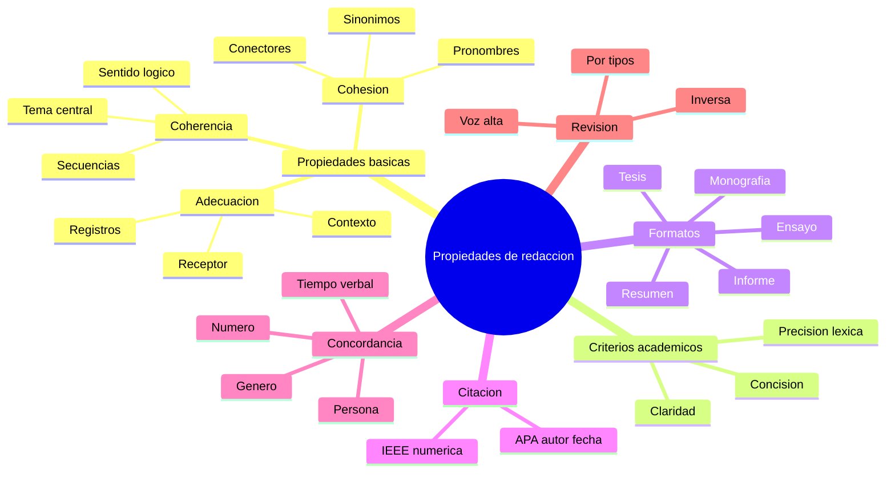

---
{"dg-publish":true,"permalink":"/universidad/preuniversitario/comunicacion-efectiva/unidad-1-el-proceso-de-la-comunicacion/02-propiedades-de-la-redaccion-y-textos-academicos/","dg-note-properties":{}}
---

# 📝 Propiedades de la Redacción y Textos Académicos

## 🎯 Introducción

> [!info] 💡 ¿Por qué importan las propiedades de la redacción?
>
> La **concordancia** es la adecuada relación gramatical entre las palabras de una oración: género, número, persona y tiempo deben mantenerse consistentes para que el mensaje sea claro y profesional. Una falta de concordancia genera ambigüedad, desconfianza y pérdida de credibilidad.
>
> Además de la concordancia, toda redacción efectiva se apoya en tres propiedades fundamentales —adecuación, coherencia y cohesión— y en tres criterios académicos —precisión, claridad y concisión— que transforman ideas dispersas en textos comprensibles, rigurosos y persuasivos. Esta nota conserva el núcleo normativo de concordancia y organiza las propiedades, los formatos académicos y las normas de citación.
>
> ```mermaid
> graph LR
>     A[Ideas del autor] --> B[Texto claro y efectivo]
>     B --> C[Lector comprende el mensaje]
> ```

---

## 📐 Propiedades Básicas y Académicas de la Redacción

> [!note] 📋 Las tres propiedades fundamentales
>
> |Propiedad|Definición|Ejemplo práctico|
> |---|---|---|
> |**Adecuación**|Adaptar el texto al contexto, al interlocutor y al propósito comunicativo|Un ensayo universitario no usa el mismo tono que un mensaje de texto a un amigo|
> |**Coherencia**|Las ideas se conectan lógicamente entre sí y respaldan la idea central|Cada párrafo aporta un argumento que sostiene la tesis principal|
> |**Cohesión**|Uso de conectores, pronombres y referencias que enlazan las oraciones y párrafos|"Sin embargo", "por lo tanto", "además", "en consecuencia" mantienen el hilo del texto|

> [!note] 🔍 Adecuación en detalle
>
> La adecuación exige que el escritor ajuste su registro, vocabulario y estructura según:
>
> - **Contexto comunicativo:** ¿Es un correo formal, una tesis, una publicación en redes sociales?
> - **Receptor:** ¿El lector es un experto, un compañero, un profesor?
> - **Propósito:** ¿Se busca informar, persuadir, entretener, solicitar?
>
> Un mismo contenido puede expresarse de formas radicalmente distintas según estos factores.
>
> |Registro|Ejemplo de expresión|Uso|
> |---|---|---|
> |**Formal**|"Se solicita respetuosamente la entrega del documento antes del viernes."|Correos institucionales, ensayos académicos|
> |**Semi-formal**|"Por favor, envíe el informe antes del viernes."|Comunicación con compañeros de trabajo|
> |**Informal**|"Mándame el reporte el viernes."|Mensajes entre amigos o familiares|

> [!note] 🔍 Coherencia en detalle
>
> Un texto es coherente cuando:
>
> - Cada oración aporta información relevante al tema central.
> - No existen contradicciones internas.
> - El orden de las ideas sigue una secuencia lógica (cronológica, de causa-efecto, de general a específico).
> - Se respeta el tema a lo largo de todo el texto.
>
> **Tipos de secuencia lógica:**
>
> |Secuencia|Descripción|Ejemplo|
> |---|---|---|
> |**Cronológica**|Ideas ordenadas en el tiempo|Primero se plantea el problema, luego la metodología y finalmente los resultados|
> |**Causal**|Relación de causa y efecto|El aumento de temperatura causa la dilatación del material|
> |**De general a específico**|De lo amplio a lo particular|La comunicación humana incluye verbal, no verbal y escrita; la escrita se divide en académica, literaria y profesional|
> |**De específico a general**|De los detalles a la idea global|Los verbos irregulares son difíciles; todos los verbos irregulares merecen atención; la gramática requiere estudio|

> [!note] 🔍 Cohesión en detalle
>
> Los mecanismos de cohesión incluyen:
>
> - **Conectores:** "además", "sin embargo", "por lo tanto", "en primer lugar".
> - **Pronombres de referencia:** "este", "aquel", "lo cual", "quienes".
> - **Sinónimos y sustitución léxica:** evitar repeticiones innecesarias.
> - **Repetición léxica intencional:** reforzar un concepto clave.
>
> **Tabla de conectores por función:**
>
> |Función|Conectores|Ejemplo|
> |---|---|---|
> |**Adición**|además, asimismo, también, igualmente|La concordancia es importante; **además**, afecta la credibilidad del autor|
> |**Oposición**|sin embargo, no obstante, pero, aun así|El texto es extenso; **sin embargo**, carece de argumentos|
> |**Causa**|porque, ya que, dado que, puesto que|Estudia comunicación **porque** desea mejorar sus habilidades|
> |**Consecuencia**|por lo tanto, en consecuencia, por consiguiente, así que|No revisó el texto; **por lo tanto**, presentó errores|
> |**Conclusión**|en resumen, en definitiva, en conclusión, finalmente|**En resumen**, la concordancia es fundamental para la redacción|
> |**Ejemplificación**|por ejemplo, como, tal como|Los conectores mejoran la cohesión; **por ejemplo**, "sin embargo" enlaza ideas opuestas|

> [!note] ✏️ Tres pilares de la escritura académica
>
> |Criterio|Descripción|Consejo práctico|
> |---|---|---|
> |**Precisión léxica**|Elegir la palabra exacta para el concepto que se desea expresar; evitar ambigüedades|Distinguir entre "eficaz" y "eficiente"; entre "demostrar" y "argumentar"|
> |**Claridad**|Que el lector comprenda el mensaje sin esfuerzo excesivo; oraciones bien estructuradas|Preferir oraciones cortas; evitar construcciones pasivas innecesarias|
> |**Brevedad / Concisión**|Expresar la idea con el menor número de palabras posible, sin sacrificar contenido|Eliminar muletillas ("que", "el cual", "en lo que respecta a") y redundancias|
>
> > 📌 La escritura académica no debe ser complicada para ser seria. La mejor redacción es aquella que comunica ideas complejas con sencillez.
>
> **Errores frecuentes de precisión léxica:**
>
> |Palabra mal usada|Uso correcto|Explicación|
> |---|---|---|
> |"Realizar" (para decir "hacer")|Preferir "elaborar", "desarrollar", "ejecutar"|"Realizar" es vago; usar verbos más específicos mejora la claridad|
> |"En base a"|**"Con base en"** o **"Sobre la base de"**|La preposición correcta es "con" o "sobre", no "en"|
> |"De acuerdo a"|**"De acuerdo con"**|La preposición que acompaña "de acuerdo" es "con"|
> |"Diferente a" (en lugares)|**"Diferente de"** o **"distinto de"**|En español estándar se usa "de" para indicar diferencia|
> |"En relación a"|**"En relación con"**|La preposición correcta es "con"|
> |"A pesar que"|**"A pesar de que"**|La locución correcta incluye la preposición "de"|

---

## 📄 Tipología y Rigor: Formatos y Normas de Citación

> [!note] 📚 Formatos más utilizados en el ámbito universitario
>
> |Formato|Extensión típica|Estructura principal|Uso principal|
> |---|---|---|---|
> |**Resumen**|150–300 palabras|Introducción, metodología breve, resultados clave, conclusión|Sintetizar un artículo o proyecto para consulta rápida|
> |**Informe**|5–20 páginas|Introducción, marco teórico, metodología, resultados, discusión, conclusiones|Presentar resultados de un experimento o investigación de curso|
> |**Monografía**|30–100 páginas|Capítulos temáticos con introducción, desarrollo y conclusión|Estudio profundo de un solo tema específico|
> |**Tesis**|100–300+ páginas|Planteamiento del problema, marco teórico, metodología, análisis, conclusiones, bibliografía|Investigación original para obtener un grado académico|
> |**Ensayo**|3–10 páginas|Introducción con tesis propia, desarrollo argumentativo, conclusión|Texto argumentativo-expositivo de estructura libre donde el autor defiende una tesis propia con argumentos y evidencias|

> [!note] 📝 El ensayo como formato académico
>
> El **ensayo** es un texto argumentativo-expositivo de estructura libre con tesis propia. A diferencia del informe o la monografía, no sigue un esquema rígido de capítulos: el autor plantea una postura, la sostiene con argumentos y evidencias, y cierra con una conclusión reflexiva. Exige las mismas propiedades de adecuación, coherencia, cohesión, precisión, claridad y concisión, además de citación rigurosa cuando usa fuentes externas.
>
> - **Propósito:** persuadir o reflexionar, no solo informar.
> - **Tono:** formal, pero con voz propia del autor.
> - **Evaluación típica:** calidad de la tesis, solidez argumentativa y corrección idiomática.

> [!note] 📖 APA vs. IEEE — Dos sistemas de referencia
>
> |Aspecto|APA (7.ª ed.)|IEEE|
> |---|---|---|
> |**Estilo**|Autor-fecha en el texto: (López, 2020)|Numeración correlativa en corchetes: [1]|
> |**Lista de referencias**|Alfabética, al final del documento|Numérica, en orden de aparición|
> |**Libro**|López, A. (2020). _Título del libro_. Editorial.|A. López, _Título del libro_. Editorial, 2020.|
> |**Artículo**|García, P. (2019). Título del artículo. _Revista_, _10_(2), 45–60.|P. García, "Título del artículo," _Revista_, vol. 10, no. 2, pp. 45–60, 2019.|
> |**Página web**|Autor. (Fecha). Título. Sitio web. URL|Autor, "Título," _Sitio web_. [Página en línea]. Disponible: URL [Acceso: Fecha].|
> |**Uso principal**|Ciencias sociales, psicología, educación|Ingeniería, ciencias de la computación, electrónica|
>
> > 📌 En el contexto de Comunicación Efectiva se suele emplear **APA**, pero es importante conocer IEEE por su uso en ingeniería y tecnología.

---

## ⚠️ Concordancia: Núcleo Normativo

> [!warning] ❌ Tipos de falta de concordancia
>
> |Tipo de concordancia|Error Incorrecto|Correcto|Explicación|
> |---|---|---|---|
> |**Número (sujeto-verbo)**|"Los estudiante **asistieron** a la conferencia"|**"Los estudiantes asistieron a la conferencia"**|El sujeto plural exige verbo plural|
> |**Número (sustantivo-adjetivo)**|"Ella tiene un **ojos** **bonitos**"|**"Ella tiene unos ojos bonitos"**|El artículo y el adjetivo deben concordar en número con el sustantivo|
> |**Género (sustantivo-adjetivo)**|"El **ciudadana** **responsable** **paga** sus impuestos"|**"La ciudadana responsable paga sus impuestos"**|El artículo, el sustantivo y el adjetivo deben concordar en género|
> |**Género (participio)**|"La **niño** **cansado** **lloró**"|**"El niño cansado lloró"**|El artículo masculino concuerda con el sustantivo masculino|
> |**Persona (sujeto-verbo)**|"Nosotros **estudia** para el examen"|**"Nosotros estudiamos para el examen"**|La primera persona del plural exige la terminación "-mos"|
> |**Tiempo verbal**|"Ayer yo **voy** al mercado"|**"Ayer yo fui al mercado"**|El adverbio "ayer" exige pasado, no presente|
> |**Número (acuerdo colectivo)**|"La **mayoría** de los estudiantes **están** de acuerdo"|**"La mayoría de los estudiantes está de acuerdo"**|El sustantivo "mayoría" es singular; el verbo puede ir en singular|
> |**Pronombre-antecedente**|"Cada **alumno** debe traer **sus** materiales"|**"Cada alumno debe traer sus materiales"**|El posesivo "sus" es aceptable para ambos géneros en español actual|
>
> > 📌 Las faltas de concordancia son uno de los errores más frecuentes en textos académicos. Revisar el acuerdo de número y género entre sustantivos, adjetivos, artículos y verbos es esencial para lograr una redacción profesional.
> >
> > La nota [[Universidad/Preuniversitario/Comunicación Efectiva/Unidad 1 - El proceso de la comunicación/03 - Errores comunes, acentuación y puntuación\|03 - Errores comunes, acentuación y puntuación]] amplía las discordancias como vicios del lenguaje; aquí se conserva la regla normativa: qué debe concordar con qué.

> [!warning] 🔎 Concordancia en oraciones complejas
>
> En oraciones con varios componentes, la concordancia puede ser más difícil de detectar:
>
> |Oración con error|Corrección|Explicación|
> |---|---|---|
> |"Los libros que el profesor **recomendó** **son** indispensables"|Los libros que el profesor **recomendó** **son** indispensables|El verbo "recomendó" concuerda con "profesor" (singular); "son" con "libros" (plural)|
> |"Cada una de las alumnas **han** aprobado"|Cada una de las alumnas **ha** aprobado|El sujeto principal es "cada una" (singular), no "alumnas"|
> |"El conjunto de reglas **están** mal redactado"|El conjunto de reglas **están** mal redactado|El sujeto es "conjunto" (singular); el verbo debe ser "está"|
> |"La mayoría de los casos **requieren** análisis"|La mayoría de los casos **requieren** análisis|El verbo puede ir en plural si se considera la cantidad de "casos"|

---

## 🧪 Práctica

> [!example]- ✏️ Ejercicio 03.1 — Identificar errores de concordancia
>
> **Instrucción:** Identifica y corrige las faltas de concordancia en las siguientes oraciones. Indica el tipo de error en cada caso.
>
> 1. "Las **estudiante** **entregaron** sus trabajos a tiempo."
> 2. "El **profesora** **explicó** el tema con claridad."
> 3. "Nosotros **comprender** la importancia de la concordancia."
> 4. "La **niño** **corrió** hacia la escuela."
> 5. "Las **ciudadano** **deben** cumplir con la ley."
> 6. "Ayer ellos **van** a la biblioteca a estudiar."
> 7. "La **mayoría** de los **alumnos** **aprobó** el examen."
> 8. "Cada **persona** **tiene** **sus** derechos fundamentales."
>
> **Respuestas:**
>
> |#|Incorrecto|Correcto|Tipo de error|
> |---|---|---|---|
> |1|"Las estudiante entregaron"|Las estudiantes entregaron|Número (sustantivo)|
> |2|"El profesora explicó"|La profesora explicó|Género (artículo-sustantivo)|
> |3|"Nosotros comprender"|Nosotros comprendemos|Persona (sujeto-verbo)|
> |4|"La niño corrió"|El niño corrió|Género (artículo-sustantivo)|
> |5|"Las ciudadano deben"|Los ciudadanos deben|Número (sustantivo-adjetivo)|
> |6|"Ayer ellos van"|Ayer ellos fueron|Tiempo verbal|
> |7|"La mayoría de los alumnos aprobó"|La mayoría de los alumnos aprobó|Correcto (colectivo singular)|No aplica|
> |8|"Cada persona tiene sus derechos"|Cada persona tiene sus derechos|Correcto (uso aceptado)|No aplica|

> [!example]- ✏️ Ejercicio 03.2 — Reescribir párrafos con mejor cohesión
>
> **Instrucción:** Reescribe los siguientes párrafos incorporando conectores adecuados y mejorando la coherencia entre oraciones.
>
> **Párrafo A (original):**
> "Estudiar comunicación es importante. Se aprenden habilidades para la vida. Muchas personas no le dan valor. La comunicación afecta todas las áreas."
>
> **Párrafo A (sugerencia):**
> "Estudiar comunicación es importante **porque** se aprenden habilidades útiles para la vida. **Sin embargo**, muchas personas no le dan el valor que merece. **En realidad**, la comunicación afecta todas las áreas del quehacer humano."
>
> **Párrafo B (original):**
> "La concordancia genera confusiones. Un texto con errores pierde credibilidad. Los lectores no confían. Es necesario revisar cada oración."
>
> **Párrafo B (sugerencia):**
> "La falta de concordancia genera confusiones en el lector. **Por consiguiente**, un texto con errores pierde credibilidad. **De hecho**, los lectores dejan de confiar en el autor. **Por ello**, es necesario revisar cada oración antes de entregar el documento."
>
> **Párrafo C (original):**
> "La escritura académica tiene reglas. Un estudiante debe conocerlas. Muchos profesores las exigen. El incumplimiento genera problemas."
>
> **Párrafo C (sugerencia):**
> "La escritura académica tiene reglas **que** todo estudiante debe conocer. **En efecto**, muchos profesores las exigen como criterio de evaluación. **Por lo tanto**, el incumplimiento de estas normas genera problemas de calificación."

> [!example]- ✏️ Ejercicio 03.3 — Clasificar y corregir faltas de concordancia
>
> **Instrucción:** Clasifica cada error según su tipo (número, género, persona, tiempo verbal) y ofrece la corrección.
>
> 1. "Las **ciudadanas** **trabajan** arduamente **porque** **ellas** **quiere** progresar."
> 2. "El **niñas** **juegan** en el parque todas las tardes."
> 3. "Nosotros **iba** a la reunión pero no **teníamos** tiempo."
> 4. "La **profesor** **explicó** las reglas a **sus** **alumnos**."
> 5. "Los **documento** **están** sobre la mesa de la **sala** de **clase**."
> 6. "Cada **estudiante** **deben** **presentar** **sus** trabajos a tiempo."
> 7. "Las **investigadora** **han** **encontrado** resultados importantes."
> 8. "El **gobierno** **anunciaron** nuevas **medida** para la **economía**."
>
> **Respuestas:**
>
> |#|Error identificado|Tipo|Corrección|
> |---|---|---|---|
> |1|"ellas quiere"|Persona (sujeto-verbo)|"ellas quieren"|
> |2|"El niñas juegan"|Género (artículo-sustantivo)|"Las niñas juegan"|
> |3|"Nosotros iba"|Persona (sujeto-verbo)|"Nosotros íbamos"|
> |4|"La profesor explicó"|Género (artículo-sustantivo)|"El profesor explicó"|
> |5|"Los documento están"|Número (sustantivo)|"Los documentos están"|
> |6|"Cada estudiante deben"|Número (sujeto-verbo)|"Cada estudiante debe"|
> |7|"Las investigadora han"|Número (sustantivo-adjetivo)|"Las investigadoras han"|
> |8|"gobierno anunciaron medidas"|Número y género|El gobierno anunció nuevas medidas|

> [!tip] 🛠️ Estrategias de revisión para evitar errores de concordancia
>
> |Estrategia|Descripción|Cuándo aplicarla|
> |---|---|---|
> |**Lectura en voz alta**|Leer el texto en voz alta permite detectar ruidos gramaticales que la vista puede pasar por alto|Siempre, antes de entregar cualquier trabajo|
> |**Revisión por tipos**|Enfocarse en un solo tipo de error por revisión: primero número, luego género, luego persona, luego tiempo|Textos largos como ensayos o tesis|
> |**Uso de herramientas digitales**|Correctores gramaticales como Grammarly, LanguageTool o el corrector de Word|Como apoyo, nunca como sustituto de la revisión manual|
> |**Revisión inversa**|Leer el texto de atrás hacia adelante (oración por oración) para despegarse del sentido y enfocarse en la forma|Cuando se requiere un nivel muy alto de corrección|
> |**Comparación con un modelo**|Comparar la estructura del texto con un ejemplo de texto académico bien escrito|Para aprendizaje y mejora progresiva|

---

> [!summary] 📋 Resumen ejecutivo
>
> - La **concordancia** es el acuerdo gramatical de número, género, persona y tiempo; su ruptura genera ambigüedad y pérdida de credibilidad.
> - Toda buena redacción exige **adecuación** (contexto y receptor), **coherencia** (sentido lógico) y **cohesión** (conectores y enlaces).
> - La escritura académica suma **precisión léxica**, **claridad** y **concisión**: ideas complejas expresadas con sencillez.
> - Los formatos académicos —resumen, informe, monografía, tesis y **ensayo** argumentativo con tesis propia— difieren en extensión, estructura y propósito.
> - Las normas **APA** (autor-fecha) e **IEEE** (numérica) regulan la citación rigurosa según el área disciplinar.
> - La revisión sistemática (voz alta, por tipos, inversa) corrige número, género, persona y tiempo antes de entregar un texto profesional.

---

## ✅ Metas de Aprendizaje

> [!note] 🎯 Nivel Básico
>
> - [ ] Defino qué es la concordancia y por qué es importante en la redacción.
> - [ ] Identifico adecuación, coherencia y cohesión con un ejemplo de cada una.
> - [ ] Reconozco errores de número y género en oraciones simples.
> - [ ] Distingo los registros formal, semi-formal e informal.

> [!note] 🎯 Nivel Intermedio
>
> - [ ] Distingo resumen, informe, monografía, tesis y ensayo según extensión y propósito.
> - [ ] Aplico conectores de adición, oposición, causa y consecuencia para dar cohesión.
> - [ ] Cito en APA e identifico cuándo corresponde usar IEEE.
> - [ ] Corrijo concordancia en oraciones complejas y con colectivos.

> [!note] 🎯 Nivel Avanzado
>
> - [ ] Reviso textos con múltiples faltas de concordancia de forma integral.
> - [ ] Produzco párrafos académicos precisos, claros y concisos con tesis propia.
> - [ ] Elijo el formato académico apropiado y aplico estrategias de revisión sistemática.

---

## 📊 Resumen Visual



---

> [!quote] 📖 Fuentes consultadas
>
> [1] Real Academia Española, _Ortografía de la lengua española_. Madrid: Espasa, 2010.
>
> [2] E. Alemán y M. A. Lánchez, _Guía para redactar textos académicos_. Ciudad de México: Trillas, 2018.
>
> [3] American Psychological Association, _Publication Manual of the American Psychological Association_, 7th ed. Washington, DC, USA: APA, 2020.
>
> [4] C. Escandón, _Manual de redacción y estilo para las ciencias de la salud_. Bogotá: Editorial Médica Panamericana, 2015.

> [!quote] 🔗 Conexiones
>
> - [[Universidad/Preuniversitario/Comunicación Efectiva/Unidad 1 - El proceso de la comunicación/01 - El proceso y las funciones de la comunicación\|01 - El proceso y las funciones de la comunicación]] — el proceso y las funciones comunicativas se concretan en textos con adecuación, coherencia y cohesión.
> - [[Universidad/Preuniversitario/Comunicación Efectiva/Unidad 1 - El proceso de la comunicación/03 - Errores comunes, acentuación y puntuación\|03 - Errores comunes, acentuación y puntuación]] — las discordancias como vicios, la acentuación y la puntuación complementan el núcleo normativo de concordancia de esta nota.

---

**Tags:** #unidad1 #redaccion #concordancia #textosAcademicos #comunicacionEfectiva #normasAPA
