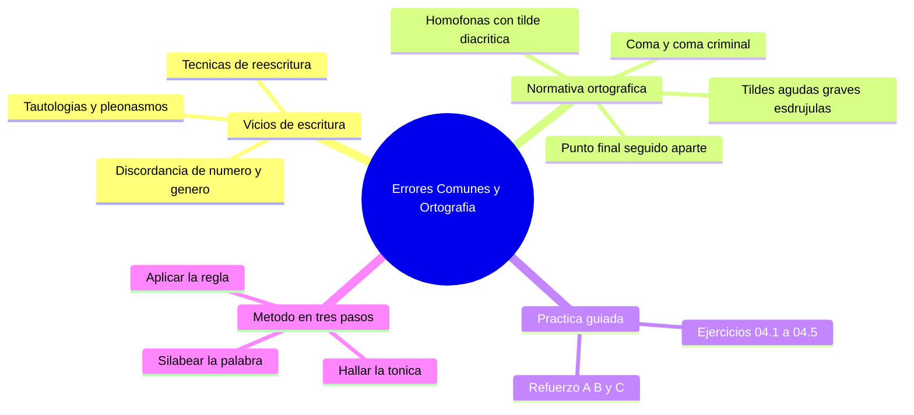

---
{"dg-publish":true,"permalink":"/universidad/preuniversitario/comunicacion-efectiva/unidad-1-el-proceso-de-la-comunicacion/03-errores-comunes-acentuacion-y-puntuacion/","dg-note-properties":{}}
---

# ⚠️ Errores Comunes, Acentuación y Puntuación

## 🎯 Introducción

> [!info] 💡 ¿Por qué importan la concisión y la ortografía?
>
> La **verbosidad** es la tendencia a usar más palabras de las necesarias para expresar una idea. Dificulta la comprensión, consume tiempo del receptor y resta impacto al mensaje. La **eliminación de redundancias** no recorta contenido arbitrariamente: dice lo mismo con menos palabras sin perder información.
>
> La **tilde** y la **puntuación** son las herramientas que completan ese mensaje conciso. La tilde modifica pronunciación y significado (*término* ≠ *termino*), mientras que el punto y la coma organizan las ideas y evitan ambigüedades. En el proceso comunicativo, la **codificación** del mensaje depende directamente de estas reglas: un error ortográfico o de puntuación puede cambiar radicalmente el sentido de lo expresado.
>
> Esta nota fusiona tres temas complementarios: **vicios de escritura** (discordancias y verbosidad), **normativa ortográfica** (tildes, punto y coma) y **práctica guiada** (ejercicios resueltos). El detalle normativo de la concordancia se estudia en la nota 02; aquí se mantiene el enfoque de vicio y error con ejemplos.
>
> ```mermaid
> graph LR
>   A[Texto con vicios<br/>redundante y ambiguo] --> B[Normativa ortografica<br/>tilde punto y coma]
>   B --> C[Texto claro<br/>conciso y correcto]
>   C --> D[Comunicacion efectiva]
> ```

---

## 1️⃣ Vicios de escritura: discordancia y verbosidad

> [!warning] ⚠️ Discordancias sintácticas de número y género
>
> La **concordancia** exige que sustantivos, adjetivos, pronombres y verbos coincidan en número y género. **Regla general:** el verbo concuerda con el sujeto gramatical, no con el sustantivo más cercano ni con el complemento preposicional. El género se determina por el sustantivo al que se refiere el modificador, no por el sentido.
>
> |Tipo|Error (incorrecto)|Corrección|Regla aplicada|
> |---|---|---|---|
> |Número|"Cada uno de los alumnos **tienen** su cuaderno."|"Cada uno de los alumnos **tiene** su cuaderno."|El sujeto es "cada uno" (singular), no "alumnos".|
> |Número|"El grupo de estudiantes **están** reunidos."|"El grupo de estudiantes **está** reunido."|El sujeto es "grupo" (singular), no "estudiantes".|
> |Número|"La cantidad de personas **son** muchas."|"La cantidad de personas **es** mucha."|El sujeto es "cantidad" (singular), no "personas".|
> |Número|"Los profesores y el director **está** de acuerdo."|"Los profesores y el director **están** de acuerdo."|Sujeto compuesto con "y" → verbo en plural.|
> |Número|"Ni Juan ni María **asistieron**."|✅ Correcto. Pero: "Ni Juan ni nadie **asistió**."|Con "ni... ni" el verbo va en plural si ambos sujetos son explícitos; en singular si uno es indefinido.|
> |Número|"La mayoría de los casos **han sido** resueltos."|✅ Correcto cuando "mayoría" se refiere a una cantidad plural.|"Mayoría" + complemento plural admite verbo en plural.|
> |Número|"Uno de mis amigos **tienen** un carro nuevo."|"Uno de mis amigos **tiene** un carro nuevo."|"Uno" es el sujeto (singular); "de mis amigos" solo expande el sustantivo.|
> |Número|"Los estudiantes asistieron y regresaron, pero **faltaron** uno."|"Los estudiantes asistieron y regresaron, pero **falta** uno."|El verbo concuerda con "uno" (singular).|
> |Género|"La doctora García dijo que **él** firma el documento."|"La doctora García dijo que **ella** firma el documento."|El pronombre concuerda con "doctora" (femenino).|
> |Número|"Los alumnos entregaron **su** trabajo a la profesora."|"Los alumnos entregaron **sus** trabajos a la profesora."|El posesivo concuerda con lo poseído, no con el sujeto.|
> |Número|"Cada estudiante debe traer **su** cuaderno y **su** lápiz."|✅ Correcto. En plural: "**sus** cuadernos y **sus** lápices."|El posesivo concuerda en número con lo poseído.|
> |Número|"María y Juan **trabajó** en el proyecto."|"María y Juan **trabajaron** en el proyecto."|Dos sujetos unidos por "y" → verbo en plural.|
> |Número|"La persona que llegó primero **están** en la oficina."|"La persona que llegó primero **está** en la oficina."|El verbo del relativo "que" concuerda con "persona" (singular).|
> |Género|"La empresa contrató **una** nueva **ingeniera** competente." (si se refiere a un hombre)|"La empresa contrató **un** nuevo **ingeniero** competente."|El género del sustantivo y sus modificadores debe coincidir.|
> |Género|"Las casas **blanco** están en la esquina."|"Las casas **blancas** están en la esquina."|El adjetivo concuerda en género y número con "casas".|
> |Léxico|"Todos los días **voy** al gym."|"Todos los días **voy** al gimnasio."|La concordancia es correcta, pero "gym" no es la forma española.|
>
> **Frecuencia:** los errores de concordancia de número representan aproximadamente el 40% de los errores gramaticales en escritura universitaria.

---

> [!danger] 🚨 Tautologías y pleonasmos más comunes
>
> Una **tautología** dice lo mismo dos veces con palabras distintas. Un **pleonasmo** acumula elementos que no aportan significado nuevo. Ambos inflan el texto sin agregar valor. Se exceptúa el **pleonasmo enfático** retórico e intencional ("lo vi con mis propios ojos").
>
> |Tautología / Pleonasmo|Versión concisa|Por qué es redundante|
> |---|---|---|
> |"**Subir arriba**"|"Subir" o "ir arriba"|Subir ya implica dirección ascendente.|
> |"**Bajar abajo**"|"Bajar" o "ir abajo"|Bajar ya implica dirección descendente.|
> |"**Subir para arriba**"|"Subir"|La posposición "para arriba" es pleonástica.|
> |"**Descender para abajo**"|"Descender"|La posposición "para abajo" es pleonástica.|
> |"**Resumen breve**"|"Resumen"|Un resumen, por definición, es breve.|
> |"**Anticiparse de forma preventiva**"|"Prevenir" o "anticiparse"|Anticiparse ya implica acción preventiva.|
> |"**Planear con anticipación**"|"Planear"|Planear ya implica pensar en el futuro.|
> |"**Ocurrir un acontecimiento**"|"Ocurrir un hecho" u "ocurrir"|Todo acontecimiento ya es un evento que ocurre.|
> |"**Permanecer de forma permanente**"|"Permanecer"|Permanecer ya implica duración continua.|
> |"**Regresar de vuelta**"|"Regresar"|Regresar ya implica volver.|
> |"**Repetir de nuevo**"|"Repetir"|Repetir ya implica hacer algo de nuevo.|
> |"**Finalmente terminar**"|"Terminar" u "finalizar"|Terminar ya implica el final.|
> |"**Resulta ser**"|"Es" o "resulta"|Usar solo una forma elimina la duplicación.|
> |"**Zona geográfica**"|"Zona" o "región"|Toda zona es geográfica por naturaleza.|
> |"**Esqueleto óseo**"|"Esqueleto" u "huesos"|El esqueleto está compuesto de huesos.|
> |"**Exagerar de más**"|"Exagerar"|Exagerar ya implica ir más allá de lo justo.|
> |"**Opinión personal**"|"Opinión"|Toda opinión es, por naturaleza, personal.|
> |"**Subjetivo y personal**"|"Subjetivo"|Lo subjetivo ya es apreciación personal.|
> |"**Necesario e indispensable**"|"Indispensable"|Indispensable ya implica necesidad absoluta.|
> |"**Hora actual**"|"Hora" u "ahora"|La hora es inherentemente actual.|
> |"**Historia antigua**"|"Historia"|La historia, por definición, es del pasado.|
> |"**Visto el ojo**"|"Visto"|Ver ya implica uso de la vista.|
> |"**Precio económico**"|"Precio"|El precio ya es una cantidad económica.|
> |"**Círculo redondo**"|"Círculo"|Todo círculo es redondo por definición geométrica.|

---

> [!tip] 🔧 Tres técnicas de reescritura: del texto verboso al conciso
>
> **1. Activizar la voz.** La pasiva con "ser" + participio se reemplaza por voz activa: menos palabras y más fuerza. La voz activa sitúa al actor como sujeto y aclara quién realiza la acción.
>
> - ❌ "El informe **fue elaborado** por el equipo de trabajo." (9 palabras)
> - ✅ "El equipo de trabajo **elaboró** el informe." (6 palabras)
>
> - ❌ "Las muestras **fueron recolectadas** por los investigadores durante el mes de marzo." (14 palabras)
> - ✅ "Los investigadores **recolectaron** las muestras en marzo." (8 palabras)
>
> - ❌ "La decisión **fue tomada** por el comité directivo después de una larga discusión." (14 palabras)
> - ✅ "El comité directivo **tomó** la decisión tras una larga discusión." (11 palabras)
>
> ---
>
> **2. Eliminar rodeos (circularidades).** Los rodeos dan vueltas alrededor de la idea sin llegar al punto. Se reemplaza la construcción circunlocutoria por el verbo o sustantivo directo.
>
> - ❌ "Se tiene el conocimiento de que el proyecto **lleva a cabo** su ejecución." (14 palabras)
> - ✅ "El proyecto **se ejecuta**." (4 palabras)
>
> - ❌ "Llevar a cabo una revisión exhaustiva del documento." (9 palabras)
> - ✅ "**Revisar** el documento." (3 palabras)
>
> - ❌ "Proceder a llevar a cabo la eliminación de los archivos temporales." (12 palabras)
> - ✅ "**Eliminar** los archivos temporales." (4 palabras)
>
> - ❌ "Dar inicio a la implementación del proyecto." (8 palabras)
> - ✅ "**Implementar** el proyecto." (3 palabras)
>
> - ❌ "Efectuar la realización de una revisión completa del sistema." (11 palabras)
> - ✅ "**Revisar** el sistema por completo." (5 palabras)
>
> ---
>
> **3. Simplificar oraciones compuestas.** Las oraciones con múltiples subordinadas se dividen o se fusionan en una más directa. Regla práctica: si una oración supera las 25 palabras, probablemente debe dividirse.
>
> - ❌ "Dado el hecho de que el plazo se vence mañana y que no hemos recibido la documentación requerida, es necesario proceder de manera inmediata a contactar al responsable del proyecto." (38 palabras)
> - ✅ "El plazo se vence mañana y no tenemos la documentación. Contacta al responsable de inmediato." (16 palabras)
>
> - ❌ "En lo que respecta a la cuestión de si es conveniente o no llevar a cabo la contratación de personal adicional para el proyecto, consideramos que sí." (27 palabras)
> - ✅ "Consideramos conveniente contratar personal adicional para el proyecto." (9 palabras)

---

> [!note] 📏 Diagnóstico: ¿cuánto texto puedes recortar?
>
> |Texto original (palabras)|Texto reescrito (palabras)|Reducción|
> |---|---|---|
> |"Proceder a llevar a cabo la revisión de los documentos de forma preventiva y anticipada antes de la fecha de entrega." (17)|"Revisar los documentos con antelación." (5)|71%|
> |"Subir arriba al piso superior del edificio para realizar una reunión de forma presencial con todos los miembros del equipo." (19)|"Subir al piso superior para reunir al equipo." (9)|53%|
> |"Se tiene el conocimiento de que el proyecto resulta ser uno de los más importantes que se llevan a cabo actualmente." (19)|"El proyecto es uno de los más importantes en ejecución." (10)|47%|
> |"Realizar un plan de contingencia con anticipación para el caso de que ocurra un acontecimiento imprevisto de carácter catastrófico." (18)|"Preparar un plan de contingencia para un evento catastrófico." (10)|44%|
>
> **Promedio de reducción:** 54% — más de la mitad de las palabras originales eran innecesarias.

---

> [!warning] ⚠️ Verbosidad en contextos reales
>
> **Correos electrónicos laborales**
> - ❌ "Me dirijo a usted con la finalidad de hacer de su conocimiento que el proyecto al que se hace referencia en el correo anterior ha sido llevado a cabo con éxito."
> - ✅ "Le informo que el proyecto del correo anterior se completó con éxito."
>
> **Textos académicos**
> - ❌ "En el presente trabajo se procederá a llevar a cabo un análisis exhaustivo de los datos recopilados durante el período de investigación."
> - ✅ "Este trabajo analiza los datos recopilados durante la investigación."
>
> **Documentos legales (excepción parcial)**
> - Algunos textos legales requieren redundancia deliberada para cubrir todas las interpretaciones posibles. No toda redundancia formal es un error.
>
> **Documentación técnica**
> - ❌ "Proceder a realizar la instalación del software de manera correcta y sin errores."
> - ✅ "Instalar el software correctamente."

---

> [!tip] 💡 Reglas mnemotécnicas contra la verbosidad
>
> **Regla del "¿Se puede quitar?"** Si al quitar una palabra el significado no cambia, esa palabra sobra.
>
> **Regla del "¿Se puede decir en menos?"** Si una sola palabra expresa lo mismo que una frase, úsala ("llevar a cabo" → "ejecutar").
>
> **Regla del "¿Quién actúa?"** Si no está claro quién realiza la acción, probablemente hay pasiva innecesaria: conviertela a voz activa.
>
> **Truco para tautologías:** pregúntate "¿esta palabra ya implica lo que estoy diciendo?". "Subir" ya implica "arriba": "subir arriba" es redundante.

---

> [!question] 🤔 Preguntas frecuentes sobre concisión
>
> **¿La brevedad siempre es mejor?** No siempre. Textos legales (redundancia deliberada), literarios (descripción narrativa) y documentación técnica autónoma justifican extensión. La clave es **recortar lo innecesario**: si una palabra no aporta significado nuevo, sobra.
>
> **¿Cómo saber si soy verboso?** Oraciones de más de 25 palabras, pasivas frecuentes ("fue elaborado", "se llevó a cabo"), muletillas ("es importante destacar que", "cabe mencionar que") y la misma idea repetida con distintas palabras en un párrafo.
>
> **¿Simplificar o empobrecer?** Simplificar es decir lo mismo con menos elementos ("proceder a realizar la revisión" → "revisar"). Empobrecer es perder precisión ("correlación significativa" → "algo"). Regla de oro: **si el texto pierde precisión al recortarlo, estás empobreciendo, no simplificando.**

---

## 2️⃣ Normativa ortográfica: tildes y puntuación

> [!note] 🗂️ Clasificación por sílaba tónica: el único juego de reglas
>
> La tilde sigue la lógica de la **sílaba tónica** (la que se pronuncia con mayor fuerza). Para hallarla, di la palabra en voz alta y nota qué sílaba se remarca más.
>
> |Categoría|Ubicación de la sílaba tónica|Regla de tilde (RAE)|Ejemplo|
> |---|---|---|---|
> |**Agudas**|Última sílaba|Tilde **solo** si terminan en vocal, **n** o **s**|café, razón, canción|
> |**Graves (Llanas)**|Penúltima sílaba|Tilde **solo** si terminan en consonante distinta de **n** o **s**|árbol, fácil, fútbol|
> |**Esdrújulas**|Antepenúltima sílaba|**Siempre** llevan tilde|música, cámara, teléfono|
> |**Sobreesdrújulas**|Anterior a la antepenúltima|**Siempre** llevan tilde|dígamelo, cuéntamelo|
>
> > 📌 **Truco:** agudas = tilde en la **última** (solo vocal/n/s). Graves = al revés (solo consonante ≠ n/s). Esdrújulas y sobreesdrújulas = **siempre** tilde, sin excepción.

---

> [!note] 📐 Palabras agudas (última sílaba tónica)
>
> **Regla:** llevan tilde cuando terminan en vocal, **n** o **s**. No llevan tilde si terminan en otra consonante. Excepción: el hiato de vocal cerrada tónica (*í, ú*) + vocal abierta **sí** lleva tilde aunque termine en consonante (*raíz, país, baúl*).
>
> |Palabra|División|Termina en|¿Lleva tilde?|
> |---|---|---|---|
> |**café**|ca-**fé**|vocal (e)|✅ Sí|
> |**razón**|ra-**zón**|n|✅ Sí|
> |**jardín**|jar-**dín**|n|✅ Sí|
> |**nación**|na-**ción**|n|✅ Sí|
> |**canción**|can-**ción**|n|✅ Sí|
> |**compás**|com-**pás**|s|✅ Sí|
> |**común**|co-**mún**|n|✅ Sí|
> |**raíz**|ra-**íz**|z (hiato í + vocal)|✅ Sí|
> |**ciudad**|ciu-**dad**|d|❌ No|
> |**reloj**|re-**loj**|j|❌ No|

---

> [!note] 📐 Palabras graves o llanas (penúltima sílaba tónica)
>
> **Regla:** llevan tilde cuando terminan en consonante distinta de **n** o **s**. No llevan tilde si terminan en vocal, **n** o **s**. La mayoría de las palabras españolas son graves y la mayoría **no** lleva tilde.
>
> |Palabra|División|Termina en|¿Lleva tilde?|
> |---|---|---|---|
> |**árbol**|**ár**-bol|l|✅ Sí|
> |**fácil**|**fá**-cil|l|✅ Sí|
> |**lápiz**|**lá**-piz|z|✅ Sí|
> |**carácter**|ca-**rác**-ter|r|✅ Sí|
> |**fútbol**|**fút**-bol|l|✅ Sí|
> |**ángel**|**án**-gel|l|✅ Sí|
> |**casa**|**ca**-sa|vocal (a)|❌ No|
> |**examen**|e-**xa**-men|n|❌ No|

---

> [!note] 📐 Palabras esdrújulas (antepenúltima sílaba tónica)
>
> **Regla:** **siempre** llevan tilde, sin importar la letra final. Si identificas que la tónica es la antepenúltima, no apliques más reglas: pon tilde.
>
> |Palabra|División|¿Lleva tilde?|
> |---|---|---|
> |**música**|**mú**-si-ca|✅ Siempre|
> |**cámara**|**cá**-ma-ra|✅ Siempre|
> |**teléfono**|te-**lé**-fo-no|✅ Siempre|
> |**rápido**|**rá**-pi-do|✅ Siempre|
> |**técnica**|**téc**-ni-ca|✅ Siempre|
> |**ejército**|e-**jér**-ci-to|✅ Siempre|
> |**máquina**|**má**-qui-na|✅ Siempre|
> |**práctico**|**prác**-ti-co|✅ Siempre|
> |**último**|**úl**-ti-mo|✅ Siempre|
> |**sábado**|**sá**-ba-do|✅ Siempre|
> |**múltiple**|**múl**-ti-ple|✅ Siempre|

---

> [!note] 📐 Palabras sobreesdrújulas (tónica anterior a la antepenúltima)
>
> **Regla:** **siempre** llevan tilde. Son formas verbales con pronombres enclíticos (*-le, -lo, -la, -nos, -te, -se*) añadidos: al agregarlos, la tónica se desplaza hacia atrás y la RAE fija la tilde permanente.
>
> |Palabra|División|Categoría|¿Lleva tilde?|
> |---|---|---|---|
> |**dígamelo**|**dí**-ga-me-lo|Imperativo + pronombres|✅ Siempre|
> |**cuéntamelo**|**cuén**-ta-me-lo|Imperativo + pronombres|✅ Siempre|
> |**cuéntaselo**|**cuén**-ta-se-lo|Imperativo + pronombres|✅ Siempre|
> |**díganselo**|**dí**-gan-se-lo|Imperativo + pronombres|✅ Siempre|
> |**póngaselo**|**pón**-ga-se-lo|Imperativo + pronombres|✅ Siempre|
> |**quítenlo**|**quí**-ten-lo|Imperativo + pronombre|✅ Siempre|
> |**dígaselo**|**dí**-ga-se-lo|Imperativo + pronombres|✅ Siempre|
> |**guárdamelo**|**guár**-da-me-lo|Imperativo + pronombres|✅ Siempre|

---

> [!note] 🎵 Diptongos y hiatos: ¿cómo afectan la acentuación?
>
> **Diptongo:** dos vocales seguidas en la **misma** sílaba (una abierta + una cerrada, o dos cerradas): *pau-sa*, *cien-to*. **Hiato:** dos vocales seguidas en sílabas **distintas**: *o-í-do*, *ra-íz*, *po-e-sí-a*. La tilde fuerza hiato: *ba-úl* (sin tilde sería *baul*, diptongo).
>
> |Concepto|Definición|Ejemplo|Sílabas|
> |---|---|---|---|
> |**Diptongo**|Dos vocales en la misma sílaba|pausa|pau-sa (2)|
> |**Diptongo creciente**|Vocal cerrada + abierta|tiene|tie-ne (2)|
> |**Diptongo decreciente**|Vocal abierta + cerrada|caigo|cai-go (2)|
> |**Hiato simple**|Dos vocales abiertas|poeta|po-e-ta (3)|
> |**Hiato por tilde**|La tilde rompe el diptongo|baúl|ba-úl (2)|
> |**Diéresis**|La *ü* se pronuncia separada del diptongo|pingüino|pin-güi-no (3)|
>
> > 📌 **¿Cómo distinguirlos?** Separa en sílabas: si las vocales quedan juntas es diptongo (*cien-to*); si quedan separadas es hiato (*o-í-do*).

---

> [!warning] ⚠️ Palabras homófonas: suenan igual, se escriben distinto
>
> Las **homófonas** tienen la misma pronunciación pero distinta escritura y significado. La tilde diacrítica es lo que las diferencia.
>
> |Sin tilde|Significado|Con tilde|Significado|
> |---|---|---|---|
> |**el**|Artículo determinado (el libro)|**él**|Pronombre personal (él llegó)|
> |**de**|Preposición (de casa)|**dé**|Verbo dar, subjuntivo (que me dé tiempo)|
> |**mas**|Conjunción: pero, sin embargo|**más**|Adverbio de cantidad (más personas)|
> |**si**|Conjunción condicional (si llueve)|**sí**|Afirmación o pronombre (sí, señor; para sí)|
> |**te**|Pronombre (te llamo)|**té**|Sustantivo: bebida (taza de té)|
> |**mi**|Posesivo (mi casa)|**mí**|Pronombre preposicional (para mí)|
> |**tu**|Posesivo (tu casa)|**tú**|Pronombre personal (tú hablas)|
> |**se**|Pronombre reflexivo (se lava)|**sé**|Verbo saber (yo sé) o imperativo (sé bueno)|
> |**que**|Relativo o conjunción (que venga)|**qué**|Interrogativo o exclamativo (qué hora es)|
> |**aun**|Hasta, incluso (aun sin estudiar)|**aún**|Todavía (aún no llega)|
>
> > 📌 **Regla práctica de sustitución:** **él** → "de él" (*el libro es de **él***); **tú** → "a ti"; **más** → "muchísimo" (*más personas* → *muchísimas personas*); **sí** → "efectivamente"; **dé** → conjugación de dar; **té** → cosa que se bebe. Si la sustitución cambia el sentido, esa forma lleva tilde.
>
> > 📌 **Ejemplo:** *Mi hermano es alto.* ¿Se puede sustituir *mi* por *mí*? No, porque *mí* es pronombre. Por lo tanto, *mi* posesivo no lleva tilde.

---

> [!info] 📌 Puntuación: reglas del punto
>
> El **punto (.)** indica una pausa larga y el cierre de una oración o párrafo completo.
>
> |Uso|Descripción|Ejemplo|
> |---|---|---|
> |**Punto final**|Cierra una oración con sentido completo.|Estudia todos los días.|
> |**Punto y seguido**|Separa oraciones dentro de un mismo párrafo.|Llegó temprano. Revisó el material.|
> |**Punto y aparte**|Cierra un párrafo e inicia otro nuevo.|Terminó el ensayo. / Al día siguiente entregó la tarea.|
> |**Punto y final**|Cierra un texto, capítulo o sección.|Fin del capítulo.|
>
> > 📌 **Dato:** el punto también aparece en abreviaturas (Dr., Sr.) y cifras: en español se prefiere el espacio para miles (1 000) y la coma para decimales (3,14).

---

> [!info] 📌 Puntuación: usos de la coma
>
> La **coma (,)** indica una pausa breve dentro de la oración. Su uso correcto es fundamental para la claridad.
>
> |Uso|Descripción|Ejemplo|
> |---|---|---|
> |**Listas y enumeraciones**|Separa elementos de una serie.|Manzanas, peras, uvas y plátanos.|
> |**Incisos y aposiciones**|Explicaciones o aclaraciones entre comas.|El presidente, cansado del debate, pidió un receso.|
> |**Conectores**|Antes de *pero, mas, aunque, porque, sin embargo*.|Quiero ir, pero no puedo.|
> |**Subordinadas explicativas**|Información adicional no esencial.|Mi hermano, que vive en Quito, es doctor.|
> |**Inciso introductorio**|Después de adverbios o subordinadas iniciales.|Sin embargo, no hay evidencia. / Cuando llegues, llámame.|
> |**Coordinadas**|Entre oraciones independientes unidas por conjunción.|Estudió, aprobó y se graduó.|
>
> > 📌 **Dato:** la RAE establece que el uso correcto de punto y coma es indispensable para la comprensión lectora y la producción de textos con sentido.

---

> [!danger] 🚨 La "coma criminal"
>
> La **"coma criminal"** cambia por completo el significado de la oración. Aparece cuando la coma separa elementos inseparables o une los que deben separarse.
>
> |Oración incorrecta ❌|Oración correcta ✅|Problema|
> |---|---|---|
> |Voy a comer, a mi abuela.|Voy a comer a mi abuela.|La coma separa el verbo de su complemento.|
> |Pero, no me importa.|Pero no me importa.|La conjunción *pero* no lleva coma después.|
> |El, que estudia, aprueba.|El que estudia, aprueba.|La coma separa el sujeto de su relativo.|
> |Hoy, es lunes.|Hoy es lunes.|La coma separa el sujeto del verbo.|
> |El alumno que aprueba, recibe un diploma.|El alumno que aprueba recibe un diploma.|La relativa restrictiva no va entre comas.|
> |María, y Juan, fueron al cine.|María y Juan fueron al cine.|No se separa el sujeto compuesto con comas.|
> |Los niños, juegan en el parque.|Los niños juegan en el parque.|Sin inciso, la coma es innecesaria.|
> |Quiero, ir al parque.|Quiero ir al parque.|La coma separa el verbo de su complemento.|
>
> > 📌 **Excepción:** la coma sí es válida entre sujetos compuestos largos o con incisos: *María, Pedro y Juan fueron al cine.*
>
> > 📌 **Regla clave:** no separar sujeto y verbo, ni verbo y complemento, salvo inciso explicativo.

---

> [!warning] ❌ Errores frecuentes de acentuación
>
> |Error|Forma incorrecta|Forma correcta|Explicación|
> |---|---|---|---|
> |Quitar tilde a aguda en vocal/n/s|*cafe, razon*|café, razón|Aguda en vocal o n → tilde obligatoria.|
> |Quitar tilde a esdrújula|*musico, maquina*|músico, máquina|Esdrújula → siempre tilde.|
> |Quitar tilde a sobreesdrújula|*digamelo*|dígamelo|Sobreesdrújula → siempre tilde.|
> |Confundir homófonas|*tu eres, mas tiempo*|tú eres, más tiempo|Sin tilde: posesivo y conjunción. Con tilde: pronombre y cantidad.|
> |Poner tilde a grave en vocal/n/s|*casa, examen* (con tilde)|casa, examen|Grave en vocal o n → sin tilde.|
> |Clasificar mal la palabra|*futbol* tratada como esdrújula|fútbol (grave en l → tilde)|Primero halla la tónica; luego aplica la regla.|
>
> > 📌 **Resumen en una frase:** agudas y graves llevan tilde solo según su terminación (vocal/n/s frente a consonante ≠ n/s), mientras que esdrújulas y sobreesdrújulas siempre llevan tilde.

---

## 3️⃣ Práctica: ejercicios resueltos

> [!info] 📝 Apuntes 04.3 — método de clasificación en tres pasos
>
> **Paso 1. Separa en sílabas** la palabra (*te-lé-fo-no*, *jar-dín*, *ár-bol*). Si dos vocales quedan juntas es diptongo; si quedan separadas es hiato.
>
> **Paso 2. Halla la sílaba tónica** diciendo la palabra en voz alta: última → aguda; penúltima → grave; antepenúltima → esdrújula; más atrás → sobreesdrújula.
>
> **Paso 3. Aplica la regla** de la tabla de clasificación (sección 2): agudas solo vocal/n/s; graves solo consonante ≠ n/s; esdrújulas y sobreesdrújulas siempre. Para homófonas, usa la prueba de sustitución.

---

> [!example]- ✏️ Ejercicio 04.1 — Corregir errores de concordancia
>
> **Instrucción:** identifica y corrige el error de concordancia en cada oración.
>
> 1. "Cada uno de los participantes **tienen** derecho a una copia del acta."
> 2. "La mayoría de los documentos **fue** entregados antes de la fecha límite."
> 3. "Ni el profesor ni los alumnos **asistió** a la reunión."
> 4. "El grupo de trabajo **están** reunidos en la sala de conferencias."
> 5. "María y Pedro **trabajó** juntos en la presentación."
> 6. "Una de las profesoras más reconocidas **han** recibido el premio."
> 7. "El jefe y sus empleados **está** de acuerdo en la propuesta."
> 8. "Las noticias del día **fue** publicada en la portada del periódico."
>
> **Respuestas:**
>
> |#|Error|Corrección|Explicación|
> |---|---|---|---|
> |1|"tienen"|"tiene"|Sujeto: "cada uno" (singular)|
> |2|"fue entregados"|"fueron entregados"|"Mayoría" + complemento plural → verbo en plural|
> |3|"asistió"|"asistieron"|Sujeto compuesto con "ni... ni" → plural|
> |4|"están reunidos"|"está reunido"|Sujeto: "grupo" (singular)|
> |5|"trabajó"|"trabajaron"|Sujeto compuesto con "y" → plural|
> |6|"han recibido"|"ha recibido"|Sujeto: "una de las profesoras" (singular)|
> |7|"está"|"están"|Sujeto compuesto → plural|
> |8|"fue publicada"|"fueron publicadas"|Sujeto: "las noticias" (plural femenino)|

---

> [!example]- ✏️ Ejercicio 04.2 — Reescribir textos verbosos de forma concisa
>
> **Instrucción:** reescribe cada oración eliminando redundancias con las técnicas de la sección 1. Cuenta palabras antes y después.
>
> 1. "Proceder a llevar a cabo la revisión de los documentos de forma preventiva y anticipada antes de la fecha de entrega."
> 2. "Subir arriba al piso superior del edificio para realizar una reunión de forma presencial con todos los miembros del equipo."
> 3. "El resumen breve que fue elaborado de forma exhaustiva por el departamento de comunicación contiene la información necesaria."
> 4. "Se tiene el conocimiento de que el proyecto resulta ser uno de los más importantes que se llevan a cabo actualmente."
> 5. "Realizar un plan de contingencia con anticipación para el caso de que ocurra un acontecimiento imprevisto de carácter catastrófico."
> 6. "Proceder a efectuar la implementación del sistema de manera inmediata y sin ningún tipo de demora."
> 7. "Dado el hecho de que la situación actual es la que es, debemos tomar medidas para solucionar el problema."
>
> **Respuestas:**
>
> |#|Original (palabras)|Reescritura concisa (palabras)|Técnica aplicada|
> |---|---|---|---|
> |1|17|5|"proceder a llevar a cabo" → "revisar"; "de forma preventiva y anticipada" → "con antelación"|
> |2|19|9|"subir arriba" → "subir"; "reunión presencial con todos" → "reunión del equipo"|
> |3|16|8|"resumen breve" → "resumen"; pasiva → activa|
> |4|19|10|"se tiene el conocimiento de que" → "se sabe que"; "resulta ser" → "es"|
> |5|18|10|"con anticipación" → "anticipadamente"; "ocurra un acontecimiento" → "ocurra un hecho"|
> |6|16|7|"proceder a efectuar la implementación" → "implementar"; "sin ningún tipo de demora" → "de inmediato"|
> |7|21|9|"dado el hecho de que" → "como"; "la situación actual es la que es" → "la situación actual"|

---

> [!example]- ✏️ Ejercicio 04.3 — Clasificación de acentuación
>
> **Instrucción:** clasifica cada palabra como aguda, grave (llana), esdrújula o sobreesdrújula. Indica si lleva tilde y por qué.
>
> |Palabra|Clasificación|¿Lleva tilde?|¿Por qué?|
> |---|---|---|---|
> |**teléfono**|Esdrújula|✅ Sí|Siempre llevan tilde.|
> |**café**|Aguda|✅ Sí|Termina en vocal, última sílaba tónica.|
> |**fácil**|Grave|✅ Sí|Termina en consonante ≠ n/s, penúltima tónica.|
> |**común**|Aguda|✅ Sí|Termina en n, última sílaba tónica.|
> |**razón**|Aguda|✅ Sí|Termina en n, última sílaba tónica.|
> |**rápido**|Esdrújula|✅ Sí|Siempre llevan tilde.|
> |**múltiple**|Esdrújula|✅ Sí|Siempre llevan tilde.|
> |**ciudad**|Aguda|❌ No|Termina en d (consonante ≠ n/s).|
> |**cámara**|Esdrújula|✅ Sí|Siempre llevan tilde.|
> |**dígamelo**|Sobreesdrújula|✅ Sí|Siempre llevan tilde.|
> |**carácter**|Grave|✅ Sí|Termina en r (consonante ≠ n/s), penúltima tónica.|
> |**último**|Esdrújula|✅ Sí|Siempre llevan tilde.|
> |**jardín**|Aguda|✅ Sí|Termina en n, última sílaba tónica.|
> |**examen**|Grave|❌ No|Termina en n, penúltima sílaba tónica.|
> |**fútbol**|Grave|✅ Sí|Termina en l (consonante ≠ n/s), penúltima tónica.|

---

> [!example]- ✏️ Ejercicio 04.4 — Puntuación con puntos
>
> **Instrucción:** coloca el punto donde corresponda.
>
> **Texto 1:** Hoy es martes voy a la biblioteca a estudiar para el examen de mañana
>
> **Resolución:** Hoy es martes**.** Voy a la biblioteca a estudiar para el examen de mañana**.**
>
> **Texto 2:** El profesor explicó el tema y los alumnos tomaron notas después hicieron ejercicios en grupos pequeños
>
> **Resolución:** El profesor explicó el tema y los alumnos tomaron notas**.** Después, hicieron ejercicios en grupos pequeños**.**
>
> **Texto 3:** María llegó temprano revisó el material y preparó una presentación fue un buen día de estudio
>
> **Resolución:** María llegó temprano**.** Revisó el material y preparó una presentación**.** Fue un buen día de estudio**.**

---

> [!example]- ✏️ Ejercicio 04.5 — Identificación de la "coma criminal"
>
> **Instrucción:** identifica los errores de puntuación y corrígelos.
>
> |Oración con error|Corrección|Explicación|
> |---|---|---|
> |El, que no estudia, reprueba.|El que no estudia reprueba.|La coma separa el sujeto de la relativa.|
> |Pero, nadie le hizo caso.|Pero nadie le hizo caso.|La adversativa no lleva coma después.|
> |Hoy, es un día hermoso.|Hoy es un día hermoso.|No se separa sujeto y verbo.|
> |Quiero, ir al parque.|Quiero ir al parque.|La coma separa el verbo de su complemento.|
> |Mi madre, cocina muy bien.|Mi madre cocina muy bien.|Sin inciso explicativo, la coma sobra.|
> |Sin embargo, el resultado, fue positivo.|Sin embargo, el resultado fue positivo.|Solo va coma tras *sin embargo*, no antes del verbo.|
> |El libro, que es rojo, es mío.|✅ Correcta: la coma es válida.|La subordinada es explicativa, no restrictiva.|
> |Los documentos, fueron entregados a tiempo.|Los documentos fueron entregados a tiempo.|No se separa sujeto y verbo.|
> |Juan, vino ayer, y se fue.|Juan vino ayer y se fue.|Sobran ambas comas.|
> |Si, estudio, apruebo.|Si estudio, apruebo.|No se separa *si* del verbo.|

---

> [!example]- ✏️ Refuerzo A — Clasificar palabras según su acento (de la antigua 05.1)
>
> **Instrucción:** clasifica cada palabra, indica si lleva tilde y por qué.
>
> |Palabra|Sílabas|Tónica|Categoría|Termina en|¿Lleva tilde?|¿Por qué?|
> |---|---|---|---|---|---|---|
> |1. examen|exa-men|men (penúltima)|Grave|n|❌ No|Grave en n → sin tilde|
> |2. canción|can-ción|ción (última)|Aguda|n|✅ Sí|Aguda en n → con tilde|
> |3. música|mú-si-ca|mú (antepenúltima)|Esdrújula|a|✅ Siempre|Toda esdrújula lleva tilde|
> |4. árbol|ár-bol|ár (penúltima)|Grave|l|✅ Sí|Grave en consonante ≠ n/s → tilde|
> |5. lámpara|lám-pa-ra|lám (antepenúltima)|Esdrújula|a|✅ Siempre|Toda esdrújula lleva tilde|
> |6. raíz|ra-íz|íz (última)|Aguda|z (hiato)|✅ Sí|Hiato í + vocal → tilde|
> |7. fácil|fá-cil|fá (penúltima)|Grave|l|✅ Sí|Grave en consonante ≠ n/s → tilde|
> |8. cuéntamelo|cuén-ta-me-lo|cuén (anterior)|Sobreesdrújula|o|✅ Siempre|Toda sobreesdrújula lleva tilde|
>
> > 📌 **Consejo:** separa en sílabas, halla la tónica y aplica la regla de su categoría.

---

> [!example]- ✏️ Refuerzo B — Completar con homófonos (de la antigua 05.2)
>
> **Instrucción:** completa con *él/el*, *te/té*, *de/dé*, *más/mas*, *sí/si*, *tú/tu*.
>
> |N°|Oración|Respuesta correcta|
> |---|---|---|
> |1|___ libro que me diste es muy interesante.|**El** (artículo)|
> |2|Juan dice que ___ viene mañana.|**él** (pronombre)|
> |3|¿Quieres ___ o prefieres café?|**té** (sustantivo)|
> |4|___ voy a decir la verdad.|**Te** (pronombre)|
> |5|Necesito que me ___ las instrucciones.|**dé** (verbo dar)|
>
> > 📌 **Método:** sustituye por un sinónimo o explicación. *¿Quieres él o prefieres café?* no tiene sentido (él es pronombre): lo correcto es *té*.
>
> > 📌 **Trucos:** *él* → "de él"; *tú* → "a ti"; *más* → "muchísimo"; *sí* → "efectivamente"; *dé* → verbo dar; *té* → bebida.

---

> [!example]- ✏️ Refuerzo C — Corregir errores de acentuación (ejercicio extra)
>
> **Instrucción:** reescribe cada oración corrigiendo los errores.
>
> |N°|Oración con error|Corrección|
> |---|---|---|
> |1|El examen es dificil.|El examen es **difícil**.|
> |2|Tu hermano es muy buen persona.|Tu hermano es muy **buena** persona.|
> |3|Quiero mas tiempo para estudiar.|Quiero **más** tiempo para estudiar.|
> |4|La lampara de mi cuarto se rompio.|La **lámpara** de mi cuarto se **rompió**.|
> |5|El dice que vendra mañana.|**Él** dice que vendrá mañana.|
>
> > 📌 **Clave:** revisa siempre la sílaba tónica antes de poner o quitar la tilde.

---

> [!summary] 📋 Resumen ejecutivo
>
> - La concordancia verbal sigue al sujeto gramatical, nunca al sustantivo más cercano ni al complemento con "de".
> - Toda redundancia cuya supresión no cambia el sentido es un vicio: elimínala con voz activa, sin rodeos y con oraciones de menos de 25 palabras.
> - Agudas llevan tilde solo si terminan en vocal, n o s; graves solo si terminan en consonante distinta de n o s.
> - Esdrújulas y sobreesdrújulas siempre llevan tilde, sin excepción.
> - La tilde diacrítica distingue homófonas: el/él, tu/tú, mi/mí, te/té, si/sí, se/sé, que/qué, de/dé, mas/más, aun/aún.
> - El punto cierra ideas completas (seguido, aparte, final); la coma marca pausas breves en listas, incisos, conectores y explicativas.
> - La coma criminal separa sujeto y verbo o verbo y complemento: detectarla es la prueba reina de la puntuación.
> - El método en tres pasos (silabear, hallar la tónica, aplicar la regla) resuelve cualquier duda de acentuación.

---

## ✅ Metas de Aprendizaje

> [!note] 🎯 Nivel Básico
>
> - [ ] Defino verbosidad, tautología y pleonasmo, y reconozco cinco redundancias frecuentes.
> - [ ] Identifico la sílaba tónica y distingo agudas, graves, esdrújulas y sobreesdrújulas.
> - [ ] Reconozco errores de concordancia de número y género en oraciones simples.
> - [ ] Explico por qué una palabra lleva o no tilde según su categoría.

> [!note] 🎯 Nivel Intermedio
>
> - [ ] Corrijo discordancias con sujetos compuestos y complementos preposicionales.
> - [ ] Reescribo párrafos verbosos con voz activa y sin rodeos, midiendo la reducción.
> - [ ] Aplico punto y coma correctamente, evitando la coma criminal.
> - [ ] Uso bien las homófonas (él/el, tú/tu, sí/si, más/mas) y diferencio diptongos de hiatos.

> [!note] 🎯 Nivel Avanzado
>
> - [ ] Reescribo textos académicos o profesionales sin perder formalidad ni precisión.
> - [ ] Reviso textos ajenos y corrijo errores de acentuación de forma sistemática.
> - [ ] Resuelvo casos complejos: hiato por tilde, enclíticos y excepciones reales.
> - [ ] Integro concordancia, acentuación y puntuación en una escritura impecable propia.

---

## 📊 Resumen Visual



---

> [!quote] 📖 Fuentes consultadas
>
> [1] Real Academia Española, _Ortografía de la lengua española_, Madrid: Espasa, 2010.
>
> [2] M. Seco, _Gramática esencial del español_, Madrid: Espasa-Calpe, 2005.
>
> [3] J. Martínez de Sousa, _Manual de ortografía y puntuación para la redacción de textos_, Gijón: Trea, 2015.
>
> [4] E. Alarcos Llorach, _Gramática de la lengua española_, Madrid: Espasa-Calpe, 1994.
>
> [5] Real Academia Española, _Diccionario panhispánico de dudas_, Madrid: Santillana, 2005.
>
> [6] J. Alcina Franch y J. M. Blecua, _Gramática española_, Barcelona: Ariel, 2001.

> [!quote] 🔗 Conexiones
>
> - [[Universidad/Preuniversitario/Comunicación Efectiva/Unidad 1 - El proceso de la comunicación/02 - Propiedades de la redacción y textos académicos\|02 - Propiedades de la redacción y textos académicos]] — las propiedades de adecuación, coherencia y cohesión enmarcan estos errores: la concordancia y la concisión son su aplicación directa.
> - [[Universidad/Preuniversitario/Comunicación Efectiva/Unidad 1 - El proceso de la comunicación/00 - Índice Unidad 1\|00 - Índice Unidad 1]] — mapa de la unidad: esta nota consolida los puntos 05, 06 y 07 en un solo documento.

---

**Tags:** #comunicacionEfectiva #ortografia #acentuacion #puntuacion #verbosidad #concordancia #redaccion #preuniversitario #FESD #ESPOL #unidad1

---

> [!quote] 📝 Nota final
>
> La concisión y la ortografía se entrenan. Cada vez que revises un correo, un ensayo o un informe, pregúntate: **"¿Puedo decir esto con menos palabras y sin errores?"** Si la respuesta es sí, reescríbelo.
