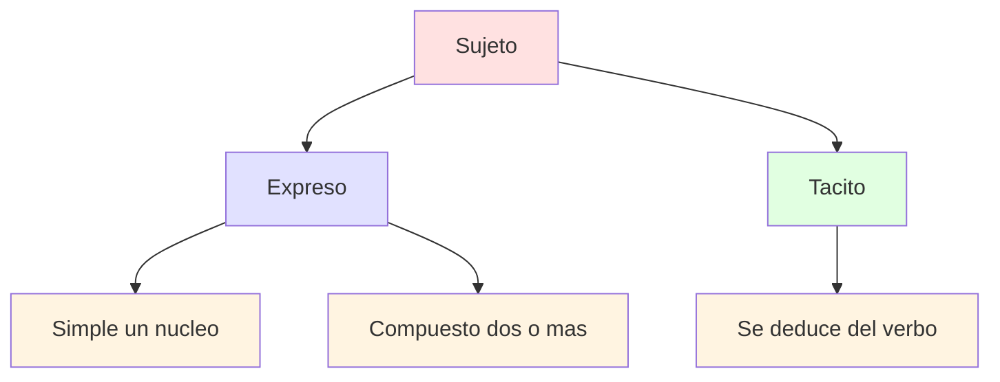
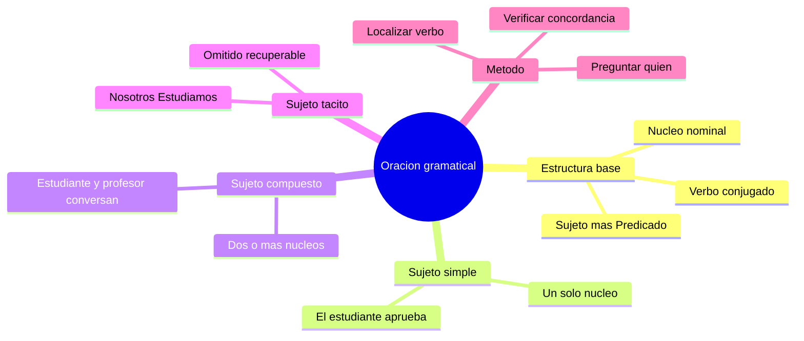

---
{"dg-publish":true,"permalink":"/universidad/preuniversitario/comunicacion-efectiva/unidad-2-la-oracion-gramatical/01-estructura-de-la-oracion-y-tipos-de-sujeto/","dg-note-properties":{}}
---

# 📝 Estructura de la oración y tipos de sujeto

## 🎯 Introducción

> [!info] 💡 ¿Qué es una oración gramatical y por qué importa?
>
> La **oración gramatical** es la unidad básica de la comunicación completa. Es el molde donde las palabras dejan de estar sueltas y empiezan a transmitir un mensaje con sentido pleno. Sin dominarla, párrafos, ensayos y exposiciones se vuelven confusos.
>
> En la vida universitaria y profesional necesitas construir oraciones claras para redactar informes, responder exámenes de desarrollo, argumentar en debates y escribir correos formales. Esta nota te enseña la estructura mínima de toda oración y los tres tipos de sujeto que verás en la Unidad 2.
>
> ```mermaid
> graph LR
> A[Oracion gramatical] --> B[Sujeto]
> A --> C[Predicado]
> B --> D[Simple]
> B --> E[Compuesto]
> B --> F[Tacito]
>
> style A fill:#ffe1e1
> style B fill:#e1e1ff
> style C fill:#e1ffe1
> style D fill:#fff4e1
> style E fill:#fff4e1
> style F fill:#fff4e1
> ```
>

---

## 📖 Definición nuclear

> [!success] 📖 Definición de la RAE - la idea central
>
> La **Real Academia Española** define la oración como una unidad con **sentido completo e independencia sintáctica**. Es decir, una secuencia de palabras que por sí sola comunica un mensaje terminado y no depende gramaticalmente de otra para entenderse.
>
> |Elemento de la definición|Qué significa|Ejemplo|
> |---|---|---|
> |**Unidad**|Conjunto organizado de palabras, no palabras aisladas|*El estudiante aprueba el examen* y no solo *estudiante examen*|
> |**Sentido completo**|El oyente o lector entiende el mensaje sin que falte información esencial|*Llueve mucho hoy* se entiende sola|
> |**Independencia sintáctica**|No necesita unirse a otra oración para ser gramatical|*Estudiamos juntos* frente a *cuando estudiamos*, que queda incompleta|
> |**Entonación propia**|En la oralidad termina con pausa y curva melódica; en la escritura con punto, interrogación o exclamación|*¿Vienes mañana?*|
>
> > 📌 Cita de referencia: la *Nueva gramática de la lengua española* señala que la oración es la unidad mínima capaz de constituir un enunciado con sentido completo. Todo lo que estudiaremos en esta unidad parte de esa idea.
>

> [!warning] ⚠️ Lo que NO es una oración
>
> |Caso|Ejemplo|Por qué no es oración|
> |---|---|---|
> |**Frase nominal sin verbo**|*El examen difícil de mañana*|No hay verbo conjugado, no hay predicado|
> |**Sintagma suelto**|*Con mucha dedicación*|Es un complemento, le falta sujeto y verbo|
> |**Oración subordinada aislada**|*Porque estudia todos los días*|Depende de una principal, no tiene independencia sintáctica|
> |**Interjección aislada**|*¡Ay!*|Expresa emoción pero no estructura sujeto más predicado|
>

---

## 🧱 Estructura base - Sujeto más Predicado

> [!note] 🧱 Las dos mitades obligatorias
>
> Toda oración bimembre se divide en exactamente dos partes. No hay tercera parte. Si sabes partir cualquier oración en estas dos mitades, ya dominas el 50 por ciento del análisis sintáctico.
>
> |Parte|Pregunta para hallarla|Núcleo obligatorio|Ejemplo en contexto|
> |---|---|---|---|
> |**Sujeto**|¿Quién realiza la acción o de quién se habla?|Un sustantivo, pronombre o sintagma nominal|*El estudiante* aprueba el examen|
> |**Predicado**|¿Qué se dice del sujeto?|Un verbo conjugado|El estudiante *aprueba el examen*|
> |**Núcleo del sujeto**|Palabra principal del sujeto, concuerda en número y persona con el verbo|Sustantivo o pronombre|*estudiante*|
> |**Núcleo del predicado**|Verbo principal conjugado|Siempre un verbo en forma personal|*aprueba*|
> |**Complementos**|Acompañan a los núcleos para precisar el mensaje|Adjetivos, artículos, adverbios, complementos verbales|*El* estudiante aprueba *el examen final*|
>
> ```mermaid
> graph LR
> A[Oracion bimembre] --> B[Sujeto]
> A --> C[Predicado]
> B --> D[Nucleo nominal]
> C --> E[Verbo conjugado]
> C --> F[Complementos]
>
> style A fill:#ffe1e1
> style B fill:#e1e1ff
> style C fill:#e1ffe1
> style D fill:#fff4e1
> style E fill:#fff4e1
> style F fill:#fff4e1
> ```
>

> [!success] 🔍 Método en 3 pasos para separar sujeto y predicado
>
> |Paso|Qué hacer|Ejemplo aplicado|
> |---|---|---|
> |**1. Localiza el verbo conjugado**|Busca el verbo en forma personal, será el núcleo del predicado|En *Los compañeros entregaron el trabajo a tiempo*, el verbo es *entregaron*|
> |**2. Pregunta quién o qué más verbo**|¿Quién entregó? Respuesta = sujeto|*Los compañeros* entregaron el trabajo a tiempo|
> |**3. Comprueba la concordancia**|Cambia el número del sujeto y el verbo debe cambiar también|*El compañero entregó* frente a *Los compañeros entregaron*|
>

> [!warning] ⚠️ Errores frecuentes al separar la oración
>
> |Error|Ejemplo incorrecto|Corrección|
> |---|---|---|
> |**Incluir el verbo dentro del sujeto**|*El estudiante aprueba* como sujeto|El sujeto es solo *El estudiante*, el verbo *aprueba* inicia el predicado|
> |**Confundir objeto directo con sujeto**|En *Aprueba el estudiante el examen*, decir que el sujeto es *el examen*|Pregunta quién aprueba: *el estudiante*. *El examen* es objeto directo|
> |**Olvidar la concordancia**|*Los estudiante aprueba*|Sujeto y verbo deben concordar: *El estudiante aprueba* o *Los estudiantes aprueban*|
> |**Partir por la coma**|Cortar donde hay una coma y no donde está el verbo|La división es lógica, no ortográfica|
>

---

## 👤 Oraciones simples y clasificación del sujeto

> [!note] 📌 Punto de partida - qué es una oración simple
>
> La **oración simple** tiene un solo verbo conjugado y, por tanto, un solo predicado. En esta nota solo trabajamos con oraciones simples. Las oraciones compuestas, con dos o más verbos conjugados, se estudian en la nota [[Universidad/Preuniversitario/Comunicación Efectiva/Unidad 2 - La oración gramatical/02 - Oraciones compuestas\|02 - Oraciones compuestas]].
>
> |Tipo de oración|Número de verbos conjugados|Ejemplo|
> |---|---|---|
> |**Simple**|Uno|*El profesor explica la lección*|
> |**Compuesta**|Dos o más|*El profesor explica y los alumnos toman apuntes*|
> |**No oracional**|Cero|*¡Silencio, por favor!*|
>

### 1. Sujeto simple

> [!note] 👤 Sujeto simple - un solo núcleo
>
> Tiene **un único núcleo**, aunque lo acompañen artículos, adjetivos u otros modificadores. Lo esencial es que solo hay una palabra principal que concuerda con el verbo.
>
> |Criterio|Detalle|
> |---|---|
> |**Núcleos**|Uno solo|
> |**Núcleo típico**|Sustantivo común o propio, pronombre, infinitivo sustantivado|
> |**Prueba**|Si quitas los modificadores, queda una sola palabra que concuerda con el verbo|
> |**Ejemplo base**|*El estudiante aprueba*|
>
> |Ejemplo|Núcleo|Modificadores|
> |---|---|---|
> |*El estudiante aprueba*|estudiante|El|
> |*La niña alta corre rápido*|niña|La, alta|
> |*Mi mejor amigo llegó tarde*|amigo|Mi, mejor|
> |*Estudiar cansa mucho*|Estudiar|Ninguno, infinitivo como sujeto|
> |*Ella escribe muy bien*|Ella|Ninguno, pronombre|
>

### 2. Sujeto compuesto

> [!note] 👥 Sujeto compuesto - dos o más núcleos
>
> Tiene **dos o más núcleos** unidos por coordinación, normalmente con *y*, *e*, *ni* u *o*. El verbo va en plural porque resume a todos los núcleos.
>
> |Criterio|Detalle|
> |---|---|
> |**Núcleos**|Dos o más|
> |**Nexo típico**|*y*, *e*, *ni*, *o*, coma enumerativa|
> |**Verbo**|Casi siempre en plural|
> |**Ejemplo base**|*El estudiante y el profesor conversan*|
>
> |Ejemplo|Núcleos|Nexo|
> |---|---|---|
> |*El estudiante y el profesor conversan*|estudiante, profesor|y|
> |*La puntualidad y el esfuerzo garantizan el éxito*|puntualidad, esfuerzo|y|
> |*Ni el frío ni la lluvia detuvieron el partido*|frío, lluvia|ni|
> |*El lápiz, el cuaderno y la mochila están listos*|lápiz, cuaderno, mochila|coma más y|
> |*Tú y yo presentaremos el trabajo*|Tú, yo|y|
>

> [!warning] ⚠️ Sujeto simple con modificadores largos NO es compuesto
>
> |Caso|Análisis|Explicación|
> |---|---|---|
> |*El estudiante alto de lentes aprueba*|Simple|Solo hay un núcleo: *estudiante*. *alto* y *de lentes* son modificadores|
> |*El estudiante y el profesor conversan*|Compuesto|Hay dos núcleos: *estudiante* y *profesor*|
> |*La casa grande y cómoda cuesta mucho*|Simple|Un solo núcleo: *casa*. *grande y cómoda* son dos adjetivos del mismo núcleo|
> |*La casa y el terreno cuestan mucho*|Compuesto|Dos núcleos distintos: *casa* y *terreno*|
>

### 3. Sujeto tácito u omitido

> [!note] 🙈 Sujeto tácito - está pero no se ve
>
> No aparece escrito, pero se **recupera por la desinencia del verbo**. En español podemos omitir el pronombre porque la terminación verbal ya indica la persona y el número. También se llama sujeto omitido, elíptico o desinencial.
>
> |Criterio|Detalle|
> |---|---|
> |**Aparición**|No hay palabra explícita como sujeto|
> |**Cómo se halla**|Se deduce de la conjugación verbal|
> |**Notación**|Se escribe entre paréntesis: *(Nosotros)*, *(Tú)*, *(Ellos)*|
> |**Ejemplo base**|*(Nosotros) Estudiamos*|
>
> |Ejemplo|Sujeto tácito recuperado|Pista verbal|
> |---|---|---|
> |*(Nosotros) Estudiamos todos los días*|Nosotros|Terminación *-amos* de primera persona plural|
> |*(Yo) Quiero aprobar el curso*|Yo|Forma *quiero*, primera persona singular|
> |*(Tú) Trae tu cuaderno mañana*|Tú|Imperativo *trae*, segunda persona|
> |*(Él) Viajó a Lima ayer*|Él o Ella|Terminación *-ó*, tercera persona singular|
> |*(Ustedes) Entreguen el informe el lunes*|Ustedes|Forma *entreguen*, tercera persona plural de cortesía|
> |*Llueve mucho en invierno*|Sin sujeto recuperable|Verbo impersonal, caso especial|
>

> [!success] 📊 Tabla comparativa - los tres tipos frente a frente
>
> |Rasgo|Sujeto simple|Sujeto compuesto|Sujeto tácito|
> |---|---|---|---|
> |**Número de núcleos**|Uno|Dos o más|Uno, pero omitido|
> |**¿Aparece escrito?**|Sí|Sí|No|
> |**Verbo en**|Singular o plural según el núcleo|Normalmente plural|Según la persona omitida|
> |**Ejemplo modelo**|*El estudiante aprueba*|*El estudiante y el profesor conversan*|*(Nosotros) Estudiamos*|
> |**Pregunta de control**|¿Hay una sola palabra principal?|¿Hay dos palabras principales unidas por *y* u *o*?|¿Falta el sujeto pero el verbo indica quién?|
> |**Error típico**|Confundirlo con compuesto cuando tiene adjetivos largos|Confundirlo con simple cuando los núcleos están lejos|Inventar un sujeto que el verbo no permite|
>

> [!note] 🧭 Guía rápida para no confundirlos
>
> |Pregunta|Si respondes sí|Entonces es|
> |---|---|---|
> |¿La oración no tiene sujeto escrito pero entiendes quién hace la acción por el verbo?|Sí|Sujeto tácito|
> |¿Puedes unir con *y* dos sustantivos que hacen la misma acción?|Sí|Sujeto compuesto|
> |¿Solo hay un sustantivo o pronombre principal?|Sí|Sujeto simple|
> |¿El verbo está en plural pero solo ves un sustantivo?|Revisa|Puede ser tácito de *nosotros*, *ellos* o compuesto con un núcleo omitido|
> |¿Hay verbo en tercera persona singular sin sujeto a la vista?|Revisa el contexto|Puede ser tácito de *él*, *ella*, *usted*|
>



---

## 🧪 Registro de práctica

> [!example]- ✏️ Ejercicio 02.1 - Separa sujeto y predicado
>
> **Instrucción:** En cada oración, identifica el sujeto, el predicado y los dos núcleos. Subraya el verbo conjugado antes de separar.
>
> |N.|Oración para analizar|
> |---|---|
> |1|*La comunicación clara facilita el aprendizaje*|
> |2|*Los alumnos del preuniversitario practican la redacción cada semana*|
> |3|*Mi profesora de Lenguaje revisa los ensayos con atención*|
> |4|*El celular vibró durante la clase*|
> |5|*Estudiar a diario mejora la memoria*|
> |6|*Las ideas principales sostienen todo el párrafo*|
>
> **Solucionario:**
>
> |N.|Sujeto|Predicado|Núcleo del sujeto|Núcleo del predicado|
> |---|---|---|---|---|
> |1|*La comunicación clara*|*facilita el aprendizaje*|comunicación|facilita|
> |2|*Los alumnos del preuniversitario*|*practican la redacción cada semana*|alumnos|practican|
> |3|*Mi profesora de Lenguaje*|*revisa los ensayos con atención*|profesora|revisa|
> |4|*El celular*|*vibró durante la clase*|celular|vibró|
> |5|*Estudiar a diario*|*mejora la memoria*|Estudiar|mejora|
> |6|*Las ideas principales*|*sostienen todo el párrafo*|ideas|sostienen|
>

> [!example]- ✏️ Ejercicio 02.2 - Clasifica el sujeto
>
> **Instrucción:** Indica si el sujeto es **simple**, **compuesto** o **tácito**. Si es tácito, escribe entre paréntesis el pronombre recuperado.
>
> |N.|Oración|
> |---|---|
> |1|*El estudiante aprueba el examen final*|
> |2|*El estudiante y el profesor conversan después de clase*|
> |3|*Estudiamos juntos para el examen de admisión*|
> |4|*La disciplina y la constancia vencen al talento*|
> |5|*Viajó a la biblioteca muy temprano*|
> |6|*El cuaderno, el lapicero y la regla están sobre la carpeta*|
>
> **Solucionario:**
>
> |N.|Sujeto identificado|Tipo|Justificación breve|
> |---|---|---|---|
> |1|*El estudiante*|Simple|Un solo núcleo: *estudiante*|
> |2|*El estudiante y el profesor*|Compuesto|Dos núcleos unidos por *y*|
> |3|*(Nosotros)*|Tácito|Verbo *estudiamos* indica primera persona plural|
> |4|*La disciplina y la constancia*|Compuesto|Dos núcleos abstractos unidos por *y*|
> |5|*(Él o Ella)*|Tácito|Verbo *viajó* en tercera persona singular sin sujeto expreso|
> |6|*El cuaderno, el lapicero y la regla*|Compuesto|Tres núcleos enumerados|
>

> [!example]- ✏️ Ejercicio 02.3 - Transforma el tipo de sujeto
>
> **Instrucción:** Reescribe cada oración cambiando el tipo de sujeto que se indica, sin alterar el sentido básico. Cuida la concordancia del verbo.
>
> |N.|Oración original|Transformación pedida|Respuesta modelo|
> |---|---|---|---|
> |1|*El alumno expone su trabajo*|A sujeto compuesto|*El alumno y la alumna exponen su trabajo*|
> |2|*La lectura y la escritura mejoran el vocabulario*|A sujeto simple|*La lectura mejora el vocabulario*|
> |3|*Ellos entregaron la tarea a tiempo*|A sujeto tácito|*(Ellos) Entregaron la tarea a tiempo*|
> |4|*Canto en el coro del colegio*|A sujeto simple expreso|*Yo canto en el coro del colegio*|
> |5|*El mapa y la brújula guían al viajero*|A sujeto simple|*El mapa guía al viajero*|
> |6|*La profesora explica con paciencia*|A sujeto compuesto|*La profesora y el auxiliar explican con paciencia*|
>
> > 📌 Regla de control: cada vez que agregues o quites un núcleo, ajusta el número del verbo. De singular a plural y viceversa.
>

---

## 🗂️ Resumen ejecutivo

> [!summary] 📌 Lo esencial en 60 segundos
>
> La **oración gramatical** es una unidad con sentido completo e independencia sintáctica. Su estructura base tiene dos partes: **sujeto**, de quién se habla, y **predicado**, qué se dice del sujeto.
>
> |Idea clave|Contenido mínimo|
> |---|---|
> |**Núcleo del sujeto**|Sustantivo o pronombre principal|
> |**Núcleo del predicado**|Verbo conjugado|
> |**Sujeto simple**|Un solo núcleo: *El estudiante aprueba*|
> |**Sujeto compuesto**|Dos o más núcleos: *El estudiante y el profesor conversan*|
> |**Sujeto tácito**|Omitido pero recuperable por el verbo: *(Nosotros) Estudiamos*|
> |**Prueba de oro**|Localiza el verbo, pregunta quién más verbo, verifica la concordancia|
>

---

## ✅ Metas de Aprendizaje

> [!note] 🎯 Nivel Básico
>
> - [ ] Defino con mis palabras qué es una oración gramatical según la RAE.
> - [ ] Separo cualquier oración simple en sujeto y predicado.
> - [ ] Identifico el núcleo del sujeto y el núcleo del predicado en 6 oraciones modelo.
> - [ ] Reconozco un sujeto simple como en *El estudiante aprueba*.
>

> [!note] 🎯 Nivel Intermedio
>
> - [ ] Distingo sujeto simple, compuesto y tácito sin dudar en oraciones nuevas.
> - [ ] Recupero el sujeto tácito a partir de la desinencia verbal.
> - [ ] Explico por qué *La casa grande y cómoda* sigue siendo sujeto simple.
> - [ ] Clasifico correctamente 6 oraciones en simple, compuesto o tácito.
>

> [!note] 🎯 Nivel Avanzado
>
> - [ ] Transformo oraciones cambiando el tipo de sujeto y ajustando la concordancia.
> - [ ] Justifico el análisis de casos límite como verbos impersonales.
> - [ ] Redacto un párrafo de 5 líneas usando los tres tipos de sujeto de forma intencional.
> - [ ] Preparo la base para analizar oraciones compuestas en la siguiente nota.
>

---

## 📊 Resumen Visual



---

> [!quote] 📖 Fuentes consultadas
>
> [1] Real Academia Española y Asociación de Academias de la Lengua Española, *Nueva gramática de la lengua española. Manual*, Madrid, España: Espasa, 2010.
>
> [2] Real Academia Española y Asociación de Academias de la Lengua Española, *Ortografía de la lengua española*, Madrid, España: Espasa, 2010.
>
> [3] S. Gili Gaya, *Curso superior de sintaxis española*, 15.ª ed. Barcelona, España: Vox-Biblograf, 1980.
>
> [4] J. M. Gómez Torrego, *Gramática didáctica del español*, 8.ª ed. Madrid, España: SM, 2007.
>

> [!quote] 🔗 Conexiones
>
> - [[Universidad/Preuniversitario/Comunicación Efectiva/Unidad 2 - La oración gramatical/00 - Índice Unidad 2\|00 - Índice Unidad 2]] — mapa general de la unidad La oración gramatical, objetivos y orden de estudio.
> - [[Universidad/Preuniversitario/Comunicación Efectiva/Unidad 2 - La oración gramatical/02 - Oraciones compuestas\|02 - Oraciones compuestas]] — siguiente nota: oraciones con dos o más verbos conjugados, coordinación y subordinación.
> - Unidad 1 — el párrafo y la idea principal, donde aplicas estas oraciones simples para construir textos claros.
>

---

**Tags:** #comunicacionEfectiva #oracionGramatical #sujeto #predicado #unidad2 #preuniversitario
