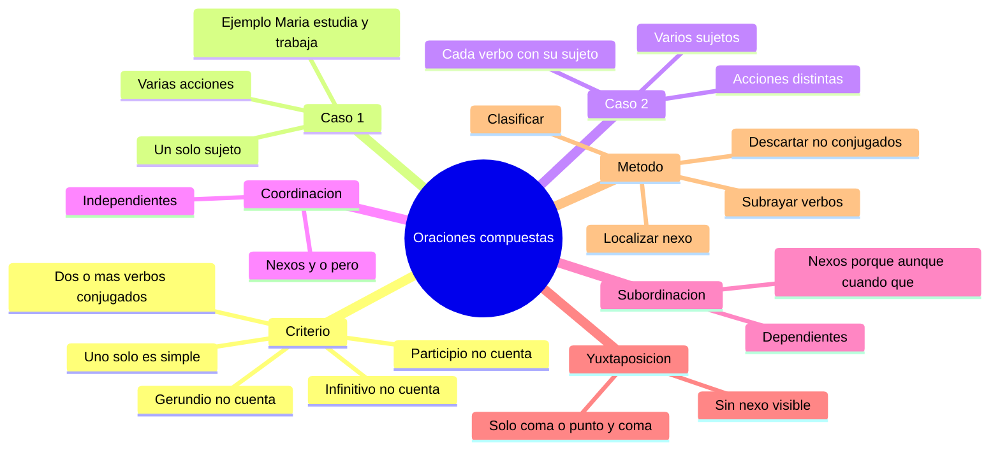

---
{"dg-publish":true,"permalink":"/universidad/preuniversitario/comunicacion-efectiva/unidad-2-la-oracion-gramatical/02-oraciones-compuestas/","dg-note-properties":{}}
---

# 🔗 Oraciones Compuestas

## 🎯 Introducción

> [!info] 💡 De lo simple a lo compuesto
>
> En la nota anterior ([[Universidad/Preuniversitario/Comunicación Efectiva/Unidad 2 - La oración gramatical/01 - Estructura de la oración y tipos de sujeto\|01 - Estructura de la oración y tipos de sujeto]]) aprendiste que la **oración simple** tiene un solo verbo conjugado y expresa una sola idea completa: *"María estudia"*. Pero en la comunicación real casi nunca hablamos con ideas tan cortas. Decimos cosas como *"María estudia y trabaja"* o *"María estudia porque quiere graduarse"*.
>
> Esas son **oraciones compuestas**: estructuras que combinan dos o más proposiciones (cada una con su propio verbo conjugado) unidas por un **nexo** o por yuxtaposición. Dominarlas es lo que te permite escribir párrafos fluidos, argumentar y no sonar "cortado" o repetitivo.
>
> ```mermaid
> graph LR
>     A[Oracion simple<br/>un verbo conjugado] -->|Se combina con otra proposicion| B[Oracion compuesta]
>     B --> C[Dos o mas verbos conjugados<br/>unidos por un nexo]
>
>     style A fill:#ffe1e1
>     style B fill:#e1e1ff
>     style C fill:#e1ffe1
> ```
>
> > 📌 Esta nota te enseña el **único criterio** que nunca falla para distinguirlas (contar verbos conjugados), los dos grandes casos de sujetos y la diferencia entre **coordinación** y **subordinación**.

---

## 📖 Definición y Criterio

> [!note] 📖 Definición de oración compuesta
>
> Una **oración compuesta** es aquella que contiene **DOS O MÁS verbos conjugados** dentro de la misma estructura oracional. Cada verbo conjugado encabeza una **proposición** (una unidad con sujeto y predicado propios, aunque el sujeto a veces se comparta o se omita).
>
> El **criterio operativo** es simple y mecánico:
>
> 1. Subraya todos los verbos de la estructura.
> 2. Descarta las formas no conjugadas (infinitivo, gerundio, participio) — ese tema se profundiza en [[Universidad/Preuniversitario/Comunicación Efectiva/Unidad 2 - La oración gramatical/03 - Formas verbales conjugadas y no conjugadas\|03 - Formas verbales conjugadas y no conjugadas]].
> 3. Cuenta solo los **verbos conjugados** (los que tienen persona, número, tiempo y modo).
> 4. Si hay **uno** → oración simple. Si hay **dos o más** → oración compuesta.

> [!success] 📊 Simple vs. compuesta — la tabla que lo resume todo
>
> |Característica|Oración simple|Oración compuesta|
> |---|---|---|
> |**Número de verbos conjugados**|1|2 o más|
> |**Número de proposiciones**|1|2 o más|
> |**Ejemplo**|*María estudia.*|*María estudia y trabaja.*|
> |**Verbos conjugados en el ejemplo**|estudia (1)|estudia, trabaja (2)|
> |**Nexo**|No necesita|Casi siempre hay uno (y, que, porque, cuando…), salvo yuxtaposición|
> |**Idea expresada**|Una sola acción o estado|Dos o más acciones o estados relacionados|

> [!warning] ⚠️ El error más común — confundir formas no conjugadas con verbos
>
> No todo lo que "parece verbo" cuenta. Solo los **conjugados** mandan.
>
> |Estructura|Análisis|Clasificación|
> |---|---|---|
> |*Quiero estudiar medicina.*|quiero (conjugado) + estudiar (infinitivo)|**Simple** — solo 1 conjugado|
> |*Salió corriendo de la casa.*|salió (conjugado) + corriendo (gerundio)|**Simple** — solo 1 conjugado|
> |*La tarea está terminada.*|está (conjugado) + terminada (participio)|**Simple** — solo 1 conjugado|
> |*Quiero que estudies medicina.*|quiero + estudies (los dos conjugados)|**Compuesta** — 2 conjugados|
> |*Salió y corrió a la casa.*|salió + corrió (los dos conjugados)|**Compuesta** — 2 conjugados|
>
> > 📌 Regla de oro: el infinitivo (-ar, -er, -ir), el gerundio (-ando, -iendo) y el participio (-ado, -ido) **nunca** convierten una oración en compuesta por sí solos.

> [!note] 🗺️ Cómo se ve una oración compuesta por dentro
>
> ```mermaid
> graph LR
>     A[Oracion compuesta] --> B[Proposicion 1<br/>verbo conjugado 1]
>     A --> C[Nexo<br/>y, pero, que, porque]
>     A --> D[Proposicion 2<br/>verbo conjugado 2]
>
>     style A fill:#e1e1ff
>     style B fill:#e1ffe1
>     style C fill:#fff4e1
>     style D fill:#ffe1e1
> ```
>
> |Parte|Ejemplo en *"María estudia porque quiere graduarse"*|
> |---|---|
> |**Proposición 1**|María estudia (verbo: estudia)|
> |**Nexo**|porque (nexo causal)|
> |**Proposición 2**|quiere graduarse (verbo principal: quiere)|

---

## 👥 Casos de Concordancia y Sujetos

> [!note] 👤 Caso 1 — Un solo sujeto realizando múltiples acciones
>
> Un mismo sujeto puede ejecutar dos o más acciones. Los verbos aparecen **coordinados** (generalmente con *y*, *e*, *ni*) y comparten el sujeto, que se menciona una sola vez.
>
> |Ejemplo|Análisis|
> |---|---|
> |*María estudia y trabaja.*|Sujeto: María. Verbos: estudia, trabaja. Ambas acciones las hace ella.|
> |*Pedro llegó, saludó y se sentó.*|Sujeto: Pedro. Tres verbos coordinados por yuxtaposición y por *y*.|
> |*Yo leo pero no comprendo.*|Sujeto tácito: yo. Verbos coordinados con valor adversativo (*pero*).|
>
> **Concordancia:** todos los verbos coordinados deben concordar con ese único sujeto en **persona y número**. Si el sujeto es singular, todos van en singular.
>
> |Correcto|Incorrecto|Por qué|
> |---|---|---|
> |*María estudia y trabaja.*|*María estudia y trabajan.*|El segundo verbo rompe la concordancia con el sujeto singular.|
> |*Nosotros corremos y saltamos.*|*Nosotros corremos y salta.*|El segundo verbo debe ir en primera persona del plural.|
>
> > 📌 Truco: si puedes separar la oración en dos simples con el mismo sujeto (*María estudia. María trabaja.*), es este caso.

> [!note] 👥 Caso 2 — Múltiples sujetos realizando acciones distintas
>
> Cada proposición tiene su propio sujeto y su propia acción. Las proposiciones se relacionan por **coordinación** o por **subordinación**.
>
> |Ejemplo|Análisis|
> |---|---|
> |*María estudia mientras Juan trabaja.*|Sujeto 1: María (estudia). Sujeto 2: Juan (trabaja). Nexo temporal: mientras.|
> |*El profesor explica y los alumnos toman apuntes.*|Sujeto 1: el profesor. Sujeto 2: los alumnos. Nexo copulativo: y.|
> |*Ana aprobó porque estudió toda la semana.*|Sujeto 1: Ana (aprobó). Sujeto 2 (tácito): ella (estudió). Nexo causal: porque.|
>
> **Concordancia:** cada verbo concuerda **solo con su propio sujeto**, no con el de la otra proposición. Ese es el punto que más errores genera en exámenes.
>
> |Correcto|Incorrecto|Por qué|
> |---|---|---|
> |*María estudia mientras Juan trabaja.*|*María estudia mientras Juan trabajo.*|*Trabaja* debe concordar con Juan (3.ª singular), no con María ni con yo.|
> |*Los niños juegan y la madre los vigila.*|*Los niños juegan y la madre los vigilan.*|*Vigila* concuerda con *la madre* (singular).|

> [!success] 📊 Coordinación vs. subordinación — tabla esencial
>
> |Criterio|Coordinación|Subordinación|
> |---|---|---|
> |**Relación entre proposiciones**|Independientes: cada una tiene sentido completo por sí sola|Dependientes: una proposición (subordinada) depende de la otra (principal)|
> |**Si las separas**|Ambas siguen siendo oraciones válidas|La subordinada queda incompleta (*"…porque quiere graduarse"* no se sostiene sola)|
> |**Nexos típicos**|*y, e, ni, o, u, pero, mas, sino, sin embargo*|*que, porque, aunque, cuando, mientras, si, para que, donde, como*|
> |**Ejemplo**|*Estudio y trabajo.*|*Estudio porque quiero graduarse.* → perdón, *porque quiero graduarme.*|
> |**Ejemplo corregido**|*María estudia y trabaja.* (dos ideas del mismo nivel)|*María estudia porque quiere graduarse.* (la causa depende de la principal)|
>
> > 📌 Para clasificar rápido: tapa el nexo y lee cada parte por separado. Si ambas "sobreviven" solas → coordinación. Si una queda coja → subordinación.

> [!note] 🔗 Los nexos más usados — tabla de referencia
>
> |Tipo|Nexos|Ejemplo|
> |---|---|---|
> |**Copulativos** (suman)|y, e, ni|*Canta y baila.*|
> |**Disyuntivos** (alternan)|o, u, o bien|*Estudias o trabajas.*|
> |**Adversativos** (contrastan)|pero, mas, sino, sin embargo|*Es difícil, pero lo lograré.*|
> |**Causales** (dan motivo)|porque, pues, ya que|*Faltó porque estaba enfermo.*|
> |**Concesivos** (admiten obstáculo)|aunque, a pesar de que|*Salió aunque llovía.*|
> |**Temporales** (ubican en el tiempo)|cuando, mientras, antes de que, después de que|*Llegó cuando anochecía.*|
> |**Condicionales** (ponen condición)|si, siempre que, con tal de que|*Si estudias, aprobarás.*|
> |**Completivos** (completan al verbo)|que, si|*Creo que tienes razón.*|

> [!warning] ⚠️ Yuxtaposición — la compuesta "sin nexo visible"
>
> Dos proposiciones pueden unirse solo con **coma, punto y coma o dos puntos**, sin nexo escrito. Sigue siendo compuesta porque hay 2+ verbos conjugados.
>
> |Ejemplo|Equivalencia con nexo|
> |---|---|
> |*Llegué, vi, vencí.*|*Llegué, vi y vencí.*|
> |*Estudia mucho: quiere ser médico.*|*Estudia mucho porque quiere ser médico.*|
> |*Hace frío; quedémonos en casa.*|*Hace frío, así que quedémonos en casa.*|
>
> > 📌 En el examen, la yuxtaposición es la trampa favorita: como no hay nexo a la vista, muchos la marcan como simple. Cuenta los verbos y no fallarás.

---

## 🎬 Zona Multimedia y Práctica

> [!info] 🎬 Notas del video 02.7 — Cómo dominar las oraciones compuestas
>
> **Idea 1 — Cómo detectar cada verbo conjugado.**
> Busca la palabra que puedes cambiar de tiempo sin romper la oración (*estudia → estudiaba → estudiará*). Si la palabra acepta ese cambio, es un verbo conjugado. Si no (*estudiar, estudiando, estudiado* no aceptan persona ni tiempo por sí solos), es forma no conjugada y no cuenta.
>
> **Idea 2 — Cómo los nexos unen proposiciones.**
> El nexo es el "puente" entre proposiciones. Localízalo primero (*y, que, porque, cuando, aunque…*): todo lo que está antes suele ser la proposición 1 y todo lo que está después, la proposición 2. Luego verifica que cada lado tenga su propio verbo conjugado.
>
> **Idea 3 — Errores típicos de los estudiantes.**
> 1. Contar infinitivos y gerundios como si fueran verbos principales (*"Quiero estudiar"* marcada como compuesta — es simple).
> 2. Creer que sin nexo no hay compuesta (olvidan la yuxtaposición: *"Vine, vi, vencí"*).
> 3. Hacer concordar un verbo con el sujeto de la otra proposición (*"Los niños juegan y la madre los vigilan"*).
> 4. Confundir *porque* (causa) con *por qué* (pregunta): solo *porque* junto y sin tilde es nexo causal.
>
> |Paso del método del video|Qué hacer|Ejemplo con *"El niño llora porque tiene hambre"*|
> |---|---|---|
> |**Paso 1**|Subraya verbos|llora, tiene (tiene + hambre no es perífrasis: *tiene* sí es conjugado)|
> |**Paso 2**|Descarta no conjugados|No hay infinitivos ni gerundios: quedan 2 conjugados|
> |**Paso 3**|Localiza el nexo|porque|
> |**Paso 4**|Clasifica|Compuesta subordinada causal, dos sujetos distintos (el niño / él tácito)|

---

## ✏️ Registro de Práctica

> [!example]- ✏️ Ejercicio 02.4 — Cuenta los verbos y clasifica
>
> **Instrucción:** Subraya los verbos conjugados de cada estructura, indica cuántos hay y clasifica como simple o compuesta.
>
> |N.º|Estructura|N.º de conjugados|Simple / Compuesta|
> |---|---|---|---|
> |1|*El perro ladra toda la noche.*|1 (ladra)|Simple|
> |2|*El perro ladra y el gato maúlla.*|2 (ladra, maúlla)|Compuesta|
> |3|*Quiero aprender a conducir.*|1 (quiero; aprender es infinitivo)|Simple|
> |4|*Quiero que aprendas a conducir.*|2 (quiero, aprendas)|Compuesta|
> |5|*Llegamos tarde porque el bus se dañó.*|2 (llegamos, dañó)|Compuesta|
> |6|*Estudiando de noche avanzó más rápido.*|1 (avanzó; estudiando es gerundio)|Simple|
>
> > 📌 Autoevaluación: si clasificaste bien las 6, ya dominas el criterio. El par 3 vs. 4 es la clave: el infinitivo no cuenta, el subjuntivo (*aprendas*) sí.

> [!example]- ✏️ Ejercicio 02.5 — Identifica los sujetos
>
> **Instrucción:** Para cada oración compuesta, indica cada verbo conjugado con su sujeto correspondiente.
>
> |N.º|Oración|Sujeto del verbo 1|Sujeto del verbo 2|
> |---|---|---|---|
> |1|*María estudia y trabaja.*|María → estudia|María → trabaja (sujeto compartido)|
> |2|*María estudia mientras Juan trabaja.*|María → estudia|Juan → trabaja|
> |3|*Los alumnos preguntan y el profesor responde.*|Los alumnos → preguntan|El profesor → responde|
> |4|*Caminamos al parque y compramos helados.*|Nosotros (tácito) → caminamos|Nosotros (tácito) → compramos|
> |5|*Ella canta aunque él no la escucha.*|Ella → canta|Él → escucha|
>
> > 📌 Fíjate en el N.º 1 vs. N.º 2: mismo ejemplo base, distinto análisis de sujetos. Esa es exactamente la diferencia entre el Caso 1 y el Caso 2 de esta nota.

> [!example]- ✏️ Ejercicio 02.6 — Coordinación o subordinación
>
> **Instrucción:** Clasifica cada oración como coordinada o subordinada y nombra el tipo de nexo.
>
> |N.º|Oración|Coordinada / Subordinada|Nexo y tipo|
> |---|---|---|---|
> |1|*Hace frío, pero saldré igual.*|Coordinada|pero — adversativo|
> |2|*Hace frío porque es invierno.*|Subordinada|porque — causal|
> |3|*Puedes quedarte o puedes irte.*|Coordinada|o — disyuntivo|
> |4|*Te llamé cuando llegué a casa.*|Subordinada|cuando — temporal|
> |5|*Iré a la fiesta aunque esté cansado.*|Subordinada|aunque — concesivo|
> |6|*Limpia tu cuarto y haz la tarea.*|Coordinada|y — copulativo|
>
> > 📌 Prueba de verificación: separa las partes del N.º 2 (*"Hace frío" / "es invierno"*): la segunda explica a la primera, no es independiente → subordinada. En el N.º 1 ambas sobreviven solas → coordinada.

> [!example]- ✏️ Ejercicio 02.7 — Une con el nexo adecuado
>
> **Instrucción:** Une cada par de oraciones simples con el nexo indicado entre paréntesis para formar una compuesta correcta.
>
> |N.º|Oraciones simples|Nexo pedido|Oración compuesta resultante|
> |---|---|---|---|
> |1|*Estudia mucho. Quiere ser médico.*|(porque)|*Estudia mucho porque quiere ser médico.*|
> |2|*Llueve. Nos quedamos en casa.*|(así que / por eso)|*Llueve, así que nos quedamos en casa.*|
> |3|*Es tarde. Podemos tomar un taxi.*|(pero / sin embargo)|*Es tarde, pero podemos tomar un taxi.*|
> |4|*Te presto el libro. Me lo devuelvas mañana.*|(con tal de que)|*Te presto el libro con tal de que me lo devuelvas mañana.*|
> |5|*El semáforo se puso en rojo. Los carros se detuvieron.*|(cuando)|*Cuando el semáforo se puso en rojo, los carros se detuvieron.*|
>
> > 📌 Observa que el nexo cambia el sentido: con *porque* das una causa, con *pero* un contraste, con *cuando* un tiempo. Elegir el nexo correcto es elegir el significado.

> [!example]- ✏️ Ejercicio 02.8 — Corrige los errores de concordancia
>
> **Instrucción:** Cada oración tiene un error de concordancia entre sujeto y verbo. Detecta y corrige.
>
> |N.º|Oración con error|Error|Corrección|
> |---|---|---|---|
> |1|*María estudia y trabajan los fines de semana.*|*trabajan* no concuerda con María|*María estudia y trabaja los fines de semana.*|
> |2|*Los niños juegan y la madre los vigilan.*|*vigilan* no concuerda con la madre|*Los niños juegan y la madre los vigila.*|
> |3|*Nosotros corremos y salta en el parque.*|*salta* no concuerda con nosotros|*Nosotros corremos y saltamos en el parque.*|
> |4|*El director habla mientras los docentes toman apuntes.*|*(trampa: está correcta)*|Sin cambios — cada verbo concuerda con su sujeto.|
> |5|*Yo cocino y él lavan los platos.*|*lavan* no concuerda con él|*Yo cocino y él lava los platos.*|
> |6|*Ustedes preguntan y yo respondo tus dudas.*|*tus* no concuerda (debe ser *sus*)|*Ustedes preguntan y yo respondo sus dudas.*|
>
> > 📌 Regla aplicada: en el Caso 1 todos los verbos miran al mismo sujeto; en el Caso 2 cada verbo mira solo al suyo. El N.º 4 demuestra que no toda oración "sospechosa" tiene error.

---

## 🧾 Resumen Ejecutivo

> [!summary] 🧾 Lo esencial de las oraciones compuestas
>
> - **Criterio único:** hay oración compuesta si hay **2 o más verbos conjugados**; con 1 solo es simple. Infinitivos, gerundios y participios no cuentan.
> - **Caso 1 (un sujeto, varias acciones):** *María estudia y trabaja* — todos los verbos concuerdan con el mismo sujeto.
> - **Caso 2 (varios sujetos, varias acciones):** *María estudia mientras Juan trabaja* — cada verbo concuerda solo con su propio sujeto.
> - **Coordinación** = proposiciones independientes (*y, o, pero*). **Subordinación** = una depende de la otra (*porque, aunque, cuando, que, si*).
> - **Yuxtaposición** = compuesta sin nexo visible, unida por coma o punto y coma (*Llegué, vi, vencí*).
> - **Método de análisis en 4 pasos:** subraya verbos → descarta no conjugados → localiza el nexo → clasifica (simple/compuesta, coordinación/subordinación).

---

## ✅ Metas de Aprendizaje

> [!note] 🎯 Nivel Básico
>
> - [ ] Defino la oración compuesta con el criterio de los dos o más verbos conjugados.
> - [ ] Distingo un verbo conjugado de un infinitivo, un gerundio y un participio en cualquier ejemplo.
> - [ ] Clasifico 6 oraciones dadas como simples o compuestas sin equivocarme.

> [!note] 🎯 Nivel Intermedio
>
> - [ ] Identifico el sujeto de cada proposición en oraciones de los Casos 1 y 2.
> - [ ] Distingo coordinación de subordinación aplicando la prueba de separar las proposiciones.
> - [ ] Uno pares de oraciones simples con el nexo adecuado (y, pero, porque, aunque, cuando, que).

> [!note] 🎯 Nivel Avanzado
>
> - [ ] Detecto y corrijo errores de concordancia sujeto-verbo dentro de oraciones compuestas.
> - [ ] Reconozco la yuxtaposición y la explico como compuesta aunque no tenga nexo visible.
> - [ ] Redacto un párrafo de 5 líneas con al menos una coordinada, una subordinada y una yuxtapuesta, sin errores de concordancia.

---

## 📊 Resumen Visual



---

> [!quote] 📖 Fuentes consultadas
>
> [1] R. Seco, *Manual de gramática española*, 11.ª ed. Madrid, España: Aguilar, 1989.
>
> [2] Real Academia Española y Asociación de Academias de la Lengua Española, *Nueva gramática de la lengua española: Manual*. Madrid, España: Espasa, 2010.
>
> [3] A. Grijelmo, *La gramática descomplicada*, 2.ª ed. Madrid, España: Taurus, 2006.
>
> [4] L. Gómez Torrego, *Gramática didáctica del español*, 10.ª ed. Madrid, España: SM, 2011.

> [!quote] 🔗 Conexiones
>
> - [[Universidad/Preuniversitario/Comunicación Efectiva/Unidad 2 - La oración gramatical/01 - Estructura de la oración y tipos de sujeto\|01 - Estructura de la oración y tipos de sujeto]] — la base previa: qué es sujeto y predicado y cómo reconocer el verbo principal de una oración simple antes de pasar a las compuestas.
> - [[Universidad/Preuniversitario/Comunicación Efectiva/Unidad 2 - La oración gramatical/03 - Formas verbales conjugadas y no conjugadas\|03 - Formas verbales conjugadas y no conjugadas]] — el complemento directo: dominar infinitivo, gerundio y participio para aplicar sin errores el criterio de conteo de verbos.
> - Siguiente paso sugerido: practicar la redacción de párrafos combinando coordinación, subordinación y yuxtaposición con concordancia correcta.

---

**Tags:** #oracionCompuesta #gramatica #sintaxis #comunicacionEfectiva #preuniversitario #unidad2
