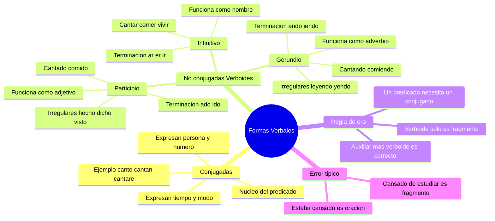

---
{"dg-publish":true,"permalink":"/universidad/preuniversitario/comunicacion-efectiva/unidad-2-la-oracion-gramatical/03-formas-verbales-conjugadas-y-no-conjugadas/","dg-note-properties":{}}
---

# ⚙️ Formas Verbales Conjugadas y No Conjugadas

## 🎯 Introducción

> [!info] 💡 ¿Por qué distinguir verbos conjugados y no conjugados?
> 
> Toda **oración gramatical** necesita un **predicado completo**, y todo predicado completo necesita al menos **un verbo conjugado**. Si no sabes reconocerlo, corres el riesgo de escribir fragmentos que parecen oraciones pero no lo son: ideas cortadas, participios sueltos o gerundios sin apoyo.
> 
> En esta nota aprenderás a diferenciar las **formas conjugadas** (cantó, comemos, vivirán) de las **formas no conjugadas o verboides** (cantar, comido, cantando), a reconocerlas por sus terminaciones y a usarlas correctamente para construir oraciones completas, claras y eficaces.
> 
> Este tema conecta directamente con [[Universidad/Preuniversitario/Comunicación Efectiva/Unidad 2 - La oración gramatical/02 - Oraciones compuestas\|02 - Oraciones compuestas]]: las subordinadas y coordinadas se articulan gracias a los verbos conjugados de cada proposición.
> 
> ```mermaid
> graph LR
>     A[Verbo en la oracion] --> B[Conjugado]
>     A --> C[No conjugado - Verboide]
>     B --> D[Predicado completo<br/>oracion gramatical]
>     C --> E[Sin tiempo ni persona<br/>no forma predicado solo]
> 
>     style A fill:#fff4e1
>     style B fill:#e1ffe1
>     style C fill:#ffe1e1
>     style D fill:#e1e1ff
> ```

---

## 🧩 El Verbo Conjugado

> [!success] ✅ Qué es una forma conjugada
> 
> Una **forma verbal conjugada** es la que expresa, por medio de desinencias o morfemas flexivos, las categorías de **tiempo, modo, número y persona**. Gracias a eso, puede anclar la acción en el tiempo y atribuirla a un sujeto.
> 
> |Categoría|Pregunta que responde|Ejemplo|
> |---|---|---|
> |**Persona**|¿Quién realiza la acción?|yo canto, tú cantas, él canta|
> |**Número**|¿Uno o varios?|canta (singular) / cantan (plural)|
> |**Tiempo**|¿Cuándo ocurre?|canto (presente) / canté (pasado) / cantaré (futuro)|
> |**Modo**|¿Cómo se presenta?|canta (indicativo, real) / cante (subjuntivo, deseado) / canta (imperativo, orden)|
> |**Aspecto**|¿Terminada o en curso?|cantaba (imperfectivo) / cantó (perfectivo)|
> |**Voz**|¿Activa o pasiva?|escribió (activa) / fue escrito (pasiva)|
> 
> > 📌 Si puedes cambiar la persona o el tiempo de la forma sin cambiar la palabra base, es conjugada: *canto, cantas, cantaba, cantaremos*.

> [!note] 🧪 Prueba rápida de conjugación
> 
> Para saber si una forma está conjugada, aplica estas dos pruebas:
> 
> |Prueba|Cómo se aplica|Ejemplo conjugado|Ejemplo no conjugado|
> |---|---|---|---|
> |**1. Cambio de persona**|Cambia el sujeto a yo, tú, él, nosotros|yo **estudio**, ellos **estudian** (cambia)|**estudiar** no cambia con el sujeto|
> |**2. Cambio de tiempo**|Ponla en pasado, presente y futuro|**estudiaba, estudio, estudiaré** (cambia)|**estudiando** no cambia: ayer estudiando, hoy estudiando|
> 
> > 📌 Si la forma **cambia** al cambiar persona o tiempo, está **conjugada**. Si permanece **invariable**, es un **verboide**.

---

## 📌 Formas No Personales o Verboides

> [!warning] ⚠️ Qué son los verboides
> 
> Las **formas no personales** (también llamadas **verboides**) son formas del verbo que **no expresan persona, número, tiempo ni modo** por sí mismas. Son invariables en ese sentido: no concuerdan con el sujeto.
> 
> |Rasgo|Verbo conjugado|Verboide|
> |---|---|---|
> |**Persona y número**|Sí (yo, tú, él, nosotros)|No|
> |**Tiempo y modo**|Sí (presente, pasado, indicativo, subjuntivo)|No|
> |**Puede ser núcleo del predicado solo**|Sí|No|
> |**Función típica**|Núcleo verbal|Nombres, adjetivos o adverbios|
> 
> > 📌 Son tres: **infinitivo, participio y gerundio**. Cada uno tiene terminaciones propias que debes memorizar.

---

### 1️⃣ El Infinitivo

> [!note] 📝 Infinitivo - el nombre del verbo
> 
> El **infinitivo** es la forma con la que nombramos al verbo en el diccionario. Termina en **-ar, -er, -ir**. Funciona muchas veces como **sustantivo** (sujeto u objeto).
> 
> |Conjugación|Terminación|Ejemplos|Como sustantivo|
> |---|---|---|---|
> |**1.ª conjugación**|**-ar**|cantar, amar, estudiar, hablar, caminar|El **cantar** de los pájaros me despierta|
> |**2.ª conjugación**|**-er**|comer, beber, correr, leer, comprender|**Comer** sano es importante|
> |**3.ª conjugación**|**-ir**|vivir, escribir, partir, recibir, dormir|**Vivir** aquí es tranquilo|
> 
> > 📌 Usos típicos del infinitivo:
> > 
> > |Uso|Ejemplo|Análisis|
> > |---|---|---|
> > |**Sujeto**|**Estudiar** requiere constancia|Estudiar = sujeto de requiere|
> > |**Objeto directo**|Quiero **aprobar** el examen|Aprobar = lo que quiero|
> > |**Después de preposición**|Salió sin **decir** nada|Sin + infinitivo|
> > |**Perífrasis**|Voy **a estudiar**, tengo **que salir**|Auxiliar conjugado + infinitivo|
> > |**Prohibición / instrucción**|No **fumar**|Infinitivo con valor imperativo en carteles|

> [!example]- ✏️ Mini ejercicio - Reconocer infinitivos
> 
> **Dato:** Subraya el infinitivo y di su conjugación: (a) Leer es un placer, (b) Necesito descansar, (c) Van a competir mañana.
> 
> |Oración|Infinitivo|Conjugación|
> |---|---|---|
> |**(a) Leer es un placer**|leer|2.ª (-er), funciona como sujeto|
> |**(b) Necesito descansar**|descansar|1.ª (-ar), objeto de necesito|
> |**(c) Van a competir mañana**|competir|3.ª (-ir), parte de perífrasis van a competir|

---

### 2️⃣ El Participio

> [!note] 📝 Participio - el verbo hecho adjetivo
> 
> El **participio** expresa la acción como **terminada o recibida**. Funciona como **adjetivo** (concuerda en género y número) y sirve para formar los **tiempos compuestos** con el auxiliar *haber*.
> 
> |Conjugación|Terminación regular|Ejemplos regulares|
> |---|---|---|
> |**1.ª (-ar)**|**-ado**|cantado, amado, estudiado, hablado, logrado|
> |**2.ª y 3.ª (-er, -ir)**|**-ido**|comido, bebido, vivido, escrito (regular aparente), partido|
> 
> |Participios irregulares más frecuentes|Forma correcta|Error frecuente|
> |---|---|---|
> |hacer|**hecho**|hacido (incorrecto)|
> |decir|**dicho**|decido (incorrecto)|
> |ver|**visto**|vido (incorrecto)|
> |escribir|**escrito**|escribido (incorrecto)|
> |abrir|**abierto**|abrido (incorrecto)|
> |poner|**puesto**|ponido (incorrecto)|
> |volver|**vuelto**|volvido (incorrecto)|
> |morir|**muerto**|morido (incorrecto)|
> |romper|**roto**|rompido (incorrecto)|
> |cubrir|**cubierto**|cubrido (incorrecto)|
> 
> > 📌 Doble uso del participio:
> > 
> > |Uso|Ejemplo|Explicación|
> > |---|---|---|
> > |**En tiempo compuesto**|He **cantado**, habían **comido**|Auxiliar haber (conjugado) + participio invariable|
> > |**Como adjetivo**|La carta **escrita**, los niños **cansados**|Concuerda: carta escrita, cartas escritas|
> 
> > ⚠️ Solo, sin auxiliar conjugado, el participio **no forma predicado**: *Cansado de tanto estudiar* no es oración.

> [!example]- ✏️ Mini ejercicio - Participios regulares e irregulares
> 
> **Dato:** Escribe el participio de: cantar, comer, hacer, decir, ver, escribir.
> 
> |Infinitivo|Participio|Regular / Irregular|
> |---|---|---|
> |cantar|cant**ado**|Regular|
> |comer|com**ido**|Regular|
> |hacer|**hecho**|Irregular|
> |decir|**dicho**|Irregular|
> |ver|**visto**|Irregular|
> |escribir|**escrito**|Irregular|

---

### 3️⃣ El Gerundio

> [!note] 📝 Gerundio - el verbo hecho adverbio
> 
> El **gerundio** expresa la acción en su **desarrollo, en curso**. Funciona como **adverbio** (modo, tiempo, causa) y forma las **perífrasis progresivas** con *estar, seguir, continuar*.
> 
> |Conjugación|Terminación regular|Ejemplos regulares|
> |---|---|---|
> |**1.ª (-ar)**|**-ando**|cantando, hablando, estudiando, caminando|
> |**2.ª y 3.ª (-er, -ir)**|**-iendo**|comiendo, bebiendo, viviendo, escribiendo|
> 
> |Gerundios irregulares frecuentes|Forma correcta|Origen|
> |---|---|---|
> |leer|**leyendo**|leer + yendo (se inserta y)|
> |ir|**yendo**|forma especial|
> |traer|**trayendo**|traer + yendo|
> |oír|**oyendo**|oír + yendo|
> |dormir|**durmiendo**|o cambia a u|
> |morir|**muriendo**|o cambia a u|
> |pedir|**pidiendo**|e cambia a i|
> |decir|**diciendo**|e cambia a i|
> |seguir|**siguiendo**|e cambia a i|
> |poder|**pudiendo**|o cambia a u|
> 
> > 📌 Usos correctos del gerundio:
> > 
> > |Uso|Ejemplo|Valor|
> > |---|---|---|
> > |**Progresivo**|Estoy **estudiando** para el examen|Acción en curso|
> > |**Modo**|Salió **corriendo** de la casa|Cómo salió|
> > |**Causa / tiempo**|**Estudiando** todos los días, aprobarás|Si estudias / cuando estudias|
> 
> > ⚠️ Solo, sin verbo conjugado, el gerundio **no forma predicado**: *Caminando por la avenida* no es oración.

---

## 🔍 Tabla Comparativa de los Tres Verboides

> [!success] 📊 Infinitivo vs. Participio vs. Gerundio
> 
> |Rasgo|Infinitivo|Participio|Gerundio|
> |---|---|---|---|
> |**Terminación 1.ª**|**-ar**: cantar|**-ado**: cantado|**-ando**: cantando|
> |**Terminación 2.ª / 3.ª**|**-er / -ir**: comer, vivir|**-ido**: comido, vivido|**-iendo**: comiendo, viviendo|
> |**Irregular ejemplo**|ser, ir|hecho, dicho, visto|leyendo, yendo, durmiendo|
> |**Funciona como**|Sustantivo|Adjetivo|Adverbio|
> |**Pregunta que responde**|¿Qué? (qué acción)|¿Cómo está? (qué estado)|¿Cómo / cuándo? (cómo ocurre)|
> |**Ejemplo en oración**|**Cantar** alegra el alma|La canción **cantada** ayer|Salió **cantando** de alegría|
> |**¿Constituye predicado solo?**|No|No|No|
> |**Necesita**|Verbo conjugado cerca|Auxiliar haber o estar|Auxiliar estar / seguir|
> 
> ```mermaid
> graph LR
>     A[Verboides] --> B[Infinitivo -ar -er -ir]
>     A --> C[Participio -ado -ido]
>     A --> D[Gerundio -ando -iendo]
>     B --> E[Funciona como nombre]
>     C --> F[Funciona como adjetivo]
>     D --> G[Funciona como adverbio]
> 
>     style A fill:#fff4e1
>     style B fill:#e1ffe1
>     style C fill:#ffe1e1
>     style D fill:#e1e1ff
> ```

---

## 🧭 Criterio de Reconocimiento

> [!note] 🧭 Cómo reconocer un verbo conjugado en cualquier oración
> 
> Aplica este procedimiento en 4 pasos:
> 
> |Paso|Pregunta|Ejemplo: *Los estudiantes presentaron sus proyectos ayer*|
> |---|---|---|
> |**1. Busca el verbo**|¿Qué palabra expresa acción o estado?|presentaron|
> |**2. Prueba persona**|¿Puedes cambiarla a yo / tú / nosotros?|yo presenté, nosotros presentamos (sí)|
> |**3. Prueba tiempo**|¿Puedes ponerla en presente / futuro?|presentan, presentarán (sí)|
> |**4. Conclusión**|Si pasa ambas pruebas, es conjugada|**presentaron** es verbo conjugado (3.ª persona plural, pretérito indicativo)|
> 
> > 📌 Todo verbo conjugado informa, al menos, de **tiempo, modo, número y persona**. Los verboides no informan de nada de eso por sí solos.

> [!success] 📊 Conjugados vs. No conjugados lado a lado
> 
> |Oración|Forma señalada|¿Conjugada?|Prueba|
> |---|---|---|---|
> |Ella **canta** muy bien|canta|Sí|yo canto, cantaré (cambia)|
> |Ella quiere **cantar** en el coro|cantar|No|yo cantar, ellos cantar (no cambia)|
> |Ellos han **comido** ya|comido|No|participio, invariable en la perífrasis|
> |Ellos **comieron** a las dos|comieron|Sí|como, comerán (cambia)|
> |**Estudiando** a diario, mejorarás|estudiando|No|gerundio, no cambia con persona|
> |**Estudias** a diario y mejorarás|estudias|Sí|estudio, estudiaba (cambia)|
> |Lo **dicho** ayer fue injusto|dicho|No|participio con valor adjetivo|
> |Me lo **dijo** ayer en clase|dijo|Sí|digo, diré (cambia)|
> 
> > 📌 Regla de oro: un **predicado completo necesita al menos UN verbo conjugado**. Sin él, solo hay un fragmento.
> > 
> > |Estructura|Ejemplo|¿Oración completa?|
> > |---|---|---|
> > |Sujeto + verbo conjugado|**María estudia.**|Sí|
> > |Sujeto + verboide solo|**María estudiando.**|No (fragmento)|
> > |Verboide solo|**Cantar.**|No (fragmento)|
> > |Auxiliar conjugado + verboide|**Está cantando. / Ha cantado.**|Sí (el auxiliar aporta la conjugación)|

---

## 🚨 Advertencia Clave

> [!danger] ⛔ Participios y gerundios aislados NO son predicado
> 
> Este es el error más frecuente en la escritura académica: usar un participio o un gerundio como si fuera el verbo principal, dejando la idea sin verbo conjugado. El resultado es un **fragmento**, no una oración.
> 
> |Fragmento (incorrecto)|Por qué falla|Oración completa (correcta)|
> |---|---|---|
> |**Cansado** de tanto estudiar.|Participio solo, sin auxiliar ni verbo conjugado|**Estaba cansado** de tanto estudiar.|
> |**Agotada** por el turno nocturno.|Participio solo|**Llegó agotada** por el turno nocturno.|
> |**Escrita** con mucho esfuerzo.|Participio solo|La tesis **fue escrita** con mucho esfuerzo.|
> |**Caminando** por la avenida.|Gerundio solo|**Iba caminando** por la avenida.|
> |**Leyendo** el informe en silencio.|Gerundio solo|**Estaba leyendo** el informe en silencio.|
> |**Habiendo terminado** el trabajo.|Gerundio compuesto solo|**Habiendo terminado** el trabajo, **salió** a descansar. (necesita principal)|
> |**Corriendo** para alcanzar el bus.|Gerundio solo|**Salió corriendo** para alcanzar el bus.|
> |**Dicho** todo lo anterior.|Participio solo|**Dicho** todo lo anterior, **podemos** concluir. (necesita principal)|
> 
> > 📌 Cómo corregir un fragmento: añade un verbo conjugado (ser, estar, llegar, salir, poder) o une el fragmento a la oración vecina con coma.
> > 
> > |Estrategia|Fragmento|Corrección|
> > |---|---|---|
> > |**Añadir estar / ser**|Cansado de tanto estudiar.|**Estaba** cansado de tanto estudiar.|
> > |**Añadir verbo principal**|Caminando por la avenida.|**Caminaba** por la avenida mientras pensaba.|
> > |**Unir con coma**|Leyendo el informe. Tomó notas.|**Leyendo** el informe, **tomó** notas.|

> [!warning] ⚠️ Falsos verbos conjugados - no te dejes engañar
> 
> |Forma|Parece conjugada pero...|Realidad|
> |---|---|---|
> |**cantado, comido**|Termina parecido a pretérito|Es participio, no indica persona|
> |**cantando, comiendo**|Expresa acción|Es gerundio, no indica tiempo ni persona|
> |**cantar, comer**|Expresa acción|Es infinitivo, es el nombre del verbo|
> |**ha cantado**|Lleva participio|Sí es predicado, pero lo conjugado es **ha** (auxiliar)|
> |**está comiendo**|Lleva gerundio|Sí es predicado, pero lo conjugado es **está** (auxiliar)|
> 
> > 📌 En las perífrasis, el verbo **auxiliar** (haber, estar, ir, tener, poder) es el conjugado; el verboide aporta el significado léxico.

---

## 🧪 Registro de Práctica

> [!example]- ✏️ Ejercicio 03.1 - Identifica conjugadas y no conjugadas
> 
> **Instrucción:** En cada oración, subraya el verbo conjugado (C) y encierra en un círculo el verboide (NC). Indica si es infinitivo (INF), participio (PART) o gerundio (GER).
> 
> |N.º|Oración|Análisis|
> |---|---|---|
> |**1**|Los niños **juegan** en el parque.|juegan (C, presente 3.ª plural)|
> |**2**|Quiero **aprender** a **nadar** este verano.|quiero (C); aprender (NC-INF), nadar (NC-INF)|
> |**3**|He **terminado** la tarea de matemáticas.|he (C, auxiliar); terminado (NC-PART)|
> |**4**|**Caminando** por el centro, **encontré** una librería.|encontré (C); caminando (NC-GER)|
> |**5**|La carta **fue escrita** por el director.|fue (C, auxiliar pasivo); escrita (NC-PART)|
> |**6**|**Estudiar** cada día **garantiza** buenos resultados.|garantiza (C); estudiar (NC-INF, sujeto)|
> |**7**|Estamos **leyendo** una novela policial.|estamos (C, auxiliar); leyendo (NC-GER irregular)|
> |**8**|**Dicho** esto, **damos** por finalizada la reunión.|damos (C); dicho (NC-PART irregular)|
> 
> > 📌 Autoevaluación: si acertaste 7 u 8, dominas el reconocimiento. Si fallaste en 3, 5 o 7, repasa participios y gerundios irregulares.

> [!example]- ✏️ Ejercicio 03.2 - Corrige los fragmentos
> 
> **Instrucción:** Cada ítem es un fragmento con participio o gerundio sin verbo conjugado. Reescríbelo como oración completa de dos maneras cuando sea posible: (a) añadiendo un verbo conjugado, (b) uniéndolo a una oración vecina.
> 
> |N.º|Fragmento|Corrección (a) Añadiendo conjugado|Corrección (b) Uniendo oraciones|
> |---|---|---|---|
> |**1**|Cansado de tanto estudiar.|**Estaba** cansado de tanto estudiar.|Cansado de tanto estudiar, **se durmió** en el sofá.|
> |**2**|Agotada por el trabajo nocturno.|**Llegó** agotada por el trabajo nocturno.|Agotada por el trabajo nocturno, **pidió** ayuda.|
> |**3**|Caminando bajo la lluvia.|**Iba** caminando bajo la lluvia.|Caminando bajo la lluvia, **llegó** empapado.|
> |**4**|Escrito a toda prisa.|El informe **fue** escrito a toda prisa.|Escrito a toda prisa, el informe **tenía** errores.|
> |**5**|Leyendo en voz alta.|**Estaba** leyendo en voz alta.|Leyendo en voz alta, **practicaba** pronunciación.|
> |**6**|Dicho todo lo anterior.|**Dicho** todo lo anterior, **podemos** votar.|**Habiendo dicho** todo lo anterior, **cerró** la sesión.|
> 
> > 📌 Regla para corregir: pregúntate *¿quién?* y *¿cuándo?*. Si ninguna palabra responde, falta el verbo conjugado.

---

## 🗂️ Verbos de Práctica Frecuente

> [!note] 🗂️ Lista de verbos modelo para conjugar y reconocer
> 
> Practica con estos verbos de las tres conjugaciones, en forma conjugada y no conjugada:
> 
> |Infinitivo|Participio|Gerundio|Ejemplo conjugado|Ejemplo no conjugado solo|
> |---|---|---|---|---|
> |**cantar**|cantado|cantando|Ella **cantó** ayer|Cantar (sujeto: cantar alegra)|
> |**comer**|comido|comiendo|Ellos **comieron** juntos|Comiendo (fragmento si va solo)|
> |**vivir**|vivido|viviendo|Nosotros **vivimos** aquí|Vivido (en: he vivido)|
> |**estudiar**|estudiado|estudiando|Tú **estudias** mucho|Estudiando (necesita auxiliar)|
> |**leer**|leído / lectura|leyendo|Él **lee** novelas|Leyendo (gerundio irregular)|
> |**escribir**|escrito|escribiendo|Yo **escribo** cartas|Escrito (participio irregular)|
> |**hacer**|hecho|haciendo|Ella **hizo** la tarea|Hecho (participio irregular)|
> |**decir**|dicho|diciendo|Me **dijo** la verdad|Dicho (participio irregular)|
> 
> ```mermaid
> graph LR
>     A[Quiero aprobar] --> B[quiero = conjugado]
>     A --> C[aprobar = infinitivo]
>     D[Estoy cantando] --> E[estoy = conjugado]
>     D --> F[cantando = gerundio]
> 
>     style A fill:#e1ffe1
>     style D fill:#e1e1ff
> ```

---

## ✅ Metas de Aprendizaje

> [!note] 🎯 Nivel Básico
> 
> - [ ] Defino qué es una forma conjugada y qué es un verboide con un ejemplo de cada uno.
> - [ ] Enumero los tres verboides (infinitivo, participio, gerundio) con sus terminaciones regulares.
> - [ ] Reconozco infinitivos en -ar, -er, -ir en oraciones simples (cantar, comer, vivir).
> - [ ] Distingo cantó (conjugado) de cantado y cantando (no conjugados).

> [!note] 🎯 Nivel Intermedio
> 
> - [ ] Aplico el criterio de persona y tiempo para identificar el verbo conjugado en 8 oraciones.
> - [ ] Escribo correctamente participios irregulares (hecho, dicho, visto, escrito) y gerundios irregulares (leyendo, yendo, durmiendo).
> - [ ] Explico por qué el auxiliar (haber, estar) es el elemento conjugado en las perífrasis.
> - [ ] Detecto fragmentos formados por participios o gerundios aislados y los corrijo añadiendo un verbo conjugado.

> [!note] 🎯 Nivel Avanzado
> 
> - [ ] Analizo oraciones con dos o más verbos (quiero aprender a nadar) y clasifico cada forma.
> - [ ] Corrijo párrafos académicos con fragmentos de participio y gerundio sin alterar el sentido.
> - [ ] Justifico por qué una proposición subordinada necesita su propio verbo conjugado en [[Universidad/Preuniversitario/Comunicación Efectiva/Unidad 2 - La oración gramatical/02 - Oraciones compuestas\|02 - Oraciones compuestas]].
> - [ ] Redacto un párrafo de 8 líneas sin fragmentos, usando los tres verboides apoyados en verbos conjugados.

---

## 📊 Resumen Visual



---

## 🧾 Resumen Ejecutivo

> [!summary] 🧾 Lo esencial en 60 segundos
> 
> |Idea clave|Detalle|
> |---|---|
> |**Verbo conjugado**|Expresa persona, número, tiempo y modo (canto, comieron, estudiaré). Es el núcleo del predicado.|
> |**Verboide**|No expresa persona ni tiempo (cantar, comido, cantando). No forma predicado solo.|
> |**Infinitivo**|Termina en -ar, -er, -ir. Funciona como sustantivo. Ej.: cantar, comer, vivir.|
> |**Participio**|Termina en -ado, -ido (irregulares: hecho, dicho, visto). Funciona como adjetivo y forma tiempos compuestos.|
> |**Gerundio**|Termina en -ando, -iendo (irregulares: leyendo, yendo). Funciona como adverbio y forma progresivos.|
> |**Regla de oro**|Todo predicado completo necesita al menos UN verbo conjugado.|
> |**Error típico**|Participio o gerundio aislado (Cansado de tanto estudiar, Caminando por la avenida) es fragmento; corrígelo con estaba, llegó, iba.|
> 
> > 📌 Si solo recuerdas una frase: **sin verbo conjugado, no hay oración**.

---

> [!quote] 📖 Fuentes consultadas
> 
> [1] Real Academia Española y Asociación de Academias de la Lengua Española, _Nueva gramática de la lengua española. Manual_, Madrid, España: Espasa, 2010.
> 
> [2] L. Gómez Torrego, _Gramática didáctica del español_, 11.ª ed. Madrid, España: SM, 2007.
> 
> [3] E. Alarcos Llorach, _Gramática de la lengua española_, Madrid, España: Espasa Calpe, 1994.
> 
> [4] M. Seco, _Gramática esencial del español_, 3.ª ed. Madrid, España: Espasa Calpe, 1999.

> [!quote] 🔗 Conexiones
> 
> - [[Universidad/Preuniversitario/Comunicación Efectiva/Unidad 2 - La oración gramatical/02 - Oraciones compuestas\|02 - Oraciones compuestas]] — cada proposición coordinada o subordinada necesita su propio verbo conjugado; los verboides no bastan para articularlas.
> - [[Universidad/Preuniversitario/Comunicación Efectiva/Unidad 2 - La oración gramatical/00 - Índice Unidad 2\|00 - Índice Unidad 2]] — índice general de la unidad: la oración gramatical, sus partes y tipos.
> - Próxima nota (Unidad 2, punto 4): análisis de sujeto y predicado con verbos conjugados como núcleo.

---

**Tags:** #comunicacionEfectiva #oracionGramatical #formasVerbales #verboides #conjugacionVerbal #unidad2 #preuniversitario
