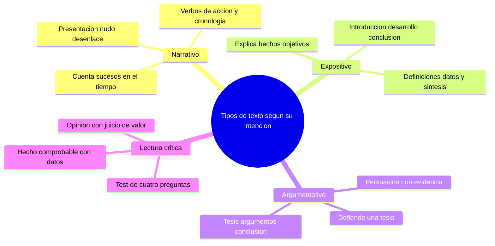

---
{"dg-publish":true,"permalink":"/universidad/preuniversitario/comunicacion-efectiva/unidad-3-tipologia-textual/01-tipos-de-texto-segun-su-intencion/","dg-note-properties":{}}
---

# 📝 Tipos de texto según su intención

## 🎯 Introducción

> [!info] 💡 Por qué la intención determina la estructura
>
> Todo texto nace con una **intención comunicativa**: lo que el autor quiere lograr en el lector. Esa intención no es un adorno, es el plano que define **qué información se selecciona, en qué orden se presenta y con qué lenguaje se expresa**.
>
> Un mismo hecho puede contarse de tres formas distintas según la intención: como historia que emociona, como explicación que aclara o como argumento que convence. Cambia la intención y cambia la estructura, aunque el tema sea el mismo.
>
> En esta nota estudiarás la **tríada fundamental** de la tipología textual por intención: textos **narrativos**, **expositivos** y **argumentativos**. Aprenderás a reconocerlos, a describir su estructura interna y a aplicar la distinción más importante de la lectura crítica: **hecho verificable frente a opinión**.
>
> ```mermaid
> graph LR
>     A[Intencion del autor] --> B[Estructura del texto]
>     B --> C[Efecto en el lector]
>     A --> D[Tipo narrativo expositivo argumentativo]
>     D --> B
> ```

---

## 🗂️ La tríada fundamental

> [!note] 🗂️ Tres intenciones, tres tipos de texto
>
> |Tipo|Intención dominante|Pregunta que responde|Rasgos lingüísticos|Ejemplo típico|
> |---|---|---|---|---|
> |**Narrativo**|Contar sucesos y experiencias en el tiempo|Qué pasó y en qué orden|Verbos de acción en pasado, conectores temporales, personajes, cronología|Cuento, novela, crónica, anécdota, noticia narrativa|
> |**Expositivo**|Informar y explicar hechos objetivos con claridad|Qué es y cómo funciona|Síntesis, definiciones, datos, lenguaje denotativo y neutral, organizadores lógicos|Manual, informe, entrada enciclopédica, texto escolar|
> |**Argumentativo**|Defender una tesis y persuadir al lector|Por qué debo creerte|Tesis explícita, argumentos y contraargumentos, conectores causales y concesivos, adjetivos valorativos|Ensayo, columna de opinión, debate, publicidad|

> [!success] 📊 Cómo reconocer cada tipo en 30 segundos
>
> |Pista|Narrativo|Expositivo|Argumentativo|
> |---|---|---|---|
> |**Verbos**|Pasaron, llegó, corrió|Es, se compone, mide|Creo, demuestra, debería|
> |**Conectores**|Primero, después, finalmente|En primer lugar, es decir, por ejemplo|Porque, sin embargo, por lo tanto|
> |**Personas**|Personajes que actúan|Conceptos que se definen|Voces que discuten|
> |**Finalidad**|Entretener o testimoniar|Hacer comprender|Sacar una conclusión y mover a la acción|
> |**Prueba rápida**|Si puedes hacer una línea de tiempo, es narrativo|Si puedes hacer un esquema o resumen, es expositivo|Si puedes subrayar una tesis, es argumentativo|

> [!warning] ⚠️ Los textos reales se mezclan
>
> En la práctica casi ningún texto es puro. Una crónica combina narración y exposición de datos. Un ensayo expone hechos y luego argumenta. Un manual puede abrir con una anécdota narrativa.
>
> La regla es: **clasifica por la intención dominante**, no por los fragmentos secundarios. Pregúntate: si quito todo lo demás, qué quiere el autor que yo haga al final: imaginar lo ocurrido, entender un tema o aceptar una postura.

---

## 🏗️ Estructuras internas

> [!note] 📖 Estructura del texto narrativo - Presentación, nudo y desenlace
>
> El texto narrativo organiza los **sucesos en cronología** con tensión creciente:
>
> - **Presentación:** quién, dónde, cuándo. Se presenta el marco y los personajes.
> - **Nudo:** qué conflicto rompe el equilibrio. Es el centro más extenso.
> - **Desenlace:** cómo se resuelve el conflicto y qué estado final queda.
>
> ```mermaid
> graph LR
>     A[Presentacion] --> B[Nudo]
>     B --> C[Desenlace]
>     A --> D[Marco y personajes]
>     B --> E[Conflicto y climax]
>     C --> F[Resolucion final]
> ```
>
> |Parte|Contenido|Marcas textuales|Ejemplo breve|
> |---|---|---|---|
> |**Presentación**|Contexto inicial estable|Había una vez, en 1998, vivía|María vivía tranquila en el pueblo|
> |**Nudo**|Aparición del problema y acciones|Pero un día, de pronto, entonces|Un día desapareció el puente del río|
> |**Desenlace**|Solución y situación final|Finalmente, al final, desde entonces|Finalmente construyeron uno nuevo y María cruzó primera|

> [!note] 📘 Estructura del texto expositivo - Introducción, desarrollo y conclusión
>
> El texto expositivo ordena **hechos, datos y definiciones** de lo general a lo específico para lograr síntesis y claridad:
>
> - **Introducción:** presenta el tema, su importancia y el objetivo del texto.
> - **Desarrollo:** explica con definiciones, clasificaciones, causas, datos y ejemplos.
> - **Conclusión:** sintetiza lo esencial y cierra sin agregar información nueva.
>
> ```mermaid
> graph LR
>     A[Introduccion] --> B[Desarrollo]
>     B --> C[Conclusion]
>     A --> D[Tema y objetivo]
>     B --> E[Hechos datos y ejemplos]
>     C --> F[Sintesis final]
> ```
>
> |Parte|Función|Recursos típicos|Pregunta guía|
> |---|---|---|---|
> |**Introducción**|Delimitar el tema|Definición inicial, contexto, pregunta|De qué trata este texto|
> |**Desarrollo**|Explicar por partes|Subtítulos, enumeraciones, gráficos, ejemplos|Cómo se compone y por qué ocurre|
> |**Conclusión**|Resumir lo explicado|En síntesis, en resumen, por tanto informativo|Qué debo recordar|

> [!note] 🗣️ Estructura del texto argumentativo - Tesis, argumentos y conclusión
>
> El texto argumentativo organiza **razones para sostener una tesis** y persuadir:
>
> - **Tesis:** postura central y discutible que el autor defiende.
> - **Argumentos:** razones, evidencias, ejemplos y autoridad que la sostienen. Incluye anticipación de objeciones.
> - **Conclusión:** reafirmación de la tesis y llamado a aceptar o actuar.
>
> ```mermaid
> graph LR
>     A[Tesis] --> B[Argumentos]
>     B --> C[Conclusion]
>     A --> D[Postura central]
>     B --> E[Evidencia y refutacion]
>     C --> F[Reafirmacion y llamado]
> ```
>
> |Parte|Contenido|Marcas textuales|Ejemplo breve|
> |---|---|---|---|
> |**Tesis**|Opinión central defendible|En mi opinión, sostengo que, es necesario|El transporte público debe ser gratuito|
> |**Argumentos**|Datos, causas, ejemplos, autoridad|Porque, dado que, según estudios, por ejemplo|Porque reduce tráfico y contaminación|
> |**Conclusión**|Cierre persuasivo|Por lo tanto, en conclusión, por eso|Por lo tanto, la ciudad debe financiarlo|

> [!success] 📊 Comparación rápida de estructuras
>
> |Tipo|Esquema secuencial|Eje organizador|Lo que no puede faltar|
> |---|---|---|---|
> |**Narrativo**|Presentación, nudo, desenlace|Tiempo y cronología|Sucesos ordenados y transformación|
> |**Expositivo**|Introducción, desarrollo, conclusión|Lógica y jerarquía|Hechos objetivos y síntesis|
> |**Argumentativo**|Tesis, argumentos, conclusión|Persuasión y prueba|Postura discutible y razones|

---

## 🔍 Diferenciación crítica - Hecho frente a opinión

> [!warning] ⚠️ La distinción que sostiene toda la lectura crítica
>
> Un **hecho** es un enunciado **comprobable** con datos, fechas, mediciones o fuentes. Una **opinión** es un **juicio de valor** que expresa creencia, gusto o postura y no se puede verificar como verdadero o falso, solo se puede argumentar.
>
> |Criterio|Hecho comprobable|Opinión o juicio de valor|
> |---|---|---|
> |**Definición**|Describe algo verificable en la realidad|Expresa valoración, creencia o postura|
> |**Lenguaje**|Denotativo, neutro, con cifras y fechas|Connotativo, con adjetivos valorativos|
> |**Prueba**|Se puede confirmar con fuentes o medición|Se puede discutir, no medir|
> |**Ejemplos**|El agua hierve a 100 C a nivel del mar|El agua de esa fuente es la más rica|
> |**Ejemplos**|En 2024 la ciudad tenía 2 millones de habitantes|Esa ciudad es caótica e inhabitable|
> |**Ejemplos**|El texto tiene 350 palabras|Ese texto es aburrido y mal escrito|

> [!note] 🧪 Test de 4 preguntas para distinguirlos
>
> Aplica estas preguntas a cada enunciado:
>
> - **1. Es verificable:** Puedo comprobarlo con una fuente, medición u observación.
> - **2. Tiene fecha o dato:** Incluye cifras, lugares, fechas o nombres precisos.
> - **3. Usa adjetivos valorativos:** Palabras como mejor, peor, hermoso, terrible, justo, injusto delatan opinión.
> - **4. Admite prueba contraria:** Si nadie podría demostrar que es falso con datos, es opinión.
>
> |Enunciado|Es verificable|Tiene fecha o dato|Usa valorativos|Resultado|
> |---|---|---|---|---|
> |El río mide 120 km de longitud|Sí|Sí|No|Hecho|
> |Ese río es el más hermoso del país|No|No|Sí, hermoso|Opinión|
> |La ley se aprobó en marzo de 2023|Sí|Sí|No|Hecho|
> |Esa ley es injusta e inútil|No|No|Sí, injusta e inútil|Opinión|

> [!success] 📊 Por qué importa en cada tipo de texto
>
> |Tipo de texto|Rol del hecho|Rol de la opinión|Error frecuente|
> |---|---|---|---|
> |**Narrativo**|Sitúa la historia en tiempo y lugar reales o verosímiles|Da tono y punto de vista del narrador|Confundir la voz del personaje con dato real|
> |**Expositivo**|Es la materia prima: datos, definiciones, causas|Debe evitarse o marcarse como valoración externa|Presentar una opinión como si fuera dato|
> |**Argumentativo**|Sirve como evidencia que sostiene la tesis|Es la tesis misma y los juicios que la rodean|Dar opiniones sin ningún hecho que las apoye|

---

## 🔠 Marcadores de cada tipo

> [!note] 🔠 Conectores que delatan la intención
>
> |Función|Narrativo|Expositivo|Argumentativo|
> |---|---|---|---|
> |**Orden**|Primero, luego, después, mientras tanto|En primer lugar, a continuación, finalmente expositivo|En primer término, además, por último|
> |**Causa**|Por eso narrativo, entonces pasó que|Se debe a, es causado por, como resultado de|Porque, dado que, puesto que|
> |**Contraste**|Pero de pronto, sin embargo ocurrió|En cambio, a diferencia de, frente a|Sin embargo, no obstante, aunque|
> |**Cierre**|Al final, desde entonces, nunca más|En síntesis, en resumen, en conclusión informativa|Por lo tanto, en conclusión, por eso defiendo que|
> |**Ejemplo de uso**|Después de cruzar el río, acamparon|Por ejemplo, el cobre conduce electricidad|Por ejemplo, en Suecia esta medida funcionó|

> [!success] 📊 El lenguaje como huella de la intención
>
> |Nivel|Narrativo|Expositivo|Argumentativo|
> |---|---|---|---|
> |**Persona verbal**|Tercera o primera que vivió los hechos|Tercera impersonal, se explica|Primera que opina y segunda a la que persuade|
> |**Tiempo verbal**|Pretérito y copretérito dominan|Presente atemporal y definitorio|Presente de tesis más condicional de propuesta|
> |**Adjetivación**|Sensorial y emotiva para imaginar|Precisa y técnica para delimitar|Valorativa para convencer|
> |**Verbos tipo**|Corrió, gritó, descubrió|Es, comprende, se clasifica, mide|Creo, demuestra, exige, debería|
> |**Objetividad**|Subjetividad del narrador permitida|Máxima objetividad y neutralidad|Subjetividad argumentada con pruebas|

> [!warning] ⚠️ Falsas pistas que confunden
>
> - Un texto con fechas no siempre es narrativo: si las fechas explican un proceso y no cuentan una historia, es expositivo.
> - Un texto con yo no siempre es argumentativo: el narrador en primera persona también usa yo para contar.
> - Un texto con datos no siempre es expositivo: si los datos solo sirven para probar una tesis, es argumentativo.
> - La pregunta decisiva sigue siendo: qué quiere el autor que yo haga: imaginar, entender o aceptar.

---

## 🚫 Errores frecuentes al clasificar

> [!warning] ⚠️ Cinco confusiones típicas y cómo evitarlas
>
> |Error|Ejemplo del error|Corrección|
> |---|---|---|
> |**Confundir tema con tipo**|Es de historia, entonces es narrativo|El tema no define el tipo, lo define la intención: un texto de historia que explica causas es expositivo|
> |**Llamar argumento a cualquier opinión**|Decir me gusta sin razones y creer que se argumentó|Sin tesis más razones no hay argumentación, solo gusto|
> |**Pedir opinión en un expositivo**|Cerrar un informe con yo creo que es malo|El expositivo cierra con síntesis, no con juicio|
> |**Narrar sin nudo**|Contar solo el marco sin conflicto|Sin ruptura del equilibrio no hay narración completa|
> |**Dar hechos sin fuente en argumentación**|Decir estudios dicen sin precisar cuál|Todo hecho usado como evidencia debe poder verificarse|

> [!note] ✅ Checklist de autoevaluación rápida
>
> - [ ] Puedo nombrar la intención dominante en una frase: cuenta, explica o defiende.
> - [ ] Puedo señalar dos marcas textuales que prueban mi clasificación.
> - [ ] Puedo ubicar dónde empieza y termina cada parte de la estructura interna.
> - [ ] Puedo separar los hechos verificables de las opiniones del texto.
> - [ ] Puedo reescribir un párrafo cambiando su intención sin cambiar su tema.
> - [ ] Puedo redactar una tesis discutible y sostenerla con dos razones.

---

## 🧪 Registro de práctica

> [!example]- ✏️ Ejercicio 02.1 - Clasifica por intención
>
> **Instrucción:** Lee cada fragmento y clasifícalo como narrativo, expositivo o argumentativo. Justifica con la intención dominante y una marca textual.
>
> 1. Cuando el reloj marcó las seis, Elena tomó su mochila y corrió a la estación. El tren ya partía cuando logró subir al último vagón.
> 2. La fotosíntesis es el proceso por el cual las plantas transforman luz solar, agua y dióxido de carbono en glucosa y oxígeno.
> 3. Prohibir los celulares en clase mejora el aprendizaje porque reduce distracciones y aumenta la participación, según diversos estudios.
> 4. Primero calentó el agua, después agregó el café y finalmente lo sirvió en tazas pequeñas para los invitados.
> 5. El corazón se divide en cuatro cavidades: dos aurículas y dos ventrículos, que bombean sangre oxigenada y desoxigenada.
> 6. El voto debería ser obligatorio desde los 16 años, ya que los jóvenes también son afectados por las decisiones públicas.
>
> **Clave de respuesta:**
>
> |N.º|Tipo|Justificación breve|
> |---|---|---|
> |1|**Narrativo**|Sucesos en cronología con personajes y verbos de acción|
> |2|**Expositivo**|Define y explica un proceso objetivo con lenguaje neutro|
> |3|**Argumentativo**|Defiende una tesis con porque y evidencia|
> |4|**Narrativo**|Secuencia temporal de acciones, conectores primero después finalmente|
> |5|**Expositivo**|Describe y clasifica con datos objetivos|
> |6|**Argumentativo**|Postura discutible con debería y razón con ya que|

> [!example]- ✏️ Ejercicio 02.2 - Ordena la estructura narrativa
>
> **Instrucción:** Los siguientes párrafos están desordenados. Ordénalos en presentación, nudo y desenlace.
>
> - **A.** Finalmente, el faro se encendió de nuevo y los barcos pudieron entrar al puerto sin peligro. Tomás fue reconocido como héroe del pueblo.
> - **B.** Tomás era el guardián del faro en un pueblo pesquero tranquilo. Cada noche encendía la luz que guiaba a los barcos.
> - **C.** Una noche de tormenta, el viento apagó la lámpara y un barco quedó a la deriva. Tomás subió con una antorcha entre las olas y la lluvia.
>
> **Clave de respuesta:**
>
> |Orden|Párrafo|Parte|Pista|
> |---|---|---|---|
> |1|**B**|Presentación|Marco estable, personajes, rutina|
> |2|**C**|Nudo|Conflicto, tormenta, peligro, acción|
> |3|**A**|Desenlace|Finalmente, resolución y reconocimiento|
>
> **Reto extra:** Subraya los conectores temporales y cambia el desenlace por uno distinto en dos líneas.

> [!example]- ✏️ Ejercicio 02.3 - Hecho frente a opinión, 8 enunciados
>
> **Instrucción:** Marca cada enunciado con H si es hecho comprobable u O si es opinión o juicio de valor. Aplica el test de 4 preguntas.
>
> 1. El Perú tiene tres regiones naturales: costa, sierra y selva.
> 2. La selva es la región más fascinante del país.
> 3. El censo de 2017 registró más de 29 millones de habitantes.
> 4. Ese censo fue un fracaso total y mal organizado.
> 5. El agua cubre cerca del 71 por ciento de la superficie terrestre.
> 6. Desperdiciar el agua debería castigarse con multas altas.
> 7. La novela tiene 220 páginas y fue publicada en 1967.
> 8. Esa novela es aburrida y sobrevalorada.
>
> **Clave de respuesta:**
>
> |N.º|Marca|Por qué|
> |---|---|---|
> |1|**H**|Dato geográfico verificable en fuentes|
> |2|**O**|Adjetivo valorativo fascinante, gusto personal|
> |3|**H**|Cifra y fecha comprobables|
> |4|**O**|Juicio fracaso total sin dato verificable|
> |5|**H**|Porcentaje medible y contrastable|
> |6|**O**|Propuesta con debería, postura no verificable|
> |7|**H**|Páginas y año comprobables|
> |8|**O**|Adjetivos aburrida y sobrevalorada|

> [!example]- ✏️ Ejercicio 02.4 - Escribe tesis más dos argumentos
>
> **Instrucción:** Elige uno de estos temas y escribe una tesis clara más dos argumentos con evidencia o razón. Cierra con una conclusión de una línea.
>
> - Temas: las redes sociales en el estudio, el deporte obligatorio, el reciclaje en el barrio.
>
> **Modelo resuelto con el tema redes sociales:**
>
> |Parte|Texto modelo|
> |---|---|---|
> |**Tesis**|Las redes sociales deben usarse con horario limitado durante la época de exámenes.|
> |**Argumento 1**|Porque reducen las horas de sueño y concentración, según reportes de hábitos de estudio y testimonios de docentes.|
> |**Argumento 2**|Porque con un horario fijo se mantienen sus beneficios de comunicación sin que interrumpan cada sesión de repaso.|
> |**Conclusión**|Por lo tanto, limitar su uso en exámenes mejora el rendimiento sin aislar al estudiante.|
>
> **Lista de chequeo:**
>
> - [ ] Mi tesis es una opinión discutible, no un hecho.
> - [ ] Cada argumento empieza con porque, dado que o según.
> - [ ] Incluyo al menos un dato, ejemplo o autoridad.
> - [ ] Mi conclusión reafirma la tesis sin agregar tema nuevo.
> - [ ] Reviso que ningún argumento sea solo otra opinión sin prueba.
> - [ ] Leo mi texto en voz alta y verifico que persuade a un lector neutral.

---

## 🌉 Puente hacia el texto académico

> [!note] 🌉 Lo que te llevas a la próxima nota
>
> - El texto académico que verás en [[Universidad/Preuniversitario/Comunicación Efectiva/Unidad 3 - Tipología textual/02 - El texto académico\|02 - El texto académico]] combina exposición y argumentación con normas formales.
> - Todo trabajo académico exige separar hechos con cita de opiniones propias con tesis.
> - Si dominas la tríada de hoy, el informe, el ensayo y la monografía serán solo combinaciones de lo ya aprendido.
> - Vuelve a [[Universidad/Preuniversitario/Comunicación Efectiva/Unidad 3 - Tipología textual/00 - Índice Unidad 3\|00 - Índice Unidad 3]] cuando necesites ubicar dónde encaja cada formato académico.
> - Recuerda: contar emociona, explicar aclara y argumentar convence; la universidad te pedirá sobre todo las dos últimas.

---

## 📝 Resumen ejecutivo

> [!summary] 📝 Lo esencial en un minuto
>
> La **intención** del autor define el tipo de texto y su **estructura interna**. Hay tres tipos básicos por intención: el **narrativo** cuenta sucesos en cronología con esquema presentación, nudo y desenlace; el **expositivo** explica hechos objetivos con esquema introducción, desarrollo y conclusión; el **argumentativo** defiende una tesis para persuadir con esquema tesis, argumentos y conclusión. La herramienta crítica que los atraviesa es distinguir el **hecho comprobable** con datos verificables de la **opinión** con juicios de valor. Si puedes subrayar la línea de tiempo es narrativo, si puedes hacer el esquema es expositivo y si puedes subrayar la tesis es argumentativo.

---

## ✅ Metas de Aprendizaje

> [!note] 🎯 Nivel Básico
>
> - [ ] Defino con mis palabras qué es la intención comunicativa y por qué determina la estructura.
> - [ ] Clasifico un texto breve como narrativo, expositivo o argumentativo según su intención dominante.
> - [ ] Reconozco el esquema de cada tipo: presentación nudo desenlace, introducción desarrollo conclusión, tesis argumentos conclusión.

> [!note] 🎯 Nivel Intermedio
>
> - [ ] Ordeno párrafos desordenados en la estructura interna correcta de cada tipo.
> - [ ] Distingo un hecho comprobable de una opinión usando el test de 4 preguntas.
> - [ ] Explico por qué un texto real mezcla tipos y justifico cuál es la intención dominante.

> [!note] 🎯 Nivel Avanzado
>
> - [ ] Redacto una tesis discutible con dos argumentos apoyados en hechos y una conclusión coherente.
> - [ ] Transformo un mismo tema en versión narrativa, expositiva y argumentativa según la intención pedida.
> - [ ] Evalúo un texto identificando dónde se presenta una opinión como si fuera hecho y propongo cómo corregirlo.

---

## 📊 Resumen Visual



---

> [!quote] 📖 Fuentes consultadas
>
> [1] D. Cassany, _Describir el escribir: cómo se aprende a escribir_, Barcelona, España: Paidós, 1988.
>
> [2] H. Serafini, _Cómo se escribe_, Barcelona, España: Paidós, 1994.
>
> [3] J. Basulto, _Tipología textual y estrategias de comprensión lectora_, México: Trillas, 2010.
>
> [4] Real Academia Española y Asociación de Academias de la Lengua Española, _Nueva gramática de la lengua española_, Madrid, España: Espasa, 2009.

> [!quote] 🔗 Conexiones
>
> - [[Universidad/Preuniversitario/Comunicación Efectiva/Unidad 3 - Tipología textual/00 - Índice Unidad 3\|00 - Índice Unidad 3]] — mapa general de la unidad de tipología textual y orden de lectura.
> - [[Universidad/Preuniversitario/Comunicación Efectiva/Unidad 3 - Tipología textual/02 - El texto académico\|02 - El texto académico]] — siguiente nota: cómo el texto expositivo y argumentativo se aplican en el ámbito académico.
> - [[Universidad/Preuniversitario/Comunicación Efectiva/Unidad 3 - Tipología textual/00 - Índice Unidad 3\|00 - Índice Unidad 3]] — vuelve al índice para repasar la tríada antes de pasar al texto académico.

---

**Tags:** #tipologiaTextual #textoNarrativo #textoExpositivo #textoArgumentativo #comprensionLectora #unidad3 #comunicacionEfectiva
