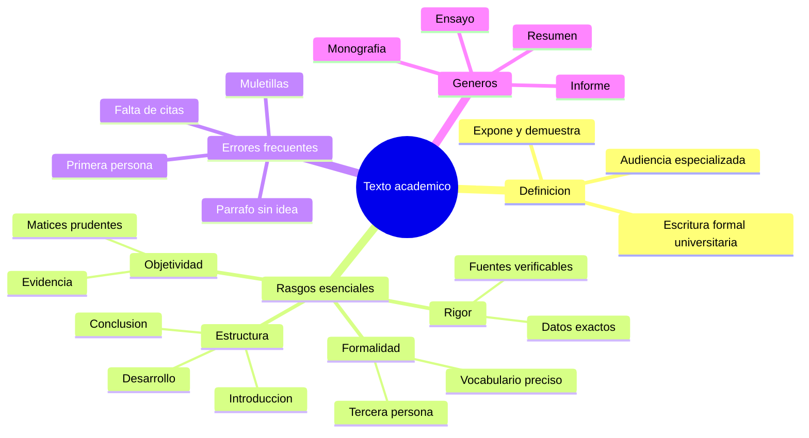

---
{"dg-publish":true,"permalink":"/universidad/preuniversitario/comunicacion-efectiva/unidad-3-tipologia-textual/02-el-texto-academico/","dg-note-properties":{}}
---

# 🎓 El texto académico

## 🎯 Introducción

> [!info] 💡 ¿Qué es el texto académico y por qué importa en la universidad?
>
> El **texto académico** es el tipo de escritura que se usa en la universidad para construir, ordenar y comunicar conocimiento. Ensayos, informes, resúmenes, monografías y tesis son textos académicos: todos comparten una misma exigencia de rigor, claridad y honestidad intelectual.
>
> Si en la nota anterior ([[Universidad/Preuniversitario/Comunicación Efectiva/Unidad 3 - Tipología textual/01 - Tipos de texto según su intención\|01 - Tipos de texto según su intención]]) aprendiste a distinguir intenciones como informar, narrar o persuadir, aquí damos un paso más: el texto académico no solo informa, sino que **demuestra**. Cada afirmación debe sostenerse con razones, datos o fuentes verificables.
>
> Dominar este registro es lo que separa un trabajo aprobado de un trabajo destacado. Es la herramienta con la que participas en la conversación universitaria.
>
> ```mermaid
> graph LR
>     A[Experiencia y opinion] --> B[Texto academico]
>     B --> C[Rigor y evidencia]
>     B --> D[Estructura clara]
>     C --> E[Conocimiento universitario]
>     D --> E
> ```

---

## 📚 Qué es el texto académico

> [!note] 📖 Definición de trabajo
>
> El **texto académico** es una producción escrita formal, objetiva y estructurada, cuyo propósito es exponer, analizar o argumentar un tema con fundamento teórico y evidencia verificable.
>
> |Elemento|Descripción|Ejemplo|
> |---|---|---|
> |**Propósito**|Generar o transmitir conocimiento, no entretener ni opinar sin fundamento|Un ensayo que analiza las causas de la deserción universitaria|
> |**Audiencia**|Comunidad académica: docentes, pares, lectores especializados|Un profesor que evalúa coherencia y uso de fuentes|
> |**Base**|Lecturas previas, datos, teorías y citas|Referencias a autores y estudios|
> |**Tono**|Formal, preciso y prudente|Se evita el yo creo y el lenguaje coloquial|

> [!note] 🎓 Por qué importa en la universidad
>
> |Razón|Explicación|
> |---|---|
> |**Evalúa tu pensamiento**|El docente no solo califica lo que sabes, sino cómo razonas y ordenas ideas|
> |**Te entrena para investigar**|Todo trabajo académico es un mini entrenamiento para la tesis|
> |**Te da credibilidad**|Un texto riguroso hace que tus ideas sean tomadas en serio|
> |**Es transversal**|Se exige en todas las carreras, desde ingeniería hasta comunicación|
> |**Evita el plagio**|Te obliga a distinguir tu voz de la voz de las fuentes|

> [!note] 🗂️ Géneros académicos más comunes
>
> |Género|Propósito|Extensión típica|
> |---|---|---|
> |**Resumen**|Condensar fielmente un texto fuente|1 página|
> |**Informe**|Presentar resultados de una observación o práctica|3 a 10 páginas|
> |**Ensayo académico**|Defender una tesis con argumentos y fuentes|3 a 8 páginas|
> |**Monografía**|Profundizar un tema con revisión bibliográfica|10 a 30 páginas|
> |**Reseña crítica**|Evaluar una obra con criterios explícitos|2 a 5 páginas|
> |**Tesis**|Aportar conocimiento original|50 páginas o más|

---

## 🧱 Rasgos esenciales del texto académico

> [!abstract] 🧭 Los cuatro pilares — video 03.1
>
> Todo texto académico sólido se sostiene sobre cuatro rasgos: **rigor, formalidad, objetividad y estructura**. Si falta uno, el texto se debilita. Si están los cuatro, el texto convence.
>
> |Pilar|Pregunta de control|
> |---|---|
> |**Rigor**|¿Puedo probar lo que afirmo?|
> |**Formalidad**|¿Suena universitario o suena a chat?|
> |**Objetividad**|¿Hablan los hechos o solo mi opinión?|
> |**Estructura**|¿Cada párrafo tiene una idea y un lugar?|

> [!success] 🔬 1. Rigor — precisión y fuentes verificables
>
> El rigor significa que cada dato es exacto, cada término está bien usado y cada afirmación importante tiene respaldo.
>
> |Práctica del rigor|Ejemplo incorrecto|Ejemplo correcto|
> |---|---|---|
> |**Datos precisos**|Muchos estudiantes reprueban|El 32 por ciento de estudiantes reprobó según el informe 2024|
> |**Términos exactos**|La cosa esa del texto|La idea central del texto|
> |**Fuentes verificables**|Lo dice internet|Lo afirma Cassany 2007 en su estudio sobre escritura|
> |**Distinguir hecho de inferencia**|Esto prueba que...|Estos datos sugieren que...|
>
> > 📌 Regla de oro: si un lector exigente te pregunta de dónde sacaste eso, debes poder responder con autor, año y página.
>
> **Mini ejemplo:**
>
> > ❌ La contaminación es muy grave hoy en día.
> >
> > ✅ La concentración de CO2 superó las 420 ppm en 2023 según la NOAA, lo que confirma una tendencia ascendente sostenida.

> [!success] 🎩 2. Formalidad — registro culto y tercera persona
>
> La formalidad es el traje del texto académico: vocabulario preciso, sintaxis completa y trato de usted al lector. Se prefiere la tercera persona y las construcciones impersonales.
>
> |Recurso formal|Ejemplo coloquial|Versión académica|
> |---|---|---|
> |**Tercera persona**|Yo creo que la lectura sirve|La lectura favorece el pensamiento crítico|
> |**Impersonal con se**|Aquí vemos que...|Se observa que...|
> |**Vocabulario preciso**|Un montón de ideas|Una diversidad de ideas|
> |**Conectores formales**|Y bueno, entonces...|Asimismo, por consiguiente...|
> |**Evitar muletillas**|O sea, tipo, como que|Es decir, por ejemplo, en otras palabras|
>
> > 📌 Lista de destierro académico: cosa, algo así, chévere, bacán, un montón, o sea, tipo, de ley.
>
> **Mini ejemplo:**
>
> > ❌ Yo pienso que este tema es súper interesante porque tiene un montón de cosas.
> >
> > ✅ Este tema resulta relevante por la diversidad de enfoques que convoca.

> [!success] ⚖️ 3. Objetividad — hechos sobre opiniones
>
> Ser objetivo no es no tener punto de vista, sino **fundamentarlo**. El texto académico privilegia la evidencia sobre la emoción y matiza las afirmaciones.
>
> |Marca de objetividad|Ejemplo subjetivo|Versión objetiva|
> |---|---|---|
> |**Evidencia antes que gusto**|Este libro es aburridísimo|Este libro presenta escasa ejemplificación, lo que dificulta la lectura|
> |**Matizadores**|Siempre, nunca, todos|Con frecuencia, en la mayoría de los casos|
> |**Atribución**|Es obvio que...|Según Van Dijk 1998, ...|
> |**Tono prudente**|Esto demuestra totalmente...|Esto sugiere / indica / tiende a confirmar...|
>
> > 📌 La objetividad también es honestidad: si un dato contradice tu tesis, debes mencionarlo y discutirlo, no ocultarlo.
>
> **Mini ejemplo:**
>
> > ❌ Todos saben que las redes sociales son malas para estudiar.
> >
> > ✅ Diversos estudios señalan una correlación entre el uso intensivo de redes sociales y la disminución del tiempo de estudio sostenido.

> [!success] 🏛️ 4. Estructura — introducción, desarrollo y conclusión
>
> Un texto académico siempre avanza en tres momentos y cada párrafo desarrolla **una sola idea central** anunciada en su oración temática.
>
> |Parte|Función|Contenido típico|
> |---|---|---|
> |**Introducción**|Presenta y delimita|Tema, objetivo, tesis y plan del texto|
> |**Desarrollo**|Demuestra|Argumentos ordenados, cada uno en párrafos temáticos con evidencia y citas|
> |**Conclusión**|Cierra y proyecta|Síntesis de hallazgos, sin ideas nuevas, con alcance o recomendación|
>
> **Anatomía del párrafo académico:**
>
> |Paso|Función|Ejemplo|
> |---|---|---|
> |**1. Oración temática**|Anuncia la idea central|La cohesión garantiza la unidad del texto.|
> |**2. Desarrollo**|Explica y ejemplifica|Para ello emplea conectores, pronombres y sinonimia que...|
> |**3. Evidencia o cita**|Respalda|Como señala Cassany...|
> |**4. Cierre**|Conecta con la tesis|Por tanto, sin cohesión el texto se fragmenta.|
>
> > 📌 Un párrafo = una idea. Si puedes ponerle dos títulos distintos a un mismo párrafo, debes dividirlo en dos.

> [!tip] 📊 Tabla resumen de los cuatro rasgos
>
> |Rasgo|En qué consiste|Error típico|Antídoto|
> |---|---|---|---|
> |**Rigor**|Precisión y fuentes verificables|Datos vagos sin cita|Citar autor, año y dato exacto|
> |**Formalidad**|Registro culto, tercera persona|Coloquialismos y primera persona|Impersonalizar y precisar vocabulario|
> |**Objetividad**|Hechos y evidencia sobre opiniones|Juicios sin prueba|Matizar y atribuir a fuentes|
> |**Estructura**|Introducción, desarrollo y conclusión|Párrafos mezcla-todo|Un párrafo, una idea central|

---

## ⚠️ Errores frecuentes y cómo corregirlos

> [!warning] 🚧 Los cuatro errores que más bajan la nota
>
> |Error frecuente|Por qué es grave|Ejemplo incorrecto|Cómo corregirlo|
> |---|---|---|---|
> |**1. Abusar de la primera persona**|Convierte el análisis en anécdota|Yo creo, en mi opinión, a mí me parece|Usar tercera persona o impersonal: el análisis muestra, se observa|
> |**2. Muletillas y coloquialismos**|Rompes el registro universitario|O sea, tipo, cosa, un montón, chévere|Reemplazar por vocabulario preciso: es decir, elemento, diversidad, relevante|
> |**3. Afirmar sin citar**|Es plagio o bluff académico|Como todos saben...|Citar la fuente: Según Pérez 2020... con referencia completa|
> |**4. Párrafos sin idea central**|El lector se pierde|Párrafo de 20 líneas que mezcla tres temas|Dividir: una oración temática por párrafo y conectores entre párrafos|
>
> > 📌 Autotest rápido antes de entregar: subraya los yo, rodea las muletillas, marca cada cita y ponle título a cada párrafo. Si algo falla, corrígelo.

> [!danger] ⛔ Falsos amigos del registro académico
>
> |Quita esto|Pon esto|
> |---|---|
> |Yo pienso que|El presente análisis sostiene que|
> |Un montón de autores|Diversos autores|
> |La cosa es que|El aspecto central es que|
> |De ley que sí|Efectivamente / Ciertamente|
> |Como que no cuadra|Resulta incoherente|
> |Súper importante|De especial relevancia|
> |En plan de resumen|En síntesis|

---

## ✍️ Registro de práctica

> [!example]- ✏️ Ejercicio 03.1 — Académico o no académico
>
> **Consigna:** Lee cada fragmento y decide si el rasgo señalado es académico o no. Justifica en una línea apelando a rigor, formalidad, objetividad o estructura.
>
> |N.|Fragmento|¿Académico?|Justificación|
> |---|---|---|---|
> |**1**|Se observa un incremento del 18 por ciento en la comprensión lectora tras la intervención.|Sí|Tercera persona, dato preciso y tono objetivo|
> |**2**|Yo creo que leer es súper importante porque tiene un montón de beneficios.|No|Primera persona, coloquialismo y afirmación sin evidencia|
> |**3**|Según Cassany 2007, la escritura es una práctica social situada.|Sí|Cita verificable y vocabulario formal|
> |**4**|O sea, el texto como que no se entiende porque le faltan cosas.|No|Muletillas, vaguedad y ausencia de terminología precisa|
> |**5**|Estos resultados sugieren que la estrategia es efectiva, aunque la muestra es limitada.|Sí|Matización prudente y reconocimiento de límites, marca de objetividad|
> |**6**|En conclusión, este trabajo confirma totalmente y para siempre la hipótesis inicial.|No|Generalización excesiva sin matiz, rompe la prudencia académica|
>
> > 📌 Si acertaste 5 de 6, ya distingues el registro. Si fallaste más, repasa la tabla resumen de los cuatro rasgos.

> [!example]- ✏️ Ejercicio 03.2 — Reescritura en registro académico
>
> **Consigna:** Reescribe el siguiente párrafo informal en registro académico. Debes corregir primera persona, coloquialismos, falta de citas y ausencia de estructura.
>
> **Texto informal:**
>
> > Yo pienso que los jóvenes hoy en día no leen nada porque pasan todo el día en el celular, o sea es obvio que eso es malísimo y un montón de profes lo dicen.
>
> **Versión académica modelo:**
>
> > Diversos docentes señalan una disminución del tiempo de lectura entre los jóvenes, asociada al uso intensivo del teléfono móvil. Según el informe CERLALC 2022, el promedio de lectura diaria en este grupo se redujo un 25 por ciento en la última década. Estos datos sugieren una correlación entre ambos fenómenos, aunque se requieren estudios longitudinales para establecer causalidad.
>
> **Qué se corrigió:**
>
> |Problema|Corrección aplicada|
> |---|---|
> |**Primera persona (yo pienso)**|Impersonal: diversos docentes señalan|
> |**Generalización (no leen nada)**|Dato delimitado: se redujo un 25 por ciento|
> |**Muletilla (o sea)**|Conector formal: según / estos datos sugieren|
> |**Juicio sin prueba (es malísimo)**|Tono prudente: sugieren una correlación|
> |**Fuente vaga (un montón de profes)**|Fuente verificable: informe CERLALC 2022|
>
> > 📌 Tu turno: toma un párrafo propio de un trabajo anterior y aplícale la misma tabla de corrección en tu cuaderno.

---

## 🧾 Resumen ejecutivo

> [!summary] 📌 Lo esencial en 60 segundos
>
> El **texto académico** es la escritura formal de la universidad: expone y demuestra conocimiento con **rigor** (datos exactos y citas), **formalidad** (registro culto y tercera persona), **objetividad** (evidencia y matices) y **estructura** (introducción, desarrollo y conclusión con un párrafo por idea).
>
> Los errores que más debes evitar son la primera persona anecdótica, las muletillas coloquiales, las afirmaciones sin cita y los párrafos mezcla-todo. La solución es siempre la misma: precisar, formalizar, citar y ordenar.
>
> Si aplicas la pregunta de control de cada pilar —¿puedo probarlo?, ¿suena universitario?, ¿hablan los hechos?, ¿cada párrafo tiene un lugar?— tu próximo ensayo ya estará en otro nivel.

---

## ✅ Metas de Aprendizaje

> [!note] 🎯 Nivel Básico
>
> - [ ] Defino qué es el texto académico y lo distingo de otros tipos de texto por su intención.
> - [ ] Nombro los cuatro rasgos esenciales: rigor, formalidad, objetividad y estructura.
> - [ ] Reconozco marcas coloquiales y las reemplazo por equivalentes formales.

> [!note] 🎯 Nivel Intermedio
>
> - [ ] Redacto párrafos académicos con oración temática, desarrollo, evidencia y cierre.
> - [ ] Cito fuentes de forma básica para respaldar una afirmación sin incurrir en plagio.
> - [ ] Reescribo un párrafo informal en registro académico corrigiendo los cuatro errores frecuentes.

> [!note] 🎯 Nivel Avanzado
>
> - [ ] Estructuro un ensayo breve completo con introducción, desarrollo y conclusión cohesionados.
> - [ ] Evalúo un texto propio o ajeno con una rúbrica de los cuatro rasgos y propongo mejoras.
> - [ ] Integro y discuto una fuente que contradice mi tesis manteniendo la objetividad.

---

## 📊 Resumen Visual



---

> [!quote] 📖 Fuentes consultadas
>
> [1] D. Cassany, *Taller de textos: leer, escribir y comentar en el aula*. Barcelona, España: Paidós, 2007.
>
> [2] E. Ander-Egg y M. Valle, *Cómo elaborar monografías, artículos científicos y otros textos expositivos*. Buenos Aires, Argentina: Lumen Humanitas, 1997.
>
> [3] M. A. Calsamiglia y A. Tusón, *Las cosas del decir: manual de análisis del discurso*. Barcelona, España: Ariel, 1999.
>
> [4] R. Hernández Sampieri, C. Fernández Collado y P. Baptista Lucio, *Metodología de la investigación*, 6ta ed. México: McGraw-Hill, 2014.

> [!quote] 🔗 Conexiones
>
> - [[Universidad/Preuniversitario/Comunicación Efectiva/Unidad 3 - Tipología textual/01 - Tipos de texto según su intención\|01 - Tipos de texto según su intención]] — base para distinguir la intención demostrativa del texto académico frente a narrar, describir o persuadir.
> - [[Universidad/Preuniversitario/Comunicación Efectiva/Unidad 3 - Tipología textual/03 - Uso correcto del verbo haber\|03 - Uso correcto del verbo haber]] — aliado directo de la formalidad: dominar hay, hubo y ha evita uno de los errores más visibles en trabajos universitarios.
> - Siguiente paso sugerido: aplicar los cuatro rasgos a la reescritura de un ensayo propio anterior.

---

**Tags:** #textoAcademico #tipologiaTextual #comunicacionEfectiva #preuniversitario #unidad3
