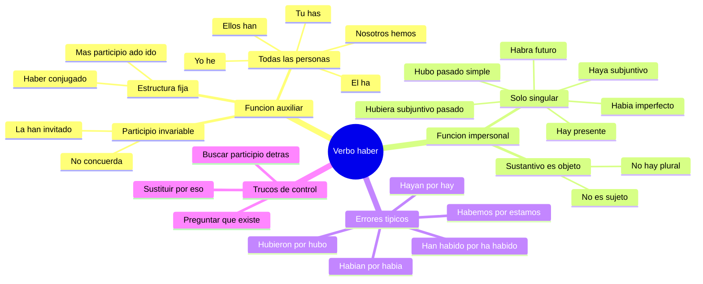

---
{"dg-publish":true,"permalink":"/universidad/preuniversitario/comunicacion-efectiva/unidad-3-tipologia-textual/03-uso-correcto-del-verbo-haber/","dg-note-properties":{}}
---

# 📝 Uso Correcto del Verbo Haber

## 🎯 Introducción

> [!info] 💡 El verbo mas mal usado del espanol
>
> El verbo **haber** es, sin duda, el verbo que mas errores provoca en la escritura academica y cotidiana. No significa existir por si mismo como otros verbos: cumple **dos funciones** muy distintas que nunca deben confundirse.
>
> Las dos funciones son: (1) como **verbo auxiliar** que acompana a un participio para formar los tiempos compuestos, y (2) como **verbo impersonal** que expresa existencia o presencia (hay, habia, hubo).
>
> La mayoria de los errores —hubieron, habian, habemos— nace de tratar la forma impersonal como si fuera personal, es decir, de conjugarla en plural cuando debe quedar siempre en singular.
>
> ```mermaid
> graph LR
>     A[Verbo haber] --> B[Funcion auxiliar]
>     A --> C[Funcion impersonal]
>     B --> D[Tiempos compuestos]
>     C --> E[Expresa existencia]
> ```

---

## 🧩 Las Dos Funciones del Verbo Haber

> [!note] 🧩 Mapa general del tema
>
> |Funcion|Pregunta que responde|Forma tipica|Ejemplo|
> |---|---|---|---|
> |**Auxiliar**|Que ha pasado o que se ha hecho|haber conjugado + participio|He terminado el ensayo|
> |**Impersonal**|Que existe o que hay|tercera persona singular invariable|Hay tres fuentes citadas|
>
> > 📌 Regla de oro: si despues de haber puedes poner un participio (-ado, -ido, -to, -so, -cho), es **auxiliar**. Si despues va un sustantivo o sintagma nominal que indica lo que existe, es **impersonal**.

---

## 🔧 Funcion Auxiliar — Tiempos Compuestos

> [!note] 🔧 Regla de formacion
>
> La estructura es siempre: **forma conjugada de haber + participio regular**.
>
> Participios regulares: verbos en **-ar** forman **-ado** (cantado, redactado, citado), verbos en **-er / -ir** forman **-ido** (comido, vivido, escrito en su forma regular, corregido).
>
> |Persona|Presente de haber|Ejemplo con cantar|Ejemplo con comer|Ejemplo con vivir|
> |---|---|---|---|---|
> |Yo|**he**|he cantado|he comido|he vivido|
> |Tu|**has**|has cantado|has comido|has vivido|
> |El / ella / usted|**ha**|ha cantado|ha comido|ha vivido|
> |Nosotros|**hemos**|hemos cantado|hemos comido|hemos vivido|
> |Ustedes / ellos|**han**|han cantado|han comido|han vivido|
>
> > 📌 En el registro formal escrito se prefiere **ha** sobre **han** para usted en singular, y se evita la contraccion coloquial.

> [!note] 🔧 Otros tiempos compuestos con haber
>
> |Tiempo compuesto|Estructura|Ejemplo|
> |---|---|---|
> |Preterito perfecto compuesto|he, has, ha, hemos, han + participio|He entregado el informe|
> |Preterito pluscuamperfecto|habia, habias, habia, habiamos, habian + participio|Ya habia revisado las citas|
> |Preterito anterior|hube, hubiste, hubo, hubimos, hubieron + participio|Apenas hubo terminado, lo envio|
> |Futuro perfecto|habre, habras, habra, habremos, habran + participio|Para junio habre aprobado el curso|
> |Condicional perfecto|habria, habrias, habria, habriamos, habrian + participio|Habria escrito mejor con mas tiempo|
> |Subjuntivo perfecto|haya, hayas, haya, hayamos, hayan + participio|Espero que hayas citado bien|
> |Subjuntivo pluscuamperfecto|hubiera o hubiese + participio|Si hubiera leido mas, no repetiria ideas|
>
> > 📌 Observa que como auxiliar **si se conjuga en todas las personas y numeros**. Esa es la gran diferencia con el uso impersonal, que queda congelado en singular.

> [!success] ✅ El participio NO concuerda en los tiempos compuestos
>
> Cuando haber es auxiliar, el participio queda **invariable en genero y numero**. No cambia aunque el objeto directo sea femenino o plural.
>
> |Correcto|Incorrecto|Por que|
> |---|---|---|
> |La han **invitado** al congreso|La han invitada|El participio con auxiliar haber no concuerda|
> |Ya hemos **revisado** las pruebas|Ya hemos revisadas|Se mantiene en masculino singular|
> |Las normas se han **actualizado**|Se han actualizadas|Aun con se, si hay haber auxiliar, no hay concordancia|
> |Me han **devuelto** los libros|Me han devueltos|El plural del objeto no afecta al participio|
>
> > 📌 Excepcion real: el participio solo concuerda cuando el verbo principal es **ser o estar** (fue escrita, estan cansados), nunca con haber auxiliar.

> [!note] 🔧 Diagrama de la funcion auxiliar
>
> ```mermaid
> graph LR
>     A[Haber auxiliar] --> B[Persona y numero variables]
>     B --> C[Mas participio invariable]
>     C --> D[Tiempo compuesto]
>     D --> E[He has ha hemos han mas ado ido]
> ```

---

## 👁️ Funcion Impersonal — Expresa Existencia

> [!note] 👁️ Regla central
>
> Como impersonal, haber expresa que algo **existe, ocurre o esta presente**. Solo se usa en **tercera persona del singular**, en todos los tiempos y modos, aunque lo que existe sea plural.
>
> La clave gramatical: el sustantivo que sigue a hay, habia, hubo **no es sujeto, es objeto directo**. Por eso el verbo no cambia al plural. Decimos *hay muchos libros* igual que decimos *veo muchos libros*: el verbo no concuerda con el objeto.

> [!success] 📊 Formas impersonales mas usadas con ejemplos
>
> |Tiempo / Modo|Forma impersonal|Ejemplo correcto|
> |---|---|---|
> |Presente de indicativo|**hay**|Hay tres argumentos en tu ensayo|
> |Preterito imperfecto|**habia**|Habia muchas dudas antes del examen|
> |Preterito perfecto simple|**hubo**|Hubo dos ponencias excelentes|
> |Futuro simple|**habra**|Habra tutoria el viernes|
> |Condicional|**habria**|Habria mas orden si citaramos bien|
> |Presente de subjuntivo|**haya**|Espero que haya suficientes cupos|
> |Imperfecto de subjuntivo|**hubiera / hubiese**|Si hubiera mas tiempo, leeria mas|
> |Preterito perfecto compuesto (impersonal)|**ha habido**|Ha habido quejas por el ruido|
> |Pluscuamperfecto (impersonal)|**habia habido**|Habia habido varios intentos previos|
> |Futuro perfecto (impersonal)|**habra habido**|Habra habido unas cien personas|
> |Gerundio (impersonal)|**habiendo**|Habiendo tantas fuentes, elige bien|
> |Infinitivo|haber|Debe haber una justificacion clara|
> |Participio|habido|Ha habido cambios en el programa|
>
> > 📌 Todas estas formas estan en singular aunque hablen de muchas cosas. Esa invariabilidad es la marca del uso impersonal.

> [!note] 👁️ Hay es forma especial
>
> **Hay** es la forma impersonal de presente. Viene de *ha + y* (antiguo adverbio de lugar). Por eso no existe *hayan* como impersonal de presente: el plural de *hay* en sentido existencial **no existe**.
>
> |Contexto|Correcto|Incorrecto|
> |---|---|---|
> |Presente existencial|Hay dos examenes|Hayan dos examenes|
> |Negacion|No hay cupos|No hayan cupos|
> |Pregunta|Hay preguntas|Hayan preguntas|
>
> > 📌 *Hayan* si existe, pero solo como auxiliar de subjuntivo plural (que ellos hayan terminado), nunca como existencial.

> [!warning] ⚠️ La trampa del plural
>
> El oido nos engana: como el sustantivo posterior esta en plural, tendemos a poner el verbo en plural. Resiste esa tentacion.
>
> |Oracion correcta|Analisis|Error frecuente|
> |---|---|---|
> |Habia tres citas mal hechas|habia = singular, tres citas = objeto directo plural|Habian tres citas|
> |Hubo reclamos justos|hubo = singular, reclamos = objeto directo|Hubieron reclamos|
> |Habra nuevas fechas|habra = singular, fechas = objeto directo|Habran nuevas fechas|
> |Ha habido avances|ha habido = singular impersonal|Han habido avances|
>
> > 📌 Truco practico: sustituye el sustantivo por *eso*. Si la oracion sigue teniendo sentido (Habia eso, Hubo eso), es impersonal y va en singular.

> [!note] 👁️ Diagrama de la funcion impersonal
>
> ```mermaid
> graph LR
>     A[Haber impersonal] --> B[Siempre tercera singular]
>     B --> C[Mas sustantivo objeto directo]
>     C --> D[Hay habia hubo habra haya hubiera]
> ```

---

## 🚨 Lista de Incorrecciones Comunes

> [!danger] 🚨 Alerta visual — Los tres errores clasicos
>
> Estos tres usos son incorrectos en el registro culto y deben eliminarse de tus textos academicos. Memorizalos como una lista cerrada.
>
> |Error|Lo que debes usar|Por que es error|
> |---|---|---|
> |**hubieron** como existencial|hubo|Hubieron solo es valido como auxiliar plural de preterito anterior (hubieron terminado), nunca como hay en pasado|
> |**habian** como existencial|habia|Habian solo es valido como auxiliar (habian revisado), nunca para decir que existian cosas|
> |**habemos** como existencial|hemos, estamos, somos|Habemos no existe como impersonal; solo sobrevive en la formula arcaica habemos de + infinitivo|
> |**han habido / habian habido**|ha habido / habia habido|La forma impersonal compuesta tambien queda en singular|
> |**hayan** como existencial|hay|Hayan solo es auxiliar de subjuntivo plural|
> |**habran / habrian** existenciales|habra / habria|El futuro y condicional existenciales tambien son singulares|

> [!warning] ⚠️ Caso por caso con ejemplos
>
> |Incorrecto|Correcto|Explicacion breve|
> |---|---|---|
> |Hubieron muchos errores|Hubo muchos errores|Existencial en pasado simple, singular|
> |Hubieron terminado tarde|Correcto como auxiliar|Aqui si vale: ellos hubieron terminado (preterito anterior, registro formal)|
> |Habian dos propuestas|Habia dos propuestas|Existencial en imperfecto, singular|
> |Habian revisado todo|Correcto como auxiliar|Ellos habian revisado = pluscuamperfecto, perfecto|
> |Habemos cinco en el grupo|Estamos cinco / Somos cinco|Para contar personas presentes no se usa haber|
> |Habemos de entregar manana|Hemos de entregar / Debemos entregar|La perifrasi habemos de es arcaica, evita en texto academico|
> |Han habido cambios|Ha habido cambios|Impersonal compuesto en singular|
> |Hayan muchas dudas|Hay muchas dudas|En presente existencial solo vale hay|

> [!note] 🧠 Regla para distinguir hubieron bueno de hubieron malo
>
> Pregunta: despues de hubieron, viene un participio (-ado, -ido, -to, -so, -cho)?
>
> - Si la respuesta es **si** (hubieron entregado, hubieron dicho): es **correcto**, es preterito anterior auxiliar, propio del registro formal.
> - Si la respuesta es **no** y viene un sustantivo (hubieron protestas, hubieron fallas): es **incorrecto**, cambia a **hubo**.
>
> Lo mismo vale para habian: habian + participio es correcto (habian leido), habian + sustantivo es incorrecto (habian quejas, debe ser habia).

---

## ✏️ Registro de Practica

> [!example]- ✏️ Ejercicio 04.1 — Elige la forma impersonal correcta
>
> **Instruccion:** Completa cada oracion con la forma correcta: hay, habia, hubo, habra, haya, hubiera.
>
> 1. En la biblioteca ________ tres manuales de redaccion disponibles.
> 2. Ayer ________ una jornada de correccion de ensayos en el aula 5.
> 3. El semestre pasado ________ muchas quejas por la bibliografia desactualizada.
> 4. Manana ________ una tutoria especial sobre citacion APA.
> 5. Es necesario que ________ coherencia entre el titulo y los objetivos.
> 6. Si ________ mas tiempo, revisaria cada parrafo con calma.
> 7. En el preuniversitario ________ cursos de comunicacion muy exigentes.
> 8. Cuando llegue el profesor, ya ________ pasado la asistencia.
>
> **Clave orientativa:** 1. hay, 2. hubo, 3. hubo / habia segun matiz (hecho puntual o contexto durativo), 4. habra, 5. haya, 6. hubiera / hubiese, 7. hay, 8. habra.
>
> > 📌 Fijate en que todas las respuestas estan en singular aunque el sustantivo posterior sea plural.

> [!example]- ✏️ Ejercicio 04.2 — Corrige los errores (hubieron / habian / habemos)
>
> **Instruccion:** Cada oracion tiene un error en el uso de haber. Subraya el error y escribe la forma correcta.
>
> 1. Hubieron varios aplausos al final de la exposicion.
> 2. Habian demasiadas faltas de ortografia en el borrador.
> 3. Habemos diez estudiantes esperando la revision.
> 4. Han habido muchos cambios en el cronograma.
> 5. Hubieron protestas por el horario del examen.
> 6. Habian muchas referencias sin pagina en tu trabajo.
> 7. No habemos terminado la introduccion todavia.
> 8. Habi­an habido rumores sobre la cancelacion del taller.
>
> **Soluciones propuestas:**
>
> |N.|Oracion corregida|Justificacion|
> |---|---|---|
> |1|Hubo varios aplausos|Existencial en pasado simple|
> |2|Habia demasiadas faltas|Existencial en imperfecto|
> |3|Estamos / Somos diez estudiantes|Conteo de presentes, no existencial|
> |4|Ha habido muchos cambios|Impersonal compuesto en singular|
> |5|Hubo protestas|Existencial en pasado simple|
> |6|Habia muchas referencias|Existencial en imperfecto|
> |7|No hemos terminado|Auxiliar de perfecto, primera persona plural|
> |8|Habia habido rumores|Impersonal pluscuamperfecto en singular|

> [!example]- ✏️ Ejercicio 04.3 — Completa los tiempos compuestos con el auxiliar haber
>
> **Instruccion:** Completa con la forma correcta del auxiliar haber + el participio del verbo entre parentesis. Recuerda: el participio no concuerda.
>
> 1. Yo ________ (redactar) tres borradores esta semana.
> 2. Tu ________ (corregir) muy bien las tildes del texto.
> 3. Ella ________ (entregar) el ensayo antes del plazo.
> 4. Nosotros ________ (citar) todas las fuentes en formato APA.
> 5. Ellos ________ (revisar) las conclusiones antes de imprimir.
> 6. Ustedes ya ________ (cometer) ese error en el parcial anterior.
> 7. El profesor ________ (devolver) los trabajos con observaciones.
> 8. Mis companeras ________ (escribir) una introduccion impecable.
>
> **Soluciones propuestas:**
>
> |N.|Respuesta|Tiempo verbal|
> |---|---|---|
> |1|he redactado|Preterito perfecto compuesto|
> |2|has corregido|Preterito perfecto compuesto|
> |3|ha entregado|Preterito perfecto compuesto|
> |4|hemos citado|Preterito perfecto compuesto|
> |5|han revisado|Preterito perfecto compuesto|
> |6|han cometido / habian cometido|Perfecto o pluscuamperfecto segun contexto|
> |7|ha devuelto|Preterito perfecto compuesto|
> |8|han escrito|Preterito perfecto compuesto|
>
> > 📌 Verifica que ningun participio cambie a femenino o plural: se dice *han escrito*, nunca *han escritas* aunque el sujeto sea femenino plural.

---

## 📌 Resumen Ejecutivo

> [!summary] 📌 Lo esencial en 6 ideas
>
> 1. Haber tiene **dos funciones**: auxiliar (tiempos compuestos) e impersonal (existencia).
> 2. Como **auxiliar** se conjuga en todas las personas: he, has, ha, hemos, han + participio invariable.
> 3. Como **impersonal** queda frozen en tercera persona singular: hay, habia, hubo, habra, haya, hubiera.
> 4. El sustantivo tras el haber impersonal es **objeto directo**, nunca sujeto: por eso no hay concordancia en plural.
> 5. **Hubieron, habian, habemos** como existenciales son incorrectos: usa hubo, habia, estamos/somos/hemos.
> 6. En los tiempos compuestos el participio **no concuerda**: la han invitado, hemos revisado, han entregado.

---

## ✅ Metas de Aprendizaje

> [!note] 🎯 Nivel Basico
>
> - [ ] Distingo las dos funciones de haber (auxiliar e impersonal) con un ejemplo de cada una.
> - [ ] Conjuguo el presente de haber auxiliar (he, has, ha, hemos, han) + participio.
> - [ ] Reconozco las formas impersonales hay, habia, hubo, habra en oraciones simples.

> [!note] 🎯 Nivel Intermedio
>
> - [ ] Explico por que el sustantivo tras hay/habia/hubo es objeto directo y no sujeto.
> - [ ] Corrijo automaticamente hubieron, habian y habemos en textos propios y ajenos.
> - [ ] Aplico la regla de invariabilidad del participio (la han invitado, no invitada).

> [!note] 🎯 Nivel Avanzado
>
> - [ ] Justifico cuando hubieron/habian son correctos (como auxiliares + participio) y cuando son errores (como existenciales + sustantivo).
> - [ ] Redacto parrafos academicos sin errores de haber y reviso los de mis companeros con criterio normativo.
> - [ ] Combino formas impersonales compuestas (ha habido, habia habido, habra habido) con precision estilistica.

---

## 📊 Resumen Visual



---

> [!quote] 📖 Fuentes consultadas
>
> [1] Real Academia Espanola y Asociacion de Academias de la Lengua Espanola, _Nueva gramatica de la lengua espanola_, Madrid, Espana: Espasa, 2009, caps. 23 y 28 (verbo haber, auxiliaridad e impersonalidad).
>
> [2] Real Academia Espanola, «haber», _Diccionario panhispanico de dudas_, Madrid, Espana: RAE, 2005. [En linea]. Disponible en: https://www.rae.es/dpd/haber
>
> [3] Real Academia Espanola, «haber», _Diccionario de la lengua espanola_, 23.ª ed., Madrid, Espana: RAE. [En linea]. Disponible en: https://dle.rae.es/haber
>
> [4] M. Seco, _Diccionario de dudas y dificultades de la lengua espanola_, 10.ª ed., Madrid, Espana: Espasa-Calpe, 1998, entrada «haber».

> [!quote] 🔗 Conexiones
>
> - [[Universidad/Preuniversitario/Comunicación Efectiva/Unidad 3 - Tipología textual/02 - El texto académico\|02 - El texto académico]] — el uso correcto de haber sostiene la precision y objetividad que exige el texto academico; un ensayo con hubieron o habian pierde credibilidad formal.
> - [[Universidad/Preuniversitario/Comunicación Efectiva/Unidad 3 - Tipología textual/04 - Signos de puntuación y uso de mayúsculas\|04 - Signos de puntuación y uso de mayúsculas]] — siguiente nota de la unidad: la correccion gramatical continua con la puntuacion y las mayusculas para lograr textos normativamente impecables.
> - Unidad 3, punto 1: tipologias textuales y registro formal donde aplicaras estas normas.

---

**Tags:** #haber #verboHaber #gramatica #ortografia #DPD #RAE #comunicacionEfectiva #preuniversitario #unidad3
