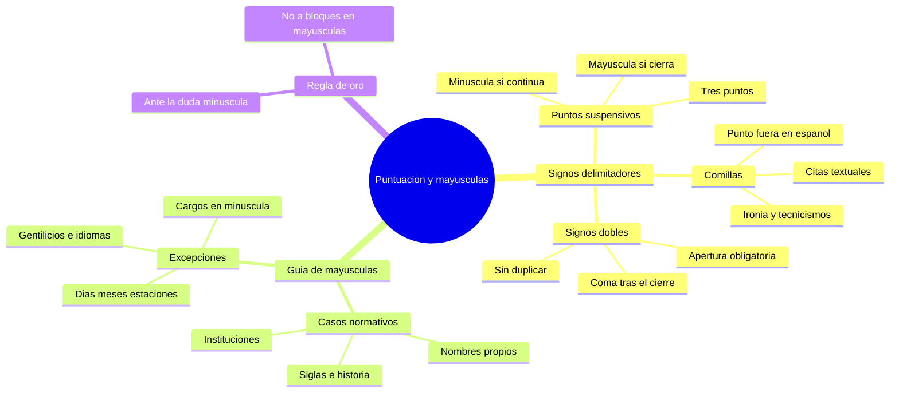

---
{"dg-publish":true,"permalink":"/universidad/preuniversitario/comunicacion-efectiva/unidad-3-tipologia-textual/04-signos-de-puntuacion-y-uso-de-mayusculas/","dg-note-properties":{}}
---

# ✍️ Signos de puntuación y uso de mayúsculas

## 🎯 Introducción

> [!info] 💡 La puntuación y las mayúsculas dan sentido al texto
>
> Los **signos de puntuación** y las **mayúsculas** no son adornos: son herramientas que organizan las ideas, marcan pausas, distinguen citas y opiniones, y evitan ambigüedades. Una misma frase cambia de significado según dónde pongas una coma, unas comillas o una mayúscula.
>
> En esta nota estudiarás tres signos delimitadores de uso frecuente en textos académicos —**puntos suspensivos, comillas y signos dobles de exclamación e interrogación**— y la **guía normativa de mayúsculas** según la RAE: cuándo son obligatorias y cuándo un uso indebido empobrece el estilo.
>
> Piensa en ellos como **señales de tránsito del texto**: sin señales, el lector no sabe dónde detenerse, qué es cita ajena o qué tono usar. Con señales claras, el texto fluye y el evaluador entiende tu idea al primer intento.
>
> Al final podrás autocorregir tus propios párrafos con una lista de control breve y cuatro ejercicios graduados.
>
> ```mermaid
> graph LR
>     A[Puntuacion y mayusculas] --> B[Organizan las ideas]
>     B --> C[Evitan ambiguedad]
>     C --> D[Texto claro y formal]
> ```

---

## ✂️ Signos delimitadores

> [!note] 🧩 Qué son los signos delimitadores
>
> |Concepto|Descripción|Ejemplo breve|
> |---|---|---|
> |**Signos delimitadores**|Signos que marcan límites, pausas especiales o actitudes del enunciado|..., " ", ¡ !, ¿ ?|
> |**Función común**|Indicar suspensión, cita, énfasis, pregunta o exclamación|Vino, vio, venció...|
> |**Riesgo si se omiten**|El texto se vuelve ambiguo, plano o informal|¿Vienes? / Vienes.|
> |**Criterio académico**|Usarlos solo cuando aportan sentido, sin abusar|Un par de exclamaciones basta|
> |**Ejemplo de ambigüedad**|Sin signos, no se distingue pregunta de afirmación|¡Vamos! / ¿Vamos? / Vamos...|
> |**Ejemplo de tono**|El mismo contenido cambia de actitud|Dijo «sí». / Dijo ¡sí! / Dijo... sí.|

> [!warning] ⛔ Errores que debes evitar desde el inicio
>
> |Error típico|Por qué es error|Forma correcta|
> |---|---|---|
> |**Escribir dos o cuatro puntos**|Los suspensivos son siempre tres|.. → ... / .... → ...|
> |**Omitir la apertura ¿ ¡**|En español la apertura es obligatoria|Qué hora es? → ¿Qué hora es?|
> |**Encerrar todo un párrafo entre comillas**|Las comillas solo marcan la cita exacta|Resumo "todo" → Resumo sin comillas|
> |**Mayúscula tras coma**|Tras coma siempre va minúscula|Hola, Mundo → Hola, mundo|
> |**Bloque en mayúsculas para destacar**|Cansa y equivale a gritar|ENTREGAR → **Entregar**|

---

### 1. Puntos suspensivos (...)

> [!note] 📝 Puntos suspensivos — suspensión y continuidad
>
> Siempre son **tres puntos (...)**, ni dos ni cuatro. Indican que el enunciado queda en suspenso, continúa o se interrumpe.
>
> |Uso|Explicación|Ejemplo|
> |---|---|---|
> |**Suspenso o duda**|Se deja la idea incompleta, con emoción contenida|No sé si aceptar... lo pensaré.|
> |**Enumeración abierta**|La lista continúa más allá de lo escrito|Llevó cuadernos, lápices, reglas...|
> |**Interrupción**|Otro hablante o un hecho corta el discurso|—Iba a decirte que yo—... ¡Silencio!|
> |**Omisión en cita**|Entre corchetes, indica texto suprimido|«La educación [...] es un derecho»|
> |**Final en suspenso**|El lector completa el sentido|Si lo hubieras visto...|
>
> > 📌 No se mezclan con la abreviatura «etc.»: se escribe *etc.* **o** *...*, nunca *etc....*

> [!warning] 🔠 Mayúscula o minúscula después de puntos suspensivos
>
> |Caso|Regla|Ejemplo|
> |---|---|---|
> |**Cierran el enunciado**|Si equivalen a punto final, sigue **mayúscula**|Salió sin despedirse... Nadie volvió a verlo.|
> |**Continúa el enunciado**|Si la frase sigue, va **minúscula** y sin punto extra|Salió sin despedirse... llorando en silencio.|
> |**Tras signo ¿? ¡!**|Si cierran, sigue mayúscula|¿Volverás...? Mañana te espero.|
> |**Dentro de enumeración**|Si la frase continúa, minúscula|Compró pan, queso, frutas... y se fue.|
> |**Antes de coma o punto y coma**|Se mantienen, sin punto adicional|Vamos, dime... , aunque duela. / Mejor: Vamos, dime..., aunque duela.|
>
> > 📌 Truco: pregúntate «¿aquí pondría un punto?». Si la respuesta es sí, escribe **mayúscula**; si pondrías una coma, escribe **minúscula**.

---

### 2. Comillas (" " " " ' ')

> [!note] 💬 Comillas — citas, distancia e ironía
>
> En español se prefieren las **comillas angulares o latinas (« »)** para citas principales, las **inglesas (" ")** para segundo nivel y las **simples (' ')** para tercer nivel. En textos escolares es aceptable usar solo las inglesas, pero con coherencia.
>
> |Uso|Explicación|Ejemplo|
> |---|---|---|
> |**Cita textual**|Reproduce palabras exactas de otro autor|El docente dijo: «Revisen la ortografía antes de entregar».|
> |**Término especial o técnico**|Marca un tecnicismo o neologismo|El «phishing» es un fraude digital.|
> |**Ironía o distanciamiento**|Indica que no se asume el término literalmente|Su «puntualidad» nos hizo esperar una hora.|
> |**Títulos de partes**|Artículos, capítulos, poemas van entre comillas|Leí «La casa tomada» en clase.|
> |**Significado o traducción**|Define un término|*Habeas corpus* significa 'traer el cuerpo'.|
>
> > 📌 Las obras completas (libros, películas) van en *cursiva*, no entre comillas: *Cien años de soledad*.

> [!note] 📌 Posición de las comillas frente al punto
>
> |Caso|Regla en español|Ejemplo|
> |---|---|---|
> |**Cita breve dentro de la frase**|El punto va **fuera** de las comillas|Dijo que era «urgente».|
> |**Cita completa e independiente**|El punto puede ir dentro si la cita es oración completa|«Revisen la ortografía antes de entregar.»|
> |**Cita + atribución**|La coma va fuera, el punto cierra toda la frase|«Estudien hoy», pidió la profesora.|
> |**Cierre + dos puntos previos**|Los dos puntos anuncian, las comillas abren|Anunció lo siguiente: «Inicio de la prueba».|
> |**Error frecuente**|No encerrar el punto final dentro si no es cita completa|❌ Dijo «hola.» / ✅ Dijo «hola».|
>
> > 📌 Diferencia con el inglés: en inglés americano el punto suele ir dentro ("hello."); en español va **fuera** salvo cita completa e independiente.

---

### 3. Signos dobles obligatorios (¡! ¿?)

> [!note] ❗❓ Apertura y cierre obligatorios en español
>
> El español exige **signo de apertura (¡ ¿) y de cierre (! ?)**. Es la gran diferencia con el inglés, que solo usa el de cierre. Omitir la apertura es falta de ortografía.
>
> |Regla|Explicación|Ejemplo|
> |---|---|---|
> |**Apertura obligatoria**|Todo enunciado exclamativo o interrogativo abre y cierra|¡Qué alegría verte! / ¿A qué hora llegas?|
> |**No duplicar**|No se escriben dos aperturas ni dos cierres seguidos|❌ ¡¡Hola!! / ✅ ¡Hola!|
> |**Énfasis con repetición**|Para énfasis real se admite máximo triple en textos expresivos|¡¡¡Increíble!!! (solo en contextos informales)|
> |**Combinados**|Interrogación + exclamación: se abren y cierran ambos|¿¡Cómo dices!? / ¡¿De verdad?!|
> |**Oraciones largas**|El signo abre donde empieza la pregunta, no al inicio del párrafo|Si vienes mañana, ¿traerás el libro?|
>
> > 📌 En textos formales, evita abusar: una exclamación bien puesta vale más que cinco seguidas.

> [!note] 🔗 Coma y mayúscula tras el cierre
>
> |Caso|Regla|Ejemplo|
> |---|---|---|
> |**Sigue minúscula**|Si tras el cierre continúa la misma frase, va **coma + minúscula**|¡Ven aquí!, por favor.|
> |**Sigue mayúscula**|Si el cierre equivale a punto, sigue **mayúscula**|¿Vienes mañana? Te espero temprano.|
> |**Cierre + coma**|La coma va **después** del signo, nunca antes|✅ ¡Bravo!, gritó el público. / ❌ ¡Bravo,! gritó.|
> |**Pregunta en serie**|Solo la primera lleva mayúscula si son una sola frase|¿Vienes?, ¿te quedas?, ¿te vas?|
> |**Pregunta independiente**|Cada pregunta cerrada con punto equivale: mayúscula|¿Vienes? ¿Te quedas? ¿Te vas?|
>
> > 📌 Pregunta de control: si puedes reemplazar «?/!» por un punto sin romper la frase, lo que sigue va en **mayúscula**.

---

## 🔠 Guía de mayúsculas

> [!note] 📏 Cuándo la mayúscula es normativa — casos obligatorios
>
> |Caso|Regla|Ejemplo|
> |---|---|---|
> |**Nombres propios**|Personas, lugares, ríos, montañas|María Torres, río Marañón, Lima|
> |**Apellidos y apodos**|Con mayúscula inicial|Vargas Llosa, el Libertador|
> |**Instituciones y organismos**|Nombres oficiales completos|Ministerio de Educación, Universidad Nacional|
> |**Apertura tras punto**|Inicio de enunciado y después de punto|Estudió. Aprobó con honores.|
> |**Después de dos puntos**|Solo si sigue cita textual o encabezado formal|Dijo: «Vengan». / Asunto: Solicitud|
> |**Siglas y acrónimos**|En mayúsculas sostenidas|RAE, ONU, DNI|
> |**Acontecimientos históricos**|Hechos singulares relevantes|Primera Guerra Mundial, Independencia del Perú|
> |**Títulos de obras**|Solo la primera palabra en mayúscula (salvo nombres propios)|*El principito*, *Historia del Perú*|
> |**Nombres de festividades**|Celebraciones oficiales y religiosas|Año Nuevo, Semana Santa, Fiestas Patrias|
> |**Topónimos con artículo**|El artículo se une al nombre propio|El Cairo, La Paz, El Salvador|

> [!note] 🧭 Mayúscula diacrítica: el mismo término cambia de sentido
>
> |Minúscula (genérico)|Mayúscula (propio o institucional)|Ejemplo contrastado|
> |---|---|---|
> |**estado** (territorio)|**Estado** (institución)|el estado andino / el Estado peruano|
> |**iglesia** (templo)|**Iglesia** (institución)|una iglesia colonial / la Iglesia católica|
> |**gobierno** (genérico)|**Gobierno** (órgano concreto)|un gobierno regional / el Gobierno Central|
> |**presidente** (cargo)|**Presidencia** (institución)|el presidente / la Presidencia del Consejo|
> |**tierra** (suelo)|**Tierra** (planeta)|pisó la tierra / la Tierra gira|
>
>
> > 📌 Los artículos dentro del nombre forman parte de él cuando van en mayúscula: *El Comercio*, *La República*.

> [!success] ⚠️ Excepciones frecuentes — donde NO va mayúscula
>
> |Caso|Error frecuente|Forma correcta|
> |---|---|---|
> |**Cargos públicos**|❌ El Presidente, La Ministra|✅ el presidente, la ministra|
> |**Títulos académicos y profesiones**|❌ El Ingeniero, El Doctor Pérez (en texto)|✅ el ingeniero, el doctor Pérez|
> |**Abreviaturas de tratamiento**|Excepción: abreviatura sí lleva mayúscula|Sr., Dra., Ing. (con punto)|
> |**Días, meses y estaciones**|❌ Lunes, Marzo, Primavera|✅ lunes, marzo, primavera|
> |**Gentilicios**|❌ Peruano, Limeño|✅ peruano, limeño|
> |**Idiomas**|❌ Español, Inglés|✅ español, inglés|
> |**Puntos cardinales genéricos**|❌ El Norte del país (genérico)|✅ el norte del país|
> |**Punto cardinal propio**|Sí en nombre oficial|América del Norte, Corea del Sur|
>
> > 📌 Solo se escribe con mayúscula el cargo cuando forma parte de un nombre protocolario o encabezado oficial: *Excmo. Sr. Presidente de la República*.

---

## 💎 Regla de oro de estilo

> [!tip] 👑 Ante la duda, prefiere la minúscula
>
> La RAE recomienda un criterio de **sobriedad**: escribe con mayúscula solo lo que la norma exige. El exceso de mayúsculas no da más importancia al texto; lo hace más difícil de leer y más propenso a errores.
>
> |Principio|Explicación|Ejemplo|
> |---|---|---|
> |**Minúscula por defecto**|Si dudas entre mayúscula y minúscula, elige **minúscula**|el estado, la iglesia (genérico)|
> |**Mayúscula con motivo**|Reserva la mayúscula para nombres propios y aperturas|el Estado peruano, la Iglesia católica (institución)|
> |**No a bloques en mayúsculas**|Un párrafo entero en MAYÚSCULAS equivale a **gritar** y cansa la vista|❌ ENTREGAR EL LUNES SIN FALTA|
> |**Alternativa formal**|Para destacar usa **negrita** o encabezados, no mayúsculas sostenidas|✅ **Entregar el lunes sin falta**|
> |**Textos digitales**|En correos y foros, todo en mayúsculas se interpreta como enfado|✅ Buenos días, adjunto mi tarea.|
>
> > 📌 Excepción técnica: formularios que piden «APELLIDOS EN MAYÚSCULAS» o siglas. Fuera de eso, evita el bloquemayúsculas.
>
> |Lista de control antes de entregar|Sí / No|
> |---|---|
> |**¿Solo usé mayúscula donde la norma lo exige?**|☐|
> |**¿Ningún párrafo está todo en mayúsculas?**|☐|
> |**¿Los ¡! y ¿? tienen apertura y cierre?**|☐|
> |**¿El punto va fuera de las comillas breves?**|☐|
> |**¿Tras puntos suspensivos decidí mayúscula o minúscula con criterio?**|☐|

---

## 🧪 Registro de práctica

> [!example]- ✏️ Ejercicio 05.1 — Puntos suspensivos: ¿mayúscula o minúscula después?
>
> **Instrucción:** Completa con mayúscula o minúscula según corresponda. Justifica si los puntos cierran o continúan el enunciado.
>
> |N.º|Caso|Respuesta y justificación|
> |---|---|---|
> |**1**|Salió corriendo... ___adie supo a dónde fue.|**Nadie** — con mayúscula. Los puntos equivalen a punto final; cierran el enunciado.|
> |**2**|Salió corriendo... ___lorando por el pasillo.|**llorando** — con minúscula. La frase continúa; los puntos valen como coma.|
> |**3**|Compró lápices, cuadernos, colores... ___ se fue a casa.|**y** — con minúscula. Enumeración abierta dentro de la misma oración.|
> |**4**|No sé qué decirte... ___e temo lo peor.|**Me** — con mayúscula. Hay pausa plena y nuevo enunciado tras el suspenso.|
> |**5**|¿Volverás mañana... ___ me llamarás antes?|¿...? **o** — con minúscula si la pregunta continúa. Aquí: *¿Volverás mañana... o me llamarás antes?*|
> |**6**|Pensé en llamarte, en escribirte... ___n fin, decidí esperar.|**En** — con mayúscula. Los puntos cierran la enumeración como punto y sigue nuevo enunciado.|
>
> > 📌 Autoevalúate: si acertaste 5–6, dominas la regla de oro «¿pondría aquí un punto o una coma?».

> [!example]- ✏️ Ejercicio 05.2 — Comillas: citas textuales e ironía
>
> **Instrucción:** Corrige el uso de comillas y la posición del punto. Marca si es cita, ironía o término especial.
>
> |N.º|Caso propuesto|Corrección y tipo|
> |---|---|---|
> |**1**|El profesor dijo que era urgente.|**El profesor dijo que era «urgente».** — término destacado; el punto va fuera.|
> |**2**|Dijo hola. (cita breve)|**Dijo «hola».** — cita breve; punto fuera de las comillas en español.|
> |**3**|Su responsabilidad nos salvó a todos. (tono irónico)|**Su «responsabilidad» nos salvó a todos.** — ironía o distanciamiento.|
> |**4**|Leí La ciudad y los perros ayer.|**Leí *La ciudad y los perros* ayer.** — obra completa va en cursiva, no entre comillas.|
> |**5**|El manual dice revise el capítulo tres.|**El manual dice: «Revise el capítulo tres».** — cita textual con dos puntos anunciadores.|
> |**6**|El hacker usó phishing para entrar.|**El *hacker* usó «phishing» para entrar.** — extranjerismo en cursiva y tecnicismo entre comillas.|
>
> > 📌 Recuerda: en español el punto va **fuera** salvo cita completa e independiente.

> [!example]- ✏️ Ejercicio 05.3 — Signos dobles: corrige la omisión de apertura
>
> **Instrucción:** Reescribe con apertura y cierre obligatorios. Corrige duplicaciones y comas mal ubicadas.
>
> |N.º|Caso con error|Corrección|
> |---|---|---|
> |**1**|Qué sorpresa verte!|**¡Qué sorpresa verte!** — faltaba la apertura.|
> |**2**|Vienes mañana?|**¿Vienes mañana?** — faltaba la apertura.|
> |**3**|¡¡Hola!! ¿¿Cómo estás??|**¡Hola! ¿Cómo estás?** — no se duplican los signos en texto formal.|
> |**4**|¡Bravo,! gritó el público.|**¡Bravo!, gritó el público.** — la coma va después del cierre.|
> |**5**|¡Ven aquí! por favor.|**¡Ven aquí!, por favor.** — si la frase continúa, coma + minúscula tras el cierre.|
> |**6**|Si apruebas, pasarás de ciclo?|**Si apruebas, ¿pasarás de ciclo?** — el signo abre donde empieza la pregunta.|
>
> > 📌 Diferencia clave con el inglés: en español la apertura es **obligatoria**, no opcional.

> [!example]- ✏️ Ejercicio 05.4 — Mayúsculas: corrige los textos
>
> **Instrucción:** Corrige las mayúsculas indebidas y añade las que falten según la norma.
>
> |N.º|Texto con error|Texto corregido y regla|
> |---|---|---|
> |**1**|El Presidente visitó Lima el Lunes.|**El presidente visitó Lima el lunes.** — cargos y días van en minúscula.|
> |**2**|La Doctora Ramos es Ingeniera Civil.|**La doctora Ramos es ingeniera civil.** — títulos y profesiones en minúscula.|
> |**3**|viajó al norte en primavera.|**Viajó al norte en primavera.** — apertura en mayúscula; punto cardinal genérico y estación en minúscula.|
> |**4**|Mi primo es Peruano y habla Español.|**Mi primo es peruano y habla español.** — gentilicios e idiomas en minúscula.|
> |**5**|leyó el principito y la biblia.|**Leyó *El principito* y la *Biblia*.** — apertura en mayúscula; título con mayúscula inicial.|
> |**6**|ENTREGAR EL INFORME EL VIERNES SIN FALTA.|**Entregar el informe el viernes sin falta.** — evita bloques en mayúsculas; usa negrita para destacar.|
>
> > 📌 Regla de oro: ante la duda, prefiere la **minúscula**.

---

## 📌 Resumen ejecutivo

> [!summary] 📌 Lo esencial de esta nota
>
> |Idea clave|Contenido mínimo que debes recordar|
> |---|---|
> |**Puntos suspensivos**|Son tres (...). Si cierran el enunciado, sigue **mayúscula**; si continúa, sigue **minúscula**.|
> |**Comillas**|Marcan **citas, ironía y tecnicismos**. En español el punto va **fuera** salvo cita completa.|
> |**Signos dobles**|En español **¡! y ¿?** son obligatorios con apertura y cierre. No se duplican y la coma va **después** del cierre.|
> |**Mayúsculas normativas**|Nombres propios, instituciones, aperturas tras punto, siglas y acontecimientos históricos.|
> |**Minúsculas obligadas**|Cargos (el presidente), profesiones (el ingeniero), días, meses, estaciones, gentilicios e idiomas.|
> |**Regla de oro**|Ante la duda, **minúscula**. Nunca escribas párrafos enteros en mayúsculas: equivale a gritar.|
> |**Lista de control**|Relee solo los signos: ¿cada uno aporta sentido o sobra? Si sobra, bórralo.|
>
> |Antes (ruidoso)|Después (formal)|
> |---|---|
> |El PRESIDENTE dijo "VEN MAÑANA"...!!!|El presidente dijo: «Ven mañana».|
> |¿¡¡QUE APROBE!!?|¡Que aprobé! ¿Lo viste?|
>
> > 📌 Si solo recuerdas una frase: *la puntuación y la mayúscula no adornan, **significan***.

---

## ✅ Metas de Aprendizaje

> [!note] 🎯 Nivel Básico
>
> - [ ] Explico con mis palabras qué indican los puntos suspensivos, las comillas y los signos ¡! ¿?.
> - [ ] Escribo correctamente ¡! y ¿? con apertura y cierre obligatorios.
> - [ ] Distingo cinco casos donde la mayúscula es obligatoria (nombre propio, institución, apertura, sigla, hecho histórico).

> [!note] 🎯 Nivel Intermedio
>
> - [ ] Decido si va mayúscula o minúscula después de puntos suspensivos según cierren o continúen el enunciado.
> - [ ] Coloco el punto fuera de las comillas en citas breves y corrijo la ironía con comillas.
> - [ ] Corrijo textos con cargos, profesiones, días, meses y gentilicios mal escritos en mayúscula.

> [!note] 🎯 Nivel Avanzado
>
> - [ ] Justifico cada signo en un párrafo académico sin abusar de exclamaciones ni comillas.
> - [ ] Reescribo un texto completo en bloquemayúsculas a un estilo formal con negritas y mayúsculas normativas.
> - [ ] Explico la diferencia entre el uso español y el inglés en comillas y signos dobles.

---

## 📊 Resumen Visual



---

> [!quote] 📖 Fuentes consultadas
>
> [1] Real Academia Española y Asociación de Academias de la Lengua Española, *Ortografía de la lengua española*, Madrid, España: Espasa, 2010.
>
> [2] Real Academia Española, *Diccionario panhispánico de dudas (DPD)*, 2.ª ed., Madrid, España: Santillana, 2023. Disponible en: https://www.rae.es/dpd/
>
> [3] Real Academia Española, *Libro de estilo de la lengua española*, Madrid, España: Espasa, 2018.
>
> [4] A. Gómez Torrego, *Gramática didáctica del español*, 11.ª ed., Madrid, España: SM, 2011.

> [!quote] 🔗 Conexiones
>
> - [[Universidad/Preuniversitario/Comunicación Efectiva/Unidad 3 - Tipología textual/03 - Uso correcto del verbo haber\|03 - Uso correcto del verbo haber]] — la corrección ortográfica continúa: puntuación clara + verbo *haber* bien usado evitan los errores más frecuentes en textos académicos.
> - [[Universidad/Preuniversitario/Comunicación Efectiva/Unidad 3 - Tipología textual/00 - Índice Unidad 3\|00 - Índice Unidad 3]] — vuelve al índice para ubicar esta nota dentro de la tipología textual y pasar al siguiente tema de la unidad.
> - Siguiente paso sugerido: revisar un texto propio y corregir puntos suspensivos, comillas, ¿? ¡! y mayúsculas con la lista de control del resumen ejecutivo.

---

**Tags:** #ortografia #puntuacion #mayusculas #comunicacionEfectiva #preuniversitario #unidad3
