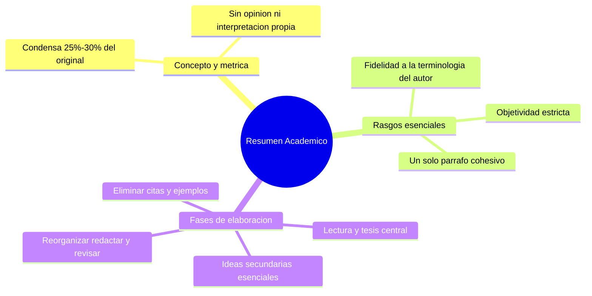

---
{"dg-publish":true,"permalink":"/universidad/preuniversitario/comunicacion-efectiva/unidad-4-resumen-y-sintesis/01-el-resumen-academico/","dg-note-properties":{}}
---


# 📝 El Resumen Académico

---

## 🎯 Introducción

> [!info] 💡 Concepto y métrica
>
> El **resumen académico** es un texto expositivo breve que **condensa entre el 25% y el 30% del contenido original**, conservando las ideas esenciales del texto fuente sin agregar interpretación ni opinión propia. No es una selección arbitraria de frases: es una reconstrucción fiel, en menor extensión, de lo que el autor original dijo.
>
> ```mermaid
> graph LR
>     A["Texto original (100%)"] --> B["Resumen (25%-30%)"]
> ```
>
> Un texto que reduce más allá de ese rango corre el riesgo de perder ideas esenciales; uno que se queda muy por encima deja de ser un resumen y se acerca a una simple copia parcial.

---

> [!note] 📋 Rasgos esenciales
>
> Un resumen académico bien construido cumple simultáneamente con:
>
> - **Objetividad estricta:** refleja lo que dice el autor, no lo que el lector piensa sobre ello.
> - **Ausencia de opiniones personales:** no se valoran ni califican las ideas del texto original (nada de "esto es correcto" o "esto es cuestionable").
> - **Fidelidad a la terminología del autor:** los términos técnicos o conceptos clave del texto original se conservan tal cual, sin sustituirlos por sinónimos que puedan alterar el significado preciso.
> - **Redacción formal cohesiva en un solo párrafo:** el resumen académico se presenta como un único párrafo fluido, no como una lista de puntos ni varios párrafos separados.

> [!warning] ⚠️ Diferencia clave con el parafraseo
>
> El resumen **reduce** el contenido (mantiene la terminología del autor); el parafraseo **reformula** el contenido con palabras y sintaxis propias, sin necesariamente reducir su extensión. Ver [[Universidad/Preuniversitario/Comunicación Efectiva/Unidad 4 - Resumen y síntesis/02 - Técnicas de parafraseo y citación\|02 - Técnicas de parafraseo y citación]] para el contraste completo.

---

> [!note] 📋 Flujo metodológico — Las 7 fases de elaboración
>
> ```mermaid
> graph TD
>     A["1. Lectura comprensiva del texto completo"] --> B["2. Identificar tesis/idea central"]
>     B --> C["3. Localizar ideas secundarias esenciales por párrafo"]
>     C --> D["4. Eliminar ejemplos, citas y detalles accesorios"]
>     D --> E["5. Reorganizar las ideas en un orden lógico propio"]
>     E --> F["6. Redactar en un solo párrafo cohesivo"]
>     F --> G["7. Revisión final (métrica 25%-30%, fidelidad, objetividad)"]
> ```

> [!success]- ✅ Detalle de cada fase
>
> | Fase | Qué implica |
> |---|---|
> | **1. Lectura comprensiva** | Leer el texto completo antes de escribir nada, entendiendo su lógica interna |
> | **2. Identificar tesis/idea central** | Determinar qué es lo esencial que el autor quiere transmitir |
> | **3. Localizar ideas secundarias esenciales** | Distinguir qué ideas de apoyo son indispensables para entender la idea central (ver también [[Universidad/Preuniversitario/Comunicación Efectiva/Unidad 5 - Textos expositivos/02 - Análisis del texto expositivo\|02 - Análisis del texto expositivo]] de la Unidad 5 para esta técnica) |
> | **4. Eliminar citas y ejemplos** | Los ejemplos ilustran pero no son indispensables en un resumen; las citas textuales tampoco se conservan |
> | **5. Reorganizar en orden lógico propio** | El resumen no tiene que seguir el orden exacto del original, mientras respete la lógica del contenido |
> | **6. Redactar en un solo párrafo** | Se integra todo en un párrafo cohesivo, con conectores que enlacen las ideas (ver [[Universidad/Preuniversitario/Comunicación Efectiva/Unidad 5 - Textos expositivos/03 - Conectores textuales y coherencia lógica\|03 - Conectores textuales y coherencia lógica]] de la Unidad 5) |
> | **7. Revisión final** | Verificar la métrica de reducción, que no haya opiniones propias, y que se conserve la terminología clave del autor |

---

> [!example]- Ejercicio 02.1 — La métrica de condensación 25%-30%
>
> **Instrucciones:** calcula el rango de palabras que debería tener el resumen para cada texto original. Muestra la operación.
>
> 1. Texto original de 200 palabras.
> 2. Texto original de 400 palabras.
> 3. Texto original de 600 palabras.
> 4. Texto original de 850 palabras.
> 5. Un resumen de 90 palabras para un original de 200 palabras, ¿cumple la métrica? Justifica.
>
> **Soluciones:**
>
> 1. 50 a 60 palabras (200 x 0,25 = 50; 200 x 0,30 = 60).
> 2. 100 a 120 palabras.
> 3. 150 a 180 palabras.
> 4. 212 a 255 palabras (850 x 0,25 = 212,5; 850 x 0,30 = 255).
> 5. No cumple: 90 palabras es el 45% de 200, está por encima del rango; deja de ser resumen y se acerca a una copia parcial.

> [!example]- Ejercicio 02.2 — Objetividad: detectar errores de opinión
>
> **Instrucciones:** indica si cada fragmento de resumen es objetivo o contiene opinión personal. Si hay opinión, subraya la expresión problemática y reescríbela objetivamente.
>
> 1. *El autor plantea que la migración afecta al mercado laboral.*
> 2. *El autor demuestra brillantemente que la lectura mejora el vocabulario.*
> 3. *Según el texto, el reciclaje reduce los residuos urbanos, lo cual es obviamente correcto.*
> 4. *La autora sostiene que el teletrabajo aumenta la autonomía, aunque esta idea es cuestionable.*
> 5. *El estudio concluye que el sueño influye en la memoria a largo plazo.*
>
> **Soluciones:**
>
> 1. Objetivo: reproduce la idea sin valorarla.
> 2. No objetivo: *"brillantemente"* es valoración; corrección: *El autor plantea que la lectura mejora el vocabulario.*
> 3. No objetivo: *"lo cual es obviamente correcto"* es juicio propio; corrección: eliminar la subordinada valorativa.
> 4. No objetivo: *"aunque esta idea es cuestionable"* añade objeción propia; corrección: *La autora sostiene que el teletrabajo aumenta la autonomía.*
> 5. Objetivo: verbo neutro (*concluye*) sin adjetivos valorativos.

> [!example]- Ejercicio 02.3 — Qué eliminar en la fase 4
>
> **Instrucciones:** para cada elemento indica si debe conservarse (C) o eliminarse (E) en un resumen académico según la fase 4, y justifica en una línea.
>
> 1. La tesis central del autor.
> 2. La anécdota con la que el autor abre la introducción.
> 3. Una cita textual larga de otro investigador que el autor comenta.
> 4. Una idea secundaria esencial sin la cual no se entiende la tesis.
> 5. La tabla con los 20 datos del anexo metodológico.
> 6. El ejemplo ilustrativo del tercer párrafo.
>
> **Soluciones:**
>
> 1. C: es el núcleo que el resumen debe conservar.
> 2. E: es un recurso retórico accesorio, no una idea esencial.
> 3. E: las citas textuales no se conservan en el resumen; solo la idea que el autor extrae de ellas.
> 4. C: las ideas secundarias esenciales sostienen la tesis.
> 5. E: los detalles y datos accesorios se descartan; solo se conserva la conclusión que se deriva de ellos.
> 6. E: los ejemplos ilustran pero no son indispensables.

> [!example]- Ejercicio 02.4 — Fidelidad a la terminología del autor
>
> **Instrucciones:** cada par muestra un término original y su sustitución en un resumen. Indica si la sustitución es aceptable o altera el significado preciso.
>
> 1. Original *fotosíntesis* → resumen *forma en que las plantas hacen su comida*.
> 2. Original *memoria a largo plazo* → resumen *memoria a largo plazo*.
> 3. Original *inflación* → resumen *aumento generalizado y sostenido de los precios*.
> 4. Original *biodiversidad* → resumen *naturaleza en general*.
> 5. Original *aprendizaje significativo (Ausubel)* → resumen *aprendizaje importante*.
>
> **Soluciones:**
>
> 1. No aceptable: diluye un término técnico preciso en una paráfrasis divulgativa.
> 2. Aceptable: conserva el término exacto del autor.
> 3. Aceptable solo si el texto original ya definía así el término; si no, mejor conservar *inflación* tal cual para no introducir matices.
> 4. No aceptable: *naturaleza en general* es mucho más vago que *biodiversidad* y cambia el alcance del concepto.
> 5. No aceptable: *significativo* en Ausubel tiene sentido técnico (anclaje en saberes previos), no equivale a *importante*.

> [!example]- Ejercicio 02.5 — Redacción en un solo párrafo cohesivo
>
> **Instrucciones:** evalúa cada propuesta de resumen según el rasgo formal (un solo párrafo cohesivo con conectores).
>
> 1. Un resumen presentado como lista de 5 viñetas.
> 2. Un resumen en tres párrafos separados sin conectores entre ellos.
> 3. Un resumen en un solo párrafo que usa *además, por tanto, sin embargo* para enlazar ideas.
> 4. Un resumen en un solo párrafo pero formado por frases copiadas y pegadas del original sin reorganizar.
> 5. Ordena estas ideas en un párrafo modelo: (a) tesis: el agua es recurso estratégico, (b) causa: crecimiento urbano, (c) consecuencia: conflictos por acceso.
>
> **Soluciones:**
>
> 1. Incorrecto: el resumen académico no es una lista de puntos.
> 2. Incorrecto: fragmenta el texto; debe integrarse en un único párrafo fluido.
> 3. Correcto: un solo párrafo con conectores que enlazan las ideas de forma cohesiva.
> 4. Incorrecto: aunque cumple la extensión, no reorganiza las ideas en un orden lógico propio (fase 5); es selección de fragmentos, no reconstrucción.
> 5. Modelo: *El texto plantea que el agua se ha convertido en un recurso estratégico debido al crecimiento urbano, lo que, por tanto, ha generado conflictos por su acceso.*

---

> [!question] 🟢 Ejercicios de refuerzo *(elaborados para practicar, no son del MOOC)* — Nivel Básico
>
> 1. Un texto original de 400 palabras, ¿en qué rango de palabras debería quedar su resumen?
> 2. Señala el error en este resumen: *"El autor plantea, muy acertadamente, que el cambio climático es la mayor amenaza del siglo."*
> 3. Indica qué elementos del texto original NO deben aparecer en un resumen (según la fase 4).

> [!example]- 🟢 Respuestas — Nivel Básico
>
> 1. Entre 100 y 120 palabras (25%-30% de 400).
> 2. *"Muy acertadamente"* es una opinión personal del que resume, que no debe aparecer — un resumen debe ser objetivo.
> 3. Citas textuales, ejemplos y detalles accesorios.

> [!question] 🟡 Ejercicios de refuerzo — Nivel Intermedio
>
> 1. Toma un artículo corto (300-500 palabras) y calcula el rango de palabras exacto que debería tener su resumen.
> 2. Redacta ese resumen en un solo párrafo, conservando la terminología clave del autor.
> 3. Revisa tu resumen: ¿eliminaste todos los ejemplos y citas? ¿hay alguna opinión propia que se haya colado?

> [!example]- 🟡 Respuestas — Nivel Intermedio
>
> Respuestas abiertas según el artículo elegido; verifica el cumplimiento estricto de la métrica y de los 4 rasgos esenciales.

> [!question] 🔴 Ejercicios de refuerzo — Nivel Avanzado
>
> 1. Compara dos resúmenes propios del mismo texto: uno de 25% y otro de 30% de extensión. ¿Qué información se pierde en el más corto?
> 2. Identifica en un resumen ajeno (de un compañero, o de internet) alguna violación a los rasgos esenciales (opinión colada, terminología alterada, etc.).
> 3. Explica por qué un resumen que solo copia y pega frases textuales del original, aunque esté "reducido", no cumple con la definición de resumen académico.

> [!example]- 🔴 Respuestas — Nivel Avanzado
>
> Respuestas abiertas. Para el punto 3: copiar y pegar frases textuales no es una reconstrucción propia del contenido, sino una selección de fragmentos — el resumen académico exige reformular la organización de las ideas (fase 5), no solo recortar.

---

## ✅ Metas de Aprendizaje

> [!note] 🎯 Nivel Básico
>
> - [ ] Calculo el rango de palabras esperado (25%-30%) para un resumen dado
> - [ ] Identifico opiniones personales que no deberían estar en un resumen
> - [ ] Reconozco qué elementos se eliminan en la fase 4 (citas, ejemplos)

> [!note] 🎯 Nivel Intermedio
>
> - [ ] Aplico las 7 fases completas para producir un resumen de un texto real
> - [ ] Conservo la terminología clave del autor sin alterar su significado
> - [ ] Redacto el resumen como un único párrafo cohesivo

> [!note] 🎯 Nivel Avanzado
>
> - [ ] Evalúo si un resumen ajeno cumple con los 4 rasgos esenciales
> - [ ] Distingo un resumen real de una simple selección de frases copiadas
> - [ ] Ajusto la extensión de un resumen dentro del rango exacto sin perder ideas esenciales

---

## 📊 Resumen Visual



> [!summary] 📋 Resumen ejecutivo
>
> - El resumen académico condensa entre el 25% y el 30% del texto original, sin agregar opinión ni interpretación propia.
> - Conserva la terminología clave del autor y se redacta como un único párrafo formal y cohesivo.
> - Su elaboración sigue 7 fases: lectura comprensiva, tesis central, ideas secundarias, eliminación de accesorios, reorganización, redacción y revisión final.
> - Se diferencia del parafraseo (que reformula sin necesariamente reducir) y de la simple copia de frases (que no reconstruye las ideas).
> - Las fases de localización de ideas y redacción cohesiva conectan con el análisis expositivo y los conectores de la Unidad 5.

---

> [!quote] 📖 Fuentes consultadas
>
> [1] MOOC *Comunicación Efectiva*, Unidad 4 — Resumen y síntesis, Nota 01: "El resumen académico".

> [!quote] 🔗 Conexiones
>
> - [[Universidad/Preuniversitario/Comunicación Efectiva/Unidad 4 - Resumen y síntesis/00 - Índice Unidad 4\|00 - Índice Unidad 4]] — mapa general de la unidad.
> - [[Universidad/Preuniversitario/Comunicación Efectiva/Unidad 4 - Resumen y síntesis/02 - Técnicas de parafraseo y citación\|02 - Técnicas de parafraseo y citación]] — contrasta el resumen (reducción) con el parafraseo (reformulación).
> - [[Universidad/Preuniversitario/Comunicación Efectiva/Unidad 4 - Resumen y síntesis/03 - La síntesis de múltiples fuentes\|03 - La síntesis de múltiples fuentes]] — extiende esta metodología a la integración de varias fuentes.
> - [!info] Conexión cruzada con la Unidad 5: la fase 3 (localizar ideas secundarias esenciales) reutiliza la técnica de disección de párrafos de [[Universidad/Preuniversitario/Comunicación Efectiva/Unidad 5 - Textos expositivos/02 - Análisis del texto expositivo\|02 - Análisis del texto expositivo]].

---

**Tags:** #comunicacion-efectiva #MOOC #resumen-y-sintesis #unidad4 #resumen-academico
