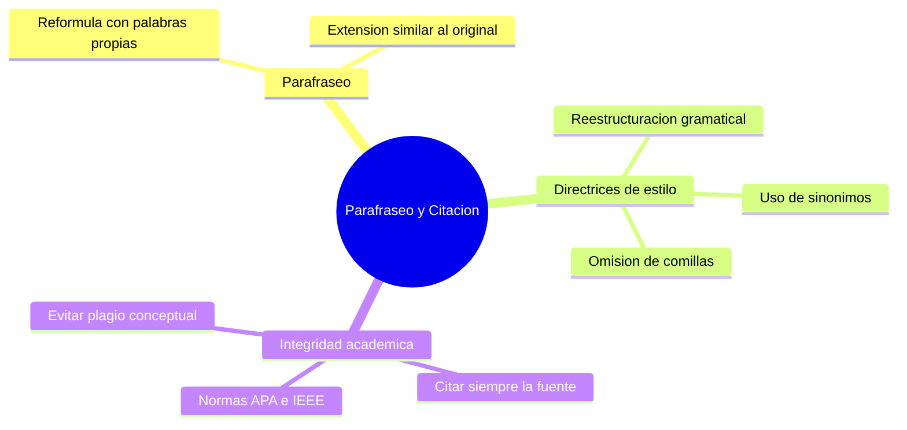

---
{"dg-publish":true,"permalink":"/universidad/preuniversitario/comunicacion-efectiva/unidad-4-resumen-y-sintesis/02-tecnicas-de-parafraseo-y-citacion/","dg-note-properties":{}}
---


# 🔄 Técnicas de Parafraseo y Citación

---

## 🎯 Introducción

> [!info] 💡 Definición y contraste con el resumen
>
> El **parafraseo** es el mecanismo de **reformular una idea con palabras y sintaxis propias**, sin necesariamente reducir su extensión. A diferencia del resumen —que condensa y conserva la terminología del autor (ver [[Universidad/Preuniversitario/Comunicación Efectiva/Unidad 4 - Resumen y síntesis/01 - El resumen académico\|01 - El resumen académico]])—, el parafraseo puede mantener una extensión similar a la del original, pero cambia por completo la forma de expresarlo.
>
> ```mermaid
> graph TD
>     A[Texto original] --> B[Resumen]
>     A --> C[Parafraseo]
>     B --> D["Reduce extensión (25%-30%)"]
>     B --> E["Conserva terminología del autor"]
>     C --> F["Extensión similar al original"]
>     C --> G["Cambia palabras y sintaxis propias"]
> ```

---

> [!note] 📋 Directrices de estilo
>
> Para que un parafraseo sea legítimo (y no una simple sustitución superficial de palabras), debe cumplir con:
>
> - **Uso de sinónimos:** reemplazar términos no técnicos por equivalentes que mantengan el significado.
> - **Reestructuración gramatical:** cambiar el orden de la oración, la voz (activa/pasiva) o la subordinación — no basta con cambiar palabras sueltas y dejar la misma estructura de la oración original.
> - **Omisión de comillas:** al no ser una transcripción literal, el parafraseo **no lleva comillas**; si se usaran comillas, se estaría afirmando (incorrectamente) que esas son las palabras exactas del autor.

> [!warning] ⚠️ Parafraseo superficial (no válido)
>
> | ❌ Parafraseo superficial | ✅ Parafraseo legítimo |
> |---|---|
> | Original: *"El cambio climático amenaza la biodiversidad global."* → *"El cambio climático pone en peligro la biodiversidad mundial."* (solo cambió 2 palabras, misma estructura) | *"La pérdida de biodiversidad a nivel mundial es una de las consecuencias más graves del cambio climático."* (reestructura la oración y cambia el enfoque sintáctico) |

---

> [!note] 📋 Integridad académica

> [!warning] ⚠️ Citación obligatoria — prevención del plagio conceptual
>
> Parafrasear una idea **no exime de citar la fuente**. Aunque las palabras sean propias, la idea sigue perteneciendo al autor original — no citarla constituye **plagio conceptual**, incluso si no hay una sola palabra copiada literalmente.
>
> - Se debe citar siguiendo las normas correspondientes (**APA, IEEE**, u otra que exija el contexto académico).
> - La cita debe acompañar al parafraseo inmediatamente (autor, año, y página si aplica), no solo aparecer al final del documento.

---

> [!info] 💡 Apuntes del video 03.1 — Técnicas de parafraseo
>
> - **Doble cambio obligatorio:** un parafraseo válido cambia vocabulario (sinónimos en términos no técnicos) y estructura gramatical (orden, voz activa/pasiva, subordinación); cambiar solo palabras sueltas es parafraseo superficial.
> - **Conservar el sentido exacto:** la reformulación no puede añadir, recortar ni matizar la idea original; si el sentido cambia, ya no es parafraseo sino distorsión.
> - **Sin comillas y siempre con cita:** al no ser transcripción literal no lleva comillas, pero la idea sigue siendo del autor original, por lo que debe citarse en la norma exigida (APA, IEEE).
> - **Del parafraseo a la síntesis:** dominar esta técnica es el paso previo para integrar varias fuentes, pues cada fuente sintetizada debe entrar parafraseada y citada.

> [!example]- Ejercicio 03.1 — Parafrasear sin cambiar el significado
>
> **Instrucciones:** clasifica cada reformulación como parafraseo legítimo (L), superficial (S) o distorsión del sentido (D). Justifica en una línea.
>
> 1. Original: *El ejercicio regular fortalece el sistema inmunológico.* → *El sistema inmunológico se ve fortalecido por la práctica constante de actividad física.*
> 2. Original: *El ejercicio regular fortalece el sistema inmunológico.* → *El ejercicio regular fortalece el sistema inmune.*
> 3. Original: *El ejercicio regular fortalece el sistema inmunológico.* → *El ejercicio regular cura todas las enfermedades.*
> 4. Original: *La deserción escolar aumenta en zonas rurales por falta de transporte.* → *La carencia de transporte en áreas rurales es uno de los factores que eleva el abandono escolar.*
> 5. Original: *Los bosques absorben dióxido de carbono.* → *Los bosques, que son muy bonitos, absorben dióxido de carbono y por eso hay que cuidarlos.*
>
> **Soluciones:**
>
> 1. L: cambia vocabulario (*regular → constante*, *fortalece → se ve fortalecido*) y estructura (voz pasiva, orden invertido) manteniendo el sentido.
> 2. S: solo sustituye *inmunológico* por *inmune*; la estructura es idéntica.
> 3. D: cambia el sentido (de *fortalece* a *cura todas las enfermedades*), exagera la afirmación original.
> 4. L: reestructura con nominalización (*carencia de transporte*) y sinónimo (*deserción → abandono*) sin alterar la relación causal.
> 5. D: añade valoración (*muy bonitos*) y exhortación (*hay que cuidarlos*) que no estaban en el original.

> [!example]- Ejercicio 03.2 — Formatos de citación APA e IEEE
>
> **Instrucciones:** indica si cada cita de idea parafraseada es correcta. Corrige las incorrectas.
>
> 1. Parafraseo sin ninguna cita al final del párrafo, aunque la bibliografía incluye la fuente.
> 2. *La memoria se consolida durante el sueño (García, 2020).*
> 3. *Según García (2020), la memoria se consolida durante el sueño.*
> 4. *La memoria se consolida durante el sueño [4].* (documento con lista numerada IEEE y la fuente es el número 4)
> 5. *"La memoria se consolida durante el sueño" (García, 2020).* (el texto entre comillas está parafraseado, no es literal)
> 6. Parafraseo de dos fuentes en el mismo párrafo citado una sola vez al final: *(Pérez, 2019; García, 2020).*
>
> **Soluciones:**
>
> 1. Incorrecta: la cita debe acompañar al parafraseo inmediatamente, no basta con listar la fuente al final del documento.
> 2. Correcta en APA parentética: autor y año junto a la idea parafraseada.
> 3. Correcta en APA narrativa: el autor integrado en la redacción con el año entre paréntesis.
> 4. Correcta en IEEE: número entre corchetes según el orden de aparición.
> 5. Incorrecta: si el texto está parafraseado no debe llevar comillas; retirarlas: *La memoria se consolida durante el sueño (García, 2020).*
> 6. Correcta: cuando dos fuentes sostienen la misma idea se citan juntas; si cada una aporta algo distinto, citar cada aporte por separado.

> [!example]- Ejercicio 03.3 — Parafraseo colaborativo frente a plagio
>
> **Instrucciones:** indica si cada caso es práctica colaborativa legítima o plagio (textual o conceptual). Justifica.
>
> 1. Dos estudiantes discuten una fuente, cada uno redacta después su propio parafraseo con sus palabras y cita la fuente.
> 2. Un estudiante copia el parafraseo ya redactado por su compañero y lo entrega como propio citando solo la fuente original.
> 3. Reformular completamente un párrafo con palabras propias pero presentarlo sin cita como si fuera idea propia.
> 4. Traducir al español un párrafo en inglés y entregarlo sin cita.
> 5. Reutilizar un parafraseo propio de un trabajo anterior sin citar la fuente original de la idea.
>
> **Soluciones:**
>
> 1. Práctica legítima: discutir ideas está permitido; cada texto final es de autoría propia y reconoce la fuente.
> 2. Plagio: aunque cite la fuente original, se apropia del trabajo de redacción del compañero sin reconocerlo.
> 3. Plagio conceptual: no hay copia literal, pero la idea es ajena y no se reconoce su origen.
> 4. Plagio: la traducción es una forma de parafraseo; la idea sigue siendo ajena y exige cita.
> 5. Plagio conceptual igualmente: reutilizar el propio parafraseo no exime de citar la fuente de la idea cada vez que se usa.

---

> [!question] 🟢 Ejercicios de refuerzo *(elaborados para practicar, no son del MOOC)* — Nivel Básico
>
> 1. Indica si esto es un parafraseo válido: original *"Los algoritmos de aprendizaje profundo requieren grandes volúmenes de datos."* → *"Los algoritmos de deep learning necesitan grandes volúmenes de datos."*
> 2. Explica por qué un parafraseo nunca debe llevar comillas.
> 3. Da un ejemplo de plagio conceptual (sin citar) aunque el texto esté parafraseado.

> [!example]- 🟢 Respuestas — Nivel Básico
>
> 1. No es válido: solo tradujo "aprendizaje profundo" a su equivalente en inglés y cambió "requieren" por "necesitan"; la estructura de la oración es idéntica.
> 2. Porque las comillas indican transcripción literal de las palabras exactas del autor; en un parafraseo las palabras ya no son las del autor, aunque la idea sí lo sea.
> 3. Presentar como propia (sin cita) la idea de que "el aprendizaje automático reduce el error humano en diagnósticos médicos" tomada de un artículo específico, aunque se reformule completamente con palabras distintas.

> [!question] 🟡 Ejercicios de refuerzo — Nivel Intermedio
>
> 1. Parafrasea legítimamente (reestructurando la sintaxis) una oración técnica de tu área de estudio.
> 2. Añade la cita correspondiente en formato APA o IEEE (puedes usar una fuente ficticia con formato correcto) para el parafraseo del punto 1.
> 3. Explica la diferencia entre citar una idea parafraseada y citar una cita textual (con comillas).

> [!example]- 🟡 Respuestas — Nivel Intermedio
>
> Respuestas abiertas; verifica que el punto 1 cambie tanto vocabulario como estructura gramatical, y que el punto 2 siga el formato de la norma elegida (por ejemplo, APA: Apellido, año).

> [!question] 🔴 Ejercicios de refuerzo — Nivel Avanzado
>
> 1. Toma un párrafo de una fuente académica real de tu carrera y elabora tanto un resumen (ver [[Universidad/Preuniversitario/Comunicación Efectiva/Unidad 4 - Resumen y síntesis/01 - El resumen académico\|01 - El resumen académico]]) como un parafraseo del mismo contenido, señalando explícitamente las diferencias entre ambos productos.
> 2. Identifica en un texto propio anterior (ensayo, informe) algún caso de parafraseo superficial y corrígelo.
> 3. Argumenta por qué el plagio conceptual puede ser tan grave académicamente como el plagio textual literal, a pesar de no copiar palabra por palabra.

> [!example]- 🔴 Respuestas — Nivel Avanzado
>
> Respuestas abiertas. Para el punto 3: el plagio conceptual se apropia de la contribución intelectual (la idea, el hallazgo, el argumento) sin reconocer su origen, que es precisamente lo que la citación académica busca proteger — la forma de las palabras es secundaria frente a la autoría de la idea.

---

## ✅ Metas de Aprendizaje

> [!note] 🎯 Nivel Básico
>
> - [ ] Distingo un parafraseo legítimo de uno superficial
> - [ ] Explico por qué el parafraseo no lleva comillas
> - [ ] Reconozco un caso de plagio conceptual

> [!note] 🎯 Nivel Intermedio
>
> - [ ] Parafraseo textos técnicos cambiando vocabulario y estructura gramatical
> - [ ] Cito correctamente una idea parafraseada según una norma (APA/IEEE)
> - [ ] Diferencio resumen y parafraseo al producir cada uno

> [!note] 🎯 Nivel Avanzado
>
> - [ ] Detecto y corrijo parafraseos superficiales en textos propios
> - [ ] Aplico consistentemente la citación en todo texto que incluya ideas ajenas parafraseadas
> - [ ] Argumento la gravedad del plagio conceptual frente al plagio textual literal

---

## 📊 Resumen Visual



> [!summary] 📋 Resumen ejecutivo
>
> - El parafraseo reformula ideas con palabras y sintaxis propias, sin reducir necesariamente la extensión del original.
> - Un parafraseo legítimo cambia vocabulario y estructura gramatical; el superficial solo sustituye palabras sueltas.
> - El parafraseo nunca lleva comillas, porque las comillas indican transcripción literal de las palabras exactas del autor.
> - Toda idea parafraseada debe citarse (APA, IEEE u otra norma); no hacerlo constituye plagio conceptual.
> - La síntesis de múltiples fuentes depende directamente de parafrasear y citar correctamente cada fuente integrada.

---

> [!quote] 📖 Fuentes consultadas
>
> [1] MOOC *Comunicación Efectiva*, Unidad 4 — Resumen y síntesis, Nota 02: "Técnicas de parafraseo y citación".

> [!quote] 🔗 Conexiones
>
> - [[Universidad/Preuniversitario/Comunicación Efectiva/Unidad 4 - Resumen y síntesis/00 - Índice Unidad 4\|00 - Índice Unidad 4]] — mapa general de la unidad.
> - [[Universidad/Preuniversitario/Comunicación Efectiva/Unidad 4 - Resumen y síntesis/01 - El resumen académico\|01 - El resumen académico]] — contraste directo entre reducción (resumen) y reformulación (parafraseo).
> - [[Universidad/Preuniversitario/Comunicación Efectiva/Unidad 4 - Resumen y síntesis/03 - La síntesis de múltiples fuentes\|03 - La síntesis de múltiples fuentes]] — la síntesis integra parafraseo de varias fuentes con su respectiva citación.

---

**Tags:** #comunicacion-efectiva #MOOC #resumen-y-sintesis #unidad4 #parafraseo #citacion
