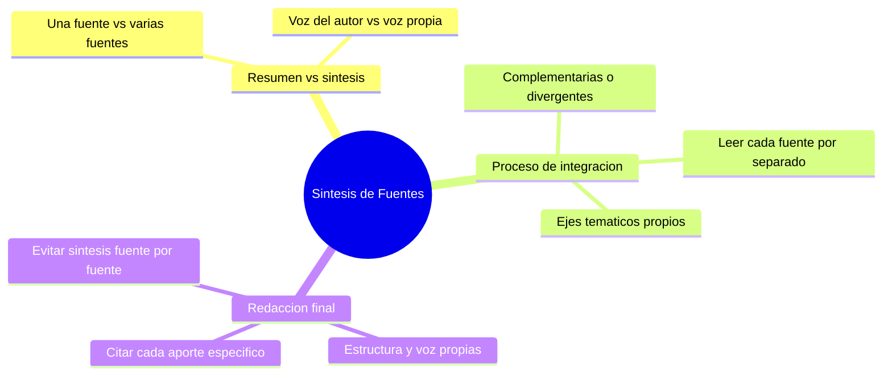

---
{"dg-publish":true,"permalink":"/universidad/preuniversitario/comunicacion-efectiva/unidad-4-resumen-y-sintesis/03-la-sintesis-de-multiples-fuentes/","dg-note-properties":{}}
---


# 🧩 La Síntesis de Múltiples Fuentes

---

## 🎯 Introducción

> [!info] 💡 Diferenciación conceptual — Síntesis vs. Resumen
>
> Mientras que el **resumen** se apega a **una sola fuente** y condensa su contenido conservando la terminología del autor (ver [[Universidad/Preuniversitario/Comunicación Efectiva/Unidad 4 - Resumen y síntesis/01 - El resumen académico\|01 - El resumen académico]]), la **síntesis integra varias fuentes** distintas sobre un mismo tema, construyendo una **estructura y una voz propias** que no pertenecen a ninguna de las fuentes originales por separado.
>
> ```mermaid
> graph TD
>     A[Resumen] --> B["Una sola fuente"]
>     A --> C["Conserva estructura y terminología del autor"]
>     D[Síntesis] --> E["Varias fuentes"]
>     D --> F["Estructura y voz propias del autor de la síntesis"]
>     D --> G["Contrasta ideas divergentes o complementarias"]
> ```
>
> La síntesis no es "pegar" resúmenes de cada fuente uno tras otro: es reorganizar el conocimiento de todas ellas alrededor de los propios ejes temáticos que el autor de la síntesis decide establecer.

---

> [!note] 📋 Proceso de integración
>
> Elaborar una síntesis exige un proceso más complejo que resumir una sola fuente:
>
> ```mermaid
> graph TD
>     A["Leer cada fuente por separado"] --> B["Identificar puntos de encuentro y desencuentro"]
>     B --> C{"¿Las ideas son complementarias o divergentes?"}
>     C -->|Complementarias| D["Integrarlas bajo un mismo eje temático"]
>     C -->|Divergentes| E["Presentar el contraste explícitamente"]
>     D --> F["Redactar el texto nuevo con estructura propia"]
>     E --> F
>     F --> G["Citar cada fuente en su aporte específico"]
> ```

> [!success]- ✅ Pautas para cada etapa
>
> | Etapa | Qué hacer |
> |---|---|
> | **Leer cada fuente por separado** | Comprender primero la postura o los datos de cada fuente de forma individual |
> | **Contrastar ideas** | Determinar si dos fuentes se refuerzan mutuamente (complementarias) o se contradicen (divergentes) |
> | **Integrar bajo ejes temáticos propios** | Organizar la síntesis por temas o preguntas, no por fuente ("qué dicen todas sobre X", no "primero la fuente A, luego la B") |
> | **Redactar con estructura y voz propias** | El texto resultante debe leerse como una unidad coherente, no como un collage de citas |
> | **Aparato crítico completo** | Cada idea tomada de una fuente debe llevar su cita correspondiente (ver [[Universidad/Preuniversitario/Comunicación Efectiva/Unidad 4 - Resumen y síntesis/02 - Técnicas de parafraseo y citación\|02 - Técnicas de parafraseo y citación]]), incluso al integrarla con otras |

> [!warning] ⚠️ Error común
>
> Redactar la síntesis fuente por fuente (*"Según la fuente A... Por otro lado, la fuente B dice..."*) en vez de organizarla por temas es una forma débil de síntesis: técnicamente contrasta las fuentes, pero no logra la integración real que exige una síntesis madura.

---

> [!example]- Ejercicio 04.1 — Integrar 2-3 fuentes en un eje propio
>
> **Instrucciones:** lee las tres mini-fuentes sobre teletrabajo y realiza lo pedido. Fuentes: (A) *Pérez (2021): el teletrabajo aumenta la autonomía y reduce tiempos de traslado.* (B) *García (2022): el teletrabajo aísla a los equipos y dificulta la creatividad colectiva.* (C) *López (2023): un modelo híbrido de 2-3 días presenciales equilibra autonomía y cohesión.*
>
> 1. Clasifica la relación A-B como complementaria o divergente.
> 2. Clasifica la relación A-C como complementaria o divergente.
> 3. Propón un eje temático propio que organice las tres fuentes (no fuente por fuente).
> 4. Redacta un párrafo de síntesis de 6-8 líneas con estructura propia, parafraseando y citando cada aporte.
> 5. Explica en una línea por qué tu párrafo no es una yuxtaposición fuente por fuente.
>
> **Soluciones:**
>
> 1. Divergente: A destaca un beneficio individual y B un costo colectivo; se contraponen.
> 2. Complementaria con matiz: C retoma el beneficio de A y propone resolver el problema de B con el modelo híbrido.
> 3. Eje modelo: *condiciones en que el teletrabajo funciona* (autonomía frente a cohesión y fórmula híbrida como equilibrio).
> 4. Modelo: *El teletrabajo incrementa la autonomía al eliminar traslados (Pérez, 2021), pero reduce la interacción que sostiene la creatividad colectiva (García, 2022). Por ello, el modelo híbrido de dos a tres días presenciales aparece como fórmula de equilibrio entre ambos efectos (López, 2023).*
> 5. Porque organiza las ideas por el eje autonomía-cohesión-equilibrio en vez de dedicar una oración aislada a cada fuente.

> [!example]- Ejercicio 04.2 — Matriz de síntesis por temas
>
> **Instrucciones:** completa la matriz con las fuentes ficticias sobre lectura digital. Fuentes: (A) *Ruiz (2020): la lectura digital mejora el acceso pero aumenta la distracción.* (B) *Torres (2021): la comprensión profunda es mayor en papel que en pantalla.* Usa C = coincide, M = matiza, N = no trata.
>
> > | Tema | Fuente A (Ruiz, 2020) | Fuente B (Torres, 2021) |
> > |---|---|---|
> > | 1. Acceso a los textos |  |  |
> > | 2. Nivel de distracción |  |  |
> > | 3. Comprensión profunda |  |  |
> > | 4. Recomendación pedagógica | Formula la tuya integrando ambas |  |
>
> 1. Completa la fila 1 para A y B.
> 2. Completa la fila 2 para A y B.
> 3. Completa la fila 3 para A y B.
> 4. Redacta la recomendación de la fila 4 en 2-3 líneas citando ambas fuentes.
>
> **Soluciones:**
>
> > | Tema | Fuente A (Ruiz, 2020) | Fuente B (Torres, 2021) |
> > |---|---|---|
> > | 1. Acceso | Facilita el acceso masivo | N: no trata el acceso |
> > | 2. Distracción | Aumenta por notificaciones y multitarea | M: la pantalla fragmenta la atención sostenida |
> > | 3. Comprensión profunda | N: no la mide | Mayor en papel que en pantalla |
> > | 4. Recomendación | Combinar acceso digital con lectura en papel para textos exigentes (Ruiz, 2020; Torres, 2021) |  |
>
> 1. A: facilita el acceso; B: no trata ese punto.
> 2. A: aumenta la distracción; B: matiza con la fragmentación de la atención en pantalla.
> 3. A: no mide comprensión; B: es mayor en papel.
> 4. Modelo: *Dado que lo digital amplía el acceso pero dispersa la atención (Ruiz, 2020) y que la comprensión profunda rinde mejor en papel (Torres, 2021), conviene reservar la pantalla para la exploración y el papel para el estudio exigente.*

> [!example]- Ejercicio 04.3 — Detectar contradicciones entre fuentes
>
> **Instrucciones:** para cada par de afirmaciones indica si hay contradicción real, diferencia de alcance o complementariedad. Justifica y propone cómo presentarla en la síntesis.
>
> 1. A: *El café mejora la alerta.* B: *El café produce insomnio.*
> 2. A: *Las redes sociales deterioran la autoestima adolescente (muestra de 2000 casos).* B: *Las redes sociales no afectan la autoestima (muestra de 30 casos, blog sin revisión).*
> 3. A: *La energía solar es la más barata a largo plazo.* B: *La energía solar exige alta inversión inicial.*
> 4. A: *El bilingüismo retrasa el vocabulario inicial.* B: *El bilingüismo retrasa para siempre el desarrollo lingüístico.*
> 5. Redacta una oración modelo que presente explícitamente la contradicción del caso 2 ponderando la confiabilidad.
>
> **Soluciones:**
>
> 1. Complementariedad (distinto momento del día): mejora la alerta de día y dificulta el sueño de noche; en la síntesis se integran como dos efectos según el horario.
> 2. Contradicción aparente con distinta confiabilidad: estudio amplio frente a blog reducido sin revisión; en la síntesis se pondera, dando más peso a la fuente sólida.
> 3. Complementariedad (distinto horizonte temporal): costo inicial alto frente a ahorro a largo plazo; se presentan como dos caras del mismo fenómeno.
> 4. Diferencia de alcance que roza la distorsión: B exagera a A (*retraso inicial* frente a *retraso permanente*); la síntesis debe señalar que B va más allá de lo que A sostiene.
> 5. Modelo: *Mientras un estudio amplio vincula las redes con menor autoestima adolescente, un blog con muestra reducida y sin revisión niega ese efecto, por lo que la evidencia sólida respalda la primera postura.*

---

> [!question] 🟢 Ejercicios de refuerzo *(elaborados para practicar, no son del MOOC)* — Nivel Básico
>
> 1. Explica en una oración la diferencia principal entre resumen y síntesis.
> 2. Indica si esto es complementario o divergente: Fuente A dice que el teletrabajo mejora la productividad; Fuente B dice que la reduce en equipos colaborativos.
> 3. Señala el problema de esta síntesis: *"La fuente A dice que X. La fuente B dice que Y. La fuente C dice que Z."*

> [!example]- 🟢 Respuestas — Nivel Básico
>
> 1. El resumen condensa una sola fuente conservando su terminología; la síntesis integra varias fuentes en una estructura y voz propias.
> 2. Divergente (las fuentes se contradicen según el tipo de trabajo).
> 3. Es una yuxtaposición fuente por fuente, no una integración temática real — no organiza el contenido por ejes propios.

> [!question] 🟡 Ejercicios de refuerzo — Nivel Intermedio
>
> 1. Toma dos fuentes breves sobre un mismo tema técnico y clasifica sus puntos como complementarios o divergentes.
> 2. Redacta un párrafo de síntesis que integre ambas fuentes bajo un eje temático propio (no fuente por fuente).
> 3. Verifica que tu párrafo cite correctamente el aporte específico de cada fuente.

> [!example]- 🟡 Respuestas — Nivel Intermedio
>
> Respuestas abiertas según las fuentes elegidas; verifica que el párrafo del punto 2 no siga la estructura "primero A, luego B" sino que combine ambos aportes en función de una idea propia.

> [!question] 🔴 Ejercicios de refuerzo — Nivel Avanzado
>
> 1. Elabora una síntesis de 3 fuentes sobre un tema de tu carrera, con al menos un punto de divergencia explícito entre ellas.
> 2. Revisa tu síntesis: ¿tiene una estructura y voz propias, o se nota la "costura" entre fuentes?
> 3. Explica cómo cambiaría tu síntesis si una de las tres fuentes fuera mucho menos confiable que las otras dos (por ejemplo, un blog sin respaldo frente a artículos revisados por pares).

> [!example]- 🔴 Respuestas — Nivel Avanzado
>
> Respuestas abiertas. Para el punto 3: una fuente menos confiable debería presentarse con matices ("un blog sugiere que...", frente a "estudios revisados por pares confirman que...") en vez de tratarla con el mismo peso que fuentes académicas verificadas.

---

## ✅ Metas de Aprendizaje

> [!note] 🎯 Nivel Básico
>
> - [ ] Distingo resumen de síntesis por su número de fuentes y su estructura
> - [ ] Clasifico ideas de distintas fuentes como complementarias o divergentes
> - [ ] Reconozco una síntesis débil organizada fuente por fuente

> [!note] 🎯 Nivel Intermedio
>
> - [ ] Integro ideas de 2 o más fuentes bajo un eje temático propio
> - [ ] Cito correctamente el aporte específico de cada fuente dentro de la síntesis
> - [ ] Presento explícitamente los puntos de divergencia entre fuentes

> [!note] 🎯 Nivel Avanzado
>
> - [ ] Redacto síntesis de 3 o más fuentes con estructura y voz propias coherentes
> - [ ] Pondero la confiabilidad relativa de cada fuente al integrarla
> - [ ] Evalúo críticamente si una síntesis propia o ajena logra integración real o solo yuxtaposición

---

## 📊 Resumen Visual



> [!summary] 📋 Resumen ejecutivo
>
> - La síntesis integra varias fuentes sobre un mismo tema en un texto nuevo con estructura y voz propias.
> - El resumen trabaja una sola fuente conservando su terminología; la síntesis combina varias reorganizando el conocimiento.
> - Las ideas de las fuentes se clasifican como complementarias (se refuerzan) o divergentes (se contradicen) y se organizan por ejes temáticos propios.
> - Cada aporte debe llevar su cita correspondiente, apoyándose en el parafraseo correcto de cada fuente.
> - Organizar la síntesis fuente por fuente es una forma débil: la integración real exige ordenar por temas, no por fuente.

---

> [!quote] 📖 Fuentes consultadas
>
> [1] MOOC *Comunicación Efectiva*, Unidad 4 — Resumen y síntesis, Nota 03: "La síntesis de múltiples fuentes".

> [!quote] 🔗 Conexiones
>
> - [[Universidad/Preuniversitario/Comunicación Efectiva/Unidad 4 - Resumen y síntesis/00 - Índice Unidad 4\|00 - Índice Unidad 4]] — mapa general de la unidad.
> - [[Universidad/Preuniversitario/Comunicación Efectiva/Unidad 4 - Resumen y síntesis/01 - El resumen académico\|01 - El resumen académico]] — contraste base: una fuente y estructura del autor vs. varias fuentes y estructura propia.
> - [[Universidad/Preuniversitario/Comunicación Efectiva/Unidad 4 - Resumen y síntesis/02 - Técnicas de parafraseo y citación\|02 - Técnicas de parafraseo y citación]] — la síntesis depende de parafrasear y citar correctamente cada fuente integrada.

---

**Tags:** #comunicacion-efectiva #MOOC #resumen-y-sintesis #unidad4 #sintesis #fuentes-multiples
