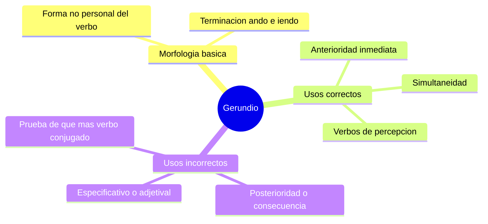

---
{"dg-publish":true,"permalink":"/universidad/preuniversitario/comunicacion-efectiva/unidad-4-resumen-y-sintesis/04-usos-correctos-e-incorrectos-del-gerundio/","dg-note-properties":{}}
---

# ✍️ Usos Correctos e Incorrectos del Gerundio

---

## 🎯 Introducción

> [!info] 💡 Morfología básica
>
> El **gerundio** es una **forma no personal del verbo** —no indica persona ni número por sí sola— terminada en **-ando** (verbos de primera conjugación: *hablando*, *estudiando*) o **-iendo** (segunda y tercera conjugación: *comiendo*, *viviendo*). Al ser una forma no personal, siempre acompaña a un verbo conjugado o funciona dentro de una perífrasis (*estar + gerundio*).

---

> [!note] 📋 Casos normativos — Usos válidos del gerundio

> [!success]- ✅ Los 3 usos correctos con ejemplos
>
> | Uso | Qué expresa | Ejemplo |
> |---|---|---|
> | **Simultaneidad** | Una acción ocurre al mismo tiempo que la acción principal | *"Explicó el proyecto mostrando los diagramas en pantalla."* (mostrar y explicar ocurren a la vez) |
> | **Anterioridad inmediata** | La acción del gerundio ocurre justo antes, sin ruptura temporal apreciable, de la acción principal | *"Habiendo revisado el informe, procedió a firmarlo."* |
> | **Verbos de percepción o representación** | Acompaña a verbos como *ver*, *oír*, *representar*, *pintar*, *fotografiar* para describir una acción captada en curso | *"Vimos al equipo trabajando en el laboratorio."* / *"El cuadro representa a un hombre caminando por el campo."* |

---

> [!warning] ⚠️ Guía de incorrecciones frecuentes
>
> El gerundio se usa incorrectamente cuando expresa una relación temporal o gramatical que no le corresponde:

> [!warning] ⚠️ Gerundio de posterioridad o consecuencia — INCORRECTO
>
> Ocurre cuando el gerundio describe una acción que sucede **después** de la acción principal, como si fuera su consecuencia — el gerundio no puede expresar posterioridad.
>
> | ❌ Incorrecto | ✅ Corrección |
> |---|---|
> | *"El puente colapsó, muriendo 5 personas."* | *"El puente colapsó y murieron 5 personas."* / *"El puente colapsó, lo que causó la muerte de 5 personas."* |
> | *"Aprobó el examen, graduándose ese mismo año."* | *"Aprobó el examen y se graduó ese mismo año."* |

> [!warning] ⚠️ Gerundio especificativo o adjetival — INCORRECTO
>
> Ocurre cuando el gerundio se usa para modificar un sustantivo como si fuera un adjetivo, delimitando o especificando cuál de varios elementos se menciona — función que en español corresponde a una oración de relativo, no a un gerundio.
>
> | ❌ Incorrecto | ✅ Corrección |
> |---|---|
> | *"Se aprobó una ley regulando el uso de plásticos."* | *"Se aprobó una ley que regula el uso de plásticos."* |
> | *"Recibimos una caja conteniendo los materiales."* | *"Recibimos una caja que contenía los materiales."* |
>
> > [!tip]- 🖥️ Regla práctica para detectarlo
> >
> > Si el gerundio puede reemplazarse por *"que + verbo conjugado"* sin cambiar el sentido y sin sonar forzado, probablemente estás frente a un gerundio especificativo incorrecto — reemplázalo por esa construcción con "que".

---

> [!example]- Ejercicio 05.1 — Gerundio correcto frente a incorrecto: simultaneidad y posterioridad
>
> **Instrucciones:** clasifica cada oración como correcta (C) o incorrecta (I). Indica la regla aplicada: simultaneidad, anterioridad inmediata, verbo de percepción, posterioridad o especificativo.
>
> 1. *Salió de casa corriendo hacia el bus.*
> 2. *El informe fue archivado, cerrándose así el caso.*
> 3. *Habiendo leído las instrucciones, comenzó el experimento.*
> 4. *Escuchamos al coro cantando en la plaza.*
> 5. *El avión despegó, aterrizando tres horas después en Lima.*
> 6. *Respondió la pregunta mirando sus apuntes.*
>
> **Soluciones:**
>
> 1. C, simultaneidad: salir y correr ocurren al mismo tiempo.
> 2. I, posterioridad: archivar ocurre antes y cerrar el caso es consecuencia posterior; corrección: *El informe fue archivado y con ello se cerró el caso.*
> 3. C, anterioridad inmediata: leer ocurre justo antes de comenzar, sin ruptura temporal.
> 4. C, verbo de percepción (*escuchar*) con acción captada en curso.
> 5. I, posterioridad: aterrizar ocurre tres horas después de despegar; corrección: *El avión despegó y aterrizó tres horas después en Lima.*
> 6. C, simultaneidad: responder y mirar los apuntes son simultáneos.

> [!example]- Ejercicio 05.2 — El error del gerundio de posterioridad
>
> **Instrucciones:** detecta el gerundio de posterioridad o consecuencia en cada oración y corrígelo con *y* o con una subordinada explícita.
>
> 1. *El diputado renunció, generando una crisis en su partido.*
> 2. *La represa se rompió, inundando dos pueblos vecinos.*
> 3. *Estudió medicina, ejerciendo luego como cirujana en el hospital regional.*
> 4. *El precio del cobre cayó, afectando las exportaciones del país.*
> 5. Explica en una línea por qué el gerundio no puede expresar posterioridad.
>
> **Soluciones:**
>
> 1. *El diputado renunció y generó una crisis en su partido.* / *...lo que generó una crisis...*
> 2. *La represa se rompió e inundó dos pueblos vecinos.* / *...lo que inundó dos pueblos...*
> 3. *Estudió medicina y luego ejerció como cirujana en el hospital regional.*
> 4. *El precio del cobre cayó, lo que afectó las exportaciones del país.*
> 5. Porque el gerundio tiene valor adverbial de modo, tiempo simultáneo o anterioridad inmediata, no de acción posterior o consecuencia; esa relación exige conjunción o subordinada causal/consecutiva.

> [!example]- Ejercicio 05.3 — Reescribe: gerundio especificativo y casos mixtos
>
> **Instrucciones:** corrige cada oración. Aplica la prueba de *que + verbo conjugado* donde corresponda.
>
> 1. *Se dictó un reglamento sancionando el plagio académico.*
> 2. *Compramos un software procesando grandes volúmenes de datos.*
> 3. *Vimos a los técnicos instalando las antenas.* (verbo de percepción)
> 4. *El conductor perdió el control, volcándose el vehículo en la curva.*
> 5. *La comisión aprobó el plan conteniendo tres ejes estratégicos.*
> 6. Reescribe este mini-párrafo sin gerundios incorrectos: *Se construyó un puente uniendo ambas riberas, inaugurándose al año siguiente.*
>
> **Soluciones:**
>
> 1. *Se dictó un reglamento que sanciona el plagio académico.* (especificativo: el gerundio pretendía funcionar como adjetivo de *reglamento*).
> 2. *Compramos un software que procesa grandes volúmenes de datos.* (especificativo).
> 3. Correcta, no se corrige: verbo de percepción (*ver*) con acción en curso.
> 4. *El conductor perdió el control y el vehículo se volcó en la curva.* (posterioridad/consecuencia).
> 5. *La comisión aprobó el plan que contiene tres ejes estratégicos.* (especificativo).
> 6. *Se construyó un puente que une ambas riberas y se inauguró al año siguiente.* (primer gerundio especificativo → *que une*; segundo de posterioridad → *y se inauguró*).

---

> [!question] 🟢 Ejercicios de refuerzo *(elaborados para practicar, no son del MOOC)* — Nivel Básico
>
> 1. Identifica el tipo de uso del gerundio: *"Salió corriendo de la habitación."*
> 2. Señala si este gerundio es correcto o incorrecto: *"El terremoto destruyó el edificio, dejando a cientos sin hogar."*
> 3. Convierte a la forma correcta: *"Publicaron un decreto prohibiendo la exportación."*

> [!example]- 🟢 Respuestas — Nivel Básico
>
> 1. Simultaneidad (salir y correr ocurren al mismo tiempo).
> 2. Incorrecto — es gerundio de consecuencia/posterioridad; corrección: *"El terremoto destruyó el edificio y dejó a cientos sin hogar."*
> 3. *"Publicaron un decreto que prohíbe la exportación."*

> [!question] 🟡 Ejercicios de refuerzo — Nivel Intermedio
>
> 1. Redacta una oración usando correctamente el gerundio de anterioridad inmediata.
> 2. Redacta una oración con un verbo de percepción (*ver*, *oír*) seguido de gerundio.
> 3. Explica por qué *"Compró un carro, chocándolo esa misma semana"* es incorrecto y qué regla viola.

> [!example]- 🟡 Respuestas — Nivel Intermedio
>
> 1. *"Habiendo terminado el reporte, lo envió al equipo."*
> 2. *"Escuché a los vecinos discutiendo sobre el proyecto."*
> 3. Es un gerundio de posterioridad/consecuencia: el choque ocurre después de la compra, no simultáneamente, así que no puede expresarse con gerundio.

> [!question] 🔴 Ejercicios de refuerzo — Nivel Avanzado
>
> 1. Revisa un texto propio (informe, ensayo) y busca al menos un gerundio mal usado (de posterioridad o especificativo); corrígelo.
> 2. Explica por qué el gerundio de posterioridad es tan frecuente en la redacción de noticias, y qué riesgo tiene para la precisión informativa.
> 3. Redacta un párrafo breve usando los 3 usos normativos del gerundio correctamente, sin caer en ninguna de las dos incorrecciones.

> [!example]- 🔴 Respuestas — Nivel Avanzado
>
> Respuestas abiertas. Para el punto 2: en las noticias es común narrar hechos consecutivos con gerundio para dar sensación de inmediatez ("el auto se volcó, muriendo el conductor"), pero esto difumina la relación causal real entre los eventos y es normativamente incorrecto — debe preferirse una conjunción (*y*) o una oración subordinada causal/consecutiva explícita.

---

## ✅ Metas de Aprendizaje

> [!note] 🎯 Nivel Básico
>
> - [ ] Identifico la terminación morfológica del gerundio (-ando/-iendo)
> - [ ] Reconozco los 3 usos normativos del gerundio
> - [ ] Detecto un gerundio de posterioridad evidente

> [!note] 🎯 Nivel Intermedio
>
> - [ ] Redacto oraciones correctas con cada uno de los 3 usos normativos
> - [ ] Corrijo gerundios de posterioridad sustituyéndolos por conjunciones u oraciones subordinadas
> - [ ] Corrijo gerundios especificativos sustituyéndolos por "que + verbo conjugado"

> [!note] 🎯 Nivel Avanzado
>
> - [ ] Reviso textos propios y detecto incorrecciones de gerundio sin ayuda
> - [ ] Explico la diferencia funcional entre gerundio adverbial (válido) y adjetival (inválido)
> - [ ] Redacto párrafos completos usando el gerundio con total corrección normativa

---

## 📊 Resumen Visual

> [!summary] 📋 Resumen ejecutivo
>
> - El gerundio es una forma no personal del verbo terminada en -ando (primera conjugación) o -iendo (segunda y tercera).
> - Sus 3 usos normativos son: simultaneidad, anterioridad inmediata y acompañamiento de verbos de percepción o representación.
> - El gerundio de posterioridad (acción posterior a la principal) es incorrecto: debe sustituirse por *y* o por una subordinada explícita.
> - El gerundio especificativo (modifica un sustantivo como adjetivo) es incorrecto: debe sustituirse por *que + verbo conjugado*.
> - Aunque es un tema gramatical, el gerundio apoya la redacción formal cohesiva exigida en el resumen y la síntesis.

---

> [!quote] 📖 Fuentes consultadas
>
> [1] MOOC *Comunicación Efectiva*, Unidad 4 — Resumen y síntesis, Nota 04: "Usos correctos e incorrectos del gerundio".

> [!quote] 🔗 Conexiones
>
> - [[Universidad/Preuniversitario/Comunicación Efectiva/Unidad 4 - Resumen y síntesis/00 - Índice Unidad 4\|00 - Índice Unidad 4]] — mapa general de la unidad.
> - [!info] Aunque temáticamente es un tema gramatical distinto al resumen/síntesis, esta nota se agrupa en la Unidad 4 como apoyo a la redacción formal cohesiva exigida en [[Universidad/Preuniversitario/Comunicación Efectiva/Unidad 4 - Resumen y síntesis/01 - El resumen académico\|01 - El resumen académico]] y en [[Universidad/Preuniversitario/Comunicación Efectiva/Unidad 4 - Resumen y síntesis/03 - La síntesis de múltiples fuentes\|03 - La síntesis de múltiples fuentes]].

---

**Tags:** #comunicacion-efectiva #MOOC #resumen-y-sintesis #unidad4 #gramatica #gerundio
