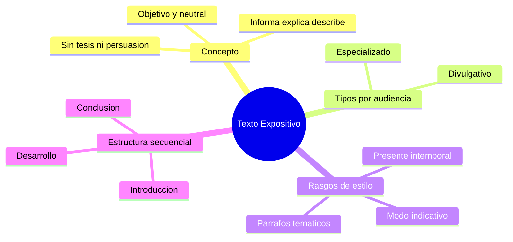

---
{"dg-publish":true,"permalink":"/universidad/preuniversitario/comunicacion-efectiva/unidad-5-textos-expositivos/01-el-texto-expositivo-concepto-tipos-y-estructura/","dg-note-properties":{}}
---


# 📖 El Texto Expositivo: Concepto, Tipos y Estructura

## 🎯 Introducción

> [!info] 💡 Definición y propósito
>
> Un **texto expositivo** tiene como propósito **informar, explicar o describir** un tema de la manera más **objetiva, clara y neutral** posible. A diferencia del texto argumentativo (ver [[Universidad/Preuniversitario/Comunicación Efectiva/Unidad 6 - Textos argumentativos/01 - El texto argumentativo (concepto, ámbitos y estructura)\|01 - El texto argumentativo (concepto, ámbitos y estructura)]] de la Unidad 6), no busca persuadir ni defender una postura: no hay tesis que sostener, sino contenido que transmitir con precisión.
>
> ```mermaid
> graph TD
>     A[Texto] --> B[Expositivo]
>     A --> C[Argumentativo]
>     B --> D["Informa / describe / explica"]
>     B --> E["Objetivo, sin sesgo persuasivo ni emocional"]
>     C --> F["Persuade / defiende una tesis"]
> ```
>
> La clave del texto expositivo es que su valor se mide por **cuánto informa con precisión**, no por cuánto convence.

---

> [!note] 📋 Tipología según audiencia
>
> El mismo contenido puede exponerse de dos maneras muy distintas según a quién se dirige:

> [!success]- ✅ Cuadro comparativo — Especializado vs. Divulgativo
>
> | Rasgo | Texto especializado (técnico/formal) | Texto divulgativo |
> |---|---|---|
> | **Audiencia** | Expertos o estudiantes del área | Público general, sin conocimiento previo |
> | **Vocabulario** | Terminología técnica sin explicar | Términos técnicos explicados o evitados |
> | **Tono** | Formal, impersonal | Accesible, a veces cercano |
> | **Propósito** | Precisión y rigor exhaustivo | Comprensión rápida y clara |
> | **Ejemplos típicos** | Artículos científicos, manuales técnicos, informes | Artículos de divulgación, notas periodísticas, videos educativos |
> | **Extensión de las explicaciones** | Asume conocimiento previo, va directo al detalle | Dedica más espacio a definir y contextualizar |

---

> [!note] 📋 Rasgos estilísticos característicos
>
> El texto expositivo tiene marcas gramaticales reconocibles que refuerzan su objetividad:
>
> - **Verbos en presente intemporal:** se usa el presente para expresar verdades generales o hechos estables, no solo lo que ocurre "ahora" (*"El agua se compone de hidrógeno y oxígeno"*, no *"se estaba componiendo"*).
> - **Modo indicativo:** se afirma el contenido como un hecho, sin matices de duda o deseo (evitando el subjuntivo, propio de la incertidumbre o la opinión).
> - **Desarrollo por párrafos temáticos:** cada párrafo desarrolla una sola idea o subtema, facilitando que el lector siga la progresión del contenido sin mezclarlas.

> [!warning] ⚠️ Errores comunes
>
> | ❌ Incorrecto (sesgo o subjetividad) | ✅ Correcto (objetivo) |
> |---|---|
> | *"Afortunadamente, la fotosíntesis permite que las plantas produzcan su alimento."* | *"La fotosíntesis permite que las plantas produzcan su propio alimento."* |
> | *"Es una lástima que el proceso sea tan lento."* | *(eliminar el juicio de valor; describir el dato: "El proceso dura entre 3 y 5 días.")* |
> | *"Sin duda, este es el mejor método."* | *"Este método presenta las siguientes ventajas: ..."* |

---

> [!note] 📋 Esquema de organización — Estructura secuencial canónica
>
> Todo texto expositivo bien formado sigue tres bloques ordenados:
>
> ```mermaid
> graph TD
>     A[Introduccion - Contexto del tema] --> B[Desarrollo - Explicacion y ejemplos]
>     B --> C[Conclusion - Sintesis del contenido]
> ```

> [!success]- ✅ Detalle de cada bloque
>
> | Bloque | Función | Contenido esperado |
> |---|---|---|
> | **Introducción** | Situar el tema | Contexto general, delimitación del alcance |
> | **Desarrollo** | Explicar con detalle | Explicación organizada por subtemas, con ejemplos que ilustren cada idea |
> | **Conclusión** | Cerrar sintetizando | Síntesis de lo explicado, sin introducir información nueva ni juicios de valor |

---

> [!example]- Ejercicio 02.1 — Rasgos del texto expositivo
>
> > **Instrucciones:** Marca V (verdadero) o F (falso) según corresponda a un texto expositivo bien formado.
>
> > 1. Su propósito principal es informar con objetividad.
> > 2. Usa verbos en presente intemporal para expresar hechos generales.
> > 3. Prefiere el modo subjuntivo para matizar opiniones.
> > 4. Cada párrafo desarrolla un solo tema o subtema.
> > 5. Incluye juicios de valor para hacerlo más persuasivo.
> > 6. Usa el modo indicativo para afirmar hechos.
>
> > **Soluciones:**
>
> > 1. V — informar, explicar o describir es su propósito definitorio.
> > 2. V — *"El agua se compone de hidrógeno y oxígeno"* es el ejemplo canónico.
> > 3. F — el subjuntivo expresa duda o deseo; el expositivo usa indicativo.
> > 4. V — desarrollo por párrafos temáticos.
> > 5. F — los juicios de valor rompen la neutralidad objetiva.
> > 6. V — afirma el contenido como hecho.
>
> [!example]- Ejercicio 02.2 — Tipos según audiencia: especializado vs. divulgativo
>
> > **Instrucciones:** Clasifica cada fragmento como ESPECIALIZADO o DIVULGATIVO y justifica por el vocabulario.
>
> > 1. *"La fotosíntesis es el proceso por el cual las plantas fabrican su alimento usando la luz del sol."*
> > 2. *"La fosforilación oxidativa acopla el gradiente electroquímico de protones a la síntesis de ATP en la ATP-sintasa."*
> > 3. *"El corazón funciona como una bomba que impulsa la sangre por todo el cuerpo."*
> > 4. *"La sepsis cursa con SIRS secundario a bacteriemia por gramnegativos."*
> > 5. *"El ADN es como un manual de instrucciones que le dice a cada célula qué hacer."*
> > 6. *"Estudio de cohorte, n = 1.240, HR ajustado 0,72 (IC 95%: 0,61-0,85)."*
>
> > **Soluciones:**
>
> > 1. DIVULGATIVO — evita tecnicismos y explica con lenguaje cotidiano.
> > 2. ESPECIALIZADO — terminología sin explicar, asume conocimiento previo.
> > 3. DIVULGATIVO — analogía accesible (bomba) para público general.
> > 4. ESPECIALIZADO — siglas y léxico clínico sin definir.
> > 5. DIVULGATIVO — comparación didáctica propia de divulgación.
> > 6. ESPECIALIZADO — formato de informe técnico con estadística sin contextualizar.
>
> [!example]- Ejercicio 02.3 — Estructura secuencial canónica
>
> > **Instrucciones:** Ordena los bloques e identifica a qué parte (introducción, desarrollo, conclusión) pertenece cada párrafo.
>
> > 1. *"En síntesis, el ciclo del agua garantiza la disponibilidad del recurso mediante evaporación, condensación y precipitación."*
> > 2. *"El ciclo del agua es el proceso continuo de circulación del agua en la Tierra y abarca varios fenómenos encadenados."*
> > 3. *"Primero, el agua se evapora por el calor solar; luego se condensa en nubes y finalmente precipita como lluvia."*
> > 4. ¿Qué bloque presenta el contexto general y delimita el alcance?
> > 5. ¿Qué bloque desarrolla con detalle y ejemplos?
> > 6. ¿Qué error comete una conclusión que introduce un dato nuevo no explicado antes?
>
> > **Soluciones:**
>
> > 1. CONCLUSIÓN — sintetiza sin agregar información nueva (*"En síntesis..."*).
> > 2. INTRODUCCIÓN — sitúa el tema y delimita el alcance.
> > 3. DESARROLLO — explica por subtemas con secuencia ordenada.
> > 4. La introducción.
> > 5. El desarrollo.
> > 6. Rompe la estructura canónica: la conclusión solo resume lo ya explicado.
>
> [!example]- Ejercicio 02.4 — Objetividad frente a sesgo
>
> > **Instrucciones:** Reescribe cada oración eliminando el sesgo subjetivo o indica "Correcta" si ya es objetiva.
>
> > 1. *"Afortunadamente, la fotosíntesis permite que las plantas produzcan su alimento."*
> > 2. *"La fotosíntesis permite que las plantas produzcan su propio alimento."*
> > 3. *"Es una lástima que el proceso sea tan lento."*
> > 4. *"Sin duda, este es el mejor método de purificación."*
> > 5. *"Sorprendentemente, el corazón late unas 100.000 veces al día."*
> > 6. *"El proceso dura entre 3 y 5 días según las condiciones registradas."*
>
> > **Soluciones:**
>
> > 1. *"La fotosíntesis permite que las plantas produzcan su alimento."* (se elimina *"Afortunadamente"*).
> > 2. Correcta — describe sin valorar.
> > 3. *"El proceso dura entre 3 y 5 días."* (se sustituye el lamento por el dato).
> > 4. *"Este método presenta las siguientes ventajas: rapidez y bajo costo."* (se sustituye el superlativo por criterios verificables).
> > 5. *"El corazón late aproximadamente 100.000 veces al día."* (se elimina *"Sorprendentemente"*).
> > 6. Correcta — dato objetivo con condición verificable.
>
> [!example]- Ejercicio 02.5 — Expositivo frente a argumentativo
>
> > **Instrucciones:** Clasifica cada enunciado como EXPOSITIVO o ARGUMENTATIVO según haya tesis y persuasión o solo información.
>
> > | # | Enunciado | Clasificación y por qué |
> > |---|---|---|
> > | 1 | *"El sistema circulatorio transporta oxígeno y nutrientes por todo el cuerpo."* | EXPOSITIVO — describe un hecho sin defender postura. |
> > | 2 | *"Se debe prohibir el plástico de un solo uso porque contamina los océanos."* | ARGUMENTATIVO — hay tesis (*se debe prohibir*) más razón (*porque...*). |
> > | 3 | *"El cobre es un buen conductor eléctrico y se usa en cableado."* | EXPOSITIVO — informa una propiedad y un uso. |
> > | 4 | *"El cobre es el mejor material para cableado y todos deberían usarlo."* | ARGUMENTATIVO — valora (*el mejor*) y prescribe (*deberían*). |
> > | 5 | *"En 2024 la temperatura media subió 1,2 °C respecto al periodo preindustrial."* | EXPOSITIVO — presenta el dato aislado. |
> > | 6 | *"Dado que la temperatura subió 1,2 °C, es urgente regular las emisiones industriales."* | ARGUMENTATIVO — usa el dato como evidencia de una tesis. |
>
> [!example]- Ejercicio 02.6 — Redacción expositiva breve
>
> > **Instrucciones:** Completa o corrige cada tarea de redacción aplicando presente intemporal, modo indicativo y un tema por párrafo.
>
> > 1. Reescribe en presente intemporal: *"Ayer los científicos descubrieron que las plantas responden al estrés hídrico."*
> > 2. Corrige el modo verbal: *"Quizás el agua sea compuesta por hidrógeno y oxígeno."*
> > 3. Divide en dos párrafos temáticos este bloque mezclado: *"El corazón bombea sangre. La sangre transporta oxígeno. Los glóbulos rojos contienen hemoglobina. El corazón tiene cuatro cavidades."*
> > 4. Escribe una introducción de 2 líneas para el tema "La mitosis" delimitando el alcance.
> > 5. Escribe un desarrollo de 2 líneas con un ejemplo que ilustre la mitosis para público divulgativo.
> > 6. Escribe una conclusión de 1 línea que sintetice sin agregar datos nuevos ni juicios.
>
> > **Soluciones:**
>
> > 1. *"Las plantas responden al estrés hídrico cerrando sus estomas."*
> > 2. *"El agua se compone de hidrógeno y oxígeno."* (indicativo, hecho estable).
> > 3. Párrafo 1 (órgano): corazón como bomba y sus cuatro cavidades. Párrafo 2 (fluido): sangre, oxígeno y hemoglobina. Cada uno con una sola idea.
> > 4. Modelo: *"La mitosis es el proceso de división celular; aquí se describen sus etapas y su resultado."*
> > 5. Modelo: *"Una célula se divide en dos células idénticas; por ejemplo, así se renueva la piel."*
> > 6. Modelo: *"En síntesis, la mitosis produce dos células idénticas a partir de una célula madre."*

---

> [!question] 🟢 Ejercicios de refuerzo *(elaborados para practicar, no son del MOOC)* — Nivel Básico
>
> 1. Clasifica como *expositivo* o *argumentativo*: *"El sistema circulatorio transporta oxígeno y nutrientes por todo el cuerpo."*
> 2. Indica si el siguiente texto es especializado o divulgativo: *"El ATP es la molécula que almacena energía celular mediante enlaces fosfato de alta energía."*
> 3. Señala el error de objetividad en: *"Sorprendentemente, el corazón late unas 100.000 veces al día."*

> [!example]- 🟢 Respuestas — Nivel Básico
>
> 1. Expositivo (describe un hecho biológico sin buscar persuadir).
> 2. Especializado (usa terminología técnica —ATP, enlaces fosfato— sin explicarla).
> 3. La palabra *"sorprendentemente"* introduce una valoración subjetiva; un texto expositivo objetivo diría solo *"El corazón late aproximadamente 100.000 veces al día."*

> [!question] 🟡 Ejercicios de refuerzo — Nivel Intermedio
>
> 1. Convierte este párrafo especializado en uno divulgativo: *"La mitosis es el proceso de división celular que produce dos células hijas genéticamente idénticas mediante las fases profase, metafase, anafase y telofase."*
> 2. Reescribe en presente intemporal: *"Ayer los científicos descubrieron que las plantas responden al estrés hídrico."*
> 3. Identifica los tres bloques de la estructura secuencial en un texto breve de tu elección (puede ser un artículo de Wikipedia).

> [!example]- 🟡 Respuestas — Nivel Intermedio
>
> 1. *"La mitosis es el proceso por el cual una célula se divide en dos células idénticas, en varias etapas ordenadas."* (se simplifican los nombres técnicos de las fases o se explican brevemente).
> 2. *"Las plantas responden al estrés hídrico cerrando sus estomas para reducir la pérdida de agua."* (se generaliza el hecho, no se narra como evento puntual pasado).
> 3. Respuesta abierta según el texto elegido; verifica que exista un párrafo de contexto, uno o más de desarrollo con ejemplos, y un cierre que sintetice sin agregar datos nuevos.

> [!question] 🔴 Ejercicios de refuerzo — Nivel Avanzado
>
> 1. Redacta un texto expositivo breve (100-150 palabras) sobre un tema técnico de tu carrera, dirigido a una audiencia divulgativa.
> 2. Revisa tu propio texto e identifica cualquier verbo o frase que introduzca sesgo o juicio de valor, y corrígelo.
> 3. Explica por qué un mismo dato (por ejemplo, una cifra de contaminación) puede aparecer tanto en un texto expositivo como en uno argumentativo, y qué cambiaría entre ambos usos.

> [!example]- 🔴 Respuestas — Nivel Avanzado
>
> Respuestas abiertas. Para el punto 3: en el texto expositivo, la cifra se presenta como dato aislado, sin interpretación ni llamado a la acción; en el argumentativo, la misma cifra se usa como **evidencia** al servicio de una tesis (por ejemplo, para defender que se debe regular una industria).

---

## ✅ Metas de Aprendizaje

> [!note] 🎯 Nivel Básico
>
> - [ ] Distingo un texto expositivo de uno argumentativo
> - [ ] Identifico si un texto es especializado o divulgativo
> - [ ] Reconozco frases con sesgo subjetivo en un texto que debería ser objetivo

> [!note] 🎯 Nivel Intermedio
>
> - [ ] Adapto un texto especializado a una versión divulgativa
> - [ ] Uso correctamente el presente intemporal y el modo indicativo
> - [ ] Identifico los tres bloques de la estructura secuencial en un texto ajeno

> [!note] 🎯 Nivel Avanzado
>
> - [ ] Redacto un texto expositivo completo y objetivo sobre un tema técnico
> - [ ] Reviso y elimino sesgos subjetivos de mi propia redacción
> - [ ] Explico cómo un mismo dato cambia de función entre un texto expositivo y uno argumentativo

---

## 📊 Resumen Visual



---

> [!summary] 📋 Resumen ejecutivo
>
> - El texto expositivo **informa con objetividad**, sin tesis ni intención persuasiva.
> - Se adapta a la audiencia: **especializado** (rigor técnico) o **divulgativo** (accesible).
> - Usa **presente intemporal**, modo indicativo y un párrafo por tema.
> - Sigue la estructura **introducción → desarrollo → conclusión** sin datos nuevos al cierre.
> - Su valor se mide por **cuánto informa con precisión**, no por cuánto convence.

---

> [!quote] 📖 Fuentes consultadas
>
> [1] MOOC *Comunicación Efectiva*, Unidad 5 — Textos expositivos, Nota 01: "El texto expositivo (concepto, tipos y estructura)".

> [!quote] 🔗 Conexiones
>
> - [[Universidad/Preuniversitario/Comunicación Efectiva/Unidad 5 - Textos expositivos/00 - Índice Unidad 5\|00 - Índice Unidad 5]] — mapa general de la unidad.
> - [[Universidad/Preuniversitario/Comunicación Efectiva/Unidad 5 - Textos expositivos/02 - Análisis del texto expositivo\|02 - Análisis del texto expositivo]] — aplica esta estructura para disecar párrafos en ideas centrales y de apoyo.
> - [[Universidad/Preuniversitario/Comunicación Efectiva/Unidad 5 - Textos expositivos/03 - Conectores textuales y coherencia lógica\|03 - Conectores textuales y coherencia lógica]] — los conectores son la herramienta que enlaza los párrafos temáticos de esta estructura.
> - [!info] Conexión cruzada con la Unidad 6: el texto expositivo se distingue del texto argumentativo por la ausencia de tesis y de sesgo persuasivo — ver [[Universidad/Preuniversitario/Comunicación Efectiva/Unidad 6 - Textos argumentativos/01 - El texto argumentativo (concepto, ámbitos y estructura)\|01 - El texto argumentativo (concepto, ámbitos y estructura)]].

---

**Tags:** #comunicacion-efectiva #MOOC #textos-expositivos #unidad5 #estructura-expositiva
