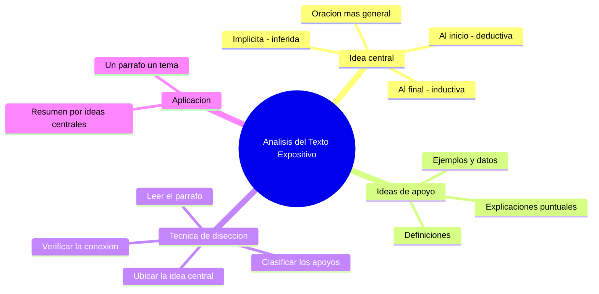

---
{"dg-publish":true,"permalink":"/universidad/preuniversitario/comunicacion-efectiva/unidad-5-textos-expositivos/02-analisis-del-texto-expositivo/","dg-note-properties":{}}
---


# 🔬 Análisis del Texto Expositivo

## 🎯 Introducción

> [!info] 💡 ¿Por qué disecar un texto expositivo?
>
> Analizar un texto expositivo significa **separar el "qué se dice" del "cómo se apoya lo que se dice"** en cada párrafo. Esta habilidad es indispensable tanto para leer con comprensión profunda (resúmenes, fichas de estudio) como para escribir mejor: un párrafo bien construido tiene siempre una idea central reconocible y evidencia o detalle que la sostiene.

---

> [!note] 📋 Técnicas de disección textual
>
> La disección de un párrafo expositivo sigue un proceso reconocible:
>
> ```mermaid
> graph TD
>     A[Leer el parrafo completo] --> B[Buscar la oracion que resume el parrafo]
>     B --> C{Al inicio, al final o implicita}
>     C -->|Al inicio| D[Idea central - oracion tematica inicial]
>     C -->|Al final| E[Idea central - oracion de cierre]
>     C -->|Implicita| F[Idea central - inferida por el lector]
>     D --> G[Clasificar el resto como ideas de apoyo]
>     E --> G
>     F --> G
>     G --> H[Verificar - cada apoyo se conecta con la idea central]
> ```

> [!success]- ✅ Idea central vs. idea de apoyo
>
> | Elemento | Función | Cómo reconocerla |
> |---|---|---|
> | **Idea central** | Resume de qué trata el párrafo | Suele ser la oración más general; el resto del párrafo la desarrolla |
> | **Ideas de apoyo** | Desarrollan, ejemplifican o detallan la idea central | Suelen incluir ejemplos, datos, definiciones o explicaciones puntuales |
>
> > [!tip]- 🖥️ Aplicación práctica
> >
> > Esta técnica es la base para hacer resúmenes eficientes: si extraes solo las ideas centrales de cada párrafo (respetando el orden), obtienes un resumen fiel del texto completo sin necesidad de leerlo de nuevo.

---

> [!info] 💡 Apuntes de lectura y video explicativo (03.1)
>
> - La disección se hace en 4 pasos: leer el párrafo completo, localizar la oración más general, clasificar el resto como apoyos y verificar que cada apoyo se conecte con la central.
> - La idea central puede ir al inicio (estructura deductiva), al final (estructura inductiva) o estar implícita y deba inferirse a partir de los apoyos.
> - Las ideas de apoyo aportan ejemplos, datos, definiciones o explicaciones puntuales; si un apoyo no desarrolla la central, es débil y debe eliminarse o mover a otro párrafo.
> - Extraer las ideas centrales en orden produce un resumen fiel: es la base para resumir sin releer todo el texto.

---

> [!example]- Ejercicio 03.1 — Ideas centrales frente a ideas secundarias
>
> > **Instrucciones:** Lee cada oración y marca C (central) si puede resumir un párrafo entero o S (secundaria) si solo aporta un detalle.
>
> > 1. *"El plástico tarda cientos de años en degradarse."*
> > 2. *"Una botella de plástico puede tardar más de 400 años en degradarse."*
> > 3. *"Las bolsas plásticas se degradan en unos 20 años."*
> > 4. *"El reciclaje reduce la cantidad de plástico que llega a los océanos."*
> > 5. *"En 2022 se reciclaron 9 millones de toneladas de plástico en la región."*
> > 6. *"Separar el plástico en casa facilita su reciclaje posterior."*
>
> > **Soluciones:**
>
> > 1. C — oración general que resume el párrafo.
> > 2. S — ejemplo puntual que apoya la central.
> > 3. S — dato específico de apoyo.
> > 4. C — generalización que podría encabezar otro párrafo.
> > 5. S — cifra que detalla la central anterior.
> > 6. S — explicación puntual de apoyo.
>
> [!example]- Ejercicio 03.2 — Disección de párrafos
>
> > **Instrucciones:** Diseca el párrafo: subraya la idea central y enumera las ideas de apoyo.
>
> > Texto: *"El desierto de Atacama es uno de los lugares más secos del planeta. En algunas estaciones no se registra lluvia durante años. Esta aridez se debe a la corriente fría de Humboldt y a la barrera de los Andes. Gracias a esa sequedad, allí se instalan grandes observatorios astronómicos."*
>
> > 1. ¿Cuál es la idea central?
> > 2. Enumera la idea de apoyo 1 (dato de sequedad extrema).
> > 3. Enumera la idea de apoyo 2 (causa de la aridez).
> > 4. Enumera la idea de apoyo 3 (consecuencia para la astronomía).
> > 5. ¿La estructura es deductiva o inductiva?
> > 6. ¿Qué oración sobraría si hablara del turismo de playa?
>
> > **Soluciones:**
>
> > 1. *"El desierto de Atacama es uno de los lugares más secos del planeta."*
> > 2. *"En algunas estaciones no se registra lluvia durante años."*
> > 3. *"Esta aridez se debe a la corriente de Humboldt y a la barrera de los Andes."*
> > 4. *"Gracias a esa sequedad, allí se instalan grandes observatorios."*
> > 5. Deductiva — la central está al inicio y el resto la desarrolla.
> > 6. La del turismo de playa: no se conecta con la central de aridez extrema.
>
> [!example]- Ejercicio 03.3 — Oraciones temáticas
>
> > **Instrucciones:** Ubica la oración temática e indica si está al inicio, al final o implícita.
>
> > | # | Párrafo | Posición y justificación |
> > |---|---|---|
> > | 1 | *"La lectura diaria mejora el vocabulario. Quienes leen 20 minutos al día incorporan cientos de palabras nuevas al año. Además, comprenden mejor textos complejos."* | Al inicio — la primera oración resume; el resto son beneficios puntuales. |
> > | 2 | *"Se calienta la muestra, se mide su temperatura y se registra el cambio. Este protocolo garantiza que cada medición sea comparable con la anterior."* | Al final — los detalles preceden y la última oración generaliza el sentido del protocolo. |
> > | 3 | *"El metro abre a las 5:30. Los buses articulados pasan cada 8 minutos. El tranvía conecta con la estación norte."* | Implícita — debe inferirse: *"La ciudad ofrece varias opciones de transporte público matutino"*. |
> > | 4 | *"El sueño consolida la memoria. Durante el sueño profundo el cerebro repite los patrones aprendidos. Dormir poco reduce el rendimiento en pruebas de memoria."* | Al inicio — estructura deductiva clásica. |
>
> [!example]- Ejercicio 03.4 — Resumen por ideas centrales
>
> > **Instrucciones:** Lee el minitexto de 3 párrafos y elabora el resumen extrayendo solo una idea central por párrafo, en orden.
>
> > P1: *"El agua cubre el 71% de la superficie terrestre, pero solo el 2,5% es dulce."* P2: *"Esa agua dulce se concentra en glaciares y acuíferos, por lo que solo una fracción está disponible para consumo."* P3: *"Por ello, el tratamiento y el uso eficiente son claves para garantizar el abastecimiento."*
>
> > 1. Idea central del P1.
> > 2. Idea central del P2.
> > 3. Idea central del P3.
> > 4. Redacta el resumen de 2-3 líneas uniendo las tres centrales con conectores.
> > 5. Indica qué detalles del texto original se omiten en un buen resumen.
> > 6. Explica por qué el resumen respeta el orden original.
>
> > **Soluciones:**
>
> > 1. La mayor parte del agua del planeta no es dulce ni directamente disponible.
> > 2. El agua dulce accesible es una fracción pequeña, retenida en glaciares y acuíferos.
> > 3. El tratamiento y el uso eficiente garantizan el abastecimiento.
> > 4. Modelo: *"Aunque el agua cubre la mayor parte del planeta, poca es dulce y accesible; por ello, tratarla y usarla con eficiencia es clave."*
> > 5. Se omiten cifras exactas (71%, 2,5%) y ejemplos de reservas si no alteran la lógica general.
> > 6. Porque el resumen fiel preserva la progresión expositiva: contexto, detalle y cierre.

---

> [!question] 🟢 Ejercicios de refuerzo *(elaborados para practicar, no son del MOOC)* — Nivel Básico
>
> 1. En el párrafo: *"El plástico tarda cientos de años en degradarse. Por ejemplo, una botella puede tardar más de 400 años. Las bolsas, en cambio, se degradan en unos 20 años."* — identifica la idea central y las ideas de apoyo.
> 2. Indica si la idea central de ese párrafo está al inicio, al final o implícita.
> 3. Da un ejemplo de una oración que sería una idea de apoyo débil (que no se conecta bien con la idea central).

> [!example]- 🟢 Respuestas — Nivel Básico
>
> 1. Idea central: *"El plástico tarda cientos de años en degradarse."* Ideas de apoyo: los ejemplos de la botella y las bolsas.
> 2. Al inicio (oración temática inicial).
> 3. Por ejemplo: *"El plástico se inventó en 1907."* — es un dato real, pero no apoya la idea de la degradación, sino el origen del material.

> [!question] 🟡 Ejercicios de refuerzo — Nivel Intermedio
>
> 1. Escribe un párrafo expositivo de 4-5 oraciones donde la idea central esté al final (estructura inductiva).
> 2. Toma un párrafo de una fuente real (artículo, libro de texto) y subraya la idea central; luego enumera cada idea de apoyo por separado.
> 3. Explica qué problema genera un párrafo que mezcla dos ideas centrales distintas sin separarlas.

> [!example]- 🟡 Respuestas — Nivel Intermedio
>
> 1. Respuesta abierta; verifica que las primeras oraciones sean detalles/ejemplos y la última sea la generalización que los resume.
> 2. Respuesta abierta según la fuente elegida.
> 3. Mezclar dos ideas centrales en un párrafo dificulta que el lector identifique el resumen del párrafo y rompe la regla de "un párrafo, un tema" — obliga a dividirlo en dos párrafos independientes.

> [!question] 🔴 Ejercicios de refuerzo — Nivel Avanzado
>
> 1. Toma un texto expositivo completo (3-4 párrafos) y elabora un resumen extrayendo solo las ideas centrales de cada párrafo, en orden.
> 2. Compara tu resumen con el texto original: ¿se pierde información esencial? ¿por qué sí o no?
> 3. Reescribe un párrafo mal estructurado (con la idea central diluida entre varias ideas de apoyo) para que quede clara desde la primera oración.

> [!example]- 🔴 Respuestas — Nivel Avanzado
>
> Respuestas abiertas y dependientes del texto elegido. Un buen resumen por ideas centrales debería preservar la lógica del argumento expositivo original sin necesitar los ejemplos o detalles secundarios.

---

## ✅ Metas de Aprendizaje

> [!note] 🎯 Nivel Básico
>
> - [ ] Identifico la idea central de un párrafo expositivo
> - [ ] Distingo ideas de apoyo de la idea central
> - [ ] Reconozco si la idea central está al inicio, al final o implícita

> [!note] 🎯 Nivel Intermedio
>
> - [ ] Redacto párrafos con estructura deductiva (idea al inicio) e inductiva (idea al final)
> - [ ] Detecto ideas de apoyo débiles o desconectadas de la idea central
> - [ ] Aplico la disección de párrafos a textos reales de mi carrera

> [!note] 🎯 Nivel Avanzado
>
> - [ ] Elaboro resúmenes fieles extrayendo solo ideas centrales
> - [ ] Reestructuro párrafos mal organizados para clarificar su idea central
> - [ ] Evalúo si un resumen por ideas centrales pierde información esencial

---

## 📊 Resumen Visual



---

> [!summary] 📋 Resumen ejecutivo
>
> - Analizar es **separar el "qué se dice" del "cómo se apoya"** en cada párrafo.
> - La **idea central** es la oración más general; puede ir al inicio, al final o implícita.
> - Las **ideas de apoyo** desarrollan con ejemplos, datos, definiciones o detalles.
> - Extraer las ideas centrales en orden produce un **resumen fiel** del texto.
> - Regla de oro: **un párrafo, un tema**; cada apoyo debe conectarse con la central.

---

> [!quote] 📖 Fuentes consultadas
>
> [1] MOOC *Comunicación Efectiva*, Unidad 5 — Textos expositivos, Nota 02: "Análisis del texto expositivo".

> [!quote] 🔗 Conexiones
>
> - [[Universidad/Preuniversitario/Comunicación Efectiva/Unidad 5 - Textos expositivos/00 - Índice Unidad 5\|00 - Índice Unidad 5]] — mapa general de la unidad.
> - [[Universidad/Preuniversitario/Comunicación Efectiva/Unidad 5 - Textos expositivos/01 - El texto expositivo (concepto, tipos y estructura)\|01 - El texto expositivo (concepto, tipos y estructura)]] — la disección de párrafos aplica directamente sobre la estructura secuencial descrita en esa nota.
> - [[Universidad/Preuniversitario/Comunicación Efectiva/Unidad 5 - Textos expositivos/03 - Conectores textuales y coherencia lógica\|03 - Conectores textuales y coherencia lógica]] — los conectores son la señal explícita de cómo una idea de apoyo se relaciona con la idea central.
> - [!info] Conexión cruzada con la Unidad 6: esta técnica de disección es análoga a la metodología de análisis de argumentos en [[Universidad/Preuniversitario/Comunicación Efectiva/Unidad 6 - Textos argumentativos/03 - Análisis y desmontaje de textos argumentativos\|03 - Análisis y desmontaje de textos argumentativos]], pero aquí se buscan ideas centrales/de apoyo en vez de tesis/argumentos.

---

**Tags:** #comunicacion-efectiva #MOOC #textos-expositivos #unidad5 #analisis-textual
