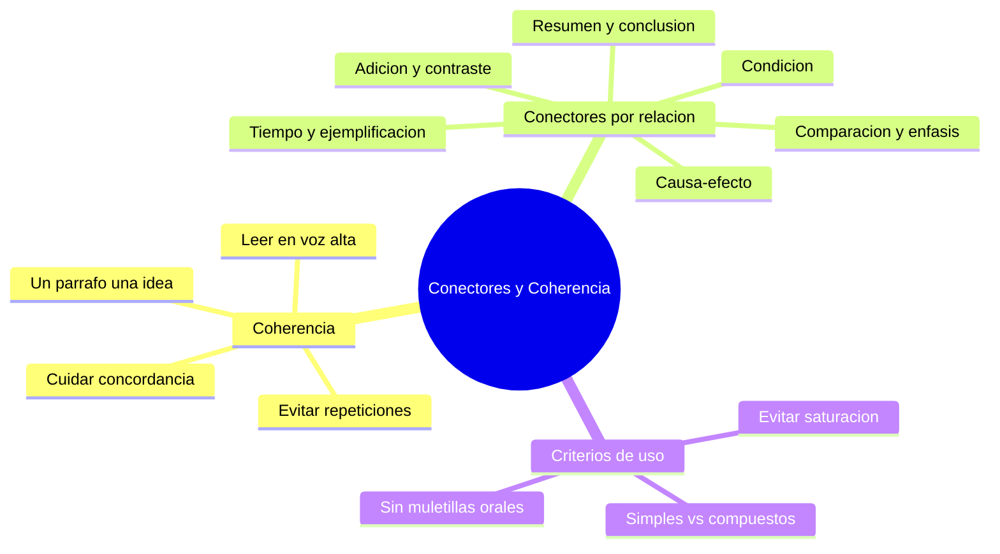

---
{"dg-publish":true,"permalink":"/universidad/preuniversitario/comunicacion-efectiva/unidad-5-textos-expositivos/03-conectores-textuales-y-coherencia-logica/","dg-note-properties":{}}
---

# 🔗 Conectores Textuales y Coherencia Lógica

## 🎯 Introducción

> [!info] 💡 ¿Por qué importan los conectores?
>
> Los conectores textuales son las **señales explícitas** que indican al lector cómo se relaciona una idea con la siguiente: si la contradice, la explica, la ejemplifica o la resume. Sin ellos, un texto puede tener ideas correctas pero sonar fragmentado o inconexo — el lector tiene que adivinar la relación lógica en vez de que el texto se la indique.

---

> [!note] 📋 Guía de coherencia
>
> Pautas directas para que un párrafo (y el texto completo) se sostenga con coherencia:
>
> - **Estructura el párrafo alrededor de una sola idea.** Cada párrafo desarrolla un tema; si necesitas introducir otro, abre un párrafo nuevo.
> - **Evita repeticiones léxicas.** Usar la misma palabra varias veces seguidas empobrece el texto; recurre a sinónimos o a referencias pronominales (*este proceso*, *dicho fenómeno*).
> - **Cuida la concordancia.** Verifica que sujeto y verbo, y sustantivo y adjetivo, concuerden en género y número — un error de concordancia rompe la fluidez de lectura.
> - **Valida leyendo en voz alta.** Si al leer el texto en voz alta te quedas sin aire o tropiezas en una oración, probablemente es demasiado larga o le falta un conector que marque una pausa lógica.

---

> [!note] 📋 Clasificación y catálogo de conectores

> [!success]- ✅ Tabla de referencia rápida por relación lógica
>
> | Relación lógica | Conectores comunes | Ejemplo |
> |---|---|---|
> | **Adición** | además, asimismo, también, incluso | *"El proceso reduce costos; además, mejora la eficiencia energética."* |
> | **Contraste** | sin embargo, no obstante, en cambio, por el contrario | *"El método es rápido; sin embargo, requiere más recursos."* |
> | **Causa-efecto** | por lo tanto, en consecuencia, debido a, ya que | *"Debido a la falta de mantenimiento, el sistema falló."* |
> | **Tiempo** | posteriormente, mientras tanto, a continuación, finalmente | *"Primero se calienta la muestra; posteriormente, se mide su temperatura."* |
> | **Ejemplificación** | por ejemplo, tal como, a modo de ilustración | *"Algunos metales son buenos conductores; por ejemplo, el cobre."* |
> | **Resumen** | en resumen, en síntesis, en definitiva | *"En síntesis, el algoritmo mejora el tiempo de respuesta en un 30%."* |
> | **Comparación** | de igual manera, así como, en comparación con | *"El nuevo modelo, así como el anterior, requiere calibración periódica."* |
> | **Énfasis** | cabe destacar, es importante señalar, sobre todo | *"Cabe destacar que el error ocurre solo bajo carga máxima."* |
> | **Condición** | si, en caso de que, siempre que | *"Siempre que se cumplan las condiciones iniciales, el sistema es estable."* |
> | **Conclusión** | en conclusión, finalmente, por consiguiente | *"En conclusión, el modelo propuesto reduce el margen de error."* |

---

> [!note] 📋 Criterios de uso
>
> - **Conectores simples vs. compuestos:** un conector *simple* es una sola palabra (*pero*, *además*, *luego*); un conector *compuesto* es una locución de varias palabras (*por otro lado*, *a pesar de que*, *en consecuencia*). Ambos son válidos; la elección depende del registro y del ritmo que se busque.
>
> > [!warning] ⚠️ Advertencias contra el mal uso de conectores
> >
> > - **Saturación redundante:** encadenar varios conectores de la misma relación lógica en un texto corto (*"Además... asimismo... también..."*) cansa al lector y no aporta matices nuevos. Alterna conectores o elimina los innecesarios.
> > - **Conectores como muletillas orales:** expresiones como *"o sea"*, *"como que"*, *"bueno, entonces"* funcionan en el habla espontánea pero no tienen lugar en un texto escrito formal — deben sustituirse por conectores propiamente textuales.

---

> [!example]- Ejercicio 04.1 — Conectores de causa
>
> > **Instrucciones:** Completa cada oración con el conector causal adecuado: *porque, ya que, debido a, puesto que*.
>
> > 1. *"El sistema falló ____ la falta de mantenimiento."*
> > 2. *"Las plantas cierran sus estomas ____ deben reducir la pérdida de agua."*
> > 3. *"____ la niebla, el observatorio suspendió la jornada."*
> > 4. *"Se suspendió el experimento, ____ los sensores estaban descalibrados."*
> > 5. Clasifica *debido a* como simple o compuesto.
> > 6. Indica qué error hay en: *"O sea, falló porque sí."*
>
> > **Soluciones:**
>
> > 1. *debido a* (causa nominal).
> > 2. *porque* (causa verbal directa).
> > 3. *Debido a* (antepuesto a sintagma nominal).
> > 4. *ya que / puesto que* (explicación ante hecho ya enunciado).
> > 5. Compuesto — locución de varias palabras.
> > 6. Muletilla oral (*o sea*) y causa vacía (*porque sí*); reformular: *"El sistema falló debido a la sobrecarga."*
>
> [!example]- Ejercicio 04.2 — Conectores de consecuencia
>
> > **Instrucciones:** Une causa y efecto con *por lo tanto, en consecuencia, por consiguiente, así que*.
>
> > 1. *"Llovió toda la semana; ____, el caudal del río aumentó."*
> > 2. *"El sensor estaba sucio. ____, las mediciones salieron alteradas."*
> > 3. *"No se calibró el equipo; ____ hubo que repetir el ensayo."*
> > 4. *"El material es frágil; ____, debe manipularse con guantes."*
> > 5. Indica si *por consiguiente* expresa causa o consecuencia.
> > 6. Corrige la saturación: *"Por lo tanto, en consecuencia, por consiguiente, el proceso mejoró."*
>
> > **Soluciones:**
>
> > 1. *por lo tanto*.
> > 2. *En consecuencia*.
> > 3. *por consiguiente / así que*.
> > 4. *por lo tanto*.
> > 5. Consecuencia — equivale a *por lo tanto*.
> > 6. Usar solo uno: *"Por lo tanto, el proceso mejoró."* Los tres juntos son saturación redundante.
>
> [!example]- Ejercicio 04.3 — Conectores de contraste
>
> > **Instrucciones:** Completa con *sin embargo, no obstante, en cambio, por el contrario*.
>
> > 1. *"El método es rápido; ____, requiere más recursos."*
> > 2. *"El diseño es elegante; ____, es poco funcional."*
> > 3. *"Las bolsas tardan 20 años; las botellas, ____, más de 400."*
> > 4. *"El modelo anterior era manual; el nuevo, ____, es automático."*
> > 5. Explica la diferencia entre *en cambio* y *sin embargo*.
> > 6. Clasifica: *"El cobre conduce bien; por ejemplo, se usa en cables."* ¿Es contraste?
>
> > **Soluciones:**
>
> > 1. *sin embargo*.
> > 2. *sin embargo / no obstante*.
> > 3. *en cambio*.
> > 4. *por el contrario / en cambio*.
> > 5. *En cambio* compara dos elementos paralelos; *sin embargo* objeta o matiza lo anterior dentro del mismo tema.
> > 6. No — es ejemplificación (*por ejemplo*), no contraste.
>
> [!example]- Ejercicio 04.4 — Conectores de adición
>
> > **Instrucciones:** Completa con *además, asimismo, también, incluso* sin caer en redundancia.
>
> > 1. *"El proceso reduce costos; ____, mejora la eficiencia."*
> > 2. *"El informe describe el método; ____, propone mejoras."*
> > 3. *"La dieta aporta fibra y ____ vitaminas esenciales."*
> > 4. *"El sistema es rápido e ____ opera sin supervisión."*
> > 5. Detecta el conector sobrante: *"Además, el sistema es rápido. Asimismo, también es eficiente."*
> > 6. Reescribe la oración 5 con un solo conector.
>
> > **Soluciones:**
>
> > 1. *además*.
> > 2. *asimismo*.
> > 3. *también*.
> > 4. *incluso*.
> > 5. Sobran dos de los tres: *además, asimismo* y *también* repiten la misma relación de adición.
> > 6. *"Además, el sistema es rápido y eficiente."*
>
> [!example]- Ejercicio 04.5 — Conectores de secuencia temporal
>
> > **Instrucciones:** Ordena el protocolo con *primero, a continuación, posteriormente, finalmente, mientras tanto*.
>
> > 1. *"____ se calienta la muestra."*
> > 2. *"____ se mide su temperatura."*
> > 3. *"____ se registra el resultado en la bitácora."*
> > 4. *"____ se enfría el equipo."*
> > 5. Indica dónde insertarías *mientras tanto* en ese protocolo.
> > 6. Explica por qué la secuencia temporal sostiene la coherencia.
>
> > **Soluciones:**
>
> > 1. *Primero*.
> > 2. *A continuación / Posteriormente*.
> > 3. *Posteriormente*.
> > 4. *Finalmente*.
> > 5. Para una acción simultánea: *"Mientras tanto, el asistente prepara la siguiente muestra."*
> > 6. Porque marca el orden cronológico y evita que el lector deba adivinar qué paso va antes o después.
>
> [!example]- Ejercicio 04.6 — Conectores de ejemplificación
>
> > **Instrucciones:** Completa con *por ejemplo, tal como, a modo de ilustración* y distingue de otras relaciones.
>
> > 1. *"Algunos metales son buenos conductores; ____, el cobre."*
> > 2. *"Varias ciudades reciclan a gran escala; ____, Bogotá y Ciudad de México."*
> > 3. *"____ se observa en la fotosíntesis, las plantas convierten luz en energía química."*
> > 4. Clasifica *por consiguiente* y *por ejemplo*: ¿cuál ejemplifica?
> > 5. Corrige: *"El cobre es buen conductor, sin embargo, se usa en cables."* (¿contraste o ejemplo?).
> > 6. Escribe una oración propia con *a modo de ilustración*.
>
> > **Soluciones:**
>
> > 1. *por ejemplo*.
> > 2. *por ejemplo / tal como*.
> > 3. *Tal como*.
> > 4. Ejemplifica *por ejemplo*; *por consiguiente* es consecuencia.
> > 5. Es ejemplo, no contraste: *"El cobre es buen conductor; por ejemplo, se usa en cables."*
> > 6. Modelo: *"A modo de ilustración, el campus redujo 30% su consumo tras cambiar la iluminación."*
>
> [!example]- Ejercicio 05.1 — Refuerzo: conectores combinados (causa + contraste)
>
> > **Instrucciones:** Elige los dos conectores correctos en cada párrafo (uno causal y uno de contraste).
>
> > 1. *"____ la sequía, la cosecha se redujo. ____, el precio se mantuvo estable por las reservas."*
> > 2. *"El equipo es preciso; ____, es costoso. Se compró ____ reduce errores de medición."*
> > 3. *"____ el ruido ambiental, se repitió la prueba; ____, los resultados coincidieron."*
> > 4. Explica por qué *"pero porque"* juntos es incorrecto y cómo separarlos.
> > 5. Reescribe con variedad léxica: *"Porque llovió, porque el suelo se saturó, el camino se cerró."*
> > 6. Indica si este uso es simple o compuesto: *"a pesar de que llovió, sin embargo avanzamos"* y corrígelo.
>
> > **Soluciones:**
>
> > 1. *Debido a / Sin embargo*.
> > 2. *sin embargo / porque*.
> > 3. *Debido a / no obstante*.
> > 4. Encadena dos relaciones distintas sin pausa; correcto: *"Avanzamos, pero lo hicimos porque..."* o en dos oraciones.
> > 5. *"Debido a la lluvia y a la saturación del suelo, el camino se cerró."* (evita repetir *porque*).
> > 6. Saturación y mezcla indebida; correcto: *"A pesar de que llovió, avanzamos."* o *"Lluvió; sin embargo, avanzamos."* (uno solo).
>
> [!example]- Ejercicio 05.2 — Refuerzo: conectores combinados (adición + secuencia + ejemplo)
>
> > **Instrucciones:** Completa el minitexto con un conector de adición, uno de secuencia y uno de ejemplo, sin repetir.
>
> > Texto base: *"El laboratorio actualizó sus equipos. ____ mejoró el protocolo. ____ se valida cada muestra, ____ se archiva el reporte. ____, el año pasado se procesaron 2.000 muestras sin errores."*
>
> > 1. Elige el conector de adición para el hueco 1.
> > 2. Elige los dos de secuencia para los huecos 2 y 3.
> > 3. Elige el de ejemplificación o precisión para el hueco 4.
> > 4. Detecta la repetición léxica si *muestra* aparece 4 veces y propone dos sinónimos o referencias.
> > 5. Reescribe el texto completo con los conectores elegidos.
> > 6. Justifica por qué no se debe usar *además, asimismo, también* en el mismo párrafo corto.
>
> > **Soluciones:**
>
> > 1. *Además / Asimismo*.
> > 2. *Primero / posteriormente* (o *a continuación / finalmente*).
> > 3. *Por ejemplo* (o *de hecho* si es precisión, pero aquí funciona como ilustración con cifra).
> > 4. *dicha muestra, este análisis, el ejemplar* o pronombres (*esta, dicho registro*).
> > 5. Modelo: *"El laboratorio actualizó sus equipos. Además, mejoró el protocolo. Primero se valida cada muestra; posteriormente se archiva el reporte. Por ejemplo, el año pasado se procesaron 2.000 muestras sin errores."*
> > 6. Porque es saturación redundante: tres marcas de la misma relación cansan y no añaden matices.
>
> [!example]- Ejercicio 05.3 — Refuerzo: reparación de la coherencia (repetición y concordancia)
>
> > **Instrucciones:** Corrige cada párrafo: sustituye repeticiones y ajusta la concordancia.
>
> > 1. *"El proceso es largo. El proceso es costoso. El proceso es necesario."*
> > 2. *"Los resultados obtenido demuestra una mejora significativa."*
> > 3. *"La muestra se analizó. La muestra se registró. La muestra se archivó."*
> > 4. *"El sistema y la red está conectado."*
> > 5. *"El informe describe el método. El informe describe los resultados. El informe describe las conclusiones."*
> > 6. Explica la regla usada en cada corrección (sinónimo/pronombre o concordancia).
>
> > **Soluciones:**
>
> > 1. *"El proceso es largo y costoso, pero necesario."* (se fusiona y se añade contraste).
> > 2. *"Los resultados obtenidos demuestran una mejora significativa."* (concordancia número: sustantivo-adjetivo y sujeto-verbo).
> > 3. *"La muestra se analizó, se registró y se archivó."* o *"Este ejemplar se analizó; dicho registro se archivó."*
> > 4. *"El sistema y la red están conectados."* (sujeto plural exige verbo y adjetivo en plural).
> > 5. *"El informe describe el método, los resultados y las conclusiones."* (enumeración en vez de repetición).
> > 6. Casos 1, 3 y 5: variedad léxica y fusión; casos 2 y 4: concordancia de género y número.
>
> [!example]- Ejercicio 05.4 — Refuerzo: reparación de la coherencia (párrafo fragmentado)
>
> > **Instrucciones:** Inserta el conector que falta en cada texto fragmentado (elige de la tabla de referencia).
>
> > 1. *"El algoritmo es eficiente. Requiere mucha memoria."* (falta contraste).
> > 2. *"Se cortó la energía. Se perdieron los datos no guardados."* (falta consecuencia).
> > 3. *"No se calibró el sensor. Las mediciones fallaron."* (falta causa).
> > 4. *"Hay varias energías limpias. La solar y la eólica."* (falta ejemplo).
> > 5. *"Se tomaron muestras. Se analizaron. Se publicaron los resultados."* (faltan dos de secuencia).
> > 6. Reescribe el caso 5 como párrafo fluido de 2 oraciones.
>
> > **Soluciones:**
>
> > 1. *"El algoritmo es eficiente; sin embargo, requiere mucha memoria."*
> > 2. *"Se cortó la energía; en consecuencia, se perdieron los datos no guardados."*
> > 3. *"Debido a que no se calibró el sensor, las mediciones fallaron."*
> > 4. *"Hay varias energías limpias; por ejemplo, la solar y la eólica."*
> > 5. *"Primero se tomaron muestras; posteriormente se analizaron y finalmente se publicaron los resultados."*
> > 6. Modelo: *"Primero se tomaron y analizaron las muestras; finalmente se publicaron los resultados."*
>
> [!example]- Ejercicio 05.5 — Refuerzo: validación por lectura en voz alta
>
> > **Instrucciones:** Lee cada oración en voz alta y aplica el criterio: si te quedas sin aire o tropiezas, divide o añade conector.
>
> > 1. *"El sistema que fue instalado el año pasado por el equipo que llegó de la sede que coordina la región opera con normalidad."*
> > 2. *"El informe es claro el informe es breve el informe es preciso."*
> > 3. *"Se midió se anotó se comparó se concluyó."*
> > 4. *"La red falló la clase se interrumpió se llamó al técnico."*
> > 5. Indica en cada caso si el problema es longitud excesiva, falta de conector o repetición.
> > 6. Reescribe el caso 1 en dos oraciones fluidas.
>
> > **Soluciones:**
>
> > 1. Longitud excesiva: *"El equipo de la sede regional instaló el sistema el año pasado. Actualmente opera con normalidad."*
> > 2. Repetición y falta de conectores: *"El informe es claro, breve y preciso."*
> > 3. Falta de secuencia: *"Primero se midió, luego se anotó y comparó, y finalmente se concluyó."*
> > 4. Falta de causa-consecuencia: *"Debido a que la red falló, la clase se interrumpió; por ello se llamó al técnico."*
> > 5. Ver diagnósticos en cada punto anterior.
> > 6. Ver propuesta del punto 1; verifica leyendo de nuevo en voz alta sin tropezar.
>
> [!example]- Ejercicio 05.6 — Refuerzo integral: redacción coherente completa
>
> > **Instrucciones:** Redacta un párrafo expositivo de 5-6 oraciones sobre "El reciclaje en el campus" que cumpla todas las condiciones y luego autoevalúalo.
>
> > 1. Incluye una oración temática inicial clara.
> > 2. Usa al menos un conector de causa, uno de consecuencia, uno de contraste y uno de ejemplo (4 distintos, sin repetir).
> > 3. Evita muletillas orales (*o sea, como que, bueno entonces*).
> > 4. Evita repetir la misma palabra más de dos veces (usa sinónimos o *este programa, dicho material*).
> > 5. Cuida la concordancia en cada oración.
> > 6. Lee en voz alta y anota dónde tropezaste y qué corregiste.
>
> > **Soluciones (modelo):**
>
> > *"El reciclaje en el campus reduce los residuos enviados al relleno. Debido a la separación en origen, el material llega limpio a la planta; por lo tanto, se aprovecha mejor. El programa es económico; sin embargo, exige constancia de todos. Por ejemplo, tras un semestre se recuperaron 12 toneladas. En síntesis, este sistema demuestra que dicho esfuerzo colectivo sostiene un campus más limpio."*
> > 1. Temática inicial: primera oración.
> > 2. *Debido a* (causa), *por lo tanto* (consecuencia), *sin embargo* (contraste), *por ejemplo* (ejemplo), *en síntesis* (cierre).
> > 3. Sin muletillas; registro formal.
> > 4. *material, programa, sistema, esfuerzo* alternados con *este/dicho* sin repetir *reciclaje* en exceso.
> > 5. Concordancias verificadas (singular/plural consistentes).
> > 6. Respuesta abierta: si tropiezas, divide la oración más larga o añade la pausa del conector.

---

> [!question] 🟢 Ejercicios adicionales *(elaborados para practicar, no son del MOOC)* — Nivel Básico
>
> 1. Elige el conector correcto (adición/contraste): *"El diseño es elegante, ____ es poco funcional."*
> 2. Clasifica el conector *"por consiguiente"* según su relación lógica.
> 3. Identifica el conector que sobra por redundante: *"Además, el sistema es rápido. Asimismo, también es eficiente."*

> [!example]- 🟢 Respuestas — Nivel Básico
>
> 1. *"sin embargo"* (contraste).
> 2. Conclusión (equivalente a "por lo tanto", "en consecuencia").
> 3. Sobra uno de los tres: usar solo *"Además"* o *"Asimismo"*, no los tres juntos.

> [!question] 🟡 Ejercicios adicionales — Nivel Intermedio
>
> 1. Redacta un párrafo de 4 oraciones usando al menos tres relaciones lógicas distintas de la tabla (sin repetir el mismo conector dos veces).
> 2. Sustituye la muletilla oral en: *"O sea, el motor se detiene si la temperatura sube demasiado."* por un conector textual adecuado.
> 3. Detecta el problema de concordancia en: *"Los resultados obtenido demuestra una mejora significativa."*

> [!example]- 🟡 Respuestas — Nivel Intermedio
>
> 1. Respuesta abierta; verifica variedad de relaciones lógicas (por ejemplo: causa-efecto + contraste + ejemplificación).
> 2. *"Es decir, el motor se detiene si la temperatura sube demasiado."* o simplemente reformular sin la muletilla: *"El motor se detiene si la temperatura sube demasiado."*
> 3. Debería ser *"Los resultados obtenidos demuestran una mejora significativa"* (concordancia de número entre sustantivo/adjetivo y sujeto/verbo).

> [!question] 🔴 Ejercicios adicionales — Nivel Avanzado
>
> 1. Toma un párrafo propio de un trabajo anterior (de cualquier materia) y revisa: ¿hay repeticiones léxicas? ¿hay saturación de conectores? Corrígelo.
> 2. Redacta un párrafo expositivo completo (introducción-desarrollo-conclusión) usando al menos 5 relaciones lógicas distintas, sin sonar forzado.
> 3. Lee tu párrafo en voz alta y anota en qué punto exacto sentiste que faltaba un conector o que la oración era demasiado larga.

> [!example]- 🔴 Respuestas — Nivel Avanzado
>
> Respuestas abiertas y dependientes del texto elegido. La validación por lectura en voz alta es subjetiva pero efectiva: si tropiezas o pierdes el aire, casi siempre hay una oración que debe dividirse o a la que le falta un conector que marque la pausa lógica.

---

## ✅ Metas de Aprendizaje

> [!note] 🎯 Nivel Básico
>
> - [ ] Identifico la relación lógica que expresa un conector dado
> - [ ] Reconozco muletillas orales que no deberían usarse en texto escrito
> - [ ] Detecto errores simples de concordancia

> [!note] 🎯 Nivel Intermedio
>
> - [ ] Uso conectores variados sin caer en saturación redundante
> - [ ] Sustituyo repeticiones léxicas por sinónimos o referencias pronominales
> - [ ] Corrijo errores de concordancia en oraciones propias

> [!note] 🎯 Nivel Avanzado
>
> - [ ] Redacto párrafos completos combinando múltiples relaciones lógicas con naturalidad
> - [ ] Reviso y valido mis propios textos leyéndolos en voz alta
> - [ ] Distingo cuándo un conector compuesto es preferible a uno simple según el registro

---

## 📊 Resumen Visual

---

> [!summary] 📋 Resumen ejecutivo
>
> - Los conectores son **señales explícitas** de la relación lógica entre ideas.
> - La coherencia exige **un tema por párrafo**, concordancia y variedad léxica.
> - El catálogo cubre **10 relaciones**: adición, contraste, causa-efecto, tiempo, ejemplificación, resumen, comparación, énfasis, condición y conclusión.
> - Hay que evitar la **saturación redundante** y las **muletillas orales** en texto formal.
> - La prueba final es **leer en voz alta**: si tropiezas, falta un conector o sobra longitud.

---

> [!quote] 📖 Fuentes consultadas
>
> [1] MOOC *Comunicación Efectiva*, Unidad 5 — Textos expositivos, Nota 03: "Conectores textuales y coherencia lógica".

> [!quote] 🔗 Conexiones
>
> - [[Universidad/Preuniversitario/Comunicación Efectiva/Unidad 5 - Textos expositivos/00 - Índice Unidad 5\|00 - Índice Unidad 5]] — mapa general de la unidad.
> - [[Universidad/Preuniversitario/Comunicación Efectiva/Unidad 5 - Textos expositivos/01 - El texto expositivo (concepto, tipos y estructura)\|01 - El texto expositivo (concepto, tipos y estructura)]] — los conectores son la herramienta que enlaza los párrafos temáticos de la estructura secuencial.
> - [[Universidad/Preuniversitario/Comunicación Efectiva/Unidad 5 - Textos expositivos/02 - Análisis del texto expositivo\|02 - Análisis del texto expositivo]] — al disecar un párrafo, los conectores son la señal explícita de cómo cada idea de apoyo se relaciona con la idea central.
> - [!info] Conexión cruzada con la Unidad 6: la contraargumentación en el texto argumentativo (ver [[Universidad/Preuniversitario/Comunicación Efectiva/Unidad 6 - Textos argumentativos/01 - El texto argumentativo (concepto, ámbitos y estructura)\|01 - El texto argumentativo (concepto, ámbitos y estructura)]]) se apoya en los mismos conectores de contraste (*sin embargo*, *no obstante*) descritos aquí.

---

**Tags:** #comunicacion-efectiva #MOOC #textos-expositivos #unidad5 #conectores #coherencia-textual
