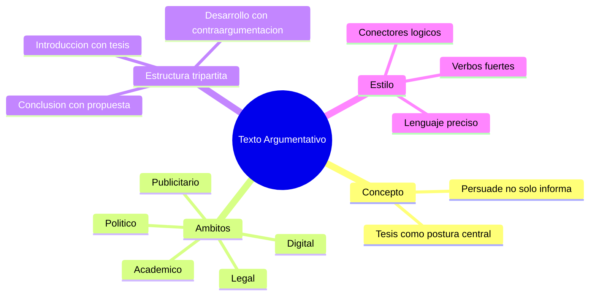

---
{"dg-publish":true,"permalink":"/universidad/preuniversitario/comunicacion-efectiva/unidad-6-textos-argumentativos/01-el-texto-argumentativo-concepto-ambitos-y-estructura/","dg-note-properties":{}}
---


# 📢 El Texto Argumentativo: Concepto, Ámbitos y Estructura

## 🎯 Introducción

> [!info] 💡 ¿Qué es un texto argumentativo?
>
> Un **texto argumentativo** es aquel cuyo propósito central es la **persuasión**: defender una postura (la tesis) frente a una audiencia con el objetivo de que la acepte, la comparta o actúe en consecuencia. Esto lo diferencia radicalmente del **texto expositivo**, cuyo propósito es informar o explicar hechos de la manera más objetiva y neutral posible, sin buscar cambiar la opinión del lector.
>
> ```mermaid
> graph TD
>     A[Texto] --> B[Expositivo]
>     A --> C[Argumentativo]
>     B --> D["Informa / describe / explica"]
>     B --> E["Busca objetividad"]
>     C --> F["Persuade / defiende una postura"]
>     C --> G["Presenta una tesis"]
> ```
>
> La diferencia no siempre es absoluta: un mismo texto puede combinar tramos expositivos (para dar contexto o presentar datos) con tramos claramente argumentativos (donde se defiende una interpretación de esos datos).

---

## 🌐 Tipología por Contexto

> [!note] 📋 Textos argumentativos según el ámbito
>
> El propósito persuasivo es constante, pero **cómo se argumenta cambia según el contexto**: el tipo de evidencia aceptada, el tono, y las convenciones formales varían de un ámbito a otro.

> [!success]- ✅ Tabla comparativa por ámbito
>
> | Ámbito | Propósito específico | Ejemplos típicos | Rasgos distintivos |
> |---|---|---|---|
> | **Político** | Movilizar apoyo, legitimar una decisión o política | Discursos, editoriales, manifiestos | Apelación emocional fuerte, uso de datos selectivos, llamados a la acción |
> | **Académico** | Sostener una interpretación o hallazgo ante pares | Ensayos, artículos científicos, tesis | Evidencia verificable, citas, lenguaje técnico y objetivo en el tono aunque la postura sea clara |
> | **Legal / jurídico** | Convencer a un juez o tribunal de una interpretación de la norma | Alegatos, sentencias, dictámenes | Apoyo estricto en normas y precedentes, estructura muy formalizada |
> | **Publicitario** | Inducir una decisión de compra o adhesión a una marca | Anuncios, campañas, eslóganes | Persuasión implícita, apelación a emociones y deseos, evidencia mínima o anecdótica |
> | **Digital** | Generar adhesión, interacción o viralización | Blogs, hilos de redes sociales, reseñas | Tono informal, argumentación breve y fragmentada, apoyo en autoridad percibida (influencers) |

---

## 🏛️ Estructura Tripartita

> [!note] 📋 Esquema canónico del texto argumentativo
>
> Todo texto argumentativo bien formado —independientemente del ámbito— sigue (al menos implícitamente) tres bloques:
>
> ```mermaid
> graph TD
>     A["Introducción Contexto + Tesis"] --> B["Desarrollo Argumentos + Evidencias + Contraargumentación"]
>     B --> C["Conclusión Reiteración de la tesis + Propuesta/Recomendación"]
> ```

> [!success]- ✅ Detalle de cada bloque
>
> | Bloque | Función | Contenido esperado |
> |---|---|---|
> | **Introducción** | Situar al lector y declarar la postura | Contexto/problema + enunciación clara de la **tesis** |
> | **Desarrollo** | Sostener la tesis con razones | Argumentos ordenados por fuerza, evidencias que los respaldan, y **contraargumentación** (anticipar y refutar objeciones) |
> | **Conclusión** | Cerrar reforzando la postura | Reiteración de la tesis (sin repetirla literalmente) + una propuesta o recomendación concreta |
>
> La contraargumentación en el desarrollo es lo que distingue un texto argumentativo maduro de uno unilateral: reconocer la postura contraria y refutarla fortalece la credibilidad del autor.

---

## 📖 Caso de Estudio: "Coexistencia entre ciencia y religión"

> [!info] 💡 Tesis del texto modelo
>
> - **Tesis identificada:** *La ciencia y la religión pueden coexistir porque responden a preguntas distintas de la experiencia humana: una explica el cómo del mundo natural y la otra orienta el sentido y los valores.*
> - **Ubicación en la estructura:** aparece al cierre de la introducción, tras contextualizar el conflicto histórico aparente entre ambas esferas.
> - **Por qué funciona como tesis:** es debatible (admite postura contraria), específica (delimita el criterio de compatibilidad) y aseverativa con verbo conjugado (ver [[Universidad/Preuniversitario/Comunicación Efectiva/Unidad 6 - Textos argumentativos/02 - Formulación y validación de la tesis\|02 - Formulación y validación de la tesis]]).

> [!success]- ✅ Desglose: 4 argumentos y conclusión
>
> | # | Argumento | Evidencia o razonamiento de apoyo |
> |---|---|---|
> | 1 | Objetos de estudio distintos | La ciencia describe fenómenos verificables; la religión propone sentido, ética y propósito, por lo que no compiten en el mismo plano |
> | 2 | Métodos complementarios, no excluyentes | El método científico exige prueba empírica; la reflexión religiosa usa interpretación filosófica y tradición, válida en su ámbito |
> | 3 | Coexistencia histórica y personal | Científicos creyentes y universidades de origen religioso muestran que ambas esferas han convivido en personas e instituciones |
> | 4 | Contraargumentación anticipada | Frente a la objeción de que todo conflicto (p. ej. creacionismo frente a evolución) prueba incompatibilidad, se responde que el choque ocurre por invasión de ámbitos, no por esencia incompatible |
> | C | **Conclusión:** reitera la tesis sin repetirla literalmente y propone una recomendación concreta: fomentar el diálogo interdisciplinar y una educación que distinga hechos científicos de creencias valorativas |

---

## ✍️ Recomendaciones de Estilo

> [!tip] 🖥️ Pautas para fortalecer un texto argumentativo
>
> - **Evita el lenguaje vago.** Frases como "esto es importante" o "muchas personas piensan" debilitan el argumento porque no son verificables ni específicas.
> - **Selecciona verbos precisos.** Preferir "demuestra", "contradice", "refuta" en vez de "dice" o "habla de", que son verbos débiles y poco informativos.
> - **Cuida la cohesión sintáctica.** Usa conectores lógicos explícitos (*sin embargo*, *en consecuencia*, *no obstante*, *por lo tanto*) para que la relación entre ideas sea clara y no quede implícita.

> [!warning] ⚠️ Errores comunes
>
> | ❌ Débil / vago | ✅ Preciso |
> |---|---|
> | *"Esto afecta mucho a la sociedad."* | *"Esta política reduce en un 15% el acceso a la educación superior."* |
> | *"Algunos dicen que es malo."* | *"Los economistas del Banco Central advierten que genera inflación."* |
> | *"Es un tema muy importante."* | *(eliminar la frase; ir directo al argumento concreto)* |

---

## 📝 Registro de Práctica — Ejercicios Formativos del MOOC (02.1 – 02.4)

> [!example]- Ejercicio 02.1 — Argumentativo frente a expositivo
>
> **Instrucciones:** clasifica cada fragmento como *expositivo (E)* o *argumentativo (A)* según su propósito dominante. Justifica en una frase si hay tramos mixtos.
>
> 1. *"El agua hierve a 100 °C al nivel del mar por la presión atmosférica."*
> 2. *"La energía nuclear debería ser la principal fuente eléctrica del país porque es estable y baja en emisiones."*
> 3. *"El informe describe el ciclo del agua en tres fases: evaporación, condensación y precipitación."*
> 4. *"A mi juicio, prohibir los plásticos de un solo uso es urgente, pues reducen la contaminación marina."*
> 5. *"Este gráfico muestra la evolución del desempleo entre 2020 y 2024, que luego el autor usa para defender una reforma laboral."*
>
> **Soluciones:**
>
> 1. E — informa un hecho verificable sin defender postura.
> 2. A — presenta tesis debatible (*debería ser*) con razones.
> 3. E — describe un proceso de forma neutral.
> 4. A — marcador de opinión + tesis + argumento causal.
> 5. Mixto con propósito global argumentativo: el tramo expositivo (datos del gráfico) funciona como evidencia de la tesis.

> [!example]- Ejercicio 02.2 — Clasificación por ámbitos
>
> **Instrucciones:** asigna cada fragmento a su ámbito (político, académico, legal, publicitario o digital) y señala un rasgo distintivo que lo delate.
>
> 1. *"Compra ahora y llévate un 20% de descuento, solo por hoy."*
> 2. *"Como muestran Pérez (2022) y el ensayo revisado por pares, la intervención redujo la deserción en un 12%."*
> 3. *"Con fundamento en el artículo 14 y la jurisprudencia citada, solicito se declare la nulidad del acto."*
> 4. *"Compañeras y compañeros: esta reforma es la única vía para recuperar la dignidad del pueblo."*
> 5. *"Hilo: probé 3 apps de estudio y esta es la única que me funcionó, les cuento por qué + enlace."*
> 6. *"Este perfume te hará irresistible; todos te mirarán."*
>
> **Soluciones:**
>
> | # | Ámbito | Rasgo distintivo |
> |---|---|---|
> | 1 | Publicitario | Urgencia y llamado a la compra, evidencia mínima |
> | 2 | Académico | Citas, datos verificables y tono técnico |
> | 3 | Legal | Apoyo en normas y precedentes, estructura formal |
> | 4 | Político | Apelación emocional e interpelación colectiva |
> | 5 | Digital | Tono informal, fragmentado, autoridad percibida |
> | 6 | Publicitario | Persuasión implícita por deseo, sin evidencia |

> [!example]- Ejercicio 02.3 — Estructura tripartita
>
> **Instrucciones:** lee cada mini-texto y señala qué bloque falta o está débil (introducción con tesis, desarrollo con argumentos y contraargumentación, conclusión con propuesta).
>
> 1. Texto con contexto y tesis más tres argumentos con datos, pero que termina sin retomar la postura ni proponer nada.
> 2. Texto que empieza directamente con *"Hay tres razones para apoyar el reciclaje..."* sin presentar el problema ni declarar la tesis.
> 3. Texto con tesis y cierre propositivo, pero cuyos argumentos son solo repeticiones de la tesis sin evidencias.
> 4. Texto completo en tres bloques, aunque la conclusión repite la tesis palabra por palabra.
> 5. Texto con tesis, dos argumentos y una objeción contraria refutada, más cierre con recomendación.
>
> **Soluciones:**
>
> 1. Falta la **conclusión** (reiteración + propuesta).
> 2. Falta la **introducción** (contexto + tesis explícita).
> 3. **Desarrollo débil**: hay estructura aparente pero sin evidencias que sostengan los argumentos.
> 4. Estructura completa pero **conclusión mejorable**: debe parafrasear la tesis, no copiarla literalmente.
> 5. Estructura **completa y madura**: incluye contraargumentación y propuesta, que es el modelo a seguir.

> [!example]- Ejercicio 02.4 — Estilo preciso y cohesión
>
> **Instrucciones:** reescribe cada frase vaga con un verbo preciso, un sujeto explícito o un dato verificable, y añade el conector lógico adecuado donde se indique.
>
> 1. *"Esto afecta mucho a la sociedad."*
> 2. *"Algunos dicen que es malo subir el pasaje."*
> 3. *"Es un tema muy importante. Hay que hacer algo."*
> 4. *"Dice cosas sobre el cambio climático."* (usa *demuestra / refuta / advierte*)
> 5. *"El teletrabajo aumenta la productividad. ___ dificulta la coordinación en equipos presenciales."* (añade conector de contraste)
> 6. *"Hay datos. ___ se propone ampliar el horario de bibliotecas."* (añade conector de consecuencia)
>
> **Soluciones:**
>
> 1. *"Esta política reduce en un 15% el acceso a la educación superior."*
> 2. *"Los economistas del Banco Central advierten que el alza genera inflación."*
> 3. (Eliminar el relleno) *"El desempleo juvenil alcanzó el 5,7% este trimestre; se propone un programa de primer empleo."*
> 4. *"El informe demuestra el aumento de 1,1 °C en la temperatura media global desde 1880."*
> 5. *"...productividad. **Sin embargo**, dificulta la coordinación..."*
> 6. *"...datos. **Por lo tanto**, se propone ampliar..."*

---

## 🧪 Ejercicios de Refuerzo *(elaborados para practicar, no son del MOOC)*

> [!question] 🟢 Nivel Básico
>
> 1. Clasifica como *expositivo* o *argumentativo*: *"El agua hierve a 100°C al nivel del mar."*
> 2. Identifica el ámbito (político, académico, legal, publicitario, digital) de: *"Compra ahora y llévate un 20% de descuento — ¡solo por hoy!"*
> 3. Señala cuál de los tres bloques de la estructura tripartita falta en un texto que solo presenta tesis y argumentos, sin cerrar con una recomendación.

> [!example]- 🟢 Respuestas — Nivel Básico
>
> 1. Expositivo (es un hecho verificable, no busca persuadir).
> 2. Publicitario (apela a la urgencia y al deseo de ahorro).
> 3. Falta la Conclusión.

> [!question] 🟡 Nivel Intermedio
>
> 1. Reescribe esta frase vaga con un verbo y dato más precisos: *"El desempleo es un problema grande en el país."*
> 2. Redacta una oración de contraargumentación para la tesis: *"El teletrabajo mejora la productividad."*
> 3. Explica por qué un mismo texto puede tener tramos expositivos dentro de un texto argumentativo, sin dejar de ser argumentativo en su conjunto.

> [!example]- 🟡 Respuestas — Nivel Intermedio
>
> 1. *"El desempleo alcanzó el 5.7% en el último trimestre, afectando principalmente a jóvenes entre 18 y 24 años."*
> 2. *"Sin embargo, algunos estudios señalan que el teletrabajo dificulta la coordinación en equipos que requieren colaboración constante."*
> 3. Porque los tramos expositivos suelen usarse para dar contexto o presentar datos objetivos que luego sirven de evidencia; la argumentación aparece en la interpretación que se hace de esos datos, no en el dato en sí.

> [!question] 🔴 Nivel Avanzado
>
> 1. Elige un tema y redacta una introducción completa (contexto + tesis) siguiendo la estructura tripartita.
> 2. Para el mismo tema, formula un argumento y una contraargumentación explícita que lo ponga a prueba.
> 3. Compara cómo cambiaría la fuerza persuasiva de tu argumento si lo trasladaras del ámbito académico al publicitario.

> [!example]- 🔴 Respuestas — Nivel Avanzado
>
> Estas respuestas son abiertas y dependen del tema elegido; no hay una única solución correcta. Al revisar tu propia redacción, verifica que: la tesis sea debatible y específica (ver [[Universidad/Preuniversitario/Comunicación Efectiva/Unidad 6 - Textos argumentativos/02 - Formulación y validación de la tesis\|02 - Formulación y validación de la tesis]]), el argumento tenga evidencia concreta, y la contraargumentación sea una objeción real (no una versión débil fácil de refutar — la llamada "hombre de paja").

---

## ✅ Metas de Aprendizaje

> [!note] 🎯 Nivel Básico
>
> - [ ] Distingo un texto argumentativo de uno expositivo
> - [ ] Identifico el ámbito de un texto argumentativo dado
> - [ ] Reconozco los tres bloques de la estructura tripartita

> [!note] 🎯 Nivel Intermedio
>
> - [ ] Redacto una introducción con contexto y tesis clara
> - [ ] Sustituyo lenguaje vago por afirmaciones precisas y verificables
> - [ ] Construyo una contraargumentación real (no una versión débil)

> [!note] 🎯 Nivel Avanzado
>
> - [ ] Redacto un texto argumentativo completo con los tres bloques
> - [ ] Adapto el mismo argumento a distintos ámbitos ajustando tono y evidencia
> - [ ] Analizo textos ajenos identificando tesis, argumentos y conclusión

---

## 📊 Resumen Visual



---

> [!summary] 📋 Resumen ejecutivo
>
> - Un texto argumentativo busca **persuadir** defendiendo una tesis, a diferencia del expositivo que informa con objetividad.
> - La forma de argumentar varía según el **ámbito** (político, académico, legal, publicitario o digital).
> - Todo texto bien formado sigue la **estructura tripartita**: introducción (tesis), desarrollo (argumentos y contraargumentación) y conclusión (propuesta).
> - La **contraargumentación** distingue un texto maduro de uno unilateral y refuerza la credibilidad del autor.
> - El estilo debe ser preciso: verbos fuertes, datos verificables y conectores lógicos explícitos.

---

> [!quote] 📖 Fuentes consultadas
>
> [1] MOOC *Comunicación Efectiva*, Unidad 6 — Textos argumentativos, Nota 01: "El texto argumentativo (concepto, ámbitos y estructura)".

> [!quote] 🔗 Conexiones
>
> - [[Universidad/Preuniversitario/Comunicación Efectiva/Unidad 6 - Textos argumentativos/00 - Índice Unidad 6\|00 - Índice Unidad 6]] — mapa general de la unidad.
> - [[Universidad/Preuniversitario/Comunicación Efectiva/Unidad 6 - Textos argumentativos/02 - Formulación y validación de la tesis\|02 - Formulación y validación de la tesis]] — profundiza en cómo formular la tesis presentada en la Introducción.
> - [[Universidad/Preuniversitario/Comunicación Efectiva/Unidad 6 - Textos argumentativos/03 - Análisis y desmontaje de textos argumentativos\|03 - Análisis y desmontaje de textos argumentativos]] — aplica esta estructura para analizar textos ajenos.

---

**Tags:** #comunicacion-efectiva #MOOC #textos-argumentativos #unidad6 #estructura-argumentativa
