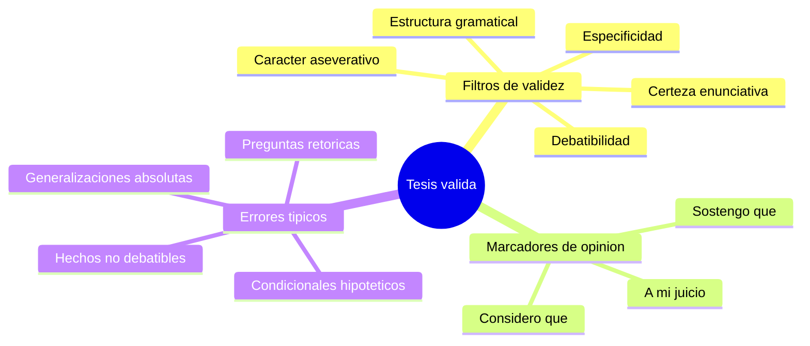

---
{"dg-publish":true,"permalink":"/universidad/preuniversitario/comunicacion-efectiva/unidad-6-textos-argumentativos/02-formulacion-y-validacion-de-la-tesis/","dg-note-properties":{}}
---


# 🎯 Formulación y Validación de la Tesis

## 🎯 Introducción

> [!info] 💡 ¿Qué es una tesis?
>
> La **tesis** es la afirmación o negación categórica que un texto argumentativo se propone defender racionalmente. No es una opinión suelta ni un dato: es una postura tomada frente a algo debatible, que el resto del texto (argumentos, evidencias, contraargumentación) existe para sostener.
>
> Una tesis mal formulada compromete todo el texto: si no es debatible, específica, afirmativa, cierta y gramaticalmente completa, no hay realmente nada que argumentar.

---

## 🧭 Los 5 Filtros de Validez

> [!note] 📋 Criterios de control para una tesis válida
>
> Antes de dar por buena una tesis, debe pasar estos cinco filtros:
>
> ```mermaid
> graph TD
>     T[Tesis propuesta] --> F1{"¿Es debatible?"}
>     F1 -->|No, es un hecho| X1[Rechazar]
>     F1 -->|Sí| F2{"¿Es específica?"}
>     F2 -->|No, es una generalización absoluta| X2[Rechazar]
>     F2 -->|Sí| F3{"¿Es aseverativa?"}
>     F3 -->|No, es pregunta retórica| X3[Rechazar]
>     F3 -->|Sí| F4{"¿Tiene certeza enunciativa?"}
>     F4 -->|No, es condicional hipotético| X4[Rechazar]
>     F4 -->|Sí| F5{"¿Estructura gramatical completa?"}
>     F5 -->|No, es frase nominal/infinitivo| X5[Rechazar]
>     F5 -->|Sí| OK[Tesis válida]
> ```

> [!success]- ✅ Los 5 filtros con ejemplos comparativos
>
> | # | Filtro | Qué exige | ❌ Incorrecto | ✅ Correcto |
> |---|---|---|---|---|
> | 1 | **Debatibilidad** | Debe ser opinable, no un hecho comprobable | *"El agua hierve a 100°C al nivel del mar."* | *"La energía nuclear debería ser la principal fuente de electricidad del país."* |
> | 2 | **Especificidad** | Evitar generalizaciones absolutas ("todo", "nadie", "siempre") | *"Todos los políticos son corruptos."* | *"La falta de mecanismos de rendición de cuentas favorece la corrupción en cargos públicos."* |
> | 3 | **Carácter aseverativo** | Debe afirmar o negar, no preguntar | *"¿Debería regularse el uso de redes sociales en menores?"* | *"El uso de redes sociales en menores de 13 años debe regularse por ley."* |
> | 4 | **Certeza enunciativa** | Afirmación firme, no hipótesis condicional | *"Si se invirtiera más en educación, tal vez mejoraría la economía."* | *"La inversión sostenida en educación mejora la economía a largo plazo."* |
> | 5 | **Estructura gramatical** | Oración completa con verbo conjugado | *"La importancia de reducir la desigualdad."* | *"Reducir la desigualdad debe ser prioridad de política pública."* |

---

## 🗣️ Marcadores de Opinión

> [!note] 📋 Fórmulas introductorias para presentar una tesis
>
> Estos marcadores señalan explícitamente que lo que sigue es una postura, no un hecho:
>
> - *A mi juicio...*
> - *Desde mi punto de vista...*
> - *Considero que...*
> - *Sostengo que...*
> - *Es evidente que...* *(usar con cautela: presupone que la evidencia ya es aceptada por el lector)*
> - *No cabe duda de que...*
>
> > [!tip]- 🖥️ Uso estratégico
> >
> > En textos académicos y digitales, abrir con un marcador de opinión ayuda a que el lector distinga de inmediato dónde termina el contexto objetivo y empieza la postura del autor — algo especialmente útil quando el texto mezcla tramos expositivos y argumentativos (ver [[Universidad/Preuniversitario/Comunicación Efectiva/Unidad 6 - Textos argumentativos/01 - El texto argumentativo (concepto, ámbitos y estructura)\|01 - El texto argumentativo (concepto, ámbitos y estructura)]]).

---

## 📝 Registro de Práctica — Video explicativo y Ejercicios Formativos (04.1 – 04.3)

> [!info] 💡 Apuntes del video explicativo — Formulación de la tesis
>
> - Una buena tesis nace de un tema debatible recortado: del tema amplio (*redes sociales*) se pasa a un problema específico (*uso en menores de 13 años*) y de ahí a una postura defendible.
> - La formulación exige forma aseverativa y certeza: afirmar o negar con verbo conjugado (*debe regularse*, *mejora*, *reduce*), sin preguntas retóricas ni condicionales hipotéticos (*si..., tal vez...*).
> - Antes de redactar el texto, la tesis candidata debe pasar los 5 filtros (debatible, específica, aseverativa, cierta, gramaticalmente completa); si falla uno, se reformula en vez de intentar sostenerla.
> - Los marcadores de opinión (*considero que*, *sostengo que*) marcan el paso del contexto objetivo a la postura y evitan que la tesis se confunda con un hecho.

> [!example]- Ejercicio 04.1 — Formular tesis válidas
>
> **Instrucciones:** convierte cada tema o frase defectuosa en una tesis que cumpla los 5 filtros. Compara con la solución propuesta (hay más de una redacción válida).
>
> 1. Tema: *redes sociales y menores*. Frase dada: *"Las redes sociales."*
> 2. Frase dada: *"¿Debería subir el salario mínimo?"*
> 3. Frase dada: *"Si se invirtiera más en educación, tal vez mejoraría la economía."*
> 4. Frase dada: *"Todos los políticos son corruptos."*
> 5. Frase dada: *"El agua hierve a 100 °C al nivel del mar."* (indica si puede ser tesis y por qué; si no, propone una tesis del mismo campo)
> 6. Tema libre de tu carrera: formula una tesis original desde cero.
>
> **Soluciones:**
>
> 1. *"El uso de redes sociales en menores de 13 años debe regularse por ley."*
> 2. *"El salario mínimo debe incrementarse para reflejar el costo de vida actual."*
> 3. *"La inversión sostenida en educación mejora la economía a largo plazo."*
> 4. *"La falta de mecanismos de rendición de cuentas favorece la corrupción en cargos públicos."*
> 5. No puede ser tesis: es un hecho no debatible (falla filtro 1). Tesis alternativa: *"La enseñanza de ciencias básicas debería priorizar la experimentación sobre la memorización."*
> 6. Respuesta abierta; verifica: debatible, sin absolutos, aseverativa, con certeza y verbo conjugado.

> [!example]- Ejercicio 04.2 — Validar con los 5 filtros
>
> **Instrucciones:** indica para cada enunciado si es tesis válida; si no lo es, señala el primer filtro que incumple y propone una corrección.
>
> 1. *"¿Es ético comer carne?"*
> 2. *"Nadie respeta las leyes de tránsito en esta ciudad."*
> 3. *"La importancia de reducir la desigualdad."*
> 4. *"Si se prohibieran los plásticos de un solo uso, quizás se reduciría la contaminación."*
> 5. *"La prohibición de plásticos de un solo uso reduce la contaminación marina."*
> 6. *"A mi juicio, el teletrabajo regulado mejora la productividad sin deteriorar la coordinación."*
>
> **Soluciones:**
>
> | # | ¿Válida? | Filtro que falla / Análisis |
> |---|---|---|
> | 1 | No | Filtro 3 (aseverativa): es pregunta retórica. Corregir: *"El consumo de carne debería reducirse por razones éticas y ambientales."* |
> | 2 | No | Filtro 2 (especificidad): generalización absoluta con *nadie*. Corregir: *"Las infracciones de tránsito aumentaron un 20% por falta de fiscalización."* |
> | 3 | No | Filtro 5 (estructura gramatical): frase nominal sin verbo conjugado. Corregir: *"Reducir la desigualdad debe ser prioridad de política pública."* |
> | 4 | No | Filtro 4 (certeza enunciativa): condicional hipotético. Corregir como en la solución del ítem 5 |
> | 5 | Sí | Pasa los 5 filtros: debatible, específica, aseverativa, cierta y completa |
> | 6 | Sí | Pasa los 5 filtros; el marcador *a mi juicio* explicita la postura sin debilitarla |

> [!example]- Ejercicio 04.3 — Marcadores de opinión
>
> **Instrucciones:** reescribe cada tesis usando el marcador indicado y explica brevemente qué efecto retórico produce.
>
> 1. Usa *considero que*: *"La jornada laboral de cuatro días aumenta el bienestar sin reducir la producción."*
> 2. Usa *sostengo que*: *"La evaluación continua es más justa que un único examen final."*
> 3. Usa *desde mi punto de vista*: *"El transporte público gratuito reduce la congestión."*
> 4. Explica por qué *"Es evidente que la educación pública necesita reforma"* puede sonar débil aunque sea formalmente válida.
> 5. Elige un párrafo expositivo neutro y añade una oración con marcador que marque el paso a la tesis.
>
> **Soluciones:**
>
> 1. *"Considero que la jornada laboral de cuatro días aumenta el bienestar sin reducir la producción."* Efecto: tono razonado y personal, propio del ámbito académico.
> 2. *"Sostengo que la evaluación continua es más justa que un único examen final."* Efecto: compromiso firme del autor, anticipa que dará argumentos.
> 3. *"Desde mi punto de vista, el transporte público gratuito reduce la congestión."* Efecto: delimita la postura como perspectiva defendible, invita al debate.
> 4. Porque *es evidente que* presupone que el lector ya está de acuerdo y puede sonar a que se evita argumentar; es válida en forma pero débil en retórica si no va seguida de pruebas.
> 5. Respuesta abierta. Modelo: *"La matrícula creció un 10% en dos años. **A mi juicio**, ese crecimiento exige ampliar la planta docente antes de abrir nuevas sedes."* El marcador separa dato (exposición) de postura (tesis).*

---

## 🧪 Ejercicios de Refuerzo *(elaborados para practicar, no son del MOOC)*

> [!question] 🟢 Nivel Básico
>
> 1. Indica qué filtro incumple: *"¿Es ético comer carne?"*
> 2. Indica qué filtro incumple: *"Nadie respeta las leyes de tránsito en esta ciudad."*
> 3. Convierte en tesis aseverativa: *"¿Debería subir el salario mínimo?"*

> [!example]- 🟢 Respuestas — Nivel Básico
>
> 1. Incumple el filtro 3 (carácter aseverativo) — es una pregunta retórica.
> 2. Incumple el filtro 2 (especificidad) — generalización absoluta con "nadie".
> 3. *"El salario mínimo debe incrementarse para reflejar el costo de vida actual."*

> [!question] 🟡 Nivel Intermedio
>
> 1. Reescribe eliminando la condicionalidad: *"Si se prohibieran los plásticos de un solo uso, quizás se reduciría la contaminación."*
> 2. Da un ejemplo de tesis que pase los filtros 1, 2 y 3, pero falle en el filtro 5 (estructura gramatical).
> 3. Explica por qué *"Es evidente que la educación pública necesita reforma"* podría considerarse una tesis débil aunque pase los 5 filtros.

> [!example]- 🟡 Respuestas — Nivel Intermedio
>
> 1. *"La prohibición de plásticos de un solo uso reduce la contaminación marina."*
> 2. *"La necesidad urgente de reformar el sistema de salud."* (es debatible, específica y aseverativa en intención, pero es una frase nominal, no una oración con verbo conjugado).
> 3. Porque el marcador *"es evidente que"* presupone que el lector ya está de acuerdo, lo que puede sonar a que el autor evita defender realmente la postura con argumentos — es una tesis válida formalmente, pero retóricamente puede debilitar la persuasión si no va seguida de argumentos sólidos.

> [!question] 🔴 Nivel Avanzado
>
> 1. Formula una tesis original sobre un tema de tu carrera (ingeniería, tecnología, etc.) que pase los 5 filtros.
> 2. Identifica un error de cada uno de los 5 filtros en tesis que veas en redes sociales durante una semana, citando el ejemplo real (sin datos identificables de terceros).
> 3. Explica la diferencia entre una tesis "débil pero válida" (pasa los filtros pero es poco persuasiva) y una tesis "inválida" (no pasa algún filtro).

> [!example]- 🔴 Respuestas — Nivel Avanzado
>
> Respuestas abiertas. Al autoevaluar el punto 3: una tesis inválida falla en algo estructural (es un hecho, una pregunta, una generalización absoluta, un condicional o una frase incompleta) y por tanto no puede defenderse como tesis. Una tesis débil sí es formalmente válida, pero puede ser poco específica, poco original o fácil de refutar sin esfuerzo — el problema no es de forma sino de fuerza argumentativa.

---

## ✅ Metas de Aprendizaje

> [!note] 🎯 Nivel Básico
>
> - [ ] Distingo un hecho de una tesis debatible
> - [ ] Identifico generalizaciones absolutas en una tesis
> - [ ] Reconozco preguntas retóricas disfrazadas de tesis

> [!note] 🎯 Nivel Intermedio
>
> - [ ] Reescribo tesis condicionales como afirmaciones ciertas
> - [ ] Corrijo tesis con estructura gramatical incompleta
> - [ ] Uso marcadores de opinión apropiados al abrir una tesis

> [!note] 🎯 Nivel Avanzado
>
> - [ ] Formulo tesis originales que pasan los 5 filtros sin ayuda
> - [ ] Evalúo tesis ajenas (propias o de redes/medios) aplicando los 5 filtros
> - [ ] Distingo entre tesis inválida y tesis válida pero retóricamente débil

---

## 📊 Resumen Visual



---

> [!summary] 📋 Resumen ejecutivo
>
> - La **tesis** es la afirmación categórica y debatible que todo el texto existe para defender.
> - Toda tesis debe pasar **5 filtros**: debatibilidad, especificidad, carácter aseverativo, certeza enunciativa y estructura gramatical completa.
> - Los **marcadores de opinión** (*considero que*, *sostengo que*) separan la postura del autor del contexto objetivo.
> - Una tesis **inválida** falla en su forma (hecho, pregunta, generalización...); una tesis **débil** es válida pero poco persuasiva.
> - Validar la tesis primero evita construir todo el texto sobre una base defectuosa.

---

> [!quote] 📖 Fuentes consultadas
>
> [1] MOOC *Comunicación Efectiva*, Unidad 6 — Textos argumentativos, Nota 02: "Formulación y validación de la tesis".

> [!quote] 🔗 Conexiones
>
> - [[Universidad/Preuniversitario/Comunicación Efectiva/Unidad 6 - Textos argumentativos/00 - Índice Unidad 6\|00 - Índice Unidad 6]] — mapa general de la unidad.
> - [[Universidad/Preuniversitario/Comunicación Efectiva/Unidad 6 - Textos argumentativos/01 - El texto argumentativo (concepto, ámbitos y estructura)\|01 - El texto argumentativo (concepto, ámbitos y estructura)]] — la tesis es el componente central de la Introducción en la estructura tripartita.
> - [[Universidad/Preuniversitario/Comunicación Efectiva/Unidad 6 - Textos argumentativos/03 - Análisis y desmontaje de textos argumentativos\|03 - Análisis y desmontaje de textos argumentativos]] — al analizar un texto ajeno, el primer paso es identificar y validar su tesis con estos mismos filtros.

---

**Tags:** #comunicacion-efectiva #MOOC #textos-argumentativos #unidad6 #tesis
