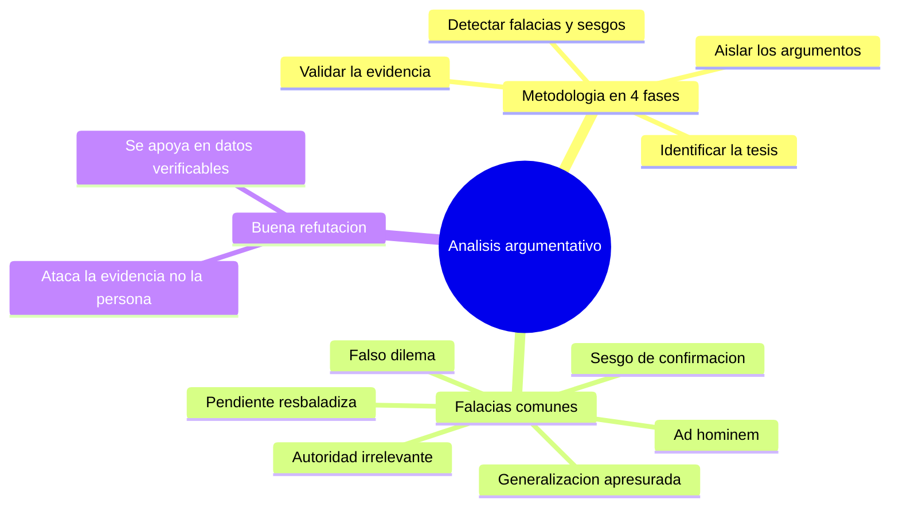

---
{"dg-publish":true,"permalink":"/universidad/preuniversitario/comunicacion-efectiva/unidad-6-textos-argumentativos/03-analisis-y-desmontaje-de-textos-argumentativos/","dg-note-properties":{}}
---


# 🔍 Análisis y Desmontaje de Textos Argumentativos

## 🎯 Introducción

> [!info] 💡 ¿Por qué "desmontar" un texto argumentativo?
>
> Analizar un texto argumentativo no es solo resumirlo: es **desarmarlo pieza por pieza** — tesis, argumentos, evidencias — para evaluar si cada una cumple su función y si el conjunto sostiene realmente la conclusión. Esta habilidad es la contraparte natural de saber *escribir* un texto argumentativo (ver [[Universidad/Preuniversitario/Comunicación Efectiva/Unidad 6 - Textos argumentativos/01 - El texto argumentativo (concepto, ámbitos y estructura)\|01 - El texto argumentativo (concepto, ámbitos y estructura)]]): quien sabe qué hace fuerte a un argumento, también sabe reconocer cuándo un argumento ajeno es débil, engañoso o directamente falaz.

---

## 🧩 Metodología de Análisis

> [!note] 📋 Pasos para diseccionar un texto argumentativo
>
> El análisis integra lectura y observación en cuatro fases secuenciales:
>
> ```mermaid
> graph TD
>     A[Leer el texto completo] --> B["Identificar la tesis (aplicar los 5 filtros)"]
>     B --> C["Aislar los argumentos que la sostienen"]
>     C --> D["Validar la evidencia de cada argumento"]
>     D --> E{"¿Evidencia solida y relevante?"}
>     E -->|No| F["Marcar como argumento debil o posible falacia"]
>     E -->|Sí| G["Marcar como argumento solido"]
>     F --> H["Redactar conclusion del analisis"]
>     G --> H
> ```

> [!success]- ✅ Qué revisar en cada fase
>
> | Fase | Pregunta guía | Qué buscar |
> |---|---|---|
> | **1. Tesis** | ¿Cuál es la postura central? | Aplicar los 5 filtros de [[Universidad/Preuniversitario/Comunicación Efectiva/Unidad 6 - Textos argumentativos/02 - Formulación y validación de la tesis\|02 - Formulación y validación de la tesis]] |
> | **2. Argumentos** | ¿Qué razones se dan a favor de la tesis? | Separar cada argumento como unidad independiente |
> | **3. Evidencias** | ¿Con qué se respalda cada argumento? | Datos, citas de autoridad, ejemplos, estadísticas — y su fuente |
> | **4. Falacias/sesgos** | ¿El razonamiento es válido o hay un atajo lógico engañoso? | Ver tabla de falacias comunes más abajo |

---

## ⚠️ Falacias y Sesgos Comunes

> [!warning] ⚠️ Errores de razonamiento frecuentes
>
> | Falacia / sesgo | En qué consiste | Ejemplo |
> |---|---|---|
> | **Ad hominem** | Atacar a la persona en vez de refutar su argumento | *"No hay que escuchar su propuesta económica, si ni siquiera terminó la universidad."* |
> | **Falso dilema** | Presentar solo dos opciones cuando existen más | *"O apoyas esta ley, o estás a favor de la delincuencia."* |
> | **Generalización apresurada** | Concluir a partir de muy pocos casos | *"Conocí a dos personas de ese país que eran groseras; toda la gente de allí es así."* |
> | **Apelación a la autoridad irrelevante** | Citar a una autoridad fuera de su campo de experiencia | *"Este actor famoso dice que la vacuna es peligrosa, así que debe serlo."* |
> | **Pendiente resbaladiza** | Afirmar que una acción menor desencadenará una cadena exagerada de consecuencias | *"Si permitimos esto hoy, mañana no habrá ninguna regla."* |
> | **Sesgo de confirmación** | Aceptar solo la evidencia que confirma la tesis propia, ignorando la contraria | Citar solo estudios que apoyan una postura y omitir los que la contradicen |
>
> > [!tip]- 🖥️ Cómo detectarlas en la práctica
> >
> > Pregúntate: *"¿Esta evidencia realmente prueba la tesis, o solo suena convincente?"* Una señal de alerta común es cuando el argumento apela más a la emoción o a la reputación de alguien que a datos verificables — típico en ámbitos político y publicitario (ver tabla de [[Universidad/Preuniversitario/Comunicación Efectiva/Unidad 6 - Textos argumentativos/01 - El texto argumentativo (concepto, ámbitos y estructura)\|01 - El texto argumentativo (concepto, ámbitos y estructura)]]).

---

## 📝 Registro de Práctica — Ejercicios Formativos (03.1 – 03.5)

> [!example]- Ejercicio 03.1 — Aplicar las 4 fases del desmontaje
>
> **Instrucciones:** desmonta el siguiente mini-texto siguiendo las 4 fases (tesis, argumentos, evidencias, veredicto). Texto: *"A mi juicio, la jornada de cuatro días debería adoptarse en el país. Primero, aumenta el bienestar sin bajar la producción, como mostró el piloto británico de 2023. Segundo, reduce el ausentismo, según reportes de las empresas participantes. Por eso, el congreso debería legislar un plan piloto nacional."*
>
> 1. Identifica la tesis y verifica con los 5 filtros.
> 2. Aísla los dos argumentos como unidades independientes.
> 3. Señala la evidencia de cada argumento y su tipo (dato, autoridad, ejemplo).
> 4. Da el veredicto: ¿argumento sólido o débil? ¿qué información adicional pedirías?
> 5. Indica en qué bloque tripartito está cada oración (introducción, desarrollo, conclusión).
>
> **Soluciones:**
>
> 1. Tesis: *la jornada de cuatro días debería adoptarse en el país*. Pasa los 5 filtros: debatible, específica, aseverativa, cierta y completa.
> 2. Argumento 1: bienestar sin baja de producción. Argumento 2: reducción del ausentismo.
> 3. Arg. 1: dato/estudio (piloto británico 2023). Arg. 2: reporte de empresas (autoridad interesada, menos independiente).
> 4. Arg. 1 sólido si la fuente es verificable; Arg. 2 más débil por posible sesgo de confirmación (solo reportes de participantes). Pediría muestra, metodología y fuentes contrarias.
> 5. Oración 1: introducción (tesis). Oraciones 2-3: desarrollo (argumentos). Oración 4: conclusión (reiteración + propuesta legislativa).

> [!example]- Ejercicio 03.2 — Identificar falacias comunes I
>
> **Instrucciones:** nombra la falacia de cada enunciado (ad hominem, falso dilema, generalización apresurada, autoridad irrelevante, pendiente resbaladiza) y justifica en una frase.
>
> 1. *"No hay que escuchar su propuesta económica, si ni siquiera terminó la universidad."*
> 2. *"O apoyas esta ley, o estás a favor de la delincuencia."*
> 3. *"Conocí a dos personas de ese país que eran groseras; toda la gente de allí es así."*
> 4. *"Este actor famoso dice que la vacuna es peligrosa, así que debe serlo."*
> 5. *"Si permitimos esto hoy, mañana no habrá ninguna regla."*
> 6. *"Este suplemento funciona, mi vecino lo tomó y mejoró."*
>
> **Soluciones:**
>
> | # | Falacia | Por qué |
> |---|---|---|
> | 1 | Ad hominem | Ataca la formación de la persona en vez de refutar sus cifras o razonamiento |
> | 2 | Falso dilema | Reduce a dos opciones extremas e ignora alternativas intermedias |
> | 3 | Generalización apresurada | Extrapola de dos casos a toda una población |
> | 4 | Apelación a la autoridad irrelevante | Cita a un famoso fuera de su campo de experiencia |
> | 5 | Pendiente resbaladiza | Predice una cadena exagerada sin probar el vínculo causal |
> | 6 | Generalización apresurada | Un caso anecdótico no prueba causalidad ni eficacia general |

> [!example]- Ejercicio 03.3 — Sesgo de confirmación y calidad de la evidencia
>
> **Instrucciones:** evalúa la evidencia de cada caso y señala si hay sesgo de confirmación o evidencia insuficiente. Propón cómo mejorarla.
>
> 1. Un artículo cita solo estudios que apoyan su postura e ignora tres revisiones que la contradicen.
> 2. Una publicidad muestra un testimonio: *"Bajé 10 kilos con este té."*
> 3. Un hilo digital afirma: *"Todos los economistas están de acuerdo conmigo."*
> 4. Un ensayo académico cita un metaanálisis revisado por pares con muestra amplia... pero de 1998 para hablar del mercado actual.
> 5. Un discurso político usa una estadística real pero recortada (omite el año en que la tendencia se revirtió).
>
> **Soluciones:**
>
> 1. Sesgo de confirmación claro; mejorar incluyendo las revisiones contrarias y explicando por qué se discrepa de ellas.
> 2. Evidencia anecdótica e insuficiente; pedir ensayo controlado o datos agregados, no un caso aislado.
> 3. Generalización absoluta + autoridad vaga; pedir nombres, fuentes y el porcentaje real de acuerdo.
> 4. Evidencia legítima pero desactualizada; actualizar con estudios recientes o justificar la vigencia.
> 5. Dato selectivo / verdad a medias; mostrar la serie completa y explicar el cambio de tendencia.

> [!example]- Ejercicio 03.4 — Redactar refutaciones sin falacias
>
> **Instrucciones:** refuta cada argumento atacando su evidencia o razonamiento, nunca a la persona. Usa datos verificables o preguntas críticas.
>
> 1. *"No hay que escuchar su propuesta, ese político siempre miente."*
> 2. *"O reducimos impuestos a cero, o el país se queda sin empresas."*
> 3. *"No podemos confiar en su análisis climático, es solo un youtuber, no un científico."*
> 4. *"Si regulamos los videojuegos hoy, mañana censurarán todos los libros."*
> 5. *"Mi vecino mejoró con este suplemento, así que todos deberían tomarlo."*
>
> **Soluciones:**
>
> 1. *"Antes de aceptar esta propuesta, conviene verificar sus cifras con fuentes independientes, dado el historial de declaraciones no verificadas de este político."* Critica la fiabilidad sin descartar sin análisis.
> 2. *"Entre cero impuestos y el nivel actual hay opciones intermedias (rebajas focalizadas, incentivos por inversión); habría que comparar su costo fiscal antes de elegir un extremo."* Rompe el falso dilema.
> 3. *"Evaluemos su análisis por sus fuentes: ¿cita datos del panel climático y metodología replicable? Si no, es insuficiente, con independencia de su profesión."* Pide evidencia, no credencial.
> 4. *"Regular un producto no implica censurar otros; habría que mostrar el mecanismo legal que llevaría de una medida a la otra."* Exige probar la pendiente.
> 5. *"Un caso no establece causalidad; haría falta un estudio con grupo control antes de recomendarlo a todos."* Señala la generalización apresurada.

> [!example]- Ejercicio 03.5 — Contraargumentación y análisis completo
>
> **Instrucciones:** toma la tesis *"El teletrabajo regulado mejora la productividad"* y realiza un análisis completo.
>
> 1. Formula la mejor objeción contraria que puedas (sin hombre de paja).
> 2. Responde a esa objeción con una contraargumentación que la integre o la refute con evidencia.
> 3. Señala qué falacia cometerías si respondieras: *"Quienes critican el teletrabajo son jefes anticuados que solo quieren controlar."*
> 4. Indica qué evidencia pedirías para decidir quién tiene razón.
> 5. Redacta en 3-4 líneas la conclusión de tu análisis (veredicto + recomendación).
>
> **Soluciones:**
>
> 1. Objeción fuerte: *"En equipos que requieren colaboración constante, el teletrabajo total dificulta la coordinación y la creatividad conjunta."*
> 2. Contraargumentación modelo: *"Por eso la tesis habla de teletrabajo **regulado** (híbrido con días presenciales), no total; los estudios con esquema híbrido mantienen la productividad y preservan la coordinación. **Sin embargo**, en roles totalmente colaborativos puede requerir ajustes."*
> 3. Sería un **ad hominem**: descalifica a las personas (*jefes anticuados*) en vez de responder a su argumento sobre coordinación.
> 4. Evidencia a pedir: estudios comparativos presencial frente a híbrido frente a remoto total, por tipo de tarea, con muestras amplias y fuentes independientes.
> 5. Modelo: *"La tesis se sostiene de forma condicional: el teletrabajo híbrido y regulado mejora la productividad en tareas autónomas, pero requiere presencialidad parcial en trabajo colaborativo. Se recomienda un piloto híbrido con métricas de coordinación antes de generalizarlo."*

---

## 🧪 Ejercicios de Refuerzo *(elaborados para practicar, no son del MOOC)*

> [!question] 🟢 Nivel Básico
>
> 1. Identifica la falacia: *"No podemos confiar en su análisis climático, es solo un youtuber, no un científico."* (cuidado: distingue esto de una crítica legítima a la falta de credenciales).
> 2. Identifica la falacia: *"O reducimos impuestos a cero, o el país se queda sin empresas."*
> 3. Señala qué falta validar en: *"Este suplemento funciona, mi vecino lo tomó y mejoró."*

> [!example]- 🟢 Respuestas — Nivel Básico
>
> 1. Podría ser una apelación a la autoridad irrelevante *a la inversa* (descartar por falta de credenciales sin evaluar el contenido) — depende del contexto; lo clave es que descarta el argumento sin analizar su evidencia.
> 2. Falso dilema — omite opciones intermedias (reducción parcial, incentivos focalizados, etc.).
> 3. Falta evidencia más allá de un caso anecdótico (generalización apresurada); un solo caso no permite establecer causalidad.

> [!question] 🟡 Nivel Intermedio
>
> 1. Toma un argumento publicitario real (de una marca que conozcas) y evalúa qué tipo de evidencia usa y si hay sesgo de confirmación.
> 2. Explica la diferencia entre una generalización apresurada y una estadística legítima basada en una muestra representativa.
> 3. Reescribe este argumento ad hominem como una crítica válida al contenido: *"No hay que escuchar su propuesta, ese político siempre miente."*

> [!example]- 🟡 Respuestas — Nivel Intermedio
>
> 1. Respuesta abierta según el ejemplo elegido; la clave es distinguir evidencia verificable de apelación emocional.
> 2. La diferencia está en el tamaño y representatividad de la muestra: una estadística legítima usa una muestra suficientemente grande y aleatoria; la generalización apresurada extrapola de 1-2 casos no representativos.
> 3. *"Antes de aceptar esta propuesta, conviene verificar sus cifras con fuentes independientes, dado el historial de declaraciones no verificadas de este político."* — critica la fiabilidad de la fuente sin descartar la propuesta sin análisis.

> [!question] 🔴 Nivel Avanzado
>
> 1. Elige un texto argumentativo real (editorial, publicidad, discurso) y aplica las 4 fases de la metodología completa: tesis, argumentos, evidencias, falacias/sesgos.
> 2. Redacta una refutación fundamentada (no ad hominem) para el argumento más débil que encontraste.
> 3. Evalúa si el propio texto que elegiste podría estar afectado por sesgo de confirmación del autor, y cómo lo notaste.

> [!example]- 🔴 Respuestas — Nivel Avanzado
>
> Respuestas abiertas y dependientes del texto elegido. Al autoevaluar, verifica que la refutación (punto 2) ataque la evidencia o el razonamiento — nunca a la persona — y que la detección de sesgo (punto 3) se apoye en algo verificable (por ejemplo, omisión sistemática de fuentes que contradicen la tesis).

---

## ✅ Metas de Aprendizaje

> [!note] 🎯 Nivel Básico
>
> - [ ] Identifico la tesis y los argumentos principales de un texto ajeno
> - [ ] Reconozco al menos 3 falacias comunes por su nombre
> - [ ] Distingo evidencia verificable de apelación emocional

> [!note] 🎯 Nivel Intermedio
>
> - [ ] Evalúo la calidad de la evidencia de cada argumento por separado
> - [ ] Detecto sesgo de confirmación en un texto
> - [ ] Diferencio una crítica legítima de un ataque ad hominem

> [!note] 🎯 Nivel Avanzado
>
> - [ ] Aplico la metodología completa de 4 fases a un texto real
> - [ ] Redacto refutaciones fundamentadas sin caer en falacias propias
> - [ ] Comparo la solidez argumentativa de dos textos sobre el mismo tema

---

## 📊 Resumen Visual



---

> [!summary] 📋 Resumen ejecutivo
>
> - **Desmontar** un texto es separarlo en tesis, argumentos y evidencias para evaluar si sostienen la conclusión.
> - La metodología sigue **4 fases**: identificar la tesis (con los 5 filtros), aislar argumentos, validar evidencias y detectar falacias o sesgos.
> - Las **falacias comunes** (ad hominem, falso dilema, generalización apresurada...) suenan convincentes sin probar realmente la tesis.
> - Una señal de alerta es la apelación a la **emoción o reputación** en vez de datos verificables.
> - La **refutación** válida ataca el razonamiento o la evidencia, nunca a la persona.

---

> [!quote] 📖 Fuentes consultadas
>
> [1] MOOC *Comunicación Efectiva*, Unidad 6 — Textos argumentativos, Nota 03: "Análisis y desmontaje de textos argumentativos".

> [!quote] 🔗 Conexiones
>
> - [[Universidad/Preuniversitario/Comunicación Efectiva/Unidad 6 - Textos argumentativos/00 - Índice Unidad 6\|00 - Índice Unidad 6]] — mapa general de la unidad.
> - [[Universidad/Preuniversitario/Comunicación Efectiva/Unidad 6 - Textos argumentativos/01 - El texto argumentativo (concepto, ámbitos y estructura)\|01 - El texto argumentativo (concepto, ámbitos y estructura)]] — la estructura tripartita es lo que se busca identificar al analizar un texto ajeno.
> - [[Universidad/Preuniversitario/Comunicación Efectiva/Unidad 6 - Textos argumentativos/02 - Formulación y validación de la tesis\|02 - Formulación y validación de la tesis]] — la fase 1 del análisis reutiliza directamente los 5 filtros de validez de tesis.

---

**Tags:** #comunicacion-efectiva #MOOC #textos-argumentativos #unidad6 #falacias #analisis-critico
