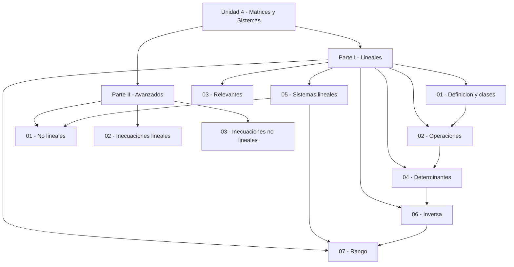

---
{"dg-publish":true,"permalink":"/universidad/preuniversitario/matematicas/unidad-4-matrices-y-sistemas/00-indice-unidad-4/","dg-note-properties":{}}
---

# 🗂️ Índice Unidad 4 — Matrices y Sistemas

## 🎯 Introducción

> [!info] 💡 Qué cubre esta unidad
>
> Esta unidad construye el álgebra matricial desde cero: qué es una matriz y sus clases, cómo operar con ellas, determinantes, sistemas lineales (Gauss, Rouché-Frobenius), matriz inversa y rango. La segunda parte extiende a sistemas no lineales y a inecuaciones lineales y no lineales con región factible y optimización.
>
> Ruta sugerida: Parte I en orden (01 → 07) y luego Parte II (01 → 03). Cada nota tiene metas de aprendizaje, resumen ejecutivo y resumen visual.

---

## 🗺️ Mapa de la unidad

> [!note] 🗺️ Las 10 notas con enlaces cortos intra-Unidad
>
> |Parte|Nota|Contenido clave|
> |---|---|---|
> |I|[[Universidad/Preuniversitario/Matemáticas/Unidad 4 - Matrices y Sistemas/I - Matrices y Sistemas de Ecuaciones/01 - Definición y clases de matrices\|01 - Definición y clases de matrices]]|Orden, notación, clases por dimensión, elementos y simetría|
> |I|[[Universidad/Preuniversitario/Matemáticas/Unidad 4 - Matrices y Sistemas/I - Matrices y Sistemas de Ecuaciones/02 - Operaciones con matrices\|02 - Operaciones con matrices]]|Suma, escalar, producto no conmutativo, transposición, potencias|
> |I|[[Universidad/Preuniversitario/Matemáticas/Unidad 4 - Matrices y Sistemas/I - Matrices y Sistemas de Ecuaciones/03 - Matrices relevantes\|03 - Matrices relevantes]]|Inversa, rotación, reflexión, proyección, Markov, Vandermonde, Toeplitz|
> |I|[[Universidad/Preuniversitario/Matemáticas/Unidad 4 - Matrices y Sistemas/I - Matrices y Sistemas de Ecuaciones/04 - Determinantes\|04 - Determinantes]]|Cálculo 2×2/3×3/Gauss, propiedades, geometría, invertibilidad|
> |I|[[Universidad/Preuniversitario/Matemáticas/Unidad 4 - Matrices y Sistemas/I - Matrices y Sistemas de Ecuaciones/05 - Sistemas de ecuaciones lineales\|05 - Sistemas de ecuaciones lineales]]|Ax igual a b, Rouché-Frobenius, Gauss y Gauss-Jordan|
> |I|[[Universidad/Preuniversitario/Matemáticas/Unidad 4 - Matrices y Sistemas/I - Matrices y Sistemas de Ecuaciones/06 - Matriz Inversa\|06 - Matriz Inversa]]|Definición, propiedades, Gauss-Jordan, adjunta, aplicaciones|
> |I|[[Universidad/Preuniversitario/Matemáticas/Unidad 4 - Matrices y Sistemas/I - Matrices y Sistemas de Ecuaciones/07 - Rango de una Matriz\|07 - Rango de una Matriz]]|Independencia, escalonada, menores, compatibilidad de sistemas|
> |II|[[Universidad/Preuniversitario/Matemáticas/Unidad 4 - Matrices y Sistemas/II - Sistemas de Ecuaciones e Inecuaciones Avanzados/01 - Sistemas de ecuaciones no lineales\|01 - Sistemas de ecuaciones no lineales]]|Sustitución, eliminación, cambio de variable, verificación|
> |II|[[Universidad/Preuniversitario/Matemáticas/Unidad 4 - Matrices y Sistemas/II - Sistemas de Ecuaciones e Inecuaciones Avanzados/02 - Sistemas de inecuaciones lineales\|02 - Sistemas de inecuaciones lineales]]|Semiplanos, región factible, vértices, programación lineal|
> |II|[[Universidad/Preuniversitario/Matemáticas/Unidad 4 - Matrices y Sistemas/II - Sistemas de Ecuaciones e Inecuaciones Avanzados/03 - Sistemas de inecuaciones no lineales\|03 - Sistemas de inecuaciones no lineales]]|Fronteras curvas, intersección de regiones, optimización|

---

## ✅ Lista de avance

> [!note] 🎯 Checklist por nota
>
> - [ ] [[Universidad/Preuniversitario/Matemáticas/Unidad 4 - Matrices y Sistemas/I - Matrices y Sistemas de Ecuaciones/01 - Definición y clases de matrices\|01 - Definición y clases de matrices]] — Clasifico cualquier matriz por dimensión, elementos y simetría.
> - [ ] [[Universidad/Preuniversitario/Matemáticas/Unidad 4 - Matrices y Sistemas/I - Matrices y Sistemas de Ecuaciones/02 - Operaciones con matrices\|02 - Operaciones con matrices]] — Opero matrices respetando compatibilidad y no conmutatividad.
> - [ ] [[Universidad/Preuniversitario/Matemáticas/Unidad 4 - Matrices y Sistemas/I - Matrices y Sistemas de Ecuaciones/03 - Matrices relevantes\|03 - Matrices relevantes]] — Reconozco inversa, rotación, proyección, Markov y estructuradas.
> - [ ] [[Universidad/Preuniversitario/Matemáticas/Unidad 4 - Matrices y Sistemas/I - Matrices y Sistemas de Ecuaciones/04 - Determinantes\|04 - Determinantes]] — Calculo determinantes y decido invertibilidad.
> - [ ] [[Universidad/Preuniversitario/Matemáticas/Unidad 4 - Matrices y Sistemas/I - Matrices y Sistemas de Ecuaciones/05 - Sistemas de ecuaciones lineales\|05 - Sistemas de ecuaciones lineales]] — Resuelvo y clasifico sistemas por Gauss y Rouché-Frobenius.
> - [ ] [[Universidad/Preuniversitario/Matemáticas/Unidad 4 - Matrices y Sistemas/I - Matrices y Sistemas de Ecuaciones/06 - Matriz Inversa\|06 - Matriz Inversa]] — Invierto matrices 2×2 y n×n y resuelvo ecuaciones matriciales.
> - [ ] [[Universidad/Preuniversitario/Matemáticas/Unidad 4 - Matrices y Sistemas/I - Matrices y Sistemas de Ecuaciones/07 - Rango de una Matriz\|07 - Rango de una Matriz]] — Hallo rangos y determino compatibilidad de sistemas.
> - [ ] [[Universidad/Preuniversitario/Matemáticas/Unidad 4 - Matrices y Sistemas/II - Sistemas de Ecuaciones e Inecuaciones Avanzados/01 - Sistemas de ecuaciones no lineales\|01 - Sistemas de ecuaciones no lineales]] — Resuelvo sistemas cuadráticos y verifico soluciones.
> - [ ] [[Universidad/Preuniversitario/Matemáticas/Unidad 4 - Matrices y Sistemas/II - Sistemas de Ecuaciones e Inecuaciones Avanzados/02 - Sistemas de inecuaciones lineales\|02 - Sistemas de inecuaciones lineales]] — Grafico regiones factibles y optimizo en vértices.
> - [ ] [[Universidad/Preuniversitario/Matemáticas/Unidad 4 - Matrices y Sistemas/II - Sistemas de Ecuaciones e Inecuaciones Avanzados/03 - Sistemas de inecuaciones no lineales\|03 - Sistemas de inecuaciones no lineales]] — Resuelvo sistemas con fronteras curvas y optimizo.

---

> [!quote] 🔗 Conexiones
>
> - [[Universidad/Preuniversitario/Matemáticas/Unidad 2 - Números Reales/I - Números Reales/01 - Conjuntos Numéricos\|Universidad/Preuniversitario/Matemáticas/Unidad 2 - Números Reales/I - Números Reales/01 - Conjuntos Numéricos]] — elementos y campos de las matrices.
> - [[Universidad/Preuniversitario/Matemáticas/Unidad 2 - Números Reales/I - Números Reales/10 - Ecuaciones\|Universidad/Preuniversitario/Matemáticas/Unidad 2 - Números Reales/I - Números Reales/10 - Ecuaciones]] — base para sistemas lineales y cuadráticos.
> - [[Universidad/Preuniversitario/Matemáticas/Unidad 2 - Números Reales/I - Números Reales/11 - Inecuaciones\|Universidad/Preuniversitario/Matemáticas/Unidad 2 - Números Reales/I - Números Reales/11 - Inecuaciones]] — base de una variable para sistemas de inecuaciones.
> - [[Universidad/Preuniversitario/Matemáticas/Unidad 5 - Geometría/III - Geometría Analítica/02 - Circunferencia\|Universidad/Preuniversitario/Matemáticas/Unidad 5 - Geometría/III - Geometría Analítica/02 - Circunferencia]] — fronteras circulares en sistemas no lineales.
> - [[Universidad/Preuniversitario/Matemáticas/Unidad 5 - Geometría/III - Geometría Analítica/03 - Parábola\|Universidad/Preuniversitario/Matemáticas/Unidad 5 - Geometría/III - Geometría Analítica/03 - Parábola]] — regiones parabólicas.
> - [[Universidad/Preuniversitario/Matemáticas/Unidad 5 - Geometría/III - Geometría Analítica/04 - Elipse\|Universidad/Preuniversitario/Matemáticas/Unidad 5 - Geometría/III - Geometría Analítica/04 - Elipse]] — regiones elípticas.
> - [[Universidad/Preuniversitario/Matemáticas/Unidad 5 - Geometría/III - Geometría Analítica/05 - Hipérbola\|Universidad/Preuniversitario/Matemáticas/Unidad 5 - Geometría/III - Geometría Analítica/05 - Hipérbola]] — ramas hiperbólicas en intersecciones.

---

**Tags:** #matematicas #preuniversitario #unidad4
