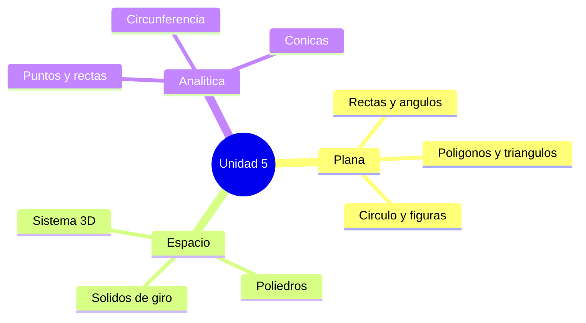

---
{"dg-publish":true,"permalink":"/universidad/preuniversitario/matematicas/unidad-5-geometria/00-indice-unidad-5/","dg-note-properties":{}}
---

# 🗺️ Índice Unidad 5 - Geometría

## 🎯 Introducción

> [!info] 💡 Bienvenido a la Unidad 5
>
> Esta unidad recorre la geometría completa del preuniversitario en tres bloques: **Geometría Plana** (figuras en R2: rectas, ángulos, polígonos, triángulos, cuadriláteros y círculo), **Geometría del Espacio** (R3: sistema tridimensional, poliedros y sólidos de revolución) y **Geometría Analítica** (puntos, rectas y cónicas con ecuaciones).
>
> Cada nota conserva su teoría matemática original con el mismo rigor, ahora en formato uniforme: introducción, teoría en callouts y tablas, ejercicios resueltos, práctica colapsable, metas de aprendizaje, resumen ejecutivo y resumen visual.

```mermaid
graph TD
  U5[Unidad 5 Geometria] --> P1[Geometria Plana]
  U5 --> P2[Geometria del Espacio]
  U5 --> P3[Geometria Analitica]
  P1 --> A01[01 Figuras en el plano]
  P1 --> A02[02 Rectas en el plano]
  P1 --> A03[03 Angulos]
  P1 --> A04[04 Poligonales y poligonos]
  P1 --> A05[05 Triangulos]
  P1 --> A06[06 Cuadrilateros]
  P1 --> A07[07 Perimetro y area]
  P1 --> A08[08 Circunferencia y circulo]
  P1 --> A09[09 Poligonos y circunferencia]
  P1 --> A10[10 Figuras circulares]
  P2 --> B01[01 Sistema tridimensional]
  P2 --> B02[02 Poliedros]
  P2 --> B03[03 Solidos de revolucion]
  P2 --> B04[04 Poliedros y redondos]
  P3 --> C01[01 Puntos y rectas]
  P3 --> C02[02 Circunferencia]
  P3 --> C03[03 Parabola]
  P3 --> C04[04 Elipse]
  P3 --> C05[05 Hiperbola]
```

---

## 🗂️ Mapa de la Unidad

> [!note] 🗂️ Tres bloques, diecinueve notas
>
> |Bloque|Nota|Contenido breve|
> |---|---|---|
> |**I - Geometría Plana**|[[Universidad/Preuniversitario/Matemáticas/Unidad 5 - Geometría/I - Geometría Plana/01 - Figuras geométricas en el plano\|01 - Figuras geométricas en el plano]]|Plano cartesiano, recta, círculo, polígonos, cónicas y lugares geométricos|
> |**I - Geometría Plana**|[[Universidad/Preuniversitario/Matemáticas/Unidad 5 - Geometría/I - Geometría Plana/02 - Clases de rectas en el plano\|02 - Clases de rectas en el plano]]|Posición, pendiente, paralelismo, formas de ecuación y haces|
> |**I - Geometría Plana**|[[Universidad/Preuniversitario/Matemáticas/Unidad 5 - Geometría/I - Geometría Plana/03 - Ángulos\|03 - Ángulos]]|Medición, clasificación, paralelas, polígonos y circunferencia|
> |**I - Geometría Plana**|[[Universidad/Preuniversitario/Matemáticas/Unidad 5 - Geometría/I - Geometría Plana/04 - Poligonales y polígonos\|04 - Poligonales y polígonos]]|Elementos, clasificación, regulares, área y teselaciones|
> |**I - Geometría Plana**|[[Universidad/Preuniversitario/Matemáticas/Unidad 5 - Geometría/I - Geometría Plana/05 - Triángulos\|05 - Triángulos]]|Clasificación, Pitágoras, senos y cosenos, áreas y centros|
> |**I - Geometría Plana**|[[Universidad/Preuniversitario/Matemáticas/Unidad 5 - Geometría/I - Geometría Plana/06 - Cuadriláteros\|06 - Cuadriláteros]]|Jerarquía, paralelogramos, trapecios, áreas y teoremas|
> |**I - Geometría Plana**|[[Universidad/Preuniversitario/Matemáticas/Unidad 5 - Geometría/I - Geometría Plana/07 - Perímetro y área de un polígono\|07 - Perímetro y área de un polígono]]|Perímetro, agrimensor, apotema, Bretschneider e isoperimetría|
> |**I - Geometría Plana**|[[Universidad/Preuniversitario/Matemáticas/Unidad 5 - Geometría/I - Geometría Plana/08 - Circunferencia y círculo\|08 - Circunferencia y círculo]]|Elementos, ecuaciones, perímetro, área y teoremas|
> |**I - Geometría Plana**|[[Universidad/Preuniversitario/Matemáticas/Unidad 5 - Geometría/I - Geometría Plana/09 - Polígonos y circunferencia\|09 - Polígonos y circunferencia]]|Inscritos, circunscritos, Ptolomeo, Pitot y Gauss|
> |**I - Geometría Plana**|[[Universidad/Preuniversitario/Matemáticas/Unidad 5 - Geometría/I - Geometría Plana/10 - Figuras circulares\|10 - Figuras circulares]]|Sector, segmento, corona, lúnula y figuras compuestas|
> |**II - Geometría del Espacio**|[[Universidad/Preuniversitario/Matemáticas/Unidad 5 - Geometría/II - Geometría del Espacio/01 - Sistema tridimensional\|01 - Sistema tridimensional]]|Coordenadas 3D, octantes, distancia y vectores|
> |**II - Geometría del Espacio**|[[Universidad/Preuniversitario/Matemáticas/Unidad 5 - Geometría/II - Geometría del Espacio/02 - Poliedros\|02 - Poliedros]]|Poliedros, cilindro, cono, esfera y Pappus|
> |**II - Geometría del Espacio**|[[Universidad/Preuniversitario/Matemáticas/Unidad 5 - Geometría/II - Geometría del Espacio/04 - Poliedros y cuerpos redondos\|04 - Poliedros y cuerpos redondos]]|Catálogo comparado de todos los sólidos|
> |**III - Geometría Analítica**|[[Universidad/Preuniversitario/Matemáticas/Unidad 5 - Geometría/III - Geometría Analítica/01 - Puntos y rectas\|01 - Puntos y rectas]]|Distancia, pendiente, posiciones y métricas|
> |**III - Geometría Analítica**|[[Universidad/Preuniversitario/Matemáticas/Unidad 5 - Geometría/III - Geometría Analítica/02 - Circunferencia\|02 - Circunferencia]]|Ecuaciones, tangentes, potencia y arco capaz|
> |**III - Geometría Analítica**|[[Universidad/Preuniversitario/Matemáticas/Unidad 5 - Geometría/III - Geometría Analítica/03 - Parábola\|03 - Parábola]]|Foco, directriz, tangentes y propiedad reflectora|
> |**III - Geometría Analítica**|[[Universidad/Preuniversitario/Matemáticas/Unidad 5 - Geometría/III - Geometría Analítica/04 - Elipse\|04 - Elipse]]|Focos, excentricidad, tangentes y órbitas|
> |**III - Geometría Analítica**|[[Universidad/Preuniversitario/Matemáticas/Unidad 5 - Geometría/III - Geometría Analítica/05 - Hipérbola\|05 - Hipérbola]]|Diferencia focal, asíntotas, excentricidad y navegación|

---

## ✅ Lista de verificación

> [!note] 🎯 Geometría Plana
>
> - [ ] [[Universidad/Preuniversitario/Matemáticas/Unidad 5 - Geometría/I - Geometría Plana/01 - Figuras geométricas en el plano\|01 - Figuras geométricas en el plano]]
> - [ ] [[Universidad/Preuniversitario/Matemáticas/Unidad 5 - Geometría/I - Geometría Plana/02 - Clases de rectas en el plano\|02 - Clases de rectas en el plano]]
> - [ ] [[Universidad/Preuniversitario/Matemáticas/Unidad 5 - Geometría/I - Geometría Plana/03 - Ángulos\|03 - Ángulos]]
> - [ ] [[Universidad/Preuniversitario/Matemáticas/Unidad 5 - Geometría/I - Geometría Plana/04 - Poligonales y polígonos\|04 - Poligonales y polígonos]]
> - [ ] [[Universidad/Preuniversitario/Matemáticas/Unidad 5 - Geometría/I - Geometría Plana/05 - Triángulos\|05 - Triángulos]]
> - [ ] [[Universidad/Preuniversitario/Matemáticas/Unidad 5 - Geometría/I - Geometría Plana/06 - Cuadriláteros\|06 - Cuadriláteros]]
> - [ ] [[Universidad/Preuniversitario/Matemáticas/Unidad 5 - Geometría/I - Geometría Plana/07 - Perímetro y área de un polígono\|07 - Perímetro y área de un polígono]]
> - [ ] [[Universidad/Preuniversitario/Matemáticas/Unidad 5 - Geometría/I - Geometría Plana/08 - Circunferencia y círculo\|08 - Circunferencia y círculo]]
> - [ ] [[Universidad/Preuniversitario/Matemáticas/Unidad 5 - Geometría/I - Geometría Plana/09 - Polígonos y circunferencia\|09 - Polígonos y circunferencia]]
> - [ ] [[Universidad/Preuniversitario/Matemáticas/Unidad 5 - Geometría/I - Geometría Plana/10 - Figuras circulares\|10 - Figuras circulares]]
>
> [!note] 🎯 Geometría del Espacio
>
> - [ ] [[Universidad/Preuniversitario/Matemáticas/Unidad 5 - Geometría/II - Geometría del Espacio/01 - Sistema tridimensional\|01 - Sistema tridimensional]]
> - [ ] [[Universidad/Preuniversitario/Matemáticas/Unidad 5 - Geometría/II - Geometría del Espacio/02 - Poliedros\|02 - Poliedros]]

> - [ ] [[Universidad/Preuniversitario/Matemáticas/Unidad 5 - Geometría/II - Geometría del Espacio/04 - Poliedros y cuerpos redondos\|04 - Poliedros y cuerpos redondos]]
>
> [!note] 🎯 Geometría Analítica
>
> - [ ] [[Universidad/Preuniversitario/Matemáticas/Unidad 5 - Geometría/III - Geometría Analítica/01 - Puntos y rectas\|01 - Puntos y rectas]]
> - [ ] [[Universidad/Preuniversitario/Matemáticas/Unidad 5 - Geometría/III - Geometría Analítica/02 - Circunferencia\|02 - Circunferencia]]
> - [ ] [[Universidad/Preuniversitario/Matemáticas/Unidad 5 - Geometría/III - Geometría Analítica/03 - Parábola\|03 - Parábola]]
> - [ ] [[Universidad/Preuniversitario/Matemáticas/Unidad 5 - Geometría/III - Geometría Analítica/04 - Elipse\|04 - Elipse]]
> - [ ] [[Universidad/Preuniversitario/Matemáticas/Unidad 5 - Geometría/III - Geometría Analítica/05 - Hipérbola\|05 - Hipérbola]]

---

## ✅ Metas de Aprendizaje

> [!note] 🎯 Nivel Básico
>
> - [ ] Describo los elementos de rectas, ángulos, polígonos y círculo en el plano.
> - [ ] Aplico perímetro, área y volumen de figuras planas y sólidos con su fórmula.
> - [ ] Ubico puntos y rectas con distancia, pendiente y punto medio en cartesianas.
>
> [!note] 🎯 Nivel Intermedio
>
> - [ ] Clasifico triángulos, cuadriláteros y cónicas por sus elementos y ecuaciones.
> - [ ] Convierto entre formas de la recta y de las cónicas completando cuadrados.
> - [ ] Resuelvo tangencias, posiciones relativas y lugares geométricos.
>
> [!note] 🎯 Nivel Avanzado
>
> - [ ] Demuestro teoremas (Pitágoras, Ptolomeo, Euler) y comparo elipse e hipérbola por $e$.
> - [ ] Modelo secciones, intersecciones y optimización geométrica con coordenadas.
> - [ ] Conecto cónicas con polares y trigonometría para órbitas y construcciones.

---

> [!summary] 📋 Resumen ejecutivo
>
> - La unidad une **síntesis** (plana y espacio) con **análisis** (analítica): cada figura tiene definición, elementos y ecuación.
> - Todo polígono se mide con perímetro y área; todo sólido con área y volumen; cada cónica se reconoce por su ecuación y su excentricidad.
> - La recta y la circunferencia son los lugares base; parábola, elipse e hipérbola son los lugares foco-directriz con $e = 1$, $0 < e < 1$ y $e > 1$.

---

## 📊 Resumen Visual

---

## 🔗 Conexiones

> [!quote] 🔗 Con el resto del curso
>
> - [[Universidad/Preuniversitario/Matemáticas/Unidad 2 - Números Reales/I - Números Reales/01 - Conjuntos Numéricos\|Universidad/Preuniversitario/Matemáticas/Unidad 2 - Números Reales/I - Números Reales/01 - Conjuntos Numéricos]] — coordenadas y medida usan los reales.
> - [[Universidad/Preuniversitario/Matemáticas/Unidad 3 - Funciones y Trigonometría/I - Funciones de Variable Real/01 - Definición, dominio y rango\|Universidad/Preuniversitario/Matemáticas/Unidad 3 - Funciones y Trigonometría/I - Funciones de Variable Real/01 - Definición, dominio y rango]] — gráficas como lugares geométricos.
> - [[Universidad/Preuniversitario/Matemáticas/Unidad 3 - Funciones y Trigonometría/II - Trigonometría/02 - Funciones trigonométricas elementales\|Universidad/Preuniversitario/Matemáticas/Unidad 3 - Funciones y Trigonometría/II - Trigonometría/02 - Funciones trigonométricas elementales]] — ángulos, pendientes y razones en triángulos.
> - [[Universidad/Preuniversitario/Matemáticas/Unidad 4 - Matrices y Sistemas/I - Matrices y Sistemas de Ecuaciones/02 - Operaciones con matrices\|Universidad/Preuniversitario/Matemáticas/Unidad 4 - Matrices y Sistemas/I - Matrices y Sistemas de Ecuaciones/02 - Operaciones con matrices]] — transformaciones y sistemas lineales.
> - [[Universidad/Preuniversitario/Matemáticas/Unidad 6 - Complejos y Polares/II - Coordenadas Polares/02 - Coordenadas polares\|Universidad/Preuniversitario/Matemáticas/Unidad 6 - Complejos y Polares/II - Coordenadas Polares/02 - Coordenadas polares]] — otra lectura de curvas y cónicas.

---

**Tags:** #matematicas #preuniversitario #unidad5
